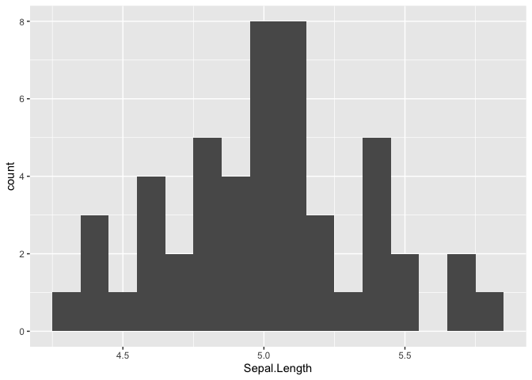

# Reminders

Don't forget about the [cheatsheets](https://rstudio.com/resources/cheatsheets/)!


# Functions

Reading: [rspatial](https://rspatial.org/intr/8-functions.html).

**Key Points**

  * Functions are like machines, they take in some input (i.e. arguments), they have some settings that change the behavior of the machine (i.e. arguments), and they produce an output (i.e. returns values).
  * Most functions have "named arguments," although there are a few unnamed arguments like `...`.
  * You can make your own function, using the function: `function()`.
  * You can name your function so it can be stored in the environment, or you can just have it run once in your code as you won't need it later. The latter functions are called "anonymous."

---

We've already gone over some existing functions in Week 1, such as `mean()`, `c()`, and `data.frame()`. Remember, these functions come bundled with R, but you can also make your own functions. But first, let's think about the structure of the function in R.

You can think of functions as machines: they (generally) take in some sort of input (sort of like unprocessed cotton into a cotton gin), the machine has some settings, and then they spit something out (like cotton fibers separated from seeds). Each function also has a unique name.

More formally, functions "take arguments," this includes the raw material and the settings, and then they "return a value."

In the below function, we'll take the mean of `some_numbers`.


```r
# first, we'll create a vector that we want to supply to the function
some_numbers <- c(5,NA,3)

# then we run the function
mean(some_numbers)
```

```
## [1] NA
```

You'll note that it spits out `NA`. This is because `mean()` doesn't know what to do with the 2nd value in `some_numbers` without some guidance.


```r
mean(some_numbers, na.rm = T)
```

```
## [1] 4
```

You'll notice that in the above modified version we have a new "argument," `na.rm = T`. The structure of an argument is such: there a name for the argument, the `=` operator to assign the value, and then the value of the argument, in this case `TRUE`. Importantly, `na.rm` is the "name" of the argument. You'll note, that the first argument, `some_numbers` is unnamed. We could name it.


```r
mean(x = some_numbers,
     na.rm = T)
```

```
## [1] 4
```

I didn't arbitrarily "name" the first argument as `x`. The name `x` is the name for the first argument. Read more in the Help tab (type `?mean`). The reason why earlier we didn't need to name the argument (i.e. `mean(some_numbers, na.rm=T)`) is because the ORDER of the arguments matter UNLESS they are named explicitly.

## Making Functions

I like naming functions starting with a prefix, `fn_`, just because I can better keep track of my functions that way. But you can name your functions any way you like.

To create a function, we use the function that creates functions, called—strangely enough—`function()`. 


```r
# fn name            arguments
fn_adder <- function(a, b){
  # return
  sum(a,b)
}

fn_adder(5,3)
```

```
## [1] 8
```

You'll note I use a function (`sum`) inside a function. I could also have just done `a+b`.

Importantly, the "value" that gets "returned" (i.e. the output) typically occurs on the last line of the function. This is not universally true, and I'll show you what I mean when we get to "decision making" (called branching in rspatial). You can also use the function `return()` to explicitly tell the function the thing you want as the "output," but by convention R coders do not use it except when they absolutely must. We will come across an example of this "decision making."

Here's another example with text.


```r
fn_short_madlib <- function(noun1, 
                            verb_present_participle, 
                            noun2){
  print(
    paste0(
      "There is a ", 
      noun1,
      " ",
      verb_present_participle, 
      " Europe."
    )
  )
}

fn_short_madlib("dog", "exploring")
```

```
## [1] "There is a dog exploring Europe."
```


One final note, rspatial describes a special argument `...`, but this is a little advanced. We will not be asking you to create a function with `...`, but we will ask you to use several functions that use `...` as an argument. For instance, the function `c()`'s main input argument is `...` because it doesn't matter how many values with which you supply it. CHeck out it's documentation, `?c`.


```r
c(1,2,3,4,5,6,7,8,9,10,11)
```

```
##  [1]  1  2  3  4  5  6  7  8  9 10 11
```

---

*Supplemental*

  * [Tutorials Point on Functions](https://www.tutorialspoint.com/r/r_functions.htm)

# Apply Functionals

**Key Concepts**

  * The apply family of functions all do similar things: run a function over a series of values, like a column in a data.frame.
  * There are many variations of apply functions, usually differentiated by the R object that they work on or they produce, for instance do they work on matrices? Do they spit out vectors?
  * Many of the complicated capabilities of apply functions can be done more easily and written in code that is easier to read to other programmers using a toolset (i.e. package) called the `tidyverse`, however it's still good to learn the basics of the apply family of functions as they are fast and efficient and used in more advanced use cases.

---

Apply is a whole family of functions that serve one key purpose, doing something iteratively over a series of values. Apply functions actually belongs to a special group of functions, called "functionals." (Read the word "functional" as a noun, not an adjective.) Functionals are functions that take another function as an input OR returns a function. Don't worry about getting your head wrapped around that last sentence, just understand that the family of functions we like to call the "apply functionals" are a little more advanced than other functions. 

## `apply`

There are several functions that belong to the apply family, including `apply`, `tapply`, `lapply`, `sapply`, and `vapply`. We'll start with the most basic one, `apply`.

Let's take a look at an example.


```r
# first create a matrix upon which to use apply over.
my_matrix <- matrix(
  # values 3 through 12 as a vector
  data = 3:12, 
  # an argument that specifies # of columns
  ncol = 2, 
  # fill the values of this 2 col matrix by row
  byrow = T
)    

my_matrix
```

```
##      [,1] [,2]
## [1,]    3    4
## [2,]    5    6
## [3,]    7    8
## [4,]    9   10
## [5,]   11   12
```

The purpose of `apply` is to do something over a matrix. The thing you "do" is a function, and you get to choose if you want to run the function across a row or column. A simple example might be to take the average of each column.


```r
apply(
  # the matrix object that composes the input values
  X = my_matrix,
  # over the row or column? 1 for row, 2 for column
  MARGIN = 2,
  # what function should we use?
  FUN = mean      
)
```

```
## [1] 7 8
```

You'll see it spits out two values, one for each column. This is just like if you ran the function `mean()` over two different vectors, and then combined the answers. Like so:


```r
c(
  mean(c(3, 5, 7, 9, 11)),
  mean(c(4, 6, 8, 10, 12))
)
```

```
## [1] 7 8
```

So, just to reiterate: apply functions take both an object (i.e. values) and a function which to use over this object. The fact that it takes in functions as an argument is why this is a "functional".

Note, when you supply a function to `apply` for the named argument `FUN`, you can either type `mean` without any parenthesis or `"mean"` with quotation marks.

## Apply your own functions

You need not be constrained to functions provided to you by others. Use your own functions. There are two ways to do this. You can either create a function much as you have before, or use an "anonymous" function that has no name. Anonymous functions disappear after they get used. If you check the Environment tab, you'll note that named functions stick around in the Environment, but "anonymous" functions do not. 

Here we see examples for each below. In this example, I am just adding numbers to each cell in the matrix (whereas before we were doing something to all of the values in a column or row together, like adding them all up or taking the average of all the values).


```r
# Your own function - Example 1.
# named function
fn_add_three <- function(input_value){
  input_value + 3
}

# apply the fn_add_two function over my_matrix by column
apply(
  my_matrix,
  2,
  fn_add_three
)
```

```
##      [,1] [,2]
## [1,]    6    7
## [2,]    8    9
## [3,]   10   11
## [4,]   12   13
## [5,]   14   15
```

Note, if you changed the value of `MARGIN` from `2` to `1` it converts each column into a row. Since we want to keep it in the same form, I used `2`.


```r
# Your own function - Example 2.
# anonymous functions
apply(
  X = my_matrix,
  MARGIN = 2,
  FUN = function(input_value) {
    input_value + 3
  }
)
```

```
##      [,1] [,2]
## [1,]    6    7
## [2,]    8    9
## [3,]   10   11
## [4,]   12   13
## [5,]   14   15
```

Please note that the "value" being passed to the function when you use `apply` is the whole row or vector. In the example above where 3 is added to each cell in the matrix, it may seem like the calcuation is happening to one cell at a time, but what is actually happening (for the first column) is `c(3,5,7,9,11) + 3`. As a proof of concept, we use the `length` function to find out exactly how many values are in `x`:


```r
apply(
  X = my_matrix,
  MARGIN = 2,
  FUN = function(x){
    length(x)
  })
```

```
## [1] 5 5
```

This is why when we use `mean` it gives us the mean of the whole column (or row) and not the mean of each cell (which would be itself, and thus useless). 

## `tapply`

What if we have a data.frame like `iris` and we want to summarise some information by category? In the `iris` dataset, we have 3 species with 50 observations of various anatomical parts, like the length of a petal.


```r
# load iris dataset
data(iris)
# first six values
head(iris)
```

```
##   Sepal.Length Sepal.Width Petal.Length Petal.Width Species
## 1          5.1         3.5          1.4         0.2  setosa
## 2          4.9         3.0          1.4         0.2  setosa
## 3          4.7         3.2          1.3         0.2  setosa
## 4          4.6         3.1          1.5         0.2  setosa
## 5          5.0         3.6          1.4         0.2  setosa
## 6          5.4         3.9          1.7         0.4  setosa
```

Let's say we want the average `Petal.Length` for each species. How do we get this?


```r
tapply(
  X = iris$Petal.Length,
  INDEX = iris$Species,
  FUN = mean
)
```

```
##     setosa versicolor  virginica 
##      1.462      4.260      5.552
```

## `aggregate`

Much like `tapply`, `aggregate` summarizes variables by category. It has the added bonus of being able to handle multiple columns at a time. This function also contains a lot of options. However, it isn't exactly user-friendly. We'll learn other ways of doing what `aggregate` does later when we learn `{tidyverse}`


```r
aggregate(
  # object to apply some function over
  # here I subset the iris dataset
  x = iris[
    c(
      "Sepal.Length",
      "Sepal.Width",
      "Petal.Length", 
      "Petal.Width" 
    )
  ],
  # column with grouping variable.
  # note, `by` accepts `lists`
  by = list(
    iris$Species  # the $ makes this a vector
  ),
  # function to apply over columns
  FUN = mean,
  # should each summarized subset be simplified?
  simplify = T,
  # remove any NA values
  na.rm = T
)
```

```
##      Group.1 Sepal.Length Sepal.Width Petal.Length Petal.Width
## 1     setosa        5.006       3.428        1.462       0.246
## 2 versicolor        5.936       2.770        4.260       1.326
## 3  virginica        6.588       2.974        5.552       2.026
```


## `lapply`

*advanced*

While there are still other functions like `apply`, I'll just go over one more that I use quite often. The function `lapply` applies a function over a list or vector, and returns a `list` object as a result.

Let's take an example using `iris` again. Here I'll split `iris` up into three separate `data.frames` and store them in a `list` for demonstration purposes.


```r
# Here I split up the data.frame called iris into three list elements.
my_list <- list(
  # sp. setosa
  iris_setosa = iris[iris$Species == "setosa",],
  # sp. versicolor
  iris_versicolor = iris[iris$Species == "versicolor",],
  # sp. virginica
  iris_virginica = iris[iris$Species == "virginica",]
)
```

Let's say I had this `list`, but didn't know what it contained. I could use `lapply` to find out what type of R object each element is. The function I'll apply is `class` which tells me the Atomic type if the input is a vector, or the type of structured data the input is if it is not a vector (e.g. `list`, `data.frame`, `matrix`).


```r
lapply(
  X = my_list,
  FUN = class
)
```

```
## $iris_setosa
## [1] "data.frame"
## 
## $iris_versicolor
## [1] "data.frame"
## 
## $iris_virginica
## [1] "data.frame"
```

Oh look! They're all data.frames. Now I would like to see the first row of each of these data.frames:


```r
print(
  lapply(
    X = my_list,
    FUN = function(x) {
      x[1,]
    }
  )
)
```

```
## $iris_setosa
##   Sepal.Length Sepal.Width Petal.Length Petal.Width Species
## 1          5.1         3.5          1.4         0.2  setosa
## 
## $iris_versicolor
##    Sepal.Length Sepal.Width Petal.Length Petal.Width    Species
## 51            7         3.2          4.7         1.4 versicolor
## 
## $iris_virginica
##     Sepal.Length Sepal.Width Petal.Length Petal.Width   Species
## 101          6.3         3.3            6         2.5 virginica
```

In the above code, I took `my_list` then applied a function that created a subset from each of the three elements. The subset was just the first row. Then, I used `print` to display them on the screen.

Admittedly, `lapply` is more for advanced users, but I like it because sometimes I need to split my data up and do weird things to it. Or sometimes I get a bunch of data already split up. In which case, I use `read.csv` to load each csv file into a `list` element, just like the three above. Then I'll do whatever I need to do to each `list` element and bring it all back together.

For example, if I wanted to first take the average of `Petal.Length` for each species, and then make a single `data.frame` I could do this.


```r
# First we create a list of three data.frames
my_list <- lapply(
  X = my_list,
  FUN = function(x) {
    # create a data.frame to return.
    data.frame(
      # Species Column
      Species = x$Species[1],
      # Mean Petal Length column
      Mean.Petal.Length = mean(x$Petal.Length)
    )  # end of data.frame()
  }  # end of anonymous function
)  # end of lapply()

print(my_list)
```

```
## $iris_setosa
##   Species Mean.Petal.Length
## 1  setosa             1.462
## 
## $iris_versicolor
##      Species Mean.Petal.Length
## 1 versicolor              4.26
## 
## $iris_virginica
##     Species Mean.Petal.Length
## 1 virginica             5.552
```


```r
# Second we use a special function to combine all the
# list elements.
do.call(rbind, my_list)
```

```
##                    Species Mean.Petal.Length
## iris_setosa         setosa             1.462
## iris_versicolor versicolor             4.260
## iris_virginica   virginica             5.552
```

You'll note we could have done the above in `tapply` or `aggregate`. My point was not that this is the easiest way to get a summary statistic for each species, just that this is another way to do so.

*Supplemental*

  * [Advanced R - Functionals](http://adv-r.had.co.nz/Functionals.html)
  * [purrr](https://purrr.tidyverse.org/) - The "tidy" way to iteratively apply a function over a series of values.

# Flow Control

Much like the apply family of functions, loops serve to do something iteratively. They're more flexible, though they tend to be a little slower depending on the task at hand. Historically, loops were the main way you did repetitive tasks, and they remain a cornerstone of programming more generally. A good rule of thumb is, if you can do something without too much effort using an apply function (beyond the initially steep learning curve), use an apply function. For other cases, use a loop.

## For Loops

The basic structure of a `for` loop is fairly straight forward. You begin by calling the function `for()`, which takes an "expression" as an argument in the following form: a variable for each element in a series of values. `for` loops always execute sequentially.

Here are some simple examples of `for` loops.


```r
for(i in 1:10) {
  print(i)
}
```

```
## [1] 1
## [1] 2
## [1] 3
## [1] 4
## [1] 5
## [1] 6
## [1] 7
## [1] 8
## [1] 9
## [1] 10
```

In the above, the variable `i` takes on the first value in the sequence `1:10` (i.e. `1`), then repeats the instruction in the curly braces, all the way through `10`.

In case you want to see this in action, you can slow things down by pausing after printing the value of `i`.


```r
for(i in 1:10){
  print(i)
  Sys.sleep(1)  # pauses for 1 second.
}
```

You might notice that:


```r
i == 10
```

```
## [1] TRUE
```

The variable `i` persists beyond the `for` loop.

`for` loops don't need just go through a series of numbers.


```r
# a character vector
values <- c("Rosa", "Karl", "Sylvia")

# a for loop
for(x in values){
  print(paste0(
    "Hello ",
    x,
    "!"
  ))
}
```

```
## [1] "Hello Rosa!"
## [1] "Hello Karl!"
## [1] "Hello Sylvia!"
```

(The `paste0` function just takes a bunch of different pieces of text and smashes it together without spaces. If you wanted spaces in between the text, use `paste`.)

Tangent: By convention when you iterate through a sequence of numbers, we use the variable names `i`, `j`, or `k`; when we iterate through a series of values that are not in a sequence, like a list of people's names, we use `x`, `y`, or `z`. Of course this convention makes no difference to R.

If you want to clean up your environment after a `for` loop, consider adding this line below the end of the loop:


```r
rm(i)
```

## While Loops

While loops are functioning the same, they just operate in a slightly different way. They continue repeating until the expression in the parentheses of `while()` becomes untrue, or you tell it to quit it.


```r
# a variable that I use to keep track of iterations.
counter <- 5
# while loop
while(counter != 0){
  print(counter)
  # decrease the value of counter by one
  counter <- counter - 1
}
```

```
## [1] 5
## [1] 4
## [1] 3
## [1] 2
## [1] 1
```

You can also do things like skip around or end a loop early. This is true for `for` loops as well. In the example below I use "decision making" or "branching," which I'll explain in more detail in the next section. In short, it allows me to make a choice.

In order to skip to the next iteration, use `next` and in order to terminate the loop altogether, use `break`.


```r
counter <- 0

while(counter <= 10){
  
  # add one to counter
  counter <- counter + 1
  
  # skip if counter == 5
  if(counter == 5){
    # the skip to next iteration function
    next()
  }
  
  # end loop early if counter == 7
  if(counter == 7){
    break()
  }
  
  print(counter)
}
```

```
## [1] 1
## [1] 2
## [1] 3
## [1] 4
## [1] 6
```

You'll note, it does indeed skip 5 and ends before 7 is printed.

Finally, loops can go on forever if you like. Just make sure the expression in `while()` is equal to true. You could use `while(1==1)`, i.e. while one is equal to 1; or you could create a `counter` variable equal to 1, and have the expression read `while(counter == 1)` and then refuse to adjust the value of `counter`; or just do:


```r
# don't execute this code without reading below...
while(TRUE){
  print("Infinite Loop!")
  Sys.sleep(3)
}
```

If you ever need stop code from continuing to execute, just hit the CTRL + C keys or the ESC key. Here's a more useful example of an infinite loop. We'll describe some of its components in more detail in the next section.


```r
random_value <- sample(5:10, 1)
print(random_value)
```

```
## [1] 10
```

```r
while(TRUE){
  # decrease value
  random_value <- random_value - 1
  
  # break.
  if(random_value == 0){
    print("Oh look, we're all done.")
    break()
  }
  
  print("I'll keep going for now.")
}
```

```
## [1] "I'll keep going for now."
## [1] "I'll keep going for now."
## [1] "I'll keep going for now."
## [1] "I'll keep going for now."
## [1] "I'll keep going for now."
## [1] "I'll keep going for now."
## [1] "I'll keep going for now."
## [1] "I'll keep going for now."
## [1] "I'll keep going for now."
## [1] "Oh look, we're all done."
```

## Decision Making (Branching)

We've already demonstrated some decision making, but here I'll go into it in more depth.

Decisions are made with the functions `if`, `else if`, and `else`. (There is a function called `elseif` that can also be used, but this is discouraged. *Advanced:* in the `tidyverse`, you can use the function `case_when` as well.)

For code to execute, the expression in the `if` statement must be evaluate to `TRUE`.


```r
if(TRUE) {
  print("It's true!")
}
```

```
## [1] "It's true!"
```


```r
if(FALSE) {
  print("This will never print.")
}
```


```r
if(1+2 == 3){
  print("Yup. The expression `1 + 2 == 3` evaluates to TRUE")
}
```

```
## [1] "Yup. The expression `1 + 2 == 3` evaluates to TRUE"
```

You can make a decision between two things like so:


```r
some_value <- 5

if (some_value > 10) {
  print("This value is larger than 10")
} else {
  print("This value is 10 or less.")
}
```

```
## [1] "This value is 10 or less."
```

Decide between two or more things with:


```r
if(some_value > 10) {
  print("This value is larger than 10")
  
} else if (some_value == 3.141592654){
  print("This value is approx. equal to pi.")
  
} else if (some_value == 5) {
  print("It's equal to 5")
  
} else {
  print("Wow, its none of the above? How strange.")
}
```

```
## [1] "It's equal to 5"
```

You'll note that `else` operates like a catchall. You can have code that executes without an `else` as we saw earlier in the `while` loop (reproduced below).


```r
while(TRUE){
  # decrease value
  random_value <- random_value - 1
  
  # break.
  if(random_value == 0){
    print("Oh look, we're all done.")
    break()
  }
  
  print("I'll keep going for now.")
}
```

In this example we used `break` to escape an infinite loop, but there are conceivable situations where you need to stop a loop before its conclusion even if it had a definite end iteration on its horizon.

## Decisions in Functions

Just like in the example above where you `break` before the conclusion of the loop, functions also sometimes need to return a value before its conclusion. In the example below, we design a function to exit early if either arguments are `NA`. In order to exit early, we use the function `return` with the R object we wish the function to produce as output.


```r
fn_adder <- function(x, y){
  if(is.na(x) | is.na(y)){
    return(NA)
  }
  
  x + y
}

fn_adder(NA, 5)
```

```
## [1] NA
```

The object that is returned could pretty much be anything.


```r
fn_adder <- function(x,y){
  if(is.na(x) | is.na(y)){
    sentence <- "One or more values are NA."
    return(sentence)
  }
  
  x + y
}

fn_adder(NA, 5)
```

```
## [1] "One or more values are NA."
```


## Practical Example

Let's say we wanted to take the Loblolly dataset and reclassify the age of the trees in the dataset by age groups: 0-4, 5-9, and so on.


```r
data("Loblolly")
head(Loblolly)
```

```
## Grouped Data: height ~ age | Seed
##    height age Seed
## 1    4.51   3  301
## 15  10.89   5  301
## 29  28.72  10  301
## 43  41.74  15  301
## 57  52.70  20  301
## 71  60.92  25  301
```


```r
# For loop
for(i in 1:nrow(Loblolly)){
  
  # get the age for the current iteration
  iteration_age <- as.numeric(Loblolly[i, "age"])
  
  # Decision Making
  if(iteration_age <= 4){
    Loblolly[i, "age"] <- "0-4"
    
  } else if (iteration_age <= 9){
    Loblolly[i, "age"] <- "5-9"
    
  } else if (iteration_age <= 14){
    Loblolly[i, "age"] <- "10-14"
    
  } else if (iteration_age <= 19){
    Loblolly[i, "age"] <- "15-19"
    
  } else if (iteration_age <= 24){
    Loblolly[i, "age"] <- "20-24"
    
  } else if (iteration_age <= 29){
    Loblolly[i, "age"] <- "25-29"
    
  } else {
    Loblolly[i, "age"] <- "Hella Old"
  }
}

head(Loblolly)
```

```
## Grouped Data: height ~ age | Seed
##    height   age Seed
## 1    4.51   0-4  301
## 15  10.89   5-9  301
## 29  28.72 10-14  301
## 43  41.74 15-19  301
## 57  52.70 20-24  301
## 71  60.92 25-29  301
```

Please note, you could have accomplished this with an apply function as well! I've used two different apply functions below to demonstrate how this works:


```r
# Simple Version
data("Loblolly")

# Here I use sapply, which will always reduce the output
# to the most simple data structure possible.
# For instance, given the choice, sapply will return
# a vector rather than a data.frame.
Loblolly$age <- sapply(
  # input
  X = Loblolly$age,
  # anonymous function
  FUN = function(x){
    # Decision Making
    if(x <= 4){
      "0-4"
      
    } else if (x <= 9){
      "5-9"
      
    } else if (x <= 14){
      "10-14"
      
    } else if (x <= 19){
      "15-19"
      
    } else if (x <= 24){
      "20-24"
      
    } else if (x <= 29){
      "25-29"
      
    } else {
      "Hella Old"
    }
  },  # end of anonymous function
  # Vector elements can actually have "names."
  # This turns that off.
  USE.NAMES = F
)
```


```r
# Advanced Version
data("Loblolly")

# Here I'm using a vapply, 
# because I expect the output of the apply fn to be a vector.
Loblolly$age <- vapply(
  # the column I want to iterate over
  # Note I use the $ to turn the age column in Loblolly into
  # a vector.
  X = Loblolly$age, 
  # my anonymous function
  FUN = function(x){
    # Decision Making
    if(x <= 4){
      "0-4"
      
    } else if (x <= 9){
      "5-9"
      
    } else if (x <= 14){
      "10-14"
      
    } else if (x <= 19){
      "15-19"
      
    } else if (x <= 24){
      "20-24"
      
    } else if (x <= 29){
      "25-29"
      
    } else {
      "Hella Old"
    }
  },  # end of anonymous function
  # This argument tells vapply what the output
  # of EACH iteration will be, in this case,
  # a character vector of length 1
  FUN.VALUE = character(1),
  # Vector elements can actually have "names."
  # This turns that off.
  USE.NAMES = F
)
```


# Data Prep

**Key Concepts**

  * Use `reshape` to restructure data that is NOT yet in a format that we can use. In other words, to create "tidy" data.
  * Use `merge` to bring two datasets, with the same individuals under observation, together.
  * User `sort` and `order` to help you sort and rearrange data.

---

## `reshape`

Sometimes data doesn't come in a format that's readily usable. In other words, it doesn't follow the "tidy data" convention: "rows as observations" and "columns as variables." To clarify, the information is all there, but its arranged in a confusing manner. Therefore, we use `reshape` (or later we use functions from `tidyr`) to fix this.


### Long to wide

Imagine we have a dataset like this:


```r
head(untidy_iris)
```

```
##   ID Species  Petal Value
## 1  1  setosa Length   1.4
## 2  1  setosa  Width   0.2
## 3  2  setosa Length   1.4
## 4  2  setosa  Width   0.2
## 5  3  setosa Length   1.3
## 6  3  setosa  Width   0.2
```

Each observation received an `ID` number, but they're split up on two lines! Notice how the `Value` column is meaningless without the `Petal` column to indicate what each value is a recorded measurement of. We describe this as "long" data; it is long because the table has more rows than necessary. Compare the `nrow` of the original iris dataset, 150, versus that of this dataset, 300.

With `reshape` (and later with functions from `tidyr`) we can fix this!


```r
tidied_iris <- reshape(
  # our untidy data
  data = untidy_iris,
  # the "key" variable(s)
  idvar = c("ID", "Species"),
  # the column that needs to change.
  timevar = "Petal",
  # are we adding width to table?
  # or are we adding rows to the table?
  direction = "wide"
)

# now just fix the names
names(tidied_iris)[3:4] <- c("Petal.Length", "Petal.Width")

head(tidied_iris)
```

```
##    ID Species Petal.Length Petal.Width
## 1   1  setosa          1.4         0.2
## 3   2  setosa          1.4         0.2
## 5   3  setosa          1.3         0.2
## 7   4  setosa          1.5         0.2
## 9   5  setosa          1.4         0.2
## 11  6  setosa          1.7         0.4
```

### Wide to long


Imagine if you were given the Loblolly dataset, which tracks the height of each tree in a given experimental site as each tree ages. There are a total of 14 different Loblolly Pine trees being measured, over a period of 25 years.


```r
# For demonstration purposes, 
# this just shows the first 4 trees
lob[1:5]
```

```
##   age   301   303   305   307
## 1   3  4.51  4.55  4.79  3.91
## 2   5 10.89 10.92 11.37  9.48
## 3  10 28.72 29.07 30.21 25.66
## 4  15 41.74 42.83 44.40 39.07
## 5  20 52.70 53.88 55.82 50.78
## 6  25 60.92 63.39 64.10 59.07
```

In some ways, this format of data is more pleasing, particularly as it is easy to compare, say, tree 301 to tree 303. However, you'll notice we no longer follow the "rows as observations" and "columns as variables" structure. If you recall the original `Loblolly` dataset, there were three columns: `height`, `age`, and `Seed`. Now each `Seed` has its own column, and so now our table "wide." We can fix this with `reshape` as well.


```r
lob2 <- reshape(
  # Wide data
  data = lob,
  # All the columns that need to be dissolved
  varying = names(lob)[2:15],
  # Name of new column with the groupings in `times`
  timevar = "Seed",
  # The groupings of Seed
  times = names(lob)[2:15],
  # the name of the new column for the values
  # that previously had no descriptor (just 301, etc)
  v.names = "height",
  # From wide to long.
  direction = "long"
)

# remove id column & reorder like original Loblolly
lob2 <- lob2[c(3,1,2)]

# remove rownames
rownames(lob2) <- NULL

head(lob2)
```

```
##   height age Seed
## 1   4.51   3  301
## 2  10.89   5  301
## 3  28.72  10  301
## 4  41.74  15  301
## 5  52.70  20  301
## 6  60.92  25  301
```

But wait, wouldn't each tree be the "observation?" Like one row for each `Seed`, with 14 rows and 7 columns, include one each for height at some age? We could do this as well, but in the case of the original Loblolly dataset, an observation is identified both by the unique `Seed` ID number and the `age`.

*Supplemental*

https://r4ds.had.co.nz/tidy-data.html

## `merge`

Sometimes your data is split up into two or more datasets, but contain the same individuals under investigation. For instance, a lot of data from government entities like the US Census data are separated by topic to make accessing those datasets less unwieldy. You might have demographic data based on ethnicity for a US Census tract that you want to combine with economic data you have for that same tract. In which case, you want to join the two datasets together using `merge` (or, again, functions from the `tidyverse`).


Imagine that you and your lab partner are measuring a bunch of Iris plants. For each plant you're in charge of measuring the Iris' sepals (a anatomical part of the flower), and your partner is measuring the petals. You write this down on a separate piece of paper and enter the data on a separate spreadsheet. Your partner didn't finish either, they only did 148 Irises. To top it off, you worked in a different order, so while you both each measured the same Irises, your data doesn't match up when placed side by side.

Here's what you got:


```r
head(iris_petals)
```

```
##    ID   Species Petal.Length Petal.Width
## 1 870 virginica          5.5         2.1
## 2 162    setosa          1.5         0.1
## 3 586    setosa          1.3         0.2
## 4 393    setosa          1.4         0.2
## 5 470 virginica          5.3         2.3
## 6 862    setosa          1.6         0.2
```


```r
head(iris_sepals)
```

```
##    ID    Species Sepal.Length Sepal.Width
## 1 194     setosa          4.5         2.3
## 2 151 versicolor          6.7         3.0
## 3 499     setosa          5.4         3.9
## 4 335     setosa          5.0         3.6
## 5 797  virginica          6.7         3.3
## 6 477 versicolor          5.7         2.9
```

R makes resolving this a trivial issue. Here you can use `merge`.


```r
all_irises <- merge(
  # first data.frame
  x = iris_sepals,
  # second data.frame
  y = iris_petals,
  # what are the "keys?"
  # i.e. what do they have in common.
  by = c("ID", "Species"),
  # This determines which data.frame is
  # considered the primary dataset.
  # When all = T, both are equally important.
  all = T
)

head(all_irises)
```

```
##    ID    Species Sepal.Length Sepal.Width Petal.Length Petal.Width
## 1 100 versicolor          6.6         3.0          4.4         1.4
## 2 106  virginica          6.1         2.6          5.6         1.4
## 3 112  virginica          7.2         3.2          6.0         1.8
## 4 113  virginica          6.9         3.1          5.1         2.3
## 5 117 versicolor          6.8         2.8          4.8         1.4
## 6 120 versicolor          6.9         3.1          4.9         1.5
```

You'll note that because your partner only did 148 irises that there are two rows missing petals.


```r
all_irises[is.na(all_irises$Petal.Length), 
           c(1,2,5,6)]
```

```
##      ID   Species Petal.Length Petal.Width
## 25  233 virginica           NA          NA
## 111 764 virginica           NA          NA
```

What if you wanted only complete rows, and you didn't need these two individuals with missing Petal data? This where we specify that one of the data.frames is the primary data.frame. In this case, the complete 150 sepals data you collected has superfluous data that can be cast aside.


```r
partial_irises <- merge(
  # first data.frame
  x = iris_sepals,
  # second data.frame
  y = iris_petals,
  # what are the "keys?"
  # i.e. what do they have in common.
  by = c("ID", "Species"),
  # This determines which data.frame is
  # considered the primary dataset.
  # When all = T, both are equally important.
  all.y = T
)
```

Note, now there are only 148 rows in the merged data.frame. You've dropped the 2 rows that are missing in the petals dataset.

*Supplemental*

https://r4ds.had.co.nz/relational-data.html

## `sort` & `order`


Your data may have a certain order to it, but comes to you out of order. Take, by example, the letters of my name. They come out of order. To set them in alphabetical order, we use `sort`


```r
my_name <- c("k", "e", "n")
sort(my_name)
```

```
## [1] "e" "k" "n"
```

But, lets say we didn't want to change the order of my name, we just wanted to know what order it comes in, compared to alphabetical order. In this case, we could use `order`.


```r
order(my_name)
```

```
## [1] 2 1 3
```

Here, `order` has identified that the letter e should come first. That's why the first value is 2, because it appears as the second letter in `c("k", "e", "n")`.

You can re-use the `order` function in a different (more useful) situation, rearranging your data.frames.

Let's take the `iris` dataset and order it by `Sepal.Length`. In this example, I'll just show the first 10 values in "Before and After" chunks:


```r
# Before
head(iris)
```

```
##   Sepal.Length Sepal.Width Petal.Length Petal.Width Species
## 1          5.1         3.5          1.4         0.2  setosa
## 2          4.9         3.0          1.4         0.2  setosa
## 3          4.7         3.2          1.3         0.2  setosa
## 4          4.6         3.1          1.5         0.2  setosa
## 5          5.0         3.6          1.4         0.2  setosa
## 6          5.4         3.9          1.7         0.4  setosa
```


```r
# After
head(iris[order(iris$Sepal.Length),])
```

```
##    Sepal.Length Sepal.Width Petal.Length Petal.Width Species
## 14          4.3         3.0          1.1         0.1  setosa
## 9           4.4         2.9          1.4         0.2  setosa
## 39          4.4         3.0          1.3         0.2  setosa
## 43          4.4         3.2          1.3         0.2  setosa
## 42          4.5         2.3          1.3         0.3  setosa
## 4           4.6         3.1          1.5         0.2  setosa
```

(You may have noticed the unnamed column on the left, the row number, shows you where it used to be.)

## Questions

What would I do if I wanted to sum all plant counts in the below data set? How would you fix this data?


```r
berryessa_count <- data.frame(
  locations = c("Stebbins", "Quail Ridge", "Putah Creek"),
  `Foothill Pine` = c(109, 39, 12),
  `Manzanita` = c(84, 197, 15),
  `CA Bay Laurel` = c(94, 1092, 19)
)

berryessa_count
```

```
##     locations Foothill.Pine Manzanita CA.Bay.Laurel
## 1    Stebbins           109        84            94
## 2 Quail Ridge            39       197          1092
## 3 Putah Creek            12        15            19
```

Answer:


```r
berryessa_count <- reshape(
  # Wide data
  data = berryessa_count,
  # All the columns that need to be dissolved
  varying = names(berryessa_count)[2:length(berryessa_count)],
  # Name of new column with the groupings in `times`
  timevar = "Spp.",
  # The groupings of plants
  times = names(berryessa_count)[2:length(berryessa_count)],
  # the name of the new column for the values
  v.names = "Count",
  # From wide to long.
  direction = "long"
)

sum(berryessa_count$Count)
```

```
## [1] 1661
```


# Packages

**Key Concepts**

  * Packages are like toolsets of code that other folks have created. Within each package contains a list of functions
  * You can install new packages by going to Tools > Install Packages or typing in the code `install.packages("name of package here")`.
  * You always want to install the "dependencies"
  * On rare occasions, you will need install "dependencies" outside of R: this may include software like Java or some geographic library that has a more general purpose beyond R.
  
---


```r
# First 20 functions in the package stats.
# You may recognize "aggregate"
head(ls("package:stats"), n=20)
```

```
##  [1] "acf"                  "acf2AR"               "add.scope"            "add1"                
##  [5] "addmargins"           "aggregate"            "aggregate.data.frame" "aggregate.ts"        
##  [9] "AIC"                  "alias"                "anova"                "ansari.test"         
## [13] "aov"                  "approx"               "approxfun"            "ar"                  
## [17] "ar.burg"              "ar.mle"               "ar.ols"               "ar.yw"
```


# The Tidyverse

**Key Concepts**

  * A suite of different packages designed for data scientists of all sorts wrangle their unwieldy data.
  * Conceptually, it is grounded on legible workflows, grouping data together in intuitive ways, and using these same processes across different packages.
  
---


```r
# load the Tidyverse
library(tidyverse)
```


## Pipes

Before we get into using some of the more important functions in the tidyverse, I wanted to introduce the pipe function from the `magrittr` package.

The pipe introduce a new form of function (that you've actually been using all along), infix functions. These functions don't operate like `mean()`, which uses the name "mean" as a prefix in front of the parentheses. Instead, infix functions exist between two arguments. You've seen this with the `<-` (assignment) operator, or in the addition of two values, eg `5 + 6`. The pipe is like one of these, sticking itself between two arguments.

The pipe operator, `%>%` can be read in English as "then." For instance, begin with a dataset, like iris, THEN give me the first 6 values.


```r
# start with the R object of interests
iris %>%
  # THEN use the function head() to see the first 6 values.
  head()
```

```
##   Sepal.Length Sepal.Width Petal.Length Petal.Width Species
## 1          5.1         3.5          1.4         0.2  setosa
## 2          4.9         3.0          1.4         0.2  setosa
## 3          4.7         3.2          1.3         0.2  setosa
## 4          4.6         3.1          1.5         0.2  setosa
## 5          5.0         3.6          1.4         0.2  setosa
## 6          5.4         3.9          1.7         0.4  setosa
```

## Dplyr

**Key Concepts**

  * A package to help you filter, sort, and clean data.
  
---

### `filter`

Perhaps one of the most useful functions is `filter`.


```r
iris %>%
  # get all of the rows for Iris virginica.
  filter(Species == "virginica") %>%
  head()
```

```
##   Sepal.Length Sepal.Width Petal.Length Petal.Width   Species
## 1          6.3         3.3          6.0         2.5 virginica
## 2          5.8         2.7          5.1         1.9 virginica
## 3          7.1         3.0          5.9         2.1 virginica
## 4          6.3         2.9          5.6         1.8 virginica
## 5          6.5         3.0          5.8         2.2 virginica
## 6          7.6         3.0          6.6         2.1 virginica
```


```r
iris %>%
  # get only virginica, with length between 5.5 & 6 cm.
  filter(Species == "virginica" & 
           Petal.Length > 5.5 & 
           Petal.Length <= 6) %>%
  # but has a petal with between 1.9-2.1 cm
  filter(Petal.Width <= 2.1 & Petal.Width >= 1.9)
```

```
##   Sepal.Length Sepal.Width Petal.Length Petal.Width   Species
## 1          7.1         3.0          5.9         2.1 virginica
## 2          6.7         3.3          5.7         2.1 virginica
## 3          6.4         2.8          5.6         2.1 virginica
```

### `select`

Another key function is `select` which picks columns you want.


```r
iris %>%
  # select these two columns
  select(Petal.Length, Petal.Width) %>%
  # I only want rows 1 through 6...
  # similar to head(), no?
  slice(1:6)
```

```
##   Petal.Length Petal.Width
## 1          1.4         0.2
## 2          1.4         0.2
## 3          1.3         0.2
## 4          1.5         0.2
## 5          1.4         0.2
## 6          1.7         0.4
```

### `mutate`

What if we need to add a new column?


```r
iris %>%
  # create a new column named "has_big_petals"
  # It should read TRUE if the petals are longer than 5
  # and wider than 2.4 cm.
  mutate(has_big_petals = (Petal.Length > 5 & 
                             Petal.Width > 2.4)) %>%
  head()
```

```
##   Sepal.Length Sepal.Width Petal.Length Petal.Width Species has_big_petals
## 1          5.1         3.5          1.4         0.2  setosa          FALSE
## 2          4.9         3.0          1.4         0.2  setosa          FALSE
## 3          4.7         3.2          1.3         0.2  setosa          FALSE
## 4          4.6         3.1          1.5         0.2  setosa          FALSE
## 5          5.0         3.6          1.4         0.2  setosa          FALSE
## 6          5.4         3.9          1.7         0.4  setosa          FALSE
```

What if I need to add a new column, but say something other than `TRUE` and `FALSE`?


```r
iris %>%
  # create a "switch" (another form of decision making)
  # where it stores the value to the right of the ~
  # if the expression on the left is TRUE.
  # Otherwise, store the value "No, it does not."
  mutate(has_big_petals = case_when(
    (Petal.Length > 5 & Petal.Width > 2.4) ~ "Yes, it does.",
    T ~ "No, it does not."
  )) %>%
  head()
```

```
##   Sepal.Length Sepal.Width Petal.Length Petal.Width Species   has_big_petals
## 1          5.1         3.5          1.4         0.2  setosa No, it does not.
## 2          4.9         3.0          1.4         0.2  setosa No, it does not.
## 3          4.7         3.2          1.3         0.2  setosa No, it does not.
## 4          4.6         3.1          1.5         0.2  setosa No, it does not.
## 5          5.0         3.6          1.4         0.2  setosa No, it does not.
## 6          5.4         3.9          1.7         0.4  setosa No, it does not.
```

Where the above code reads "Yes, it does." and "No, it does not.", you could substitute anything, include a numeric value, like 1 and 0.

### `group_by` & `summarize`

What if we want to get summaries by category?


```r
iris %>%
  # pick your category
  group_by(Species) %>%
  # What functions do you want to apply across a column?
  summarize(Count = n(), 
            `Mean Sepal Length` = mean(Sepal.Length),
            `Max Sepal Length` = max(Sepal.Length),
            `Med Sepal Length` = median(Sepal.Length)
            )
```

```
## # A tibble: 3 x 5
##   Species    Count `Mean Sepal Length` `Max Sepal Length` `Med Sepal Length`
##   <fct>      <int>               <dbl>              <dbl>              <dbl>
## 1 setosa        50                5.01                5.8                5  
## 2 versicolor    50                5.94                7                  5.9
## 3 virginica     50                6.59                7.9                6.5
```

### `arrange`

What if you want to re-arrange the last example by the highest mean to lowest mean?


```r
iris %>%
  # pick your category
  group_by(Species) %>%
  # What functions do you want to apply across a column?
  summarize(Count = n(), 
            `Mean Sepal Length` = mean(Sepal.Length),
            `Max Sepal Length` = max(Sepal.Length),
            `Med Sepal Length` = median(Sepal.Length)
            ) %>%
  # Would you like that in order?
  arrange(desc(`Mean Sepal Length`))
```

```
## # A tibble: 3 x 5
##   Species    Count `Mean Sepal Length` `Max Sepal Length` `Med Sepal Length`
##   <fct>      <int>               <dbl>              <dbl>              <dbl>
## 1 virginica     50                6.59                7.9                6.5
## 2 versicolor    50                5.94                7                  5.9
## 3 setosa        50                5.01                5.8                5
```

### `join` (like `merge`)

There are multiple ways to "merge" or "join" two tables together using `dplyr`. Depending on how you want to join two tables, you may use one way or another. For instance, you might want to get rid of any rows that don't match from one table to another, you my want all rows no matter what, etc. Below we use a `full_join`, which will create `NA` values for rows that don't match, rather than dropping them entirely. For more information, I encourage you to check out the section on "Relational Data" in [R for Data Science](https://r4ds.had.co.nz/relational-data.html).


```r
iris_sepals %>%
  full_join(x=.,
            y=iris_petals, 
            by = c("ID", 
                   "Species")) %>%
  head()
```

```
##    ID    Species Sepal.Length Sepal.Width Petal.Length Petal.Width
## 1 194     setosa          4.5         2.3          1.3         0.3
## 2 151 versicolor          6.7         3.0          5.0         1.7
## 3 499     setosa          5.4         3.9          1.7         0.4
## 4 335     setosa          5.0         3.6          1.4         0.2
## 5 797  virginica          6.7         3.3          5.7         2.5
## 6 477 versicolor          5.7         2.9          4.2         1.3
```

What if the column names don't match? No problem!


```r
iris_sepals %>%
  # here we rename Species to spp in just iris_sepals
  rename(spp = Species) %>%
  # now we just a join function, the same as above, except
  # the input value for `by`
  full_join(x=., 
            y=iris_petals, 
            # here we match by the ID column
            # and by both spp and Species columns.
            by = c("ID", 
                   "spp" = "Species")) %>%
  head()
```

```
##    ID        spp Sepal.Length Sepal.Width Petal.Length Petal.Width
## 1 194     setosa          4.5         2.3          1.3         0.3
## 2 151 versicolor          6.7         3.0          5.0         1.7
## 3 499     setosa          5.4         3.9          1.7         0.4
## 4 335     setosa          5.0         3.6          1.4         0.2
## 5 797  virginica          6.7         3.3          5.7         2.5
## 6 477 versicolor          5.7         2.9          4.2         1.3
```

Compare to `merge` below:


```r
all_irises <- merge(
  # first data.frame
  x = iris_sepals,
  # second data.frame
  y = iris_petals,
  # what are the "keys?"
  # i.e. what do they have in common.
  by = c("ID", "Species"),
  # This determines which data.frame is
  # considered the primary dataset.
  # When all = T, both are equally important.
  all = T
)
```

What does `full_join` look like when we're missing an observation in one of the tables?


```r
iris_sepals %>%
  # here we make a subset using the first 149 values (of 150)
  slice(1:149) %>%
  # now we do a full_join
  full_join(x=.,
            y=iris_petals, 
            by = c("ID", 
                   "Species")) %>%
  # let's look at the last 6 values to see the missing values
  # ID: 289 should be the one missing Sepal.Length & Width.
  tail()
```

```
##      ID    Species Sepal.Length Sepal.Width Petal.Length Petal.Width
## 145 493  virginica          6.3         3.3          6.0         2.5
## 146 405  virginica          6.3         3.4          5.6         2.4
## 147 773 versicolor          6.1         2.8          4.7         1.2
## 148 120 versicolor          6.9         3.1          4.9         1.5
## 149 354 versicolor          4.9         2.4          3.3         1.0
## 150 591  virginica           NA          NA          6.9         2.3
```

Finally, take note that it doesn't matter which table you begin with when you're using `full_join`. We could begin with `iris_petals` instead of `iris_sepals` and all the code chunks above in this section would have had the same effect (albeit with the columns in a different order). However, this is the the case with join functions `left_join` and `right_join` which prioritize one table over the other. When using these latter functions, missing data is not filled in with `NA` values, but rather the whole row is excised.

## Tidyr

The `tidyr` package contains tools similar to those addressed in the section above on "Data Prep." However, unlike those `base` functions, the analogs in `tidyr` are easier to understand.

*Supplemental*

* [A Vignette on Tidy Data](https://tidyr.tidyverse.org/articles/tidy-data.html)

### `pivot_wider`


```r
# long to wide
untidy_iris %>%
  pivot_wider(.,
              # the "key" variable(s)
              id_cols = c("ID", "Species"),
              # where the names of the new column come from
              names_from = Petal, 
              # where the values for those new columns are from
              values_from = Value) %>%
  head()
```

```
## # A tibble: 6 x 4
##      ID Species Length Width
##   <int> <fct>    <dbl> <dbl>
## 1     1 setosa     1.4   0.2
## 2     2 setosa     1.4   0.2
## 3     3 setosa     1.3   0.2
## 4     4 setosa     1.5   0.2
## 5     5 setosa     1.4   0.2
## 6     6 setosa     1.7   0.4
```

Compare the above chunk to `reshape` below:


```r
reshape(
  # our untidy data
  data = untidy_iris,
  # the "key" variable(s)
  idvar = c("ID", "Species"),
  # the column that needs to change.
  timevar = "Petal",
  # are we adding width to table?
  # or are we adding rows to the table?
  direction = "wide"
)
```

### `pivot_longer`

How about from wide to long?


```r
lob %>%
  pivot_longer(.,
              # the "key" variable(s)
              # Here we use a helper function, starts_with
              # which picks any column starting with 3.
              # alternatively you can type each one of them,
              # eg, c("301", "303", etc)
              # or
              # colnames(.)[2:length(.)]
              cols = starts_with("3"),
              # where the names of the new column come from
              names_to = "Seed", 
              # where the values for those new columns are from
              values_to = "height") %>%
  # reorder the columns
  select(height, age, Seed) %>%
  head()
```

```
## # A tibble: 6 x 3
##   height   age Seed 
##    <dbl> <dbl> <chr>
## 1   4.51     3 301  
## 2   4.55     3 303  
## 3   4.79     3 305  
## 4   3.91     3 307  
## 5   4.81     3 309  
## 6   3.88     3 311
```

Compare the above chunk to:


```r
lob2 <- reshape(
  # Wide data
  data = lob,
  # All the columns that need to be dissolved
  varying = names(lob)[2:15],
  # Name of new column with the groupings in `times`
  timevar = "Seed",
  # The groupings of Seed
  times = names(lob)[2:15],
  # the name of the new column for the values
  # that previously had no descriptor (just 301, etc)
  v.names = "height",
  # From wide to long.
  direction = "long"
)
```


## ggplot2

Data visualization is never easy in R and there are several different graphics packages for R, often differing based on the type of R object you're trying to visualize. With this said, `ggplot2` is one of the more important graphics packages in R, and it is part of the `tidyverse`.

### One Discrete Variable

#### Box Plot


```r
# data
iris %>%
  # call ggplot function
  # data = iris (hence the period)
  # x axis is Species (discrete variable in this case)
  # y axis is Sepal.Length
  # fill in the plot by Species (pick colors later)
  # Line color
  ggplot(data = ., 
         mapping = aes(x = Species, 
                       y = Sepal.Length, 
                       fill = Species,
                       color = "#cc0066")) +
  # Make a boxplot
  geom_boxplot() +
  # Pick colors for fill.
  # color values in "Hexadecimal," see Supplemental below.
  scale_fill_manual(values=c("#7a00cc", 
                             "#cc00cc", 
                             "#990099")) +
  # Re-label axes.
  labs(title = "Boxplot of Sepal Lengths of Iris spp.",
       y = "Sepal Length", 
       x = "Iris spp.") +
  # Adjust legend: remove line color item.
  guides(colour = "none") +
  # Center the title.
  theme(plot.title = element_text(hjust = 0.5))
```

<!-- -->

#### Bar Plot

Differing from historgrams, bar plots are used where the x-axis is composed of discrete categories (much like box plots)


```r
# data
iris %>%
  # call ggplot function
  # data = iris (hence the period)
  # x axis is Species (discrete variable in this case)
  # y axis is Sepal.Length
  # fill in the plot by Species
  ggplot(data = ., 
         mapping = aes(x = Species, 
                       y = Sepal.Length, 
                       fill = Species)) +
  # Make a bar plot
  # Here we tell it to use a summary statistic.
  # Specifically, use the summary stat "mean" on y axis.
  geom_bar(stat = "summary",
           fun.y = mean) +
  # Pick colors for fill.
  # color values in "Hexadecimal," see Supplemental below.
  scale_fill_manual(values=c("#7a00cc", 
                             "#cc00cc", 
                             "#990099")) +
  # Re-label axes.
  labs(title ="Bar Plot of Mean Sepal Lengths of Iris spp.",
       y = "Mean Sepal Length", 
       x = "Iris spp.") +
  # Black and White background
  theme_bw() +
  # Center the title.
  theme(plot.title = element_text(hjust = 0.5)) 
```

<!-- -->

### One Continous Variable

#### Histogram

Let's look at frequency of measurements of Sepal Lengths for Iris setosa.


```r
iris %>%
  filter(Species == "setosa") %>%
  ggplot(data = .,
         mapping = aes(x = Sepal.Length)) +
  geom_histogram(binwidth = 0.1)
```

<!-- -->

#### Frequency Polygons

Below is a close relative histograms, frequency polygons.


```r
iris %>%
  filter(Species == "setosa") %>%
  ggplot(data = .,
         mapping = aes(x = Sepal.Length)) +
  geom_freqpoly(binwidth = 0.1)
```

<!-- -->

### Two Variables

Let's see if there is a relationship between Sepal Length and Petal Length.


```r
iris %>%
  ggplot(data = .,
         mapping = aes(x = Sepal.Length,
                       y = Petal.Length,
                       color = Species)) +
  geom_point()
```

<!-- -->


### Stacking Graphics

#### Lines & Points

Relationship between Chick's weight and age.


```r
# data
ChickWeight %>%
  # group by Diet
  # NOTE, only general mapping information is provided.
  # As I only want the first two layers to color by Diet.
  # The last line I want just black
  ggplot(data = ., 
         mapping = aes(x = Time,
                       y = weight)) +
  # draw points, colored by diet
  # note, most of mapping covered above, but not color.
  geom_point(size = 0.5, 
             mapping = aes(color = Diet)) +
  # draw mean for each diet.
  geom_line(stat = "summary", 
            fun.y = "mean",
            linetype = "dashed",
            mapping = aes(color = Diet)) +
  # draw overall mean
  # note, we excluded
  geom_line(stat = "summary",
            fun.y = "mean",
            size = 1,
            color = "black") +
  # BW background
  theme_bw()
```

<!-- -->

#### Area Plots


Using New York's 1973 `airquality` dataset. Let's look at a few variables like Ozone & Temperature by Date.


```r
aq %>%
  ggplot(data = .,
         mapping = aes(x = Date)) +
  # Temperature, cerulean
  geom_area(mapping = aes(y = Temp),
            fill = "#0099ff") +
  # Ozone, eggplant
  geom_area(mapping = aes(y = Ozone), 
            fill = "#660066", 
            alpha = 0.7) +
  labs(y = "Temperature (F) | Ozone (ppb) ")
```

```
## Warning: Removed 37 rows containing missing values (position_stack).
```

<!-- -->

*Supplemental*

  * [ggplot2 Cheat Sheet](https://rstudio.com/wp-content/uploads/2015/03/ggplot2-cheatsheet.pdf)
  * [ggplot2 Reference](https://ggplot2.tidyverse.org/reference/index.html)
  * Need help picking a color? [HTML Color Picker](https://www.w3schools.com/colors/colors_picker.asp)
  
## The Rest of the Tidyverse

There are other useful `tidyverse` packages that we do not explore here. We can mimic the apply family of functions with `purrr`, maniuplate factors with `forcats`, and perhaps one of the most useful packages we do not cover in depth here is `stringr`, which streamlines a lot issues with maniuplating text and using regular expressions (aka regex). Ever wonder how to extract bits of text from a longer string? You can use regex for that. There are `base` regex functions like `grepl`, but often it's faster to use `stringr`.

