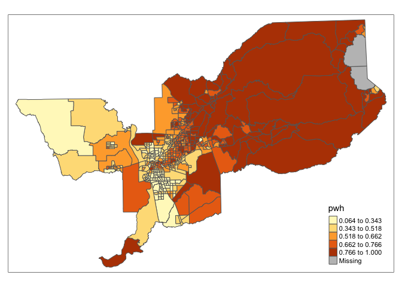
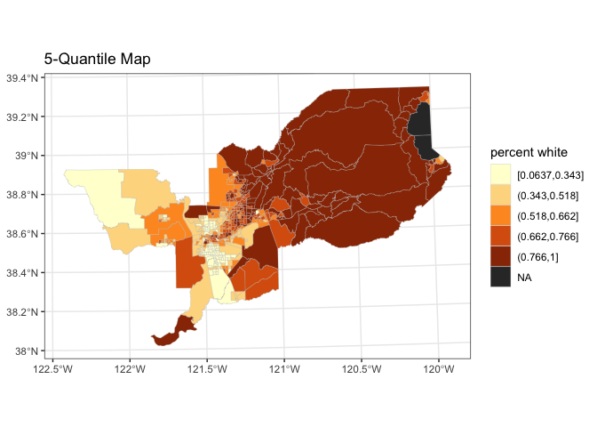
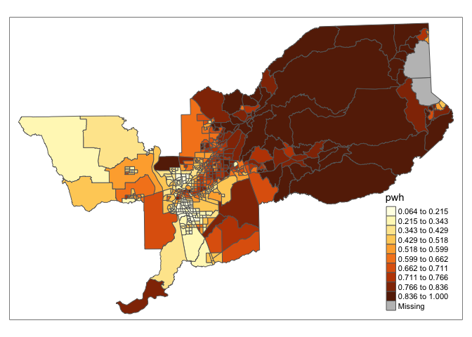
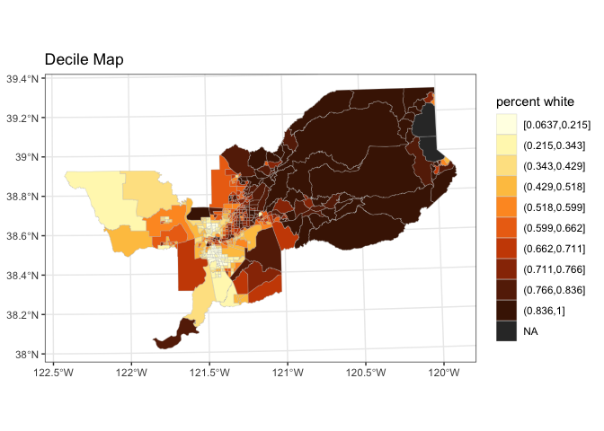
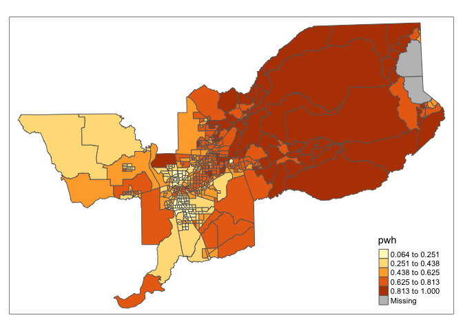

# Part 1 - {sf}

This section summarizes [Mapping using the sf package](https://geo200cn.github.io/spatialsf.html), focusing on the code necessary to complete Assignment 4.


```r
library(tidyverse)
library(sf)
library(tmap)
```

## a. read data (& data exploration)


```r
# spatial data
smt <- st_read("sacmetrotract.shp")
```

```
## Reading layer `sacmetrotract' from data source `/Users/noli/Documents/UCD/teaching/GEO 200CN/lab/geo200cn.github.io/sacmetrotract.shp' using driver `ESRI Shapefile'
## Simple feature collection with 486 features and 4 fields
## geometry type:  POLYGON
## dimension:      XY
## bbox:           xmin: 550115.8 ymin: 4208551 xmax: 770923.3 ymax: 4356172
## epsg (SRID):    NA
## proj4string:    +proj=utm +zone=10 +ellps=GRS80 +units=m +no_defs
```


```r
# non-spatial data
smtw <- read_csv("sacmetrotractwhite.csv")
```

```
## Parsed with column specification:
## cols(
##   GEOID = col_character(),
##   nhwhite = col_double(),
##   tpopr = col_double()
## )
```


```r
# Just look at non-spatial data from this spatial data set.
smt %>%
  # this will remove the geometry/spatial data (NOTE: I do not save this.)
  st_set_geometry(NULL) %>%
  head()
```

```
##         GEOID               tract           county      state
## 1 06017030200    Census Tract 302 El Dorado County California
## 2 06017030301 Census Tract 303.01 El Dorado County California
## 3 06017030302 Census Tract 303.02 El Dorado County California
## 4 06017030401 Census Tract 304.01 El Dorado County California
## 5 06017030402 Census Tract 304.02 El Dorado County California
## 6 06017030502 Census Tract 305.02 El Dorado County California
```


```r
# Just look at non-spatial data from this spatial data set.
smt %>%
  # this will remove the geometry/spatial data (NOTE: I do not save this.)
  st_set_geometry(NULL) %>%
  str()
```

```
## 'data.frame':	486 obs. of  4 variables:
##  $ GEOID : Factor w/ 486 levels "06017030200",..: 1 2 3 4 5 6 7 8 9 10 ...
##  $ tract : Factor w/ 485 levels "Census Tract 1",..: 149 150 151 152 153 154 155 156 157 158 ...
##  $ county: Factor w/ 4 levels "El Dorado County",..: 1 1 1 1 1 1 1 1 1 1 ...
##  $ state : Factor w/ 1 level "California": 1 1 1 1 1 1 1 1 1 1 ...
```


```r
head(smtw)
```

```
## # A tibble: 6 x 3
##   GEOID       nhwhite tpopr
##   <chr>         <dbl> <dbl>
## 1 06017030200    2874  5299
## 2 06017030301    1731  2874
## 3 06017030302    2085  2718
## 4 06017030401    3210  3710
## 5 06017030402    2671  3972
## 6 06017030502    2356  2638
```

## b. merge/join


```r
# a "merge" or "join" of the two data sets.
# make sure you select the right "by" value... ie the common column in both
# data.frames.
smt <- smt %>%
  left_join(smtw, by = "GEOID")
```

```
## Warning: Column `GEOID` joining factor and character vector, coercing into
## character vector
```

Why the warning message? Because GEOID is considered a factor in the `smt` df, but not in `smtw`.

## c. creating a variable

Let's create percent non-hispanic white as a column


```r
smt <- smt %>%
  mutate(pwh = nhwhite/tpopr)
```

## d. 5-quantile choropleth map

You can use a number of packages to map things in R. Here Noli has us use `{tmap}`. Read more [here](https://www.rdocumentation.org/packages/tmap). Also, they provide this bit on [getting started](https://www.rdocumentation.org/packages/tmap/versions/3.0/vignettes/tmap-getstarted.Rmd).


```r
# tmap
tm_shape(smt) +
  tm_polygons(col = "pwh", style = "quantile", n=5)
```

<!-- -->

FYI:

> The "quantile" style provides quantile breaks. [Read More.](https://www.rdocumentation.org/packages/classInt/versions/0.1-7/topics/classIntervals)


```r
# ggplot2
smt %>%
  # create new column for intervals
  mutate(cuts = cut_number(pwh, n=5)) %>%
  # make plot
  ggplot(data = .) +
  # add spatial geometry, with fill by new "cuts" column
  # make borders grey with size = 0.1
  geom_sf(mapping = aes(fill = cuts), color = "grey", size = 0.1) +
  # fill colors using the "color brewer"
  # set NA value to charcoal color.
  # add title for legend
  scale_fill_brewer(type="seq",
                    palette = "YlOrBr",
                    na.value = '#333333',
                    guide = guide_legend(title = "percent white")) +
  # add title
  labs(title = "5-Quantile Map") +
  # set background to black and white
  theme_bw()
```

<!-- -->

## e-1. 10 Quantile Map

FYI, the fine folks at colorbrewer strongly advise against more than 9 colors for choropleth maps. Check them out [here](https://colorbrewer2.org/).


```r
# tmap
tm_shape(smt) +
  tm_polygons(col = "pwh", style = "quantile", n=10)
```

<!-- -->


```r
# ggplot2
smt %>%
  mutate(cuts = cut_number(pwh, n=10)) %>%
  ggplot(data = .) +
  geom_sf(mapping = aes(fill = cuts), color = "grey", size = 0.1) +
  scale_fill_manual(
    # fill colors
    values =
      c('#ffffe5',
        '#fff7bc',
        '#fee391',
        '#fec44f',
        '#fe9929',
        '#ec7014',
        '#cc4c02',
        '#993404',
        '#662506',
        '#481a04'),
    na.value = '#333333',
    guide = guide_legend(title = "percent white")
  ) +
  labs(title = "Decile Map") +
  theme_bw()
```

<!-- -->


## e-2. 5 Equal Interval Map

> The "equal" style divides the range of the variable into n parts. [Read More.](https://www.rdocumentation.org/packages/classInt/versions/0.1-7/topics/classIntervals)


```r
# tmap
tm_shape(smt) +
  tm_polygons(col = "pwh", style = "equal", n=5)
```

<!-- -->

Before, we used `cut_number`, but now we'll use `cut_interval`.


```r
# ggplot2
smt %>%
  mutate(cuts = cut_interval(pwh, n=5)) %>%
  # make a plot
  ggplot(data = .) +
  # make geometry/polygons
  geom_sf(mapping = aes(fill = cuts), color = "grey", size = 0.1) +
  # fill colors
  scale_fill_brewer(type="seq",
                    palette = "YlOrBr",
                    na.value = '#333333',
                    guide = guide_legend(title = "percent white")) +
  # title
  labs(title = "5 Equal Interval Map") +
  # make background black and white.
  theme_bw()
```

<!-- -->


