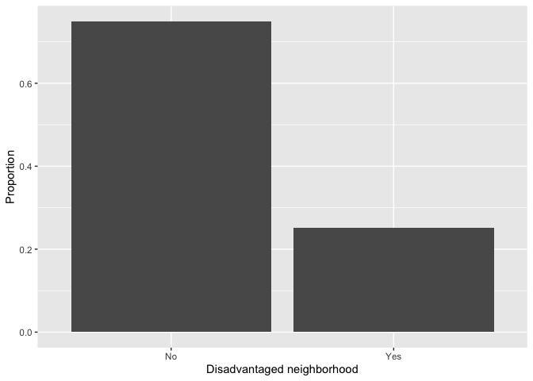
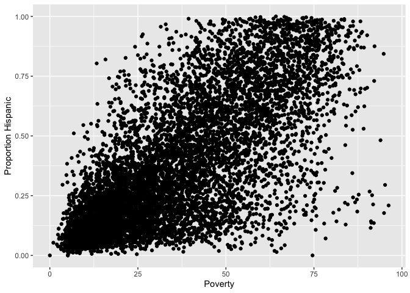
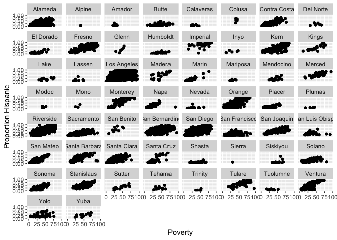
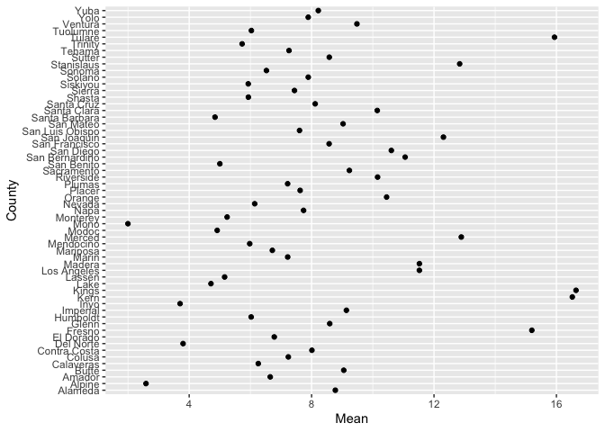
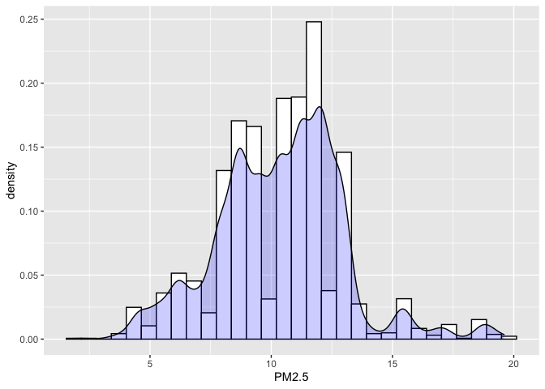
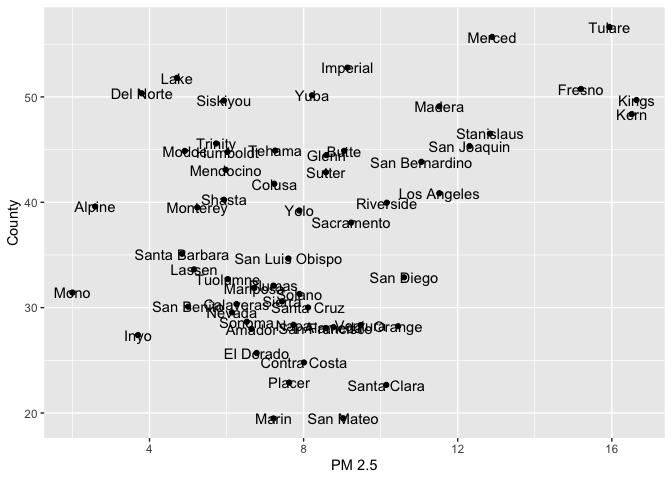
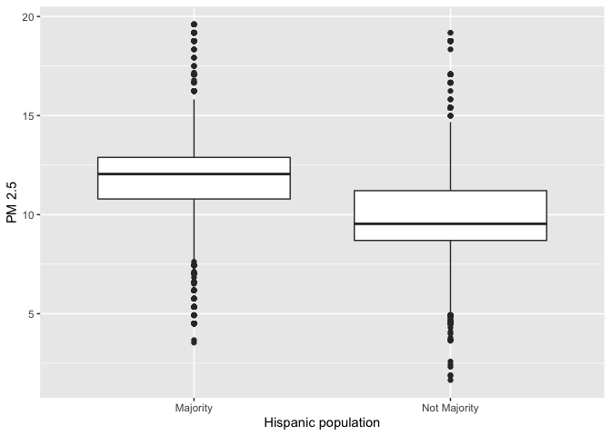
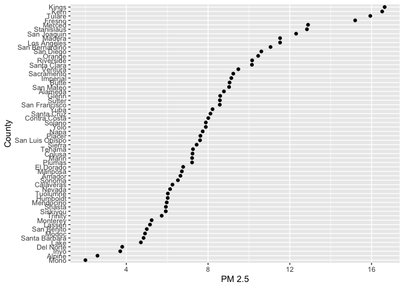

<style>
p.comment {
background-color: #DBDBDB;
padding: 10px;
border: 1px solid black;
margin-left: 25px;
border-radius: 5px;
font-style: italic;
}

.figure {
   margin-top: 20px;
   margin-bottom: 20px;
}

h1.title {
  font-weight: bold;
  font-family: Arial;  
}

h2.title {
  font-family: Arial;  
}

</style>


<style type="text/css">
#TOC {
  font-size: 13px;
  font-family: Arial;
}
</style>


\


In last lab, you were introduced to the basics of R.  In this lab, you will be learning about [tidyverse](https://www.tidyverse.org/), a collection of high-powered, consistent, and easy-to-use packages developed by a number of thoughtful and talented R developers.  Tidy R is built off of base R functions.  But, code written in the **tidyverse** style is much easier to read than those from base R. For example, if you want to select certain variables from your data frame, you use an actual tidy function named `select()`. Base R, on the other hand, has a somewhat inconsistent and sometimes incomprehensible mish-mash of function and argument styles.  To motivate the use of tidyverse functions, the second half of this guide will focus on approaches to exploratory data analysis.


<br>

The consistency of the **tidyverse**, together with the goal of increasing productivity, mean that the syntax of tidy functions is typically straightforward to learn.  You now might be asking yourself "why didn't he just cut straight to the tidyverse?"  First, many of the topics you learned in the last lab are fundamental to understanding R, tidy or not. For example, the data types remain the same whether in base or tidy world. Second, **tidyverse** is growing, but has not taken over. You need to know base R to do some of the data management and analysis procedures that we will be learning later in the class, particularly those that are specific to raster analysis.  

<br>

With that said, my approach to this course is to lean towards the tidy way of doing R.  This guide will provide you the basic fundamentals of processing nonspatial data in R using **tidyverse** functions. Because of time constraints, we will not be able to go through all of **tidyverse**'s functions in this guide.  Some you will encounter in later lab guides. Others you may need to learn on your own.  The best resource is the book [R for Data Science](http://r4ds.had.co.nz/index.html) (RDS), which is free online and was written by **tidyverse**'s creators.  You can also go straight to the **tidyverse** official [website](https://www.tidyverse.org/).

<br>

Are you ready to enter the **tidyverse**? Yes, of course, so here is your first badge.  Wear it proudly my friends! And away we go!

<center>
{ width=25% }

</center>

\

<div style="margin-bottom:25px;">
</div>
## **Tidyverse package**
\

All of **tidyverse**'s functions are located in the package **tidyverse**, which we installed in the [last lab](https://geo200cn.github.io/getting_started.html#Tidyverse).

Remember that you will install packages once and never more (unless you update R).  Next, load the package in your current session using `library()`


```r
library(tidyverse)
```

Unlike installing, loading a package using `library()` needs to happen every time you start a new R session.  Install once, never more. Library every time you start R.


<div style="margin-bottom:25px;">
</div>
## **Reading and writing data**
\

Let's bring in some data to help illustrate the use of tidy R functions.  I uploaded a file on GitHub containing the number of Hispanic, white, Asian, and black residents in 2018 in California neighborhoods taken from the United States [American Community Survey](https://www.census.gov/programs-surveys/acs).  The data are also located on Canvas in the Lab and Assignments Week 1 folder.  To import this file in R, use the `read_csv()` command


```r
neighborhoods <- read_csv("https://raw.githubusercontent.com/geo200cn/data/master/week2data.csv")
```

<br>

To write or save data, you would use the function `write_csv()`.

**tidyverse** can read in more than just csv files. It has a suite of `read_` functions that are a part of the subpackage **readr**.  The goal of **readr** is to provide a fast and friendly way to read rectangular data (like csv, tsv, and fwf). It is designed to flexibly parse many types of data found in the wild, while still cleanly failing when data unexpectedly changes. To learn more about these functions, see **readr**'s dedicated [site](https://readr.tidyverse.org/index.html).

Note the underscore in between `read` and `csv`.  There is a base R function called `read.csv()`.  What is the difference? The function `read.csv()` stores your data into a regular data frame. The function `read_csv()` stores your data in a special tidy R object - a tibble, which we discuss next. 

Before we do so, by learning how to read and write data the tidy way, you've earned another badge! Hooray for us!

<center>
{ width=25% }

</center>

\


<div style="margin-bottom:25px;">
</div>
## **Tibbles**
\

Although the **tidyverse** works with all data objects, its fundamental object type is the tibble. Tibbles are essentially a special variant of [data frames](https://geo200cn.github.io/getting_started.html#Data_Frames) that have desirable properties for printing and joining.  To illustrate comparisons between tibbles and regular data frames, let's bring in the county data we downloaded above but using the base R function `read.csv()`  


```r
neighborhoods.df <- read.csv("https://raw.githubusercontent.com/geo200cn/data/master/week2data.csv")
```


The object *neighborhoods.df* is a regular data frame. The first difference between regular data frames and tibbles is how the dataset "looks."  First, the tibble.


```r
neighborhoods
```

```
## # A tibble: 7,937 × 7
##         GEOID NAME            hisp nhasn nhblk nhwhite tpopr
##         <dbl> <chr>          <dbl> <dbl> <dbl>   <dbl> <dbl>
##  1 6019001100 Fresno          2033    24   552      81  2760
##  2 6071001600 San Bernardino  5325    11    18      94  5527
##  3 6019000200 Fresno          1935   317   416     153  2870
##  4 6077000801 San Joaquin     4977  1083   400     389  7352
##  5 6019001500 Fresno          1868    36    25     541  2475
##  6 6037204920 Los Angeles     2544     0    27      68  2639
##  7 6077000300 San Joaquin     1216   307   401     291  2240
##  8 6019001000 Fresno          2524   693   842      93  4231
##  9 6037206050 Los Angeles     1550   183   112     127  2010
## 10 6019000400 Fresno          4770   633   106     422  5958
## # … with 7,927 more rows
```

Tibbles have a refined print method that shows only the first 10 rows, and only the columns that fit on the screen.  In addition, each column reports its name and type.

Tibbles are designed so that you don't accidentally overwhelm your console when you print large data frames.  Compare the print output above to what you get with a data frame


```r
neighborhoods.df
```

Ugly, right? 

Another important difference between tidy and base R is that `read_csv()` will always read variables containing text as character variables. In contrast, the base R function `read.csv()` will sometimes convert a character variable to a factor. Tidy R figures that if you really wanted a character, you can easily convert it when you load it in. `read_csv()` will also not convert numbers with a leading zero into an integer.  It figures that if you want to convert it into an integer, you can do it after the data are read in.  In contrast, `read.csv()` will assume you want it in an integer.   And you know what they say about [assuming](https://www.youtube.com/watch?v=svkgOsr7pUc).

Anyway, you earned another badge. Yes!

<center>
{ width=25% }

</center>

\


<div style="margin-bottom:25px;">
</div>
## **Data manipulation**
\

One of the clear advantages of tidy R, at least when you are first learning R, is its assortment of user-friendly data manipulation functions, which is a part of its **dplyr** package. Compared to base R, the beauty of these **dplyr** functions is that they feature consistent design principles and easily work with non-standard evaluation (i.e., you don’t have to put quotes around variable names).


It is rare that the data you download are in exactly the right form for analysis.  For example, you might want to analyze just Yolo county neighborhoods. Or you might want to discard certain variables from the dataset to reduce clutter. Or you encounter missing data. The process of gathering data in its raw form and molding it into a form that is suitable for its end use is known as *data wrangling*.  

In this lab, we won't have time to go through all of the methods and functions in R that are associated with the data wrangling process. Many methods you will have to learn on your own given the specific tasks you will need to accomplish.  In the rest of this lab, we'll go through some of the basic data wrangling techniques using the functions found in the package **dplyr**, which was automatically installed and loaded when you brought in the **tidyverse** package.  These functions can be used for tibbles and regular data frames.

<div style="margin-bottom:25px;">
</div>
### **Renaming variables**
\

You will likely encounter a variable in a dataset with a name that is not descriptive. The more descriptive the names, the more efficient your analysis will be and the less likely you are going to make a mistake. To see the names of variables in your dataset, use the `names()` command.  


```r
names(neighborhoods)
```

```
## [1] "GEOID"   "NAME"    "hisp"    "nhasn"   "nhblk"   "nhwhite" "tpopr"
```

Use the command `rename()` to - what else? - rename a variable!  Let's rename *NAME* to *County*.  


```r
neighborhoods <- rename(neighborhoods, County = "NAME")
```

<div style="margin-bottom:25px;">
</div>
### **Selecting variables**
\

In practice, most of the data files you will download will contain variables you don't need. It is easier to work with a smaller dataset as it reduces clutter and clears up memory space, which is important if you are executing complex tasks on a large number of observations.  Use the command `select()` to keep variables by name.  Visually, we are doing the following (taken from the RStudio [cheatsheet](http://www.rstudio.com/wp-content/uploads/2015/02/data-wrangling-cheatsheet.pdf))  


<center>


</center>


Let's keep *County*, *GEOID*, and *hisp*, *nhwhite*, *nhblk* and *tpopr* from the *neighborhoods* dataset.


```r
select(neighborhoods, County, GEOID, hisp, nhwhite, nhblk, tpopr)
```

```
## # A tibble: 7,937 × 6
##    County              GEOID  hisp nhwhite nhblk tpopr
##    <chr>               <dbl> <dbl>   <dbl> <dbl> <dbl>
##  1 Fresno         6019001100  2033      81   552  2760
##  2 San Bernardino 6071001600  5325      94    18  5527
##  3 Fresno         6019000200  1935     153   416  2870
##  4 San Joaquin    6077000801  4977     389   400  7352
##  5 Fresno         6019001500  1868     541    25  2475
##  6 Los Angeles    6037204920  2544      68    27  2639
##  7 San Joaquin    6077000300  1216     291   401  2240
##  8 Fresno         6019001000  2524      93   842  4231
##  9 Los Angeles    6037206050  1550     127   112  2010
## 10 Fresno         6019000400  4770     422   106  5958
## # … with 7,927 more rows
```

You can use also use `select()` command to keep variables *except* for the ones you designate.  For example, to keep all variables in *neighborhoods* except *nhasn* and save this back into *neighborhoods*, type in


```r
neighborhoods <- select(neighborhoods, -nhasn)
neighborhoods
```

The negative sign tells R to exclude the variable.


<div style="margin-bottom:25px;">
</div>
### **Creating new variables**
\

The `mutate()` function allows you to create new variables within your dataset.  This is important when you need to transform variables in some way - for example, calculating a ratio or adding two variables together.  Visually, you are doing this

<center>


</center>

You can use the `mutate()` command to generate as many new variables as you would like.  For example, let's construct three new variables in *neighborhoods* - the percent of residents who are non-Hispanic white, non-Hispanic black, and Hispanic.  Name these variables *pwhite*, *pblack*, and *phisp*, respectively.


```r
mutate(neighborhoods, pwhite = nhwhite/tpopr, pblack = nhblk/tpopr, 
       phisp = hisp/tpopr)
```

Note that you can create new variables based on the variables you just created in the same line of code. For example, you can create a categorical variable yielding "Majority" if the tract is majority Hispanic and "Not Majority" otherwise after creating the percent Hispanic variable within the same `mutate()` command.  Let's save these changes back into *neighborhoods*.


```r
neighborhoods <- mutate(neighborhoods, pwhite = nhwhite/tpopr,  
              pblack = nhblk/tpopr, phisp = hisp/tpopr,
              mhisp = ifelse(phisp > 0.5, "Majority","Not Majority"))
neighborhoods
```

We used the function `ifelse()` to create *mhisp* - the function tells R that if the condition `phisp > 0.5` is met, the tract's value for the variable *mhisp* will be "Majority", otherwise it will be "Not Majority".


<div style="margin-bottom:25px;">
</div>
### **Filtering**
\

Filtering means selecting rows/observations based on their values.  To filter in R, use the command `filter()`.  Visually, filtering rows looks like.

<center>


</center>

The first argument in the parentheses of this command is the name of the data frame. The second and any subsequent arguments (separated by commas) are the expressions that filter the data frame. For example, we can select Sacramento county


```r
filter(neighborhoods, County == "Sacramento")
```

The double equal operator `==` means equal to.  We can also explicitly exclude cases and keep everything else by using the not equal operator `!=`.  The following code *excludes* Sacramento county.


```r
filter(neighborhoods, County != "Sacramento")
```


What about filtering if a neighborhood has a value greater than a specified value?  For example, neighborhoods with a percent white greater than 0.5 (50%). 


```r
filter(neighborhoods, pwhite > 0.5)
```

What about less than 0.5 (50%)?


```r
filter(neighborhoods, pwhite < 0.5)
```

Both lines of code do not include neighborhoods that have a percent white equal to 0.5.  We include it by using the less than or equal operator `<=` or greater than or equal operator `>=`.


```r
filter(neighborhoods, pwhite <= 0.5)
```

In addition to comparison operators, filtering may also utilize logical operators that make multiple selections.  There are three basic logical operators: `&` (and), `|` is (or), and `!` is (not).  We can keep neighborhoods with *phisp* greater than 0.5 **and** *tpopr* greater than 5000 using `&`.


```r
filter(neighborhoods, phisp > 0.5 & tpopr > 5000)
```

Use `|` to keep neighborhoods in Sacramento **or** Yolo


```r
filter(neighborhoods, County == "Sacramento" | County == "Yolo")
```

<div style="margin-bottom:25px;">
</div>
### **Joining tables**
\

Often you will have two datasets containing the same observations but with different variables.  Your goal is to combine the datasets into a single one. 

Let's join a dataset containing some health and air pollution data from California's [CalEnviroScreen](https://oehha.ca.gov/calenviroscreen/report/calenviroscreen-30) program. Read it in from GitHub using our new friend `read_csv()`.


```r
ces <- read_csv("https://raw.githubusercontent.com/geo200cn/data/master/ces.csv")
names(ces)
```

The dataset contains the poverty rate, air pollution levels ([PM2.5](https://www.epa.gov/pm-pollution/particulate-matter-pm-basics)), and whether the neighborhood is environmentally disadvantaged according to the CES.  To join the objects *ces* and *neighborhoods*, we need a unique ID that connects the observations across the two files. This unique is named *GEOID* in both files. The IDs should be the same data class, which is the case.


```r
class(ces$GEOID)
```

```
## [1] "numeric"
```

```r
class(neighborhoods$GEOID)
```

```
## [1] "numeric"
```


To merge the datasets together, use the function `left_join()`, which matches pairs of observations whenever their keys or IDs are equal. We match on the variable *GEOID* and save the merged data set into a new object called *neighces*. 

```r
neighces <- left_join(neighborhoods, ces, by = "GEOID")
```

The argument *by* tells R which variable(s) to match rows on, in this case *GEOID*. You can match on multiple variables and you can also match on a single variable with different variable names (see the `left_join()` help documentation for how to do this). 

<div style="margin-bottom:25px;">
</div>
### **Other functions**
\

If you have a dataset with a lot of variables, you might want to put important variables at or close to the front.  To relocate variables in your dataset, use the function `relocate()`. Currently, this is the order of variables in *neighborhoods*


```r
names(neighborhoods)
```

```
##  [1] "GEOID"   "County"  "hisp"    "nhblk"   "nhwhite" "tpopr"   "pwhite" 
##  [8] "pblack"  "phisp"   "mhisp"
```

Use `relocate()` to move up *tpopr* right after *GEOID* and *County*


```r
neighborhoods <- relocate(neighborhoods, GEOID, County, tpopr)
names(neighborhoods)
```

```
##  [1] "GEOID"   "County"  "tpopr"   "hisp"    "nhblk"   "nhwhite" "pwhite" 
##  [8] "pblack"  "phisp"   "mhisp"
```

What if you want to arrange rows? Use the `arrange()` function.  Use the function `head()` to see what are the observations at the top of your file


```r
head(neighborhoods)
```

```
## # A tibble: 6 × 10
##        GEOID County         tpopr  hisp nhblk nhwhite pwhite  pblack phisp mhisp
##        <dbl> <chr>          <dbl> <dbl> <dbl>   <dbl>  <dbl>   <dbl> <dbl> <chr>
## 1 6019001100 Fresno          2760  2033   552      81 0.0293 0.2     0.737 Majo…
## 2 6071001600 San Bernardino  5527  5325    18      94 0.0170 0.00326 0.963 Majo…
## 3 6019000200 Fresno          2870  1935   416     153 0.0533 0.145   0.674 Majo…
## 4 6077000801 San Joaquin     7352  4977   400     389 0.0529 0.0544  0.677 Majo…
## 5 6019001500 Fresno          2475  1868    25     541 0.219  0.0101  0.755 Majo…
## 6 6037204920 Los Angeles     2639  2544    27      68 0.0258 0.0102  0.964 Majo…
```

What if we wanted to sort the rows by population size in descending order?


```r
neighborhoods <- arrange(neighborhoods, tpopr)
head(neighborhoods)
```

```
## # A tibble: 6 × 10
##        GEOID County        tpopr  hisp nhblk nhwhite pwhite pblack  phisp mhisp 
##        <dbl> <chr>         <dbl> <dbl> <dbl>   <dbl>  <dbl>  <dbl>  <dbl> <chr> 
## 1 6075980300 San Francisco    66     0     0      55  0.833      0 0      Not M…
## 2 6017031900 El Dorado        75     4     0      69  0.92       0 0.0533 Not M…
## 3 6037575500 Los Angeles      92    80     0      12  0.130      0 0.870  Major…
## 4 6037930101 Los Angeles      92     0     0      48  0.522      0 0      Not M…
## 5 6037980019 Los Angeles     151     0     0     125  0.828      0 0      Not M…
## 6 6065940100 Riverside       166    25     0     135  0.813      0 0.151  Not M…
```

To sort in descending order, add a `-` sign in front of the variable


```r
neighborhoods <- arrange(neighborhoods, -tpopr)
head(neighborhoods)
```

```
## # A tibble: 6 × 10
##        GEOID County      tpopr  hisp nhblk nhwhite pwhite  pblack phisp mhisp   
##        <dbl> <chr>       <dbl> <dbl> <dbl>   <dbl>  <dbl>   <dbl> <dbl> <chr>   
## 1 6073018700 San Diego   38932 10784  3414   22842  0.587 0.0877  0.277 Not Maj…
## 2 6073013310 San Diego   32326 14894  1135    4489  0.139 0.0351  0.461 Not Maj…
## 3 6107001003 Tulare      24719 13575   119    8656  0.350 0.00481 0.549 Majority
## 4 6077005206 San Joaquin 23903  5103  1698    7640  0.320 0.0710  0.213 Not Maj…
## 5 6059052420 Orange      23482  2415     0    7437  0.317 0       0.103 Not Maj…
## 6 6077003500 San Joaquin 23464  6583  1213    5464  0.233 0.0517  0.281 Not Maj…
```

You've learned many of the major functions used in data manipulation.  Here's another badge for you. Congrats!!

<center>
{ width=25% }

</center>

\


<div style="margin-bottom:25px;">
</div>
### **Function conflicts**
\

You'll learn to understand that R is beautiful.  But, it isn't perfect. One of its annoyances is that because R is open source, R users who contribute packages sometimes create functions with the same names. To demonstrate this, let's load in the package **MASS**


```r
library(MASS)
```

```
## 
## Attaching package: 'MASS'
```

```
## The following object is masked from 'package:dplyr':
## 
##     select
```

You see the warning? Keep it in mind. 

Let's use the function `select()` again to keep the variables *GEOID* and *PM2.5* from *neighces*


```r
select(neighces, GEOID, PM2.5)
```

```
## Error in select(neighces, GEOID, PM2.5): unused arguments (GEOID, PM2.5)
```

What in the world just happened? By loading **MASS**, we have overwritten **tidyverse**’s `select()` function (hence the warning when you loaded **MASS**). R will choose the function from the package that was most recently loaded. The normal workaround is to be explicit about which `select()` function you want by using `dplyr::select()` as in


```r
dplyr::select(neighces, GEOID, PM2.5)
```

```
## # A tibble: 7,937 × 2
##         GEOID PM2.5
##         <dbl> <dbl>
##  1 6019001100  15.4
##  2 6071001600  13.3
##  3 6019000200  15.4
##  4 6077000801  12.5
##  5 6019001500  15.4
##  6 6037204920  12.9
##  7 6077000300  13.4
##  8 6019001000  15.4
##  9 6037206050  12.9
## 10 6019000400  15.4
## # … with 7,927 more rows
```

To unload a package (i.e. "unlibrary" it) use the `detach()` function as follows.


```r
detach("package:MASS")
```

<div style="margin-bottom:25px;">
</div>
## **Pipes**
\

One of the important innovations from the **tidyverse** is the pipe operator `%>%`. [Pipes](https://www.youtube.com/watch?v=ofsljUAUdlc) are the workhorse of tidy analyses. Piping allows you to chain together many functions, eliminating the need to define multiple intermediate objects to use as the input to subsequent functions. [Pipes](https://www.youtube.com/watch?v=-B5VBH0y2Ig) are also the primary reason that **tidyverse** code is fundamentally easier to read than base R code.

It may seem complicated at first, but what the pipe does is actually quite simple. That is, it allows users to write linear code. To illustrate the use of the pipe, consider the following base R code that takes the mean of the log of three numbers


```r
mean(log(c(1, 3, 9)))
```

```
## [1] 1.098612
```

Notice how the numbers *c(1, 3, 9)* are nested inside `log()`, which is then nested inside `mean()`. If you’re reading the code from left-to-right, it means the functions are performed in reverse order from how they are written. If we broke the code down into its three functions, we would actually expect the order of operations to proceed as follows

1. Concatenate numbers into vector `c(...)`
2. Log the numeric vector `log(...)`
3. Estimate the mean of the logged numeric vector `mean(...)`

Now consider how you would do this using pipes.


```r
c(1, 3, 9) %>% 
  log() %>% 
  mean()
```

```
## [1] 1.098612
```

In contrast to the nested base code, the tidy code is linear; in other words, the code appears in the same order (moving from left to right) as the operations are performed.  Let's bring back our original *neighborhoods* dataset 


```r
neighborhoods <- read_csv("https://raw.githubusercontent.com/geo200cn/data/master/week2data.csv")
```

and use pipes to 

1. rename the variable *NAME* to *County* 
2. keep all variables except *nhasn*
3. create the percent race/ethnicity and majority Hispanic variables 
4. join the *ces* file


```r
neighces <- neighborhoods %>%
  rename(County = NAME) %>%
  select(GEOID, County, hisp, nhblk, nhwhite, tpopr) %>%
  mutate(pwhite = nhwhite/tpopr, phisp = hisp/tpopr,
         pblk = nhblk/tpopr, 
         mhisp = ifelse(phisp > 0.5, "Majority","Not Majority")) %>%
  left_join(ces, by = "GEOID")
```

In the code above, the tibble *neighborhoods* is piped into the command `rename()`.  This command changes *NAME* to *County*.  The resulting object gets piped into the command `select()`. And so on.

Piping makes code clearer, and simultaneously gets rid of the need to define any intermediate objects that you would have needed to keep track of while reading the code. PIPE, Pipe, and pipe whenever you can. Badge it!

<center>
{ width=25% }

</center>

\


<div style="margin-bottom:25px;">
</div>
## **Exploratory Data Analysis**
\


So far we've gone through **tidyverse**'s data cleaning and manipulation functions. After you've cleaned your dataset, you then want to start descriptively analyzing your data. Below we will go through several methods for conducting Exploratory Data Analysis (EDA).  We first start with univariate and bivariate statistics. We then go through how to construct charts and graphs.

<div style="margin-bottom:25px;">
</div>
### **Univariate statistics**
\

Univariate statistics provide summaries of a single variable.  The most common univariate statistics are those that measure central tendency. The most common measure of central tendency is the mean.  We can calculate the mean of a variable using the function `summarize()`


```r
summarize(neighces, mean(PM2.5))
```

```
## # A tibble: 1 × 1
##   `mean(PM2.5)`
##           <dbl>
## 1          10.4
```

The first argument inside `summarize()` is the data object *neighces* and the second argument is the function calculating the specific summary statistic, in this case `mean()`, which unsurprisingly calculates the mean of the variable you indicate in between the parentheses.

Other common measures of central tendency are the median (50th percentile) and the mode (most frequent value).  The function for the median is `median()`.  There is no base function for calculating the mode, so lets create our own function called `getmode()`, which we learned about in [last lab]().


```r
# Create the function.
getmode <- function(v) {
   uniqv <- unique(v)
   uniqv[which.max(tabulate(match(v, uniqv)))]
}
```


```r
neighces %>%
  summarize(Mean = mean(PM2.5),
            Median = median(PM2.5),
            Mode = getmode(PM2.5))
```

```
## # A tibble: 1 × 3
##    Mean Median  Mode
##   <dbl>  <dbl> <dbl>
## 1  10.4   10.4  12.0
```


The other common set of univariate statistics measure spread.  The three most common measures of spread are the variance, its buddy the standard deviation and the Interquartile Range (IQR).


```r
neighces %>%
  summarize(Mean = mean(PM2.5),
            Median = median(PM2.5),
            Mode = getmode(PM2.5),
            Variance = var(PM2.5),
            SD = sd(PM2.5),
            IQR = IQR(PM2.5))
```

```
## # A tibble: 1 × 6
##    Mean Median  Mode Variance    SD   IQR
##   <dbl>  <dbl> <dbl>    <dbl> <dbl> <dbl>
## 1  10.4   10.4  12.0     6.74  2.60  3.35
```

What if your variable is categorical? You want to summarize this variable type using a frequency table. What are the percentages of neighborhoods that are considered to be environmentally burdened in California? To get these percentages, you'll need to combine the functions `group_by()`, `summarize()` and `mutate()` using `%>%`.


```r
neighces %>%
  group_by(disadvantage) %>%
  summarize(n = n()) %>%
  mutate(freq = n / sum(n))
```

```
## # A tibble: 2 × 3
##   disadvantage     n  freq
##   <chr>        <int> <dbl>
## 1 No            5947 0.749
## 2 Yes           1990 0.251
```

The `group_by()` function applies another function independently within groups of observations (where the groups are specified by a categorical variable in your data frame). We used `summarize()` to count the number of neighborhoods by disadvantage designation.  The function to get a count is `n()`, and we saved this count in a variable named *n*.  The code within `mutate()` calculates the frequencies.

You can get a summary of all the variables in a data frame using the `summary()` function


```r
summary(neighces)
```

```
##      GEOID              County               hisp           nhblk       
##  Min.   :6.001e+09   Length:7937        Min.   :    0   Min.   :   0.0  
##  1st Qu.:6.037e+09   Class :character   1st Qu.:  641   1st Qu.:  34.0  
##  Median :6.059e+09   Mode  :character   Median : 1420   Median : 116.0  
##  Mean   :6.055e+09                      Mean   : 1909   Mean   : 269.5  
##  3rd Qu.:6.073e+09                      3rd Qu.: 2789   3rd Qu.: 311.0  
##  Max.   :6.115e+09                      Max.   :14894   Max.   :5469.0  
##     nhwhite          tpopr           pwhite           phisp       
##  Min.   :    0   Min.   :   66   Min.   :0.0000   Min.   :0.0000  
##  1st Qu.:  649   1st Qu.: 3495   1st Qu.:0.1466   1st Qu.:0.1537  
##  Median : 1590   Median : 4632   Median :0.3783   Median :0.3088  
##  Mean   : 1839   Mean   : 4904   Mean   :0.3895   Mean   :0.3797  
##  3rd Qu.: 2681   3rd Qu.: 5924   3rd Qu.:0.6131   3rd Qu.:0.5805  
##  Max.   :22842   Max.   :38932   Max.   :0.9804   Max.   :1.0000  
##       pblk             mhisp              Poverty         PM2.5       
##  Min.   :0.000000   Length:7937        Min.   : 0.0   Min.   : 1.651  
##  1st Qu.:0.008253   Class :character   1st Qu.:19.2   1st Qu.: 8.698  
##  Median :0.025617   Mode  :character   Median :33.5   Median :10.370  
##  Mean   :0.055452                      Mean   :36.4   Mean   :10.377  
##  3rd Qu.:0.065583                      3rd Qu.:51.6   3rd Qu.:12.050  
##  Max.   :0.839158                      Max.   :96.2   Max.   :19.600  
##  disadvantage      
##  Length:7937       
##  Class :character  
##  Mode  :character  
##                    
##                    
## 
```

<div style="margin-bottom:25px;">
</div>
### **Bivariate statistics**
\

A frequent goal in data analysis is to efficiently describe or measure the strength of relationships between variables, or to detect associations between categorical variables used to set up a cross tabulation. A related goal may be to determine which variables are related in a predictive sense to a particular outcome variable, or put another way, to learn how best to predict future values of a outcome variable. Correlation, along with measures of association constructed from tables, provide the means for constructing and displaying such relationships.

The correlation coefficient is used to measure the association between two numeric variables.  Use the function `cor` in R.  What is the correlation between PM2.5 levels and percent Hispanic? What about percent White?


```r
neighces %>%
  summarize(hispcor = cor(phisp,PM2.5, use = "complete.obs"),
            whitecor = cor(pwhite,PM2.5, use = "complete.obs"))
```

```
## # A tibble: 1 × 2
##   hispcor whitecor
##     <dbl>    <dbl>
## 1   0.366   -0.372
```

You can obtain a correlation matrix to show bivariate correlation across multiple variables.  One way of doing this in R is to use the `correlate()` function, which is found in the package **corrr**.  Use the function `install.packages()` to [install]() **corrr**.  Then load the package in using `library()`.


```r
library(corrr)
```


```r
neighces %>% 
  select(pwhite, phisp, pblk, Poverty, `PM2.5`) %>% 
  correlate()
```

```
## 
## Correlation method: 'pearson'
## Missing treated using: 'pairwise.complete.obs'
```

```
## # A tibble: 5 × 6
##   term    pwhite   phisp    pblk Poverty   PM2.5
##   <chr>    <dbl>   <dbl>   <dbl>   <dbl>   <dbl>
## 1 pwhite  NA     -0.771  -0.329   -0.598 -0.372 
## 2 phisp   -0.771 NA       0.0326   0.701  0.366 
## 3 pblk    -0.329  0.0326 NA        0.223  0.0766
## 4 Poverty -0.598  0.701   0.223   NA      0.234 
## 5 PM2.5   -0.372  0.366   0.0766   0.234 NA
```

To summarize the relationship between two categorical variables, you’ll need to find the proportion of observations for each combination, also known as a cross tabulation. Let’s create a cross tabulation of the categorical variables *mhisp* and *disadvantage*. We do this by using both variables in the `group_by()` command.


```r
neighces %>%
  group_by(disadvantage, mhisp) %>%
  summarize(n = n())  %>%
  mutate(freq = n / sum(n))
```

```
## # A tibble: 4 × 4
## # Groups:   disadvantage [2]
##   disadvantage mhisp            n  freq
##   <chr>        <chr>        <int> <dbl>
## 1 No           Majority       980 0.165
## 2 No           Not Majority  4967 0.835
## 3 Yes          Majority      1492 0.750
## 4 Yes          Not Majority   498 0.250
```

A much higher proportion of disadvantaged neighborhoods are Majority Hispanic (0.750) compared to non disadvantage neighborhoods (0.165).

What about summarizing the relationship between a categorical and numeric variable? A typical way of summarizing the relationship between a categorical variable and a numeric variable is to take the mean of the numeric variable for each level of the categorical variable. What is the mean pollution levels for majority vs non-majority Hispanic neighborhoods?


```r
neighces %>%
  group_by(mhisp) %>%
  summarize(Mean = mean(PM2.5))
```

```
## # A tibble: 2 × 2
##   mhisp         Mean
##   <chr>        <dbl>
## 1 Majority     11.6 
## 2 Not Majority  9.82
```

You can also find the mean PM2.5 levels by county using the same code.


```r
neighces %>%
  group_by(County) %>%
  summarize(Mean = mean(PM2.5)) 
```

```
## # A tibble: 58 × 2
##    County        Mean
##    <chr>        <dbl>
##  1 Alameda       8.78
##  2 Alpine        2.59
##  3 Amador        6.65
##  4 Butte         9.05
##  5 Calaveras     6.26
##  6 Colusa        7.24
##  7 Contra Costa  8.01
##  8 Del Norte     3.80
##  9 El Dorado     6.78
## 10 Fresno       15.2 
## # … with 48 more rows
```


How can you add to the above code to find out the top 10 counties in average PM2.5 levels?


<div style="margin-bottom:25px;">
</div>
### **Data visualization**
\

Instead of tables and summary statistics, you might want to summarize your data using plots. The base R function for plotting is `plot()`. We can create a scatterplot (more on this later) of proportion and Hispanic and the poverty rate by typing in the following


```r
plot(neighces$phisp~neighces$Poverty)
```

<!-- -->

The **tidyverse**'s data visualization package is **ggplot2**. The graphing function is `ggplot()` and it takes on the basic template

<br>

````
ggplot(data = <DATA>) +
      <GEOM_FUNCTION>(mapping = aes(x, y)) +
      <OPTIONS>()
````
<br>

1. `ggplot()` is the base function where you specify your dataset using the `data = <DATA>` argument.

2. You then need to build on this base by using the plus operator `+` and `<GEOM_FUNCTION>()` where `<GEOM_FUNCTION>()` is a unique function indicating the type of graph you want to plot. Each unique function has its unique set of mapping arguments which you specify using the `mapping = aes()` argument.  Charts and graphs have an x-axis, y-axis, or both.  Check [this](https://rstudio.com/wp-content/uploads/2016/11/ggplot2-cheatsheet-2.1.pdf) **ggplot** cheat sheet for all possible geoms. 

3. `<OPTIONS>()` are a set of functions you can specify to change the look of the graph, for example relabeling the axes or adding a title.


The basic idea is that a ggplot graphic layers geometric objects (circles, lines, etc), themes, and scales on top of data.

You first start out with the base layer.  It represents the empty ggplot layer defined by the `ggplot()` function. 


```r
ggplot(neighces)
```

<!-- -->

We haven’t told `ggplot()` what type of geometric object(s) we want to plot, nor how the variables should be mapped to the geometric objects, so we just have a blank plot. We have geoms to paint the blank canvas.

From here, we add a “geom” layer to the ggplot object.  Layers are added to ggplot objects using `+`, instead of `%>%`, since you are not explicitly piping an object into each subsequent layer, but adding layers on top of one another.  Each geom is associated with a specific type of graph.

<div style="margin-bottom:25px;">
</div>
#### **Histogram**
\

Histograms are used to summarize a single numeric variable. To create a histogram, use `geom_histogram()` for `<GEOM_FUNCTION()>`. Let’s create a histogram of PM 2.5.


```r
ggplot(neighces) + 
  geom_histogram(mapping = aes(x=PM2.5)) +
  xlab("PM 2.5") 
```

```
## `stat_bin()` using `bins = 30`. Pick better value with `binwidth`.
```

<!-- -->

Because a single variable is plotted on the x-axis, we specify `x = in aes()` but not a `y =`. The `xlab()` function, which is an example of a `<OPTIONS>()` function, allows you to relabel the title of the x-axis (`ylab()` is for the y-axis). The message before the plot tells us that we can use the `bins =` argument to change the number of bins used to produce the histogram. You can increase the number of bins to make the bins narrower and thus get a finer grain of detail. Or you can decrease the number of bins to get a broader visual summary of the shape of the variable’s distribution. Try changing the number of bins and see what you get.


<div style="margin-bottom:25px;">
</div>
#### **Density plot**
\

A density plot is a plot of the local relative frequency or density of points along the number line or x-axis of a plot. The local density is determined by summing the individual “kernel” densities for each point. Where points occur more frequently, this sum, and consequently the local density, will be greater. Density plots get around some of the problems that histograms have.  `geom_density()` is the associated  `<GEOM_FUNCTION()>` for a density plot. Let's make a density plot of PM 2.5.


```r
ggplot(neighces) + 
  geom_density(mapping = aes(x=PM2.5)) +
  ylab("PM 2.5") 
```

<!-- -->

Plots with both a histogram and density line can be created:


```r
ggplot(neighces, aes(x=PM2.5)) + 
 geom_histogram(aes(y=..density..), colour="black", fill="white")+
 geom_density(alpha=.2, fill="blue") 
```

```
## `stat_bin()` using `bins = 30`. Pick better value with `binwidth`.
```

<!-- -->

`alpha =` controls the transparency and `fill =` controls for the color of the plot.

<div style="margin-bottom:25px;">
</div>
#### **Boxplot**
\

We can use a boxplot (or a box-and-whisker plot) to visually summarize the distribution of a single variable. Use `geom_boxplot()` for `<GEOM_FUNCTION()>` to create a boxplot. Let’s examine PM 2.5


```r
ggplot(neighces) + 
  geom_boxplot(mapping = aes(y=PM2.5)) +
  ylab("PM 2.5") 
```

<!-- -->

The top, middle and bottom of the box represent the 75th, 50th, and 25th percentiles, respectively.  The points outside the whiskers represent outliers. Outliers are defined as having values that are either larger than the 75th percentile plus 1.5 times the IQR or smaller than the 25th percentile minus 1.5 times the IQR. 

We can also use the boxplot to examine the relationship between a categorical and numeric variable. Let’s examine the distribution of PM 2.5 by majority vs. non majority Hispanic. Because we are examining the association between two variables, we need to specify *x* and *y* variables within `aes()`


```r
ggplot(neighces) + 
  geom_boxplot(mapping = aes(x = mhisp, y=PM2.5)) +
  ylab("PM 2.5") +
    xlab("Hispanic population") 
```

<!-- -->


<div style="margin-bottom:25px;">
</div>
#### **Barchart**
\

We use a bar chart to summarize a categorical variable. Bar charts show either the number or frequency of each category. To create a bar chart, use `geom_bar()` for `<GEOM_FUNCTION>()`. Let’s show a bar chart of environmentally disadvantaged communities. We can borrow from the code we used earlier to create our *disadvantage* frequency table and pipe this table directly into `ggplot()`.


```r
neighces %>%
  group_by(disadvantage) %>%
  summarize(n = n()) %>%
  mutate(freq = n / sum(n))  %>%
  ggplot() +
  geom_bar(mapping=aes(x=disadvantage, y=freq),stat="identity") +
    xlab("Disadvantaged neighborhood") +
    ylab("Proportion") 
```

<!-- -->

We didn’t need to specify `data = <DATA>` in `ggplot()` because it was piped in. Within `aes()`, we specified the categorical variable *oppzone* on the x-axis and then the proportion of neighborhoods freq on the y-axis. The argument `stat = "identity"` tells `ggplot()` to plot the exact value listed for the variable *freq*.

<div style="margin-bottom:25px;">
</div>
#### **Scatterplot**
\

The scatterplot is the traditional graph for visualizing the association between two numeric variables. For scatterplots, we use `geom_point()` for `<GEOM_FUNCTION>()`. Because we are plotting two variables, we specify an *x* and *y* variable. Does proportion Hispanic change with greater poverty in the neighborhood?


```r
ggplot(neighces) +
    geom_point(mapping = aes(x = Poverty, 
                             y = phisp)) +
    xlab("Poverty") +
    ylab("Proportion Hispanic")
```

<!-- -->

What does scatter plot suggest about the relationship between the two variables?

You can add the `facet_wrap()` function to create a scatterplot for each county.


```r
ggplot(neighces) +
    geom_point(mapping = aes(x = Poverty, 
                             y = phisp)) +
    xlab("Poverty") +
    ylab("Proportion Hispanic") +
      facet_wrap(~County) 
```

<!-- -->


<div style="margin-bottom:25px;">
</div>
#### **Dot plot**
\

A (Cleveland) dot plot displays the values of a single variable as symbols plotted along a line, with a separate line for each observation. The associated `<GEOM_FUNCTION>()` is `geom_point()`.  Here is a dot plot of the mean PM 2.5 levels for each county in California.  We have to first create a tibble containing the mean levels, which we already did [earlier](), and pipe that into `ggplot()`


```r
neighces %>%
  group_by(County) %>%
  summarize(Mean = mean(PM2.5)) %>%
ggplot() + 
  geom_point(aes(x=County, y=Mean)) +
  coord_flip()
```

<!-- -->

`coord_flip()` flips the x and y axes (take it out and see how ugly the plot is).

The default ordering of the y-axis is alphabetical.  We can reorder the counties based on highest to lowest in mean PM 2.5.


```r
neighces %>%
  group_by(County) %>%
  summarize(Mean = mean(PM2.5)) %>%
ggplot() + 
  geom_point(aes(x=Mean, y=reorder(County,Mean))) +
  ylab("County") +
  xlab("PM 2.5")
```

<!-- -->

`ggplot()` has many additional functions and features that allow you to adjust the the aesthetic features of your plot.  For example, we can add additional text to your plot to enhance its readability.  To illustrate this, let's create a scatterplot of mean PM 2.5 and mean poverty rate for each county, but indicate the county corresponding to each point on the plot.  We do this by adding the `geom_text()` function.


```r
neighces %>%
  group_by(County) %>%
  summarize(MeanPM = mean(PM2.5),
            MeanPov = mean(Poverty)) %>%
ggplot() + 
  geom_point(aes(x=MeanPM, y=MeanPov)) +
  geom_text(aes(x=MeanPM, y=MeanPov, label = County)) +
  ylab("County") +
  xlab("PM 2.5")
```

<!-- -->


`ggplot()` is a powerful function, and you can make a lot of really visually captivating graphs. You can change colors, add text labels, layer different plots on top of one another or side by side. You can also make maps with the function, which we'll cover a few labs from now.  You can also make your graphs really "pretty" and professional looking by altering graphing features using `<OPTIONS()`, including colors, labels, titles and axes.  For a list of `ggplot()` functions that alter various features of a graph, check out [Chapter 22 in RDS](http://r4ds.had.co.nz/graphics-for-communication.html).  
    

And here's your **ggplot2** badge. Wear it with pride!


<center>
{ width=25% }

</center>

Answer the assignment 2 questions that are uploaded on Canvas. Submit an R Markdown and its knitted document on Canvas by the assignment due date.


***

<a rel="license" href="http://creativecommons.org/licenses/by-nc/4.0/"></a><br />This work is licensed under a <a rel="license" href="http://creativecommons.org/licenses/by-nc/4.0/">Creative Commons Attribution-NonCommercial 4.0 International License</a>.


Website created and maintained by [Noli Brazil](https://nbrazil.faculty.ucdavis.edu/)
