<style>
p.comment {
background-color: #DBDBDB;
padding: 10px;
border: 1px solid black;
margin-left: 25px;
border-radius: 5px;
font-style: normal;
}

.figure {
   margin-top: 20px;
   margin-bottom: 20px;
}

h1.title {
  font-weight: bold;
  font-family: Arial;  
}

h2.title {
  font-family: Arial;  
}

</style>


<style type="text/css">
#TOC {
  font-size: 13px;
  font-family: Arial;
}
</style>


\


In last lab, you were introduced to data transformation functions in R.  In this lab, you will learn how to use R to run exploratory data analysis (EDA). EDA is a framework and a set of methods for analyzing data in which you examine, summarize, and visualize a dataset to discover patterns, relationships, anomalies, or trends before doing formal statistical modeling or hypothesis testing. The objectives of EDA include (a) suggesting hypotheses; (b) assessing assumptions on which inferences will be based; (c) selecting appropriate statistical tools; and (d) guiding further data collection. The objectives of this lab are as follows:

1. Learn how to run univariate descriptive statistics.
2. Learn how to run bivariate descriptive statistics.
3. Learn how to create data visualizations.


<div style="margin-bottom:25px;">
</div>
## **Installing and loading packages**
\

As described in last lab, many functions are part of packages that are not preinstalled into R. In last lab, we installed the package **tidyverse**. We will be using two new packages in this lab, **corr** and **psych**, so let's install them.


``` r
install.packages(c("corrr", "psych"))
```

Installing a package does not mean its functions are accessible during a given R session. You’ll need to load packages using the function `library()`. Unlike installing, you need to use `library()` every time you start an R session. A good practice is to load all the packages you will be using in a given R Markdown at the top of the file. We'll be using the **tidyverse** package in this lab, so let's load it and the **corrr** package in. 


``` r
library(tidyverse)
library(corrr)
library(psych)
```


<div style="margin-bottom:25px;">
</div>
## **Reading in data**
\

Let's bring in some data to help illustrate EDA tools in R.  I uploaded a file on GitHub containing the number of Hispanic, white, Asian, and black residents in 2018 in California neighborhoods taken from the United States [American Community Survey](https://www.census.gov/programs-surveys/acs).  The data are also located on Canvas in the Lab and Assignments Week 2 folder.  To import this file in R, use the `read_csv()` command, which is a part of the **tidyverse** package. 


```r
neighborhoods <- read_csv("https://raw.githubusercontent.com/geo200cn/data/master/week2data.csv")
```

<br>

The data object *neighborhoods* should have appeared in your environment window.

Let's bring in another dataset containing some health and environmental data from California's [CalEnviroScreen](https://oehha.ca.gov/calenviroscreen/report/calenviroscreen-40) program. Read it in from GitHub using our new friend `read_csv()`.


``` r
ces <- read_csv("https://raw.githubusercontent.com/geo200cn/data/master/ces.csv")
```

To check the variable names of the dataset, use the function `names()`


``` r
names(ces)
```

```
## [1] "GEOID"        "Poverty"      "PM2.5"        "disadvantage"
```

The dataset contains the poverty rate, air pollution levels ([PM2.5](https://www.epa.gov/pm-pollution/particulate-matter-pm-basics)), and whether the neighborhood is environmentally disadvantaged according to the CalEnviroScreen program.  


<div style="margin-bottom:25px;">
</div>
## **Data Transformation**
\

It is rare that the data you download is in exactly the right form for analysis.  For example, you might want to analyze just Yolo county neighborhoods. Or you might want to discard certain variables from the dataset to reduce clutter. Or you encounter missing data. We already went through the basics of data transformation in the [last lab](https://geo200cn.github.io/data_transformation.html).  Let's conduct the following data wrangling tasks on the data object *neighborhoods*.

1. rename the variable *NAME* to *County* 
2. keep all variables except *nhasn*
3. create the percent race/ethnicity variables and a variable designating a neighborhood as majority Hispanic or not
4. join the *ces* file

As we learned in the [last lab](https://geo200cn.github.io/data_transformation.html#Pipes), we can use the pipe operator `%>%` to connect these tasks into one continuous line of code.


``` r
neighces <- neighborhoods %>%
  rename(County = NAME) %>%
  select(GEOID, County, hisp, nhblk, nhwhite, tpopr) %>%
  mutate(pwhite = nhwhite/tpopr, phisp = hisp/tpopr,
         pblk = nhblk/tpopr, 
         mhisp = ifelse(phisp > 0.5, "Majority","Not Majority")) %>%
  left_join(ces, by = "GEOID")
```


<div style="margin-bottom:25px;">
</div>
## **Exploratory Data Analysis**
\


Below we go through several methods for conducting Exploratory Data Analysis (EDA).  We first start with univariate and bivariate statistics. We then go through data visualization with charts and graphs.

<div style="margin-bottom:25px;">
</div>
### **Univariate statistics**
\

Univariate statistics provide summaries of a single variable. The most common statistics capture a distribution's central tendency or spread.

<div style="margin-bottom:25px;">
</div>
#### **Central tendency**
\


The most common univariate statistics are those that measure central tendency. The most common measure of central tendency is the mean.  We can calculate the mean of a variable using the **tidyverse** function `summarize()`.


``` r
summarize(neighces, 
          mean(PM2.5))
```

```
## # A tibble: 1 × 1
##   `mean(PM2.5)`
##           <dbl>
## 1          10.4
```

The first argument inside `summarize()` is the data object *neighces* and the second argument is the function calculating the specific summary statistic, in this case `mean()`, which unsurprisingly calculates the mean of the variable you indicate in between the parentheses.

Other common measures of central tendency are the median (50th percentile) 


``` r
summarize(neighces, 
          median(PM2.5))
```

```
## # A tibble: 1 × 1
##   `median(PM2.5)`
##             <dbl>
## 1            10.4
```

and the mode (most frequent value). There is no base function for calculating the mode, so lets create our own function called `getmode()`.


``` r
# Create a function that calculates the statistical mode
getmode <- function(v) {
   uniqv <- unique(v)
   uniqv[which.max(tabulate(match(v, uniqv)))]
}
```

We can plug in all three measures within a single `summarize()`.


``` r
neighces %>%
  summarize(Mean = mean(PM2.5),
            Median = median(PM2.5),
            Mode = getmode(PM2.5))
```

```
## # A tibble: 1 × 3
##    Mean Median  Mode
##   <dbl>  <dbl> <dbl>
## 1  10.4   10.4  12.0
```

The mean and the mode have the same value. What does this say about the shape of the distribution of PM 2.5?

<div style="margin-bottom:25px;">
</div>
#### **Spread**
\

The other common set of univariate statistics measure a distribution's spread.  The three most common measures of spread are the variance, its buddy the standard deviation and the Interquartile Range (IQR). We calculate the variance, standard deviation and IQR using the functions `var()`, `sd()` and `IQR()`, respectively. Let's combine them with measures of central tendency into a single `summarize()`.


``` r
neighces %>%
  summarize(Mean = mean(PM2.5),
            Median = median(PM2.5),
            Mode = getmode(PM2.5),
            Variance = var(PM2.5),
            SD = sd(PM2.5),
            IQR = IQR(PM2.5))
```

```
## # A tibble: 1 × 6
##    Mean Median  Mode Variance    SD   IQR
##   <dbl>  <dbl> <dbl>    <dbl> <dbl> <dbl>
## 1  10.4   10.4  12.0     6.74  2.60  3.35
```


You can get a summary of all the variables in a data frame using the `summary()` function. 


``` r
summary(neighces)
```

```
##      GEOID              County               hisp           nhblk       
##  Min.   :6.001e+09   Length:7937        Min.   :    0   Min.   :   0.0  
##  1st Qu.:6.037e+09   Class :character   1st Qu.:  641   1st Qu.:  34.0  
##  Median :6.059e+09   Mode  :character   Median : 1420   Median : 116.0  
##  Mean   :6.055e+09                      Mean   : 1909   Mean   : 269.5  
##  3rd Qu.:6.073e+09                      3rd Qu.: 2789   3rd Qu.: 311.0  
##  Max.   :6.115e+09                      Max.   :14894   Max.   :5469.0  
##     nhwhite          tpopr           pwhite           phisp       
##  Min.   :    0   Min.   :   66   Min.   :0.0000   Min.   :0.0000  
##  1st Qu.:  649   1st Qu.: 3495   1st Qu.:0.1466   1st Qu.:0.1537  
##  Median : 1590   Median : 4632   Median :0.3783   Median :0.3088  
##  Mean   : 1839   Mean   : 4904   Mean   :0.3895   Mean   :0.3797  
##  3rd Qu.: 2681   3rd Qu.: 5924   3rd Qu.:0.6131   3rd Qu.:0.5805  
##  Max.   :22842   Max.   :38932   Max.   :0.9804   Max.   :1.0000  
##       pblk             mhisp              Poverty         PM2.5       
##  Min.   :0.000000   Length:7937        Min.   : 0.0   Min.   : 1.651  
##  1st Qu.:0.008253   Class :character   1st Qu.:19.2   1st Qu.: 8.698  
##  Median :0.025617   Mode  :character   Median :33.5   Median :10.370  
##  Mean   :0.055452                      Mean   :36.4   Mean   :10.377  
##  3rd Qu.:0.065583                      3rd Qu.:51.6   3rd Qu.:12.050  
##  Max.   :0.839158                      Max.   :96.2   Max.   :19.600  
##  disadvantage      
##  Length:7937       
##  Class :character  
##  Mode  :character  
##                    
##                    
## 
```

You'll notice that some variables are not given summary statistics. These are of class *character*. How do we summarize variables whose values are of class *character*?

<div style="margin-bottom:25px;">
</div>
#### **Categorical variable**
\


You summarize a categorical variable using a frequency table. What are the percentages of neighborhoods that are considered to be environmentally burdened in California? To get these percentages, you'll need to combine the functions `group_by()`, `summarize()` and `mutate()` using `%>%`.


``` r
neighces %>%
  group_by(disadvantage) %>%
  summarize(n = n()) %>%
  mutate(freq = 100*(n / sum(n)))
```

```
## # A tibble: 2 × 3
##   disadvantage     n  freq
##   <chr>        <int> <dbl>
## 1 No            5947  74.9
## 2 Yes           1990  25.1
```

The `group_by()` function applies another function independently within groups of observations (where the groups are specified by a categorical variable in your data frame). In the code above, we group by whether neighborhoods are considered to be disadvantaged or not. We used `summarize()` to count the number of neighborhoods by disadvantage designation.  The function to get a count is `n()`, and we saved this count into a variable named *n*.  The code within `mutate()` calculates the percentages.

<div style="margin-bottom:25px;">
</div>
### **Bivariate statistics**
\

A frequent goal in data analysis is to efficiently describe or measure the strength of relationships between variables, or to detect associations between categorical variables used to set up a cross tabulation. A related goal may be to determine which variables are related in a predictive sense to a particular outcome variable, or put another way, to learn how best to predict future values of a outcome variable. Correlation, along with measures of association constructed from tables, provide the means for constructing and displaying such relationships.

The correlation coefficient is used to measure the association between two numeric variables.  Use the function `cor()` in R.  What is the correlation between PM2.5 levels and percent Hispanic? What about percent White?


``` r
neighces %>%
  summarize(hispcor = cor(phisp,PM2.5),
            whitecor = cor(pwhite,PM2.5))
```

```
## # A tibble: 1 × 2
##   hispcor whitecor
##     <dbl>    <dbl>
## 1   0.366   -0.372
```

The correlations are for the full sample. Which county has the largest correlation between PM 2.5 and percent Hispanic?

You can obtain a correlation matrix to show bivariate correlation across multiple variables.  One way of doing this in R is to use the `correlate()` function, which is found in the package **corrr**.  


``` r
neighces %>% 
  select(pwhite, phisp, pblk, Poverty, `PM2.5`) %>% 
  correlate()
```

```
## # A tibble: 5 × 6
##   term    pwhite   phisp    pblk Poverty   PM2.5
##   <chr>    <dbl>   <dbl>   <dbl>   <dbl>   <dbl>
## 1 pwhite  NA     -0.771  -0.329   -0.598 -0.372 
## 2 phisp   -0.771 NA       0.0326   0.701  0.366 
## 3 pblk    -0.329  0.0326 NA        0.223  0.0766
## 4 Poverty -0.598  0.701   0.223   NA      0.234 
## 5 PM2.5   -0.372  0.366   0.0766   0.234 NA
```

To summarize the relationship between two categorical variables, you’ll need to find the proportion of observations for each combination, also known as a cross tabulation. Let’s create a cross tabulation of the categorical variables *mhisp* and *disadvantage*. We do this by using both variables in the `group_by()` command.


``` r
neighces %>%
  group_by(disadvantage, mhisp) %>%
  summarize(n = n())  %>%
  mutate(freq = 100*(n / sum(n)))
```

```
## # A tibble: 4 × 4
## # Groups:   disadvantage [2]
##   disadvantage mhisp            n  freq
##   <chr>        <chr>        <int> <dbl>
## 1 No           Majority       980  16.5
## 2 No           Not Majority  4967  83.5
## 3 Yes          Majority      1492  75.0
## 4 Yes          Not Majority   498  25.0
```

A much higher percentage of disadvantaged neighborhoods are Majority Hispanic (75.0) compared to non disadvantage neighborhoods (16.5).

What about summarizing the relationship between a categorical and numeric variable? A typical way of summarizing the relationship between a categorical variable and a numeric variable is to take the mean of the numeric variable for each level of the categorical variable. What is the mean pollution levels for majority vs non-majority Hispanic neighborhoods?


``` r
neighces %>%
  group_by(mhisp) %>%
  summarize(Mean = mean(PM2.5))
```

```
## # A tibble: 2 × 2
##   mhisp         Mean
##   <chr>        <dbl>
## 1 Majority     11.6 
## 2 Not Majority  9.82
```

You can also find the mean PM2.5 levels by county using the same code.


``` r
neighces %>%
  group_by(County) %>%
  summarize(Mean = mean(PM2.5)) 
```

```
## # A tibble: 58 × 2
##    County        Mean
##    <chr>        <dbl>
##  1 Alameda       8.78
##  2 Alpine        2.59
##  3 Amador        6.65
##  4 Butte         9.05
##  5 Calaveras     6.26
##  6 Colusa        7.24
##  7 Contra Costa  8.01
##  8 Del Norte     3.80
##  9 El Dorado     6.78
## 10 Fresno       15.2 
## # ℹ 48 more rows
```


How can you add to the above code to find out the top 10 counties in average PM2.5 levels? 


<div style="margin-bottom:25px;">
</div>
### **Data visualization**
\

Instead of tables and summary statistics, you might want to summarize your data visually through plots. The base R function for plotting is `plot()`. We can create a scatterplot (more on this later) of percent Hispanic and the poverty rate by typing in the following


``` r
plot(neighces$phisp~neighces$Poverty)
```

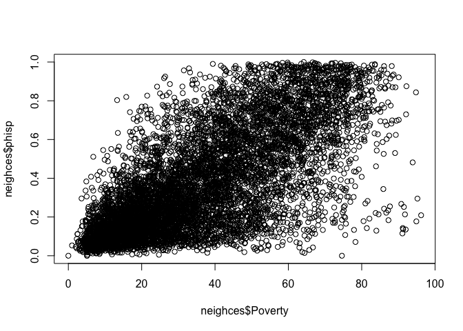<!-- -->

The **tidyverse**'s data visualization package is **ggplot2**. The graphing function is `ggplot()` and it takes on the basic template

<br>

````
ggplot(data = <DATA>) +
      <GEOM_FUNCTION>(mapping = aes(x, y)) +
      <OPTIONS>()
````
<br>

1. `ggplot()` is the base function where you specify your dataset using the `data = <DATA>` argument.

2. You then need to build on this base by using the plus operator `+` and `<GEOM_FUNCTION>()` where `<GEOM_FUNCTION>()` is a unique `geom` function indicating the type of graph you want to plot. Each unique function has its unique set of arguments which you specify using the `aes()` argument.   `aes()` stands for aesthetics - things we can see.  Within `aes()` you specify the variables you need to plot in the given `geom()` or graph, typically based on what is plotted on the `x =` and `y =` axes. Charts and graphs have an x-axis, y-axis, or both.  Check [this](https://posit.co/wp-content/uploads/2022/10/data-visualization-1.pdf) ggplot cheat sheet for all possible geoms. 

3. `<OPTIONS>()` are a set of functions you can specify to change the look of the graph, for example relabeling the axes or adding a title.


The basic idea is that a ggplot graphic layers geometric objects (circles, lines, etc), themes, and scales on top of data.

You first start out with the base layer. It represents the empty **ggplot** layer defined by the `ggplot()` function with the data object whose variable(s) you want to graph.


``` r
ggplot(neighces)
```

<!-- -->

We get an empty plot. We haven’t told `ggplot()` what type of geometric object(s) we want to plot, nor how the variables should be mapped to the geometric objects, so we just have a blank plot. We have `geoms` to paint the blank canvas.

From here, we add a `geom` layer to the **ggplot** object. Layers are added to **ggplot** objects using `+`, instead of `%>%`, since you are not explicitly piping an object into each subsequent layer, but adding layers on top of one another. Each `geom` is associated with a specific type of graph. 

<div style="margin-bottom:25px;">
</div>
#### **Histogram**
\

Histograms are used to summarize a single numeric variable. To create a histogram, use `geom_histogram()` for `<GEOM_FUNCTION()>`. Let’s create a histogram of PM 2.5.


``` r
ggplot(neighces) + 
  geom_histogram(mapping = aes(x=PM2.5)) +
  xlab("PM 2.5") 
```

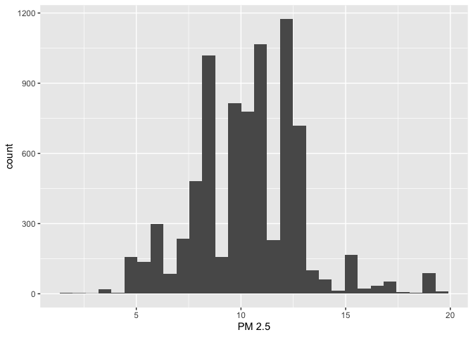<!-- -->

Because a single variable is plotted on the x-axis, we specify `x =` in `aes()` but not a `y =`. The `xlab()` function, which is an example of a `<OPTIONS>()` function, allows you to relabel the title of the x-axis (`ylab()` is for the y-axis). The message before the plot tells us that we can use the `bins =` argument to change the number of bins used to produce the histogram. You can increase the number of bins to make the bins narrower and thus get a finer grain of detail. Or you can decrease the number of bins to get a broader visual summary of the shape of the variable’s distribution. Try changing the number of bins and see what you get.


<div style="margin-bottom:25px;">
</div>
#### **Density plot**
\

A density plot is a plot of the local relative frequency or density of points along the number line or x-axis of a plot. The local density is determined by summing the individual “kernel” densities for each point. Where points occur more frequently, this sum, and consequently the local density, will be greater. Density plots get around some of the problems that histograms have.  `geom_density()` is the associated  `<GEOM_FUNCTION()>` for a density plot. Let's make a density plot of PM 2.5.


``` r
ggplot(neighces) + 
  geom_density(mapping = aes(x=PM2.5)) +
  xlab("PM 2.5") 
```

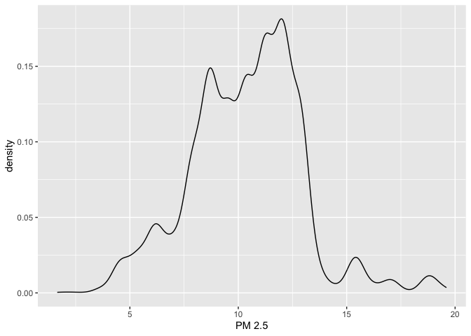<!-- -->

Plots with both a histogram and density line can be created:


``` r
ggplot(neighces, aes(x=PM2.5)) + 
 geom_histogram(aes(y=after_stat(density)), 
                colour="black", fill="white")+
 geom_density(alpha=.2, fill="blue") 
```

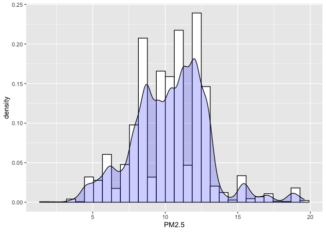<!-- -->

`alpha =` controls the transparency and `fill =` controls for the color of the plot.

You can show the densities of two groups by adding the `fill =` argument.


``` r
ggplot(neighces) + 
  geom_density(mapping = aes(x=PM2.5, fill =mhisp),
               alpha = 0.5) +
  xlab("PM 2.5") 
```

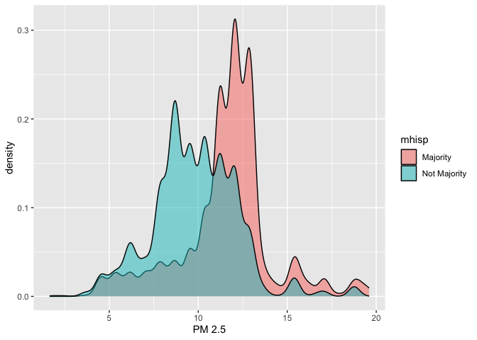<!-- -->

<div style="margin-bottom:25px;">
</div>
#### **Boxplot**
\

We can use a boxplot (or a box-and-whisker plot) to visually summarize the distribution of a single numeric variable. Use `geom_boxplot()` for `<GEOM_FUNCTION()>` to create a boxplot. Let’s examine PM 2.5


``` r
ggplot(neighces) + 
  geom_boxplot(mapping = aes(y=PM2.5)) +
  ylab("PM 2.5") 
```

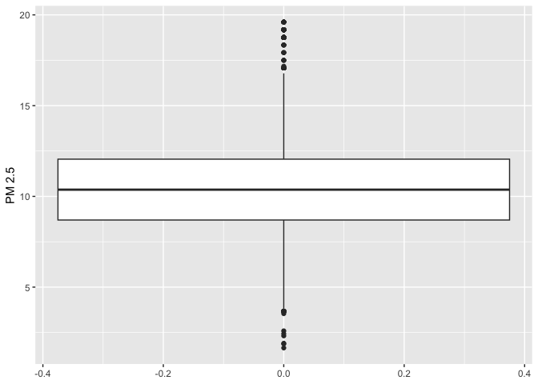<!-- -->

The top, middle and bottom of the box represent the 75th, 50th, and 25th percentiles, respectively.  The points outside the whiskers represent outliers. Outliers are defined as having values that are either larger than the 75th percentile plus 1.5 times the IQR or smaller than the 25th percentile minus 1.5 times the IQR. 

We can also use the boxplot to examine the relationship between a categorical and numeric variable. Let’s examine the distribution of PM 2.5 by majority vs. non majority Hispanic. Because we are examining the association between two variables, we need to specify *x* and *y* variables within `aes()`


``` r
ggplot(neighces) + 
  geom_boxplot(mapping = aes(x = mhisp, y=PM2.5)) +
  ylab("PM 2.5") +
  xlab("Hispanic population") 
```

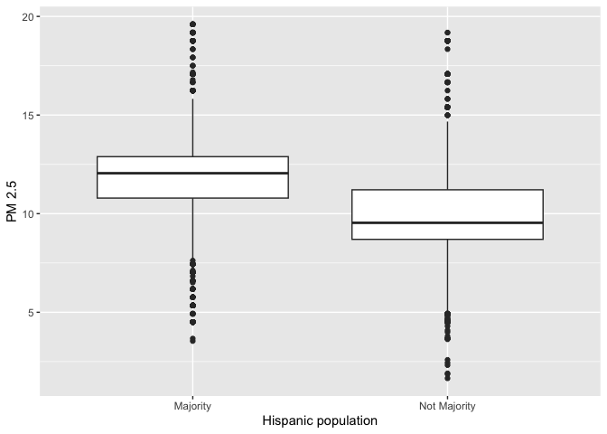<!-- -->


How can you adjust the code above to further separate the majority and not majority box plots by environmentally disadvantaged or not, and represent the disadvantage/not disadvantage boxes by different colors?

<div style="margin-bottom:25px;">
</div>
#### **Barchart**
\

We use a bar chart to summarize a categorical variable. Bar charts show either the number or frequency of each category. To create a bar chart, use `geom_bar()` for `<GEOM_FUNCTION>()`. Let’s show a bar chart of environmentally disadvantaged communities. 


``` r
ggplot(neighces, aes(x=factor(disadvantage)))+
    geom_bar(stat="count")+
    xlab("Disadvantaged neighborhood") +
    ylab("Count") 
```

<!-- -->

This provides the number of observations in each category, which is designated by the argument `stat = "count"`. What if we want to show the percentages? There is no `stat = "freq"` option, so we have to calculate those proportions (or percentages) on our own.  We can borrow from the code we used earlier to create our *disadvantage* frequency table and pipe this table directly into `ggplot()`.


``` r
neighces %>%
  group_by(disadvantage) %>%
  summarize(n = n()) %>%
  mutate(freq = 100*(n / sum(n)))  %>%
  ggplot() +
  geom_bar(mapping=aes(x=disadvantage, y=freq),stat="identity") +
    xlab("Disadvantaged neighborhood") +
    ylab("Percentage") 
```

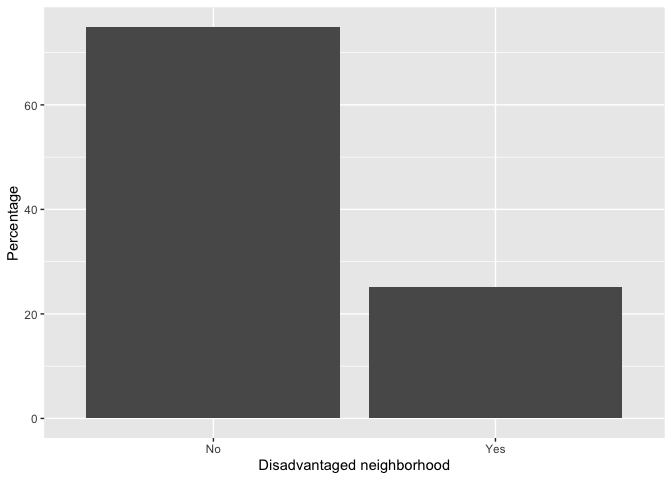<!-- -->

We didn’t need to specify `data = <DATA>` in `ggplot()` because it was piped in. Within `aes()`, we specified the categorical variable *disadvantage* on the x-axis and then the proportion of neighborhoods freq on the y-axis. The argument `stat = "identity"` tells `ggplot()` to plot the exact value listed for the variable *freq*.

<div style="margin-bottom:25px;">
</div>
#### **Scatterplot**
\

The scatterplot is the traditional graph for visualizing the association between two numeric variables. For scatterplots, we use `geom_point()` for `<GEOM_FUNCTION>()`. Because we are plotting two variables, we specify an *x* and *y* variable. Does proportion Hispanic change with greater poverty in the neighborhood?


``` r
ggplot(neighces) +
    geom_point(mapping = aes(x = Poverty, 
                             y = phisp)) +
    xlab("Poverty") +
    ylab("Proportion Hispanic")
```

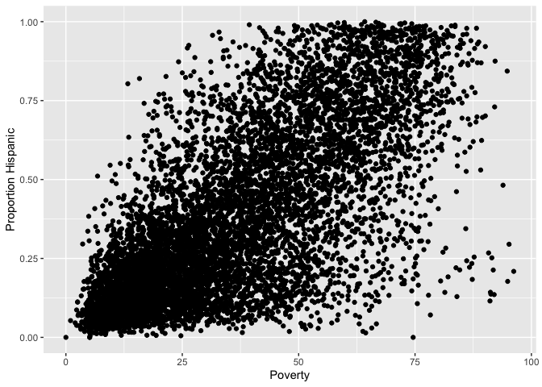<!-- -->

What does scatter plot suggest about the relationship between the two variables?

You should pair a visual with a descriptive stat to better guide your understanding of a relationship. One way of doing this for a large number of variables is through a pairs plot. We'll use the function `pairs.panels()` from the package **psych** to create a pairs plot.


``` r
neighces %>%
     select(pwhite:pblk, PM2.5) %>%
     pairs.panels(method = "pearson", # correlation method
             hist.col = "#00AFBB",
             density = TRUE, # show density plots
             ellipses = F, smooth = F) # unneeded  
```

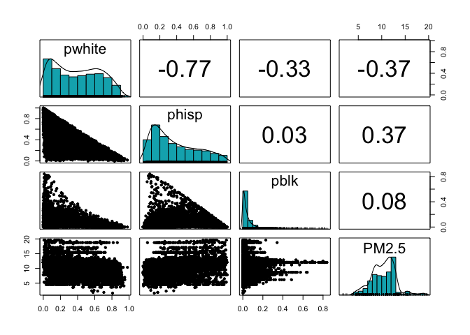<!-- -->

The plot shows the histograms and density plots of the four selected variables on the diagonal, the correlation between each of the variables above the diagonal and the scatterplots below the diagonal.

You can add the `facet_wrap()` function to create a scatterplot for each county.


``` r
ggplot(neighces) +
    geom_point(mapping = aes(x = Poverty, 
                             y = phisp)) +
    xlab("Poverty") +
    ylab("Proportion Hispanic") +
      facet_wrap(~County) 
```

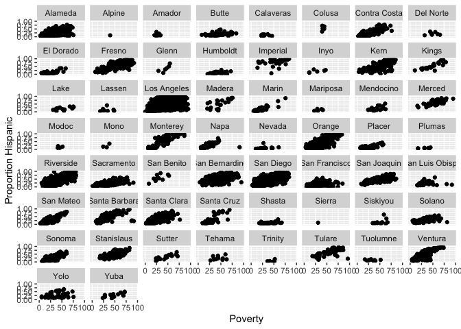<!-- -->


<div style="margin-bottom:25px;">
</div>
#### **Dot plot**
\

A (Cleveland) dot plot displays the values of a single variable as symbols plotted along a line, with a separate line for each observation. The associated `<GEOM_FUNCTION>()` is `geom_point()`.  Here is a dot plot of the mean PM 2.5 levels for each county in California.  We have to first create a tibble containing the mean levels, and pipe that into `ggplot()`


``` r
neighces %>%
  group_by(County) %>%
  summarize(Mean = mean(PM2.5)) %>%
ggplot() + 
  geom_point(aes(x=County, y=Mean)) +
  coord_flip()
```

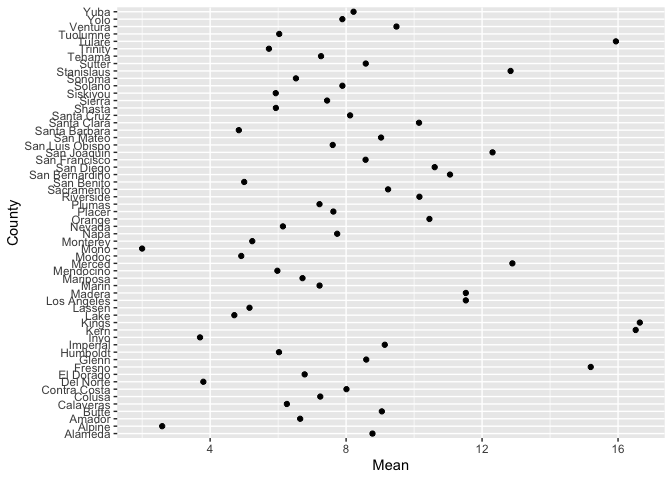<!-- -->

`coord_flip()` flips the x and y axes (take it out and see how ugly the plot is).

The default ordering of the y-axis is alphabetical.  We can reorder the counties based on highest to lowest in mean PM 2.5 using the function `reorder()`.


``` r
neighces %>%
  group_by(County) %>%
  summarize(Mean = mean(PM2.5)) %>%
ggplot() + 
  geom_point(aes(x=Mean, y=reorder(County,Mean))) +
  ylab("County") +
  xlab("PM 2.5")
```

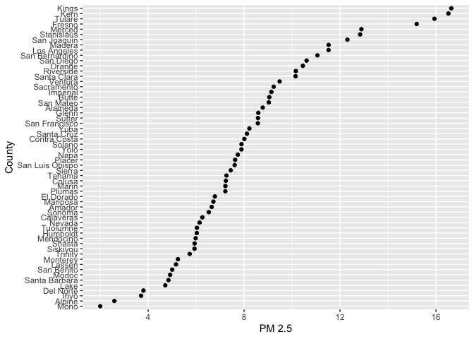<!-- -->

`ggplot()` has many additional functions and features that allow you to adjust the the aesthetic features of your plot.  For example, we can add additional text to your plot to enhance its readability.  To illustrate this, let's create a scatterplot of mean PM 2.5 and mean poverty rate for each county, but indicate the county corresponding to each point on the plot.  We do this by adding the `geom_text()` function.


``` r
neighces %>%
  group_by(County) %>%
  summarize(MeanPM = mean(PM2.5),
            MeanPov = mean(Poverty)) %>%
ggplot() + 
  geom_point(aes(x=MeanPM, y=MeanPov)) +
  geom_text(aes(x=MeanPM, y=MeanPov, label = County)) +
  ylab("County") +
  xlab("PM 2.5")
```

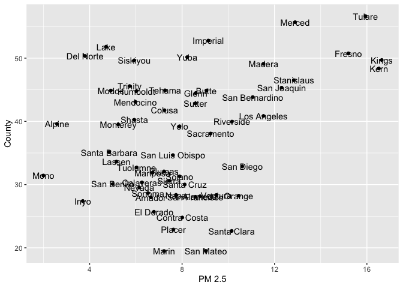<!-- -->


`ggplot()` is a powerful function, and you can make a lot of really visually captivating graphs. You can change colors, add text labels, layer different plots on top of one another or side by side. You can also make maps with the function, which we'll cover a few labs from now.  You can also make your graphs really "pretty" and professional looking by altering graphing features using `<OPTIONS()`, including colors, labels, titles and axes.  For a list of `ggplot()` functions that alter various features of a graph, check out [Chapter 11 in RDS](https://r4ds.hadley.nz/communication.html).  
    

You've reached the end of the lab! [Hip Hip Hooray](https://www.youtube.com/watch?v=Rz1Xn1vzOM4)! Answer the Assignment 2 questions that are uploaded on Canvas in a separate R Markdown from the one you used to run this lab.

***

<a rel="license" href="http://creativecommons.org/licenses/by-nc/4.0/"></a><br />This work is licensed under a <a rel="license" href="http://creativecommons.org/licenses/by-nc/4.0/">Creative Commons Attribution-NonCommercial 4.0 International License</a>.


Website created and maintained by [Noli Brazil](https://nbrazil.faculty.ucdavis.edu/)
