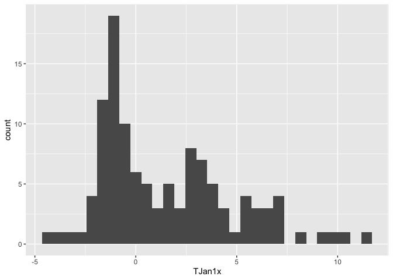
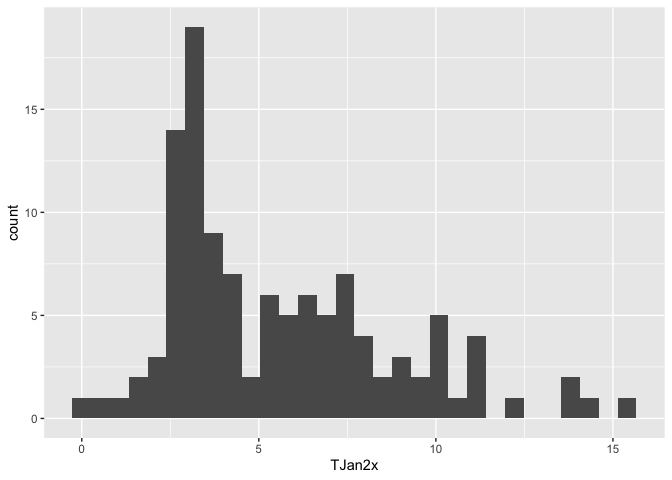
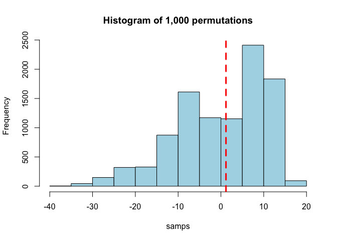

<style>
p.comment {
background-color: #DBDBDB;
padding: 10px;
border: 1px solid black;
margin-left: 25px;
border-radius: 5px;
font-style: italic;
}

.figure {
   margin-top: 20px;
   margin-bottom: 20px;
}

h1.title {
  font-weight: bold;
  font-family: Arial;  
}

h2.title {
  font-family: Arial;  
}

</style>


<style type="text/css">
#TOC {
  font-size: 13px;
  font-family: Arial;
}
</style>


\


In this lab guide, we'll make statistical inferences about the significance of particular data values within a hypothesis testing framework. We will follow the material presented in BBR Ch. 8 and 9.

The objectives of the guide are as follows

1. Apply one-sample hypothesis testing
2. Make inferences about mean comparisons between two groups
3. Bonus: Conduct significance testing non-parametrically using a permutation test

We'll use two data sets in this guide. The first contains current and forecasted climate values in Oregon.  The second contains property values for buildings in Manhattan, New York City.


<div style="margin-bottom:25px;">
</div>
## **Installing and loading packages**
\

We'll be using one new package in this lab - **foreign**.  First, install it if you don't already have it.
.

```r
if (!require("foreign")) install.packages("foreign")
```

and then load it in and the other packages we will use in this guide.


```r
library(foreign)
library(tidyverse)
```


<div style="margin-bottom:25px;">
</div>
## **One-sample hypothesis testing**
\


Download the data set [orsim.csv](https://raw.githubusercontent.com/geo200cn/data/master/orsim.csv). The data is also located on Canvas in the Lab and Assignments Week 3 folder. This data set includes climate values (January and July temperature and precipitation) simulated by a regional climate model for present, and for potential future conditions when the concentration of carbon dioxide in the atmosphere has doubled, for a set of model grid points that cover Oregon. The variables named *TJan1x*, *TJul1x*, *PJan1x* and *PJul1x* are the simulated present values of temperature (T) and precipitation (P), while the variables with *2x* in their names are those for the doubled CO2 (carbon dioxide) scenarios that are intended to describe the climate of the next century.  Read in the data set using `read_csv()`


```r
orsim <- read_csv("https://raw.githubusercontent.com/geo200cn/data/master/orsim.csv")
```

The research question is: How would a doubling of carbon dioxide in the atmosphere affect temperature over Oregon? From what we already know about the greenhouse effect, atmospheric change, and basic climatology, we can suspect that the temperatures will increase with an increase in carbon dioxide. The question is, are the simulated temperatures for the enhanced greenhouse-situation significantly higher than those for present?

Before running any tests, let's just look at the distribution of our two variables *TJan2x* and *TJan1x*. First, histograms of each


```r
hist(orsim$TJan1x)
```

<!-- -->

```r
hist(orsim$TJan2x)
```

<!-- -->

Remember what CLT says?

Let's do a side-by-side comparison using a boxplot using the function `boxplot()`


```r
boxplot(orsim$TJan1x, orsim$TJan2x)
```

<!-- -->

Descriptively, it looks like an increase in the mean temperature from present to future.  But, let's formally test it since we now have the tools to do so. Remember the steps in hypothesis testing outlined in BBR and lecture.

<br>

| **1. State the null and alternative hypotheses**

<br>

The null hypothesis is that there is no change in temperature, or the difference between present and future temperature is 0.  The alternative hypothesis is that there is an increase in temperature.

<br>

| **2. Identify a test statistic**

<br>

We'll use the standard *t* statistic, which will allow us to conduct a *t*-test.

<br>

| **3. Choose a level of error $\alpha$.** 

<br>

We should not be fixated too much with threshold cutoffs, but the standard $\alpha$ is 0.05.

<br>

| **4. Compute the test statistic**

<br>

We're computing a difference of means for paired observations (BBR page 363).  If you look at the formula (page 365), this is basically a one-sample hypothesis test.  

First, let's calculate the difference between *TJan2x* and *TJan1x* and save it back in our data frame.


```r
orsim$diff <- orsim$TJan2x - orsim$TJan1x
```

Next, we calculate $s$


```r
n <- length(orsim$diff)
s <- sqrt(sum((orsim$diff-mean(orsim$diff))^2)/(n-1)) #formula from page 310
#same as sqrt(var(orsim$diff))
```

Next, the *t* statistic


```r
t1 = mean(orsim$diff)/(s/sqrt(n)) 
t1
```

```
## [1] 192.6058
```

<br>

| **5. Calculate the p-value**. We can calculate the p-value by mapping our *t* statistic onto the *t*-distribution.  In R, this is done using the function `pt()`.  Note that if you wanted a two-sided p-value you would multiply the value produced by the line of code below by 2.

<br>


```r
pt(t1, n-1, lower=FALSE)
```

```
## [1] 2.141518e-144
```

<br>

<p class="comment", style="font-style:normal">**Question 1**: What is your conclusion regarding the difference between the present and simulated future January mean temperature over Oregon? How would you change the null and alternative hypotheses to make this a two-sided test? What is the p-value of this two-sided test?</p>


<p class="comment", style="font-style:normal">**Question 2**:  For January precipitation (*PJan1x* and *PJan2x*) test the hypothesis that *PJan1x* and *PJan2x* are not equal.  Also test the hypothesis that *PJan1x* is less than *PJan2x* </p>

<br>

There is actually a canned function, `t.test()`, that you can use to run the *t*-test.  


```r
t.test(orsim$TJan2x, orsim$TJan1x, paired = TRUE, alternative="greater", conf.level =.95)
```

```
## 
## 	Paired t-test
## 
## data:  orsim$TJan2x and orsim$TJan1x
## t = 192.61, df = 113, p-value < 2.2e-16
## alternative hypothesis: true difference in means is greater than 0
## 95 percent confidence interval:
##  4.054261      Inf
## sample estimates:
## mean of the differences 
##                4.089474
```

similarly because this is basically a one-sample test


```r
t.test(orsim$diff, mu = 0, alternative="greater", conf.level =.95)
```

```
## 
## 	One Sample t-test
## 
## data:  orsim$diff
## t = 192.61, df = 113, p-value < 2.2e-16
## alternative hypothesis: true mean is greater than 0
## 95 percent confidence interval:
##  4.054261      Inf
## sample estimates:
## mean of x 
##  4.089474
```

<div style="margin-bottom:25px;">
</div>
## **Two-sample hypothesis testing**
\

To demonstrate two-sample hypothesis testing, let's bring in the data set *mnmappluto.dbf*, which includes information about every building in Manhattan, over 40,000 buildings (wow!). I've uploaded this data on Canvas in the Week 3 Lab folder. Download it into an appropriate folder and bring it in using the function `read.dbf()`, which is a part of the **foreign** package.


```r
MN<-read.dbf("mnmappluto.dbf")
```

A dbase file is just another way of storing tabular data. There is little substantive difference between a dbase, csv, or an excel file. Esri (ArcGIS) likes dbase files for some reason, so when you end up doing doing GIS stuff in your career you’ll probably come across dbase files. 

In the next lab you will start exploring spatial data in R. Although *MN* is not spatialized, it does not have spatial information, longitude and latitude, which allows us to crudely plot it. 


```r
##Map all of the buildings in Manhattan
plot(MN$YCoord~MN$XCoord)
```

<!-- -->

oh OH. Something is wrong here. The resulting plot doesn’t look at all like a map of Manhattan. Some buildings have not been assigned coordinates and have longitude and latitude positions of 0,0. These must be removed from the data:

<br>

<p class="comment", style="font-style:normal">**Question 3**: Keep the buildings that have longitude *XCoord* and latitude *YCoord* positions greater than 0. </p>

<br>


You got the answer right if your *MN* object looks like this:


```r
##dim() returns the number of rows and comlumns in a table
dim(MN)
```

```
## [1] 42514    85
```

Your new map should look like this:


```r
plot(MN$YCoord~MN$XCoord)
```

<!-- -->

The research question is: Are property values higher for buildings located in historic districts? Historic neighborhoods are areas where the buildings have historical importance not because of their individual significance but because as a collection they represent the architectural sensibilities of a particular time period.  They have tremendous historical and architectural value.  But do they also carry greater financial value?

Before answering this question, we need to be able to identify buildings in historic districts.  It looks like the variable *HistDist* gives us which district a building is located in


```r
summary(MN$HistDist)
```

You'll notice that there are a bunch of buildings with a value `NA`.  These `NA` buildings are not in a historic district.  We don’t really care which district a building is in, only that it is in a historic district. We’ll now re-code the *HistDist* column to make a variable which takes the value of 1 if a building is in a historic district and a value of 0 if it is not in a historic district.  How do we do this?

One useful function is `is.na()`


```r
##is.na() is a logical expression, it returns true if a value is missing (NA)
##check the first 100 rows of the "HistDist" column to see if they are blank
is.na(MN[1:100,"HistDist"])
```

```
##   [1]  TRUE  TRUE  TRUE  TRUE  TRUE FALSE  TRUE FALSE  TRUE  TRUE  TRUE  TRUE
##  [13]  TRUE  TRUE  TRUE  TRUE FALSE  TRUE  TRUE  TRUE FALSE  TRUE  TRUE FALSE
##  [25] FALSE  TRUE FALSE  TRUE FALSE  TRUE  TRUE FALSE  TRUE FALSE  TRUE  TRUE
##  [37] FALSE FALSE  TRUE  TRUE  TRUE  TRUE  TRUE  TRUE  TRUE  TRUE  TRUE  TRUE
##  [49] FALSE  TRUE  TRUE  TRUE  TRUE  TRUE FALSE  TRUE FALSE  TRUE  TRUE FALSE
##  [61] FALSE  TRUE  TRUE FALSE  TRUE FALSE  TRUE  TRUE  TRUE  TRUE  TRUE  TRUE
##  [73]  TRUE  TRUE  TRUE  TRUE  TRUE  TRUE  TRUE  TRUE FALSE  TRUE FALSE  TRUE
##  [85] FALSE FALSE  TRUE  TRUE  TRUE  TRUE  TRUE  TRUE  TRUE  TRUE  TRUE  TRUE
##  [97] FALSE  TRUE FALSE  TRUE
```

In the output the `TRUE` values indicate rows where the *HistDist* column is missing a value- these are places that are not in a historic district.   Another useful function is `ifelse()`


```r
##take the previous line and replace the "TRUE" with 0
ifelse(is.na(MN[1:100,"HistDist"]), 0, 1)
```

```
##   [1] 0 0 0 0 0 1 0 1 0 0 0 0 0 0 0 0 1 0 0 0 1 0 0 1 1 0 1 0 1 0 0 1 0 1 0 0 1
##  [38] 1 0 0 0 0 0 0 0 0 0 0 1 0 0 0 0 0 1 0 1 0 0 1 1 0 0 1 0 1 0 0 0 0 0 0 0 0
##  [75] 0 0 0 0 0 0 1 0 1 0 1 1 0 0 0 0 0 0 0 0 0 0 1 0 1 0
```

The function `ifelse()` takes three arguments, a logical expression, a value for true, and a value for false. If the logical expression evaluates to `TRUE` the first value is used, if not the second value is used.


<br>

<p class="comment", style="font-style:normal">**Question 4**: Use the `ifelse()` and `is.na()` functions to create a variable named *HD* in *MN* that indicates whether a building is located in a historic district. </p>

<br>


Your output should match the line below:


```r
summary(MN$HD)
```

```
##    Min. 1st Qu.  Median    Mean 3rd Qu.    Max. 
##   0.000   0.000   0.000   0.244   0.000   1.000
```

A variable that is coded 0,1 to refer to absence or presence, respectively, is sometimes called a dummy variable or an indicator variable. Although a dummy looks like a numeric, it is in fact a qualitative or categorical variable. Since *HD* captures whether a building is in or out of a historic district, we should tell R that the numbers in the column are a code for historic districts, and we do this by creating a factor, or categorical variable, using `as.factor()`.


```r
MN$HD <- as.factor(MN$HD) 
```

Now we can draw a very crude map of buildings in historic districts.


```r
plot(y= MN$YCoord, x= MN$XCoord, col = MN$HD, pch=16, cex=.5)
```

<!-- -->

Finally, split the “MN” object into two tables, one for the historic buildings (*inHD*) and one for the buildings outside a historic district (*outHD*):


```r
inHD <- MN[MN$HD ==1,] 

outHD <- MN[MN$HD ==0,]
```

Our goal is to explore the effect of historic districts on property values in Manhattan. Our null hypothesis is that the designation of historic districts has no effect on property values, the buildings in a historic district have the same value as those outside of a historic district, and the difference between the two groups is due to random chance. First, let's create boxplots of property values


```r
boxplot(inHD$AssessTot, outHD$AssessTot)
```

<!-- -->


ooof. There appears to be a big outlier in the non historical district group.  Can you guess what building this is? 

We'll use the function `t.test()` to run the hypothesis test.  In this case, `x =` is the data being tested, `y =` is the comparison group (used for a two sample test).  

<br>

<p class="comment", style="font-style:normal">**Question 5**: Run the appropriate *t*-test to compare the mean property values of buildings in historic districts and those not in historic districts based on the research question.  Briefly summarize your results. </p>

<br>


Location is an important component of a property’s value. To test the impact of a historic district designation we should revise our test to examine only buildings that have similar locations. One way to do this is to identify buildings that are close to but outside of historic districts. Each building in the database has a block number. Let's revise *outHD* so that it only includes buildings which are on the same block as a historic district but outside of the district boundaries.


```r
##Select buildings on the same block as a historic district
##Get a list of all blocks that contain historic buildings
blocks <- inHD$Block 

#display the first 5 rows of blocks
head(blocks)
```

```
## [1]  7 72 73 29  7 29
```

```r
##Select all buildings (from MN) that are on the same block as historic buildings
##The line below selects all rows where the block column contains values in our list of blocks
##Save the result as a new object
HDB <- MN[MN$Block %in% blocks, ] 

HDB_out <- HDB[HDB$HD == 0, ] 

HDB_in <- HDB[HDB$HD == 1, ]
```

Boxplot again


```r
boxplot(HDB_in$AssessTot, HDB_out$AssessTot)
```

<!-- -->

Seems like that severe outlier has disappeared.

Now we have two files that contain buildings on blocks with historic districts, one file describes buildings in the district and the other describes those outside the district boundaries.   But, we need one more correction: size.  The size of the building is an important determinant of its value. The variable *BldgArea* gives the square footage.   Let's calculate the price per square foot.  Taking a summary of this variable


```r
summary(HDB_in$BldgArea)
```

```
##    Min. 1st Qu.  Median    Mean 3rd Qu.    Max. 
##       0    4319    6605   20903   13910 2725731
```

We see a problem.  Some buildings have 0 area (square footage). This could mean the lot is vacant, it could be an error. Either way it makes it hard to compute the price per square foot. We need to exclude these zero area buildings from the data set.


```r
#Calcuate price per square foot for buildings
#Only for buildings with an area greater than 0
HDB_in_sqft <- filter(HDB_in, HDB_in$BldgArea > 0) %>%
              mutate(AssessSqFt = AssessTot/BldgArea)

HDB_out_sqft <- filter(HDB_out, HDB_out$BldgArea > 0) %>%
              mutate(AssessSqFt = AssessTot/BldgArea)
```


<br>

<p class="comment", style="font-style:normal">**Question 6**: For the new data sets *HDB_in_sqft* and *HDB_out_sqft*, we want to run a *t*-test to compare the mean property values per square footage of buildings in historic districts and those not in historic districts. Check whether the variances between the two groups differ by using the `var.test()` function. </p>


<p class="comment", style="font-style:normal">**Question 7**:  Run the appropriate *t*-test to compare the mean property values per square footage of buildings in historic districts and those not in historic districts.  Summarize your results. </p>

<br>

<div style="margin-bottom:25px;">
</div>
## **Bonus: Permutation tests**
\

This lab concludes our deep dive into the statistical foundations of classical inference.  However, we will revisit many of these ideas throughout the rest of the quarter, so it is important that we have a strong understanding both conceptually and practically how statistical inference works.  One way of further grounding these concepts is to actually step away from some of the core structures of classic inference.  In particular, rather than conducting hypothesis tests and constructing confidence intervals parametrically - i.e. relying on known theoretical distributions like *Z*, *t*, binomial and others - we can just calculate our own p-values non parametrically by using the data itself rather than translating or mapping it onto a distribution.  In other words, we will conduct inference via what are known as permutation (or Monte Carlo) tests.

<br>

Because we did not cover this in lecture, this section is a bonus portion of the lab, so you are not required to go through this to complete the assignment.  However, we will be dipping into non parametric hypothesis testing as soon as next week, and fully when we start talking about prediction, so it would be a good idea to just glance through this section. You'll also get extra credit points on your assignment (Cool!). However, don't worry, we'll revisit these ideas as they come up later, but I wanted to make sure you all have the opportunity to dip your toes early enough so that the water is not too cold when you start wading into the deeper end.

<br>

OK, so what is a permutation test?  Let's go back to the historic buildings example.  Remember that the null hypothesis comparing the property values in historic and non historic neighborhoods is that the mean values are equal.  In other words, the null is that effectively there is no difference between the two types of buildings, *as if the label historic and non historic were  randomly assigned to buildings*.  The italicized portion is key here.  Most null distributions in hypothesis testing is basically asserting that the assignment, label, indicator or treatment is just randomly assigned across observations.  The label "historic district" is not a special designation as any building can receive it simply by chance. 

<br>

The basic idea: if our data were randomly assigned labels, how likely is it that we would have gotten the observed difference in means? The set up is as follows. Let's say you have $n$ observations $x_i, ... x_n$ in group A and $m$ observations $x_j, ... x_m$ in group B. You have measured a value $y$ for each group and you want to test whether the mean in $y$ differs between the two groups.  The basic steps of a permutation test are as follows

<br>

1. Calculate your observed difference in $y$ between group A and group B.

2. Combine everyone into a single pool.  We do this because $H_0: \mu_A = \mu_B$ implies that both samples come from the same population. Take away each observation's label A and B from them. Collect the $m + n$ labels in a bag - $m$ A labels and $n$ B labels. Randomly assign each observation a label $A$ or $B$ from this bag, making sure to keep the same number of $m$ and $n$ (i.e. we are sampling without replacement).  

3. Calculate the mean difference in $y$ between the randomly assigned $A$ and $B$ groups

4. Repeat steps 2-3 many times *N*. What you are effectively doing here is creating the null distribution.

5.  Calculate the permutation test p-value: the proportion of the test statistic (difference in means) that equal or exceed the value of the test statistic from the original data.

<br>


Now, let's implement these steps in R.


```r
#insert your comment here
diff <-mean(HDB_in_sqft$AssessSqFt)- mean(HDB_out_sqft$AssessSqFt)
```


```r
#insert your comment here
HDB.in.out <- rbind.data.frame(HDB_in_sqft, HDB_out_sqft)
#insert your comment here
indicator <-c(rep(1, nrow(HDB_in_sqft)), rep(0, nrow(HDB_out_sqft)))
```


```r
#insert your comment here
rp_test <- function(data, label) {
  vecr<-sample(label)
  test <- cbind.data.frame(data, vecr)
  return(mean(test[test$vecr == 1, "AssessSqFt"]) - mean(test[test$vecr == 0, "AssessSqFt"]))
}
```


```r
#insert your comment here
set.seed(1234)
#insert your comment here
nrep <- 10000
#insert your comment here
samps <-replicate(nrep,rp_test(HDB.in.out, indicator))
```

The object *samps* gives 1,000 mean differences from the null distribution - i.e.  a scenario where in district and not in district are randomly assigned, and thus there should be no difference between the two groups.  We can create a histogram and plot the observed mean difference.


```r
hist(samps,col="lightblue", main = "Histogram of 1,000 permutations")
#histogram in generated 
abline(v = diff, col="red", lwd=3, lty=2)
```

<!-- -->

The p-value is the proportion of values in *samps* that is greater than or equal to the observed difference.  In hypothesis framework language, this is a one-sided test.


```r
table(samps >= diff)/length(samps)
```

```
## 
##  FALSE   TRUE 
## 0.4696 0.5304
```

<br>

Why do a permutation test? 

* The test is distribution free under $H_0$.  Notice that we did not once refer or map to a theoretical distribution like the standard normal or *t*.
* Some parametric methods depend on large sample sizes for their validity.  Permutation tests do not.  Even for tiny samples, the chance of false significance cannot exceed 0.05.
* p-values are exact and not asymptotic
* There is no pretense of random sampling from some imaginary population
* All the probability comes from random assignment
* You can do this for nearly *any* statistic you can think of

We'll revisit permutation tests when we go through statistical inference in point pattern analysis and spatial autocorrelation.


<br>

<p class="comment", style="font-style:normal">**Bonus Question**: In the R code chunks above that perform the permutation test, add comments to explain what each line of code is doing.</p>


<br>


***

Website created and maintained by [Noli Brazil](https://nbrazil.faculty.ucdavis.edu/)
