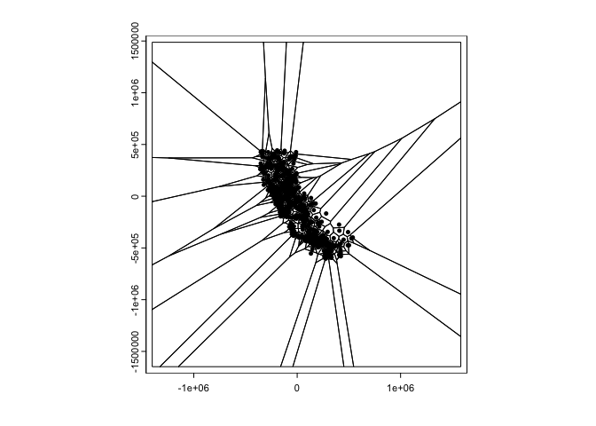
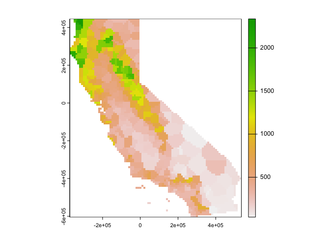
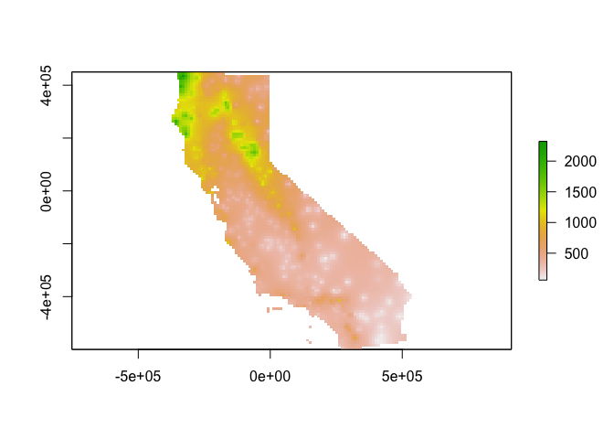

<style>
p.comment {
background-color: #DBDBDB;
padding: 10px;
border: 1px solid black;
margin-left: 25px;
border-radius: 5px;
}

.figure {
   margin-top: 20px;
   margin-bottom: 20px;
}

h1.title {
  font-weight: bold;
  font-family: Arial;  
}

h2.title {
  font-family: Arial;  
}

</style>


<style type="text/css">
#TOC {
  font-size: 13px;
  font-family: Arial;
}
</style>


\


Spatial interpolation is the prediction of exact values of attributes at unsampled locations from measurements made at control points in the same study area. In this lab guide, we will learn how to run the deterministic spatial interpolation methods described in OSU Ch. 9. The objectives of this lab are as follows

1. Learn how to interpolate values using proximity polygons
2. Learn how to interpolate values using nearest neighbor local spatial average
3. Learn how to interpolate values using inverse distance weighted

To help us accomplish these learning objectives, we will use precipitation data from weather stations in California. Our goal is to create a raster surface of California total precipitation values. Note that much of this lab guide has been adapted from rspatial.org.

<div style="margin-bottom:25px;">
</div>
## **Installing and loading packages**
\

We'll be using two new packages in this lab.  First, install the packages if you haven't already.


```r
install.packages(c("gstat", "rgeos"))
```

Second, load all necessary packages.


```r
library(sp)
library(sf)
library(tidyverse)
library(rgdal)
library(dismo)
library(gstat)
library(rgeos)
```

<div style="margin-bottom:25px;">
</div>
## **Bringing in the data**
\

To demonstrate spatial interpolation we'll be relying on a dataset containing monthly temperature data for weather stations in California.  Download the  file *interpolation.zip* from Canvas. It contains all the files that will be used in this guide. The data are also located on Canvas in the Lab and Assignments Week 9 folder. Bring in the dataset *precipitation.csv*


```r
d <- read_csv("precipitation.csv")
glimpse(d)
```

```
## Rows: 456
## Columns: 17
## $ ID   <chr> "ID741", "ID743", "ID744", "ID753", "ID754", "ID758", "ID760", "I…
## $ NAME <chr> "DEATH VALLEY", "THERMAL/FAA AIRPORT", "BRAWLEY 2SW", "IMPERIAL/F…
## $ LAT  <dbl> 36.47, 33.63, 32.96, 32.83, 33.28, 32.82, 32.76, 33.74, 34.42, 34…
## $ LONG <dbl> -116.87, -116.17, -115.55, -115.57, -115.51, -115.67, -115.56, -1…
## $ ALT  <dbl> -59, -34, -31, -18, -18, -13, -9, -6, 2, 2, 3, 3, 3, 3, 4, 4, 4, …
## $ JAN  <dbl> 7.4, 9.2, 11.3, 10.6, 9.0, 9.8, 9.0, 16.7, 106.3, 89.5, 67.7, 16.…
## $ FEB  <dbl> 9.5, 6.9, 8.3, 7.0, 8.0, 1.6, 7.0, 12.1, 107.1, 88.3, 65.0, 13.0,…
## $ MAR  <dbl> 7.5, 7.9, 7.6, 6.1, 9.0, 3.7, 5.0, 9.2, 72.9, 72.4, 49.6, 8.0, 47…
## $ APR  <dbl> 3.4, 1.8, 2.0, 2.5, 3.0, 3.0, 1.0, 2.2, 32.1, 30.1, 22.5, 3.0, 17…
## $ MAY  <dbl> 1.7, 1.6, 0.8, 0.2, 0.0, 0.4, 1.0, 1.3, 7.6, 2.0, 4.3, 1.0, 1.9, …
## $ JUN  <dbl> 1.0, 0.4, 0.1, 0.0, 1.0, 0.0, 0.0, 0.2, 2.2, 1.1, 1.3, 0.0, 0.7, …
## $ JUL  <dbl> 3.7, 1.9, 1.9, 2.4, 8.0, 3.0, 2.0, 3.5, 0.6, 0.6, 0.4, 3.0, 0.3, …
## $ AUG  <dbl> 2.8, 3.4, 9.2, 2.6, 9.0, 10.8, 9.0, 6.5, 0.6, 0.5, 1.7, 7.0, 0.3,…
## $ SEP  <dbl> 4.3, 5.3, 6.5, 8.3, 7.0, 0.2, 8.0, 6.4, 5.3, 1.4, 6.2, 8.0, 1.6, …
## $ OCT  <dbl> 2.2, 2.0, 5.0, 5.4, 8.0, 0.0, 8.0, 3.8, 11.4, 11.6, 6.0, 5.0, 4.4…
## $ NOV  <dbl> 4.7, 6.3, 4.8, 7.7, 7.0, 3.3, 7.0, 7.3, 47.8, 45.3, 33.6, 6.0, 40…
## $ DEC  <dbl> 3.9, 5.5, 9.7, 7.3, 9.0, 1.4, 11.0, 7.4, 63.7, 58.0, 42.5, 13.0, …
```

We have monthly precipitation levels for 456 weather stations in California.  Rather than monthly levels, we'll be interpolating annual precipitation levels.  So, we add up the 12 months using `sum()` and `c_across()` to create the year total variable *prec*.  Plot to see what the distribution looks like.


```r
d <- d %>% 
  group_by(ID) %>%
  mutate(prec = sum(c_across(JAN:DEC))) %>%
  ungroup()
```

Plot *prec* 


```r
plot(sort(d$prec), ylab='Annual precipitation (mm)', las=1, xlab='Stations')
```

<!-- -->

Next, let's map the annual levels.  Bring in a California county layer.


```r
CA <- st_read("counties.shp")
```

And then map the stations by levels of total precipitation.  We'll first need to make spatial points out of the station data.


```r
dsp <- st_as_sf(d, coords = c("LONG", "LAT"), crs ="+proj=longlat +datum=NAD83 +ellps=GRS80")
```

Then mapify


```r
# define groups for mapping
cuts <- c(0,200,300,500,1000,3000)
# set up a palette of interpolated colors
blues <- colorRampPalette(c('yellow', 'orange', 'blue', 'dark blue'))

ggplot(data = CA) +geom_sf() +
          geom_sf(data = dsp, aes(color = prec)) +
      scale_colour_gradientn(breaks = cuts, colours = blues(5), name ="Precipitation") + 
    theme( axis.text =  element_blank(),
    axis.ticks =  element_blank(),
    panel.background = element_blank())
```

<!-- -->

Transform longitude/latitude to planar coordinates, using the commonly used coordinate reference system for California (“Teale Albers”) to assure that our interpolation results will align with other data sets we have.


```r
TA <- CRS("+proj=aea +lat_1=34 +lat_2=40.5 +lat_0=0 +lon_0=-120 +x_0=0 +y_0=-4000000 +datum=NAD83 +units=m +ellps=GRS80 +towgs84=0,0,0")

dta <- st_transform(dsp, crs = TA)
cata <- st_transform(CA, crs = TA)
```

Finally, we need to turn the objects *dta* and *cata* into an **sp** object in order to run the spatial interpolation functions in the following sections.


```r
dta <- as(dta, "Spatial")
cata <- as(cata, "Spatial")
```


<div style="margin-bottom:25px;">
</div>
## **Mean model**
\

Our goal is to interpolate (estimate for unsampled locations) the station precipitation values across California. The simplest way would be to use the mean of all observed values. This is described on page 253 in OSU. It's not a great interpolator because it does not take into account anything spatial.  We'll consider it a “Null-model” that we can compare other more refined approaches to. We’ll use the Root Mean Square Error (RMSE) as evaluation statistic. We created a nifty RMSE function in a prior lab. Let's bring it back here.


```r
RMSE <- function(observed, predicted) {
  sqrt(mean((predicted - observed)^2, na.rm=TRUE))
}
```

Get the RMSE for the Null-model


```r
null <- RMSE(mean(dsp$prec), dsp$prec)
null
```

```
## [1] 435.3217
```


<div style="margin-bottom:25px;">
</div>
## **Proximity polygons**
\

OSU's first spatial interpolator is proximity polygons, which is described on page 254.  Another term for this is "nearest neighbour” interpolation. We use the function `vornoi()` to create the polygons surrounding the control points.


```r
v <- voronoi(dta)
plot(v)
```

<!-- -->


Looks weird. Let’s confine this to California. Map using the **sp** friendly `spplot()`.


```r
ca <- aggregate(cata)
vca <- raster::intersect(v, ca)
spplot(vca, 'prec', col.regions=rev(get_col_regions()))
```

<!-- -->

Much better. These are polygons. Our ultimate goal is to create a continuous raster surface of precipitation values. We learned about raster data in a [prior lab](https://geo200cn.github.io/introspatial.html#Raster_Data).  We can ‘rasterize’ the results like this.  


```r
r <- raster(cata, res=10000)
vr <- rasterize(vca, r, 'prec')
plot(vr)
```

<!-- -->

How good is the proximity polygon model? We evaluate the RMSE using 5-fold cross validation.  We'll use a for loop to run through the folds.


```r
#insert comment
set.seed(5132015)
#insert comment
kf <- kfold(nrow(dta))
#insert comment
rmsepp <- rep(NA, 5)
#insert comment
for (k in 1:5) {
  #insert comment
  test <- dta[kf == k, ]
  #insert comment
  train <- dta[kf != k, ]
  #insert comment
  v <- voronoi(train)
  #insert comment
  p <- extract(v, test)
  #insert comment
  rmsepp[k] <- RMSE(test$prec, p$prec)
}
#insert comment
rmsepp
#insert comment
mean(rmsepp)
#insert comment
1 - (mean(rmsepp) / null)
```


<br>

<p class="comment">**Question 1**: Add comments to the above code chunk to describe what each step is doing.  </p>

<p class="comment">**Question 2**: How does the proximity-polygon approach compare to the NULL model? </p>

<p class="comment">**Question 3**: You would not typically use proximity polygons for rainfall data. Why? For what kind of data would you use them? </p>


<br>

<div style="margin-bottom:25px;">
</div>
## **Local Spatial Average**
\

The Local Spatial Average method (OSU page 255) generalizes the proximity polygon method by considering more than one neighbor.  The method is sometimes called nearest neighbor interpolation.  Here we do nearest neighbor interpolation considering five neighbors.

We can use the `gstat()` function located in the **gstat** package for this. First we fit the following model. `~1` means “intercept only”. In the case of spatial data, that would be only ‘x’ and ‘y’ coordinates are used. We set the maximum number of points to 5, and the “inverse distance power” `idp` to zero, such that all five neighbors are equally weighted (so the message you will get that says you are running inverse distance weighting interpolation is not true in this case).


```r
gs <- gstat(formula=prec~1, locations=dta, nmax=5, set=list(idp = 0))
nn <- interpolate(r, gs)
```

```
## [inverse distance weighted interpolation]
```

Plot our results


```r
nnmsk <- mask(nn, vr)
plot(nnmsk)
```

<!-- -->

Cross validate the result (k = 5). Note that we can use the `predict()` method to get predictions for the locations of the test points.


```r
rmsenn <- rep(NA, 5)
for (k in 1:5) {
  test <- dta[kf == k, ]
  train <- dta[kf != k, ]
  gscv <- gstat(formula=prec~1, locations=train, nmax=5, set=list(idp = 0))
  p <- predict(gscv, test)$var1.pred
  rmsenn[k] <- RMSE(test$prec, p)
}
```

```
## [inverse distance weighted interpolation]
## [inverse distance weighted interpolation]
## [inverse distance weighted interpolation]
## [inverse distance weighted interpolation]
## [inverse distance weighted interpolation]
```

```r
rmsenn
```

```
## [1] 200.6222 190.8336 180.3833 169.9658 237.9067
```

```r
mean(rmsenn)
```

```
## [1] 195.9423
```

```r
1 - (mean(rmsenn) / null)
```

```
## [1] 0.5498908
```

Better than the null, but better than proximity polygons?

<div style="margin-bottom:25px;">
</div>
## **Inverse Distance Weighted**
\


A more commonly used method is “inverse distance weighted” interpolation. This method is described starting on page 257 in OSU. The only difference with the nearest neighbor approach is that points that are further away get less weight in predicting a value a location.  Use the `gstat()` function again, but this time do not set `idp` to 0.


```r
gs <- gstat(formula=prec~1, locations=dta)
idw <- interpolate(r, gs)
```

```
## [inverse distance weighted interpolation]
```

Plot the predictions.


```r
idwr <- mask(idw, vr)
plot(idwr)
```

<!-- -->

<br>

<p class="comment">**Question 4**: IDW generated rasters tend to have a noticeable artifact. What is it? </p>

<br>

Cross validate (k = 5). We can predict to the locations of the test points


```r
rmseidw <- rep(NA, 5)
for (k in 1:5) {
  test <- dta[kf == k, ]
  train <- dta[kf != k, ]
  gs <- gstat(formula=prec~1, locations=train)
  p <- predict(gs, test)
  rmseidw[k] <- RMSE(test$prec, p$var1.pred)
}
```

```
## [inverse distance weighted interpolation]
## [inverse distance weighted interpolation]
## [inverse distance weighted interpolation]
## [inverse distance weighted interpolation]
## [inverse distance weighted interpolation]
```

```r
rmseidw
```

```
## [1] 215.3319 211.9383 190.0231 211.8308 230.1893
```

```r
mean(rmseidw)
```

```
## [1] 211.8627
```

```r
1 - (mean(rmseidw) / null)
```

```
## [1] 0.5133192
```

<br>

<p class="comment">**Question 5**: Inspect the arguments used for and make a map of the IDW model below. What other name could you give to this method (IDW with these parameters)? Why? </p>

<br>


```r
gs2 <- gstat(formula=prec~1, locations=dta, nmax=1, set=list(idp=1))
```


***

<a rel="license" href="http://creativecommons.org/licenses/by-nc/4.0/"></a><br />This work is licensed under a <a rel="license" href="http://creativecommons.org/licenses/by-nc/4.0/">Creative Commons Attribution-NonCommercial 4.0 International License</a>.


Website created and maintained by [Noli Brazil](https://nbrazil.faculty.ucdavis.edu/)
