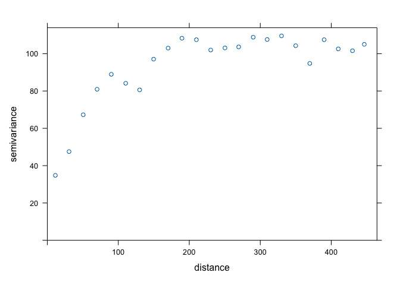
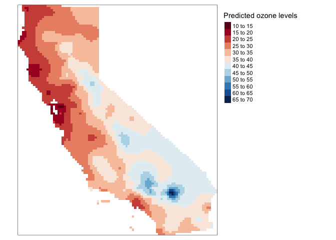

<style>
p.comment {
background-color: #DBDBDB;
padding: 10px;
border: 1px solid black;
margin-left: 25px;
border-radius: 5px;
}

.figure {
   margin-top: 20px;
   margin-bottom: 20px;
}

h1.title {
  font-weight: bold;
  font-family: Arial;  
}

h2.title {
  font-family: Arial;  
}

</style>


<style type="text/css">
#TOC {
  font-size: 13px;
  font-family: Arial;
}
</style>


\


In the last lab guide, we went through deterministic methods for interpolating spatial data. In this lab guide, we go through probabilistic or geostatistical spatial interpolation methods. We'll focus on two popular geostatistical procedures: trend surface analysis and Kriging. This lab guide closely follows OSU Ch. 10. The objectives of this lab are as follows

1. Learn how to run a trend surface analysis
2. Learn how to estimate a variogram
3. Learn how to interpolate values using Ordinary Kriging
4. Learn how to interpolate values using Universal Kriging

To help us accomplish these learning objectives, we will use California Air Pollution data. Ground-level ozone is the main component of smog and is the single most widespread air pollutant in the United States.  The objective is to spatially interpolate ozone levels in California.  After learning how to run trend surface and Kriging methods on California data, you will make comparisons between deterministic and geostatistical methods using Texas data.

<div style="margin-bottom:25px;">
</div>
## **Installing and loading packages**
\

No new packages this lab. Load all necessary packages using `library()`.


```r
library(sf)
library(sp)
library(gstat)
library(rgdal)
library(tidyverse)
library(tmap)
library(dismo)
library(raster)
```


<div style="margin-bottom:25px;">
</div>
## **Bringing in the data**
\

We will use the [airqual dataset](https://ww3.arb.ca.gov/html/ds.htm) to interpolate ozone levels for California (averages for 1980-2009). Download the  file *kriging.zip* from Canvas in the Lab and Assignments Week 9 folder. It contains all the files that will be used in this guide. Bring in the file *airqual.csv*, which contains ozone levels (among many other variables, which we will not use) for control points scattered throughout California.


```r
x <- read_csv("airqual.csv")
```

We'll need to prepare the data to get it ready. The variable we are interpolating is *OZDLYAV* (unit is parts per billion).  To get easier numbers to read, we multiply *OZDLYAV* by 1000


```r
x <- x %>%
      mutate(OZDLYAV = OZDLYAV * 1000)
```

At the moment, the data are in a tibble or data frame. 


```r
class(x)
```

```
## [1] "spec_tbl_df" "tbl_df"      "tbl"         "data.frame"
```

We need to create a *SpatialPointsDataFrame* to use the **gstat** kriging functions. This mean we will be primarily using [**sp**](https://geo200cn.github.io/introspatial.html#Spatial_Data) functions in this lab.  To convert it to a *SpatialPointsDataFrame*, we must first specify which of the columns contain the coordinates of the data. We do this by using the function `coordinates()`.


```r
coordinates(x) <- ~LONGITUDE + LATITUDE
class(x)
```

```
## [1] "SpatialPointsDataFrame"
## attr(,"package")
## [1] "sp"
```

Next, we need to establish the Coordinate Reference System (CRS).  


```r
proj4string(x) <- CRS('+proj=longlat +datum=NAD83')
```

Then reproject to a more appropriate CRS, such as Teale Albers. Note the `units=km`, which is needed to fit the variogram.


```r
TA <- CRS("+proj=aea +lat_1=34 +lat_2=40.5 +lat_0=0 +lon_0=-120 +x_0=0 +y_0=-4000000 +datum=NAD83 +units=km +ellps=GRS80")
aq <- spTransform(x, TA)
```


Next, we need to create a template raster to interpolate to. We will interpolate across California, so bring in the file *counties.shp* as an **sp** object.


```r
cageo <- shapefile("counties.shp")
```

Reproject to have the same CRS as *TA*.


```r
ca <- spTransform(cageo, TA)
```

Let's plot the points on CA to see what we got.


```r
plot(ca, border='gray')
points(aq, cex=.5, col='red')
```

<!-- -->

Coerce the *SpatialPolygonsDataFrame* of California, *ca*, to a raster using the function `raster()`.  


```r
r <- raster(ca)
res(r) <- 10  # 10 km if your CRS's units are in km
```

We need one more step. Go from raster to a *SpatialGrid* object (a different representation of the same idea) using the `as()` function.


```r
g <- as(r, 'SpatialGrid')
```

We're now ready to interpolate!

<div style="margin-bottom:25px;">
</div>
## **Trend surface analysis**
\

OSU begins Chapter 10 discussing trend surface analysis.  Trend surface modeling is basically a regression of the variable you want to interpolate on the spatial coordinates of your observed locations.  We've already done regression before!  So, trend surface analysis in regression lingo characterizes the outcome as the variable we want to interpolate *OZDLYAV*, and the independent variables as the X (longitude) and Y (latitude) coordinates.  This is equation 10.3 in OSU and the book calls it a linear trend surface. Let's run the model using our friend `lm()` (you can also use our other compadre `glm()`). 
 

```r
lm.1 <- lm(OZDLYAV~LONGITUDE + LATITUDE, data=aq)
```

And here is a summary.


```r
summary(lm.1)
```

```
## 
## Call:
## lm(formula = OZDLYAV ~ LONGITUDE + LATITUDE, data = aq)
## 
## Residuals:
##     Min      1Q  Median      3Q     Max 
## -24.714  -5.343  -1.279   3.941  45.058 
## 
## Coefficients:
##              Estimate Std. Error t value Pr(>|t|)    
## (Intercept) 32.883735   0.672214  48.919  < 2e-16 ***
## LONGITUDE    0.044224   0.004008  11.034  < 2e-16 ***
## LATITUDE     0.018565   0.003012   6.164 1.58e-09 ***
## ---
## Signif. codes:  0 '***' 0.001 '**' 0.01 '*' 0.05 '.' 0.1 ' ' 1
## 
## Residual standard error: 8.851 on 449 degrees of freedom
## Multiple R-squared:  0.2523,	Adjusted R-squared:  0.2489 
## F-statistic: 75.74 on 2 and 449 DF,  p-value: < 2.2e-16
```


Let's use this model to interpolate across California. Were interpolating across the California grid *g*.  To predict, you need to have the same right hand side variable names, *LONGITUDE* and *LATITUDE*, designating the coordinates in *g*.  However, the coordinates in *g* are named


```r
coordnames(g)
```

```
## [1] "s1" "s2"
```

Change it


```r
coordnames(g) <- c("LONGITUDE", "LATITUDE")
coordnames(g)
```

```
## [1] "LONGITUDE" "LATITUDE"
```

Now we can interpolate.  We use the function `predict()` to get interpolated values from *lm.1*, and save the predictions with the spatial grid *g* as a *SpatialGridDataFrame*.


```r
dat.1st <- SpatialGridDataFrame(g, data.frame(var1.pred = predict(lm.1, newdata=g))) 
```

And let's map using `tm_shape()`


```r
# Clip the interpolated raster to CA
r   <- raster(dat.1st)
r.m <- mask(r, ca)

# Plot the map
tm_shape(r.m) + 
  tm_raster(n=10, palette="RdBu", auto.palette.mapping=FALSE, 
            title="Predicted ozone") +
  tm_shape(aq) + tm_dots(size=0.1) +
  tm_legend(legend.outside=TRUE)
```

<!-- -->


Let's try another trend. The second order surface polynomial (aka quadratic polynomial) is a parabolic surface whose equation is given by the one shown on page 286 in OSU.


```r
lm.2 <- lm(OZDLYAV~LONGITUDE + LATITUDE + I(LONGITUDE*LONGITUDE) + I(LATITUDE*LATITUDE) + I(LONGITUDE*LATITUDE), data=aq)
```

Interpolate this across California's grid and map.


```r
# Use the regression model output to interpolate the surface
dat.2nd <- SpatialGridDataFrame(g, data.frame(var1.pred = predict(lm.2, newdata=g))) 

# Clip the interpolated raster to CA
r2   <- raster(dat.2nd)
r.m2 <- mask(r2, ca)

# Plot the map
tm_shape(r.m2) + 
  tm_raster(n=10, palette="RdBu", auto.palette.mapping=FALSE, 
            title="Predicted ozone") +
  tm_shape(aq) + tm_dots(size=0.1) +
  tm_legend(legend.outside=TRUE)
```

<!-- -->

This interpolation picks up a slight curvature in the east-west trend.

<div style="margin-bottom:25px;">
</div>
## **Kriging**
\

OSU calls trend surface analysis [dumb](https://www.youtube.com/watch?v=11G9j9utRCs) on page 287.  What a bunch of meanies. So, they then turn to Kriging. Kriging interpolates by calculating the weighted average of known values of the neighborhood points.

There are many flavors of kriging. These flavors are described on pages 310-311 in OSU.  The most common form of kriging is ordinary kriging. Ordinary kriging assumes stationarity: the mean and variance of the values is constant across the spatial field.  OSU describes on page 295 the three steps to interpolate values using kriging.  

1. Produce a description of the spatial variation in the sample control point data
2. Summarize this spatial variation by a regular mathematical function
3. Use this model to determine interpolation weights

Let's go through each step. 

<div style="margin-bottom:25px;">
</div>
### **Describe the Spatial Variation**
\

This step involves estimating the (semi) variogram. The variogram is the foundation of geostatistical analysis and is a measure of the variance as a function of distance. Basically, the variogram is our model of spatial autocorrelation. Let's estimate a variogram for *OZDLYAV*.  

First, let's create a variogram cloud.  A variogram cloud characterizes the spatial autocorrelation across a surface that we have sampled at a set of control points.   The variogram cloud is obtained by plotting all possible squared differences of observation pairs against their separation distance. As any point in the variogram cloud refers to a pair of points in the data set, the variogram cloud is used to point us to areas with unusual high or low variability.  We use the `variogram()` function, which calculates the sample variogram.  Here, we set the lag *h* to be 20 km.
 

```r
vcloud <- variogram(OZDLYAV~1, locations=aq, width=20, cloud = TRUE)
```

The first argument `OZDLYAV~1` specifies the response variable (what you are interpolating) and what covariates the interpolation will be based on. Ordinary kriging relies only on distance, which is reflected by the formula `OZDLYAV~1`, and assumes a constant trend (or a stationary process) for the variable. The ordinary kriging predictor is a weighted average of the surrounding observations, where the weight depends on a fitted model to the measured points, the distance to the prediction location, and the spatial relationships among the measured values around the prediction location. 

We then plot the cloud, getting a plot like Figure 10.7 in OSU.


```r
plot(vcloud)
```

<!-- -->

The variogram cloud gives us some insight, but need to simplify it a bit.  This is when we turn to the sample variogram. The sample variogram is estimated using the function `variogram()` but without the argument `cloud = TRUE`. 


```r
v.o <- variogram(OZDLYAV~1, locations=aq, width=20)
plot(v.o)
```

<!-- -->

The variogram plot is nothing but a plot of averages of semivariogram cloud values over distance intervals.  It is like Figure 10.9 in OSU.

The generated variogram is isotropic, meaning that we are assuming there is a constant trend for the variable. In other words, the spatial variability is the same in all directions. We will examine the situation where there is an apparent spatial trend later in this lab when we discuss universal kriging.

<div style="margin-bottom:25px;">
</div>
### **Fit the model variogram**
\

The variogram we constructed is the sample variogram.  It is for the observed or sampled points.  In order to estimate values at unknown locations, we need to create a model variogram. To generate a model variogram, we need to estimate the following components

1. Sill
2. Range
3. Nugget

The sample variogram we created above can help us estimate these values. We need to eyeball the values from the sample variogram plot. The sill is the y-value where there is no more spatial correlation, the point on the graph where y-values level off, which is around 100. The range is the x-value where the variogram reaches the sill which appears to occur at around 150.  The nugget can be thought of as the y-axis intercept, which occurs at an approximate value of 30.  We don't need to get these values exactly correct.  We just need to plug reasonable values into the function as starting points.  From these starting points, R will then adjust the values to optimize model fit.

You also need to establish the theoretical function that determines the influence of near and far locations on the estimation. Common functions include exponential circular, spherical and Gaussian (see Figure 10.10 in OSU for the shapes). You can check the available models by typing in `vgm()` in your console.  We'll start out with the Exponential function `Exp`.

We use the `fit.variogram()` function to fit a model variogram. The first argument specifies the empirical or sample variogram. The second argument is the model, with parameters, to be fit to the sample variogram. The model specifies the sill `psill =`, the range `range =`, the nugget `nugget =` and the theoretical model `model =`.  Plug in the values we eyeballed from the sample variogram as starting points for the model. `fit.variogram` will help optimize the fit of the model using an iterative weighted OLS method. 


```r
fve.o <- fit.variogram(v.o, model = vgm(psill = 100, model = "Exp", range = 150, nugget = 30))
```

Here are the actual parameters that R used to fit the model 


```r
fve.o
```

```
##   model    psill    range
## 1   Nug 21.96589  0.00000
## 2   Exp 85.52938 72.31329
```

With the sample and fit variogram, one can plot them together to see how well the fit was:


```r
plot(variogramLine(fve.o, 400), type='l', ylim=c(0,120), col='blue', main = 'Exponential variogram model')
points(v.o[,2:3], pch=20, col='red')
```

<!-- -->

Here's another way to plot the variogram and the model.


```r
plot(v.o, fve.o, main = 'Exponential variogram model')
```

<!-- -->


Let's try a different function (spherical instead of exponential)


```r
fvs.o <- fit.variogram(v.o, model = vgm(psill = 100, model = "Sph", range = 150, nugget = 30))
fvs.o
```

```
##   model    psill   range
## 1   Nug 25.59723   0.000
## 2   Sph 72.69835 136.131
```

```r
plot(variogramLine(fvs.o, 400), type='l', ylim=c(0,120) ,col='blue', lwd=2, main = 'Spherical variogram model')
points(v.o[,2:3], pch=20, col='red')
```

<!-- -->

Both look pretty good in this case. What about Gaussian?


```r
fvg.o <- fit.variogram(v.o, model = vgm(psill = 100, model = "Gau", range = 150, nugget = 30))
fvg.o
```

```
##   model    psill    range
## 1   Nug 32.45995  0.00000
## 2   Gau 63.75329 58.51846
```

```r
plot(variogramLine(fvg.o, 400), type='l', ylim=c(0,120) ,col='blue', lwd=2, main = 'Gaussian variogram model')
points(v.o[,2:3], pch=20, col='red')
```

<!-- -->


<div style="margin-bottom:25px;">
</div>
### **Ordinary kriging**
\

Once we have determined an appropriate variogram model we can interpolate across California. Ordinary kriging is an interpolation method that uses weighted averages of all,or a defined set of neighboring observations.  To Krig, you always need to establish the fitted variogram, because the variogram establishes the weights in the interpolation.  See OSU pages 302-306 if you are interested in seeing the math of how Ordinary Kriging is done. To employ Kriging in R, use the function `gstat()`. 


```r
k.o <- gstat(formula = OZDLYAV~1, locations = aq, model=fve.o)
```

The first argument is our interpolation formula, second are our observed points, third is the variogram model we are using to interpolate, in this case the exponential model. 

Next, we need to predict or interpolate for our grid *g*. 


```r
kp.o <- predict(k.o, g)
```

```
## [using ordinary kriging]
```

Let's plot the predicted values.


```r
# Convert kriged surface to a raster object for clipping
ok.o <- raster(kp.o)
ok.o <- mask(ok.o, ca)

tm_shape(ok.o) + 
  tm_raster(n=10, palette="RdBu", auto.palette.mapping=FALSE, 
            title="Ordinary kriging ozone levels") +
  tm_legend(legend.outside=TRUE)
```

<!-- -->

How good are our predictions? We run 5-fold cross-validation to estimate the test prediction error. First, we establish the `RMSE()` function we created [last lab guide](https://geo200cn.github.io/interpolation.html#mean_model).


```r
RMSE <- function(observed, predicted) {
  sqrt(mean((predicted - observed)^2, na.rm=TRUE))
}
```

Then run 5-fold cross validation using the same for loop from [last lab guide](https://geo200cn.github.io/interpolation#mean_model.html#proximity_polygons)


```r
set.seed(1234)
kf <- kfold(nrow(aq))
rmseok <- rep(NA, 5)
for (k in 1:5) {
  test <- aq[kf == k, ]
  train <- aq[kf != k, ]
  gscv <- gstat(formula = OZDLYAV~1, locations = train, model=fve.o)
  p <- predict(gscv, newdata = test, debug.level=0)$var1.pred
  rmseok[k] <- RMSE(test$OZDLYAV, p)
}
```


What is our 5-fold root mean squared error?


```r
mean(rmseok)
```

```
## [1] 6.933593
```


<div style="margin-bottom:25px;">
</div>
## **Universal kriging**
\

While in Ordinary Kriging it is assumed that the mean is constant across the entire region of study (second order stationarity), in Universal Kriging the mean is a function of the site coordinates. This means we believe there is a trend. Instead of `OZDLYAV~1` in our formula, we use `OZDLYAV~LONGITUDE + LATITUDE`, which accounts for the x and y coordinates of each point in the prediction.

Following the same sequence as above in ordinary kriging , we get the empirical or sample variogram.


```r
v.u <- variogram(OZDLYAV~LONGITUDE + LATITUDE, locations=aq, width=20)
plot(v.u)
```

<!-- -->

Sill looks like 75 (ish), range is 90 (ish), and nugget is 30 (ish).  We now get the variogram model using the exponential function.


```r
fve.u <- fit.variogram(v.u, model = vgm(psill = 75, model = "Exp", range = 90, nugget = 30))
```

Now, we  krige


```r
k.u <- gstat(formula = OZDLYAV~LONGITUDE + LATITUDE, locations = aq, model=fve.u)
```

Predict


```r
kp.u <- predict(k.u, g)
```

```
## [using universal kriging]
```


Plot the predictions to see what they look like


```r
# Convert kriged surface to a raster object for clipping
ok.u <- raster(kp.u)
ok.u <- mask(ok.u, ca)


tm_shape(ok.u) + 
  tm_raster(n=10, palette="RdBu", auto.palette.mapping=FALSE, 
            title="Predicted ozone levels") +
  tm_legend(legend.outside=TRUE)
```

<!-- -->

And the 5-fold RMSE is


```r
rmseuk <- rep(NA, 5)
for (k in 1:5) {
  test <- aq[kf == k, ]
  train <- aq[kf != k, ]
  gscv <- gstat(formula = OZDLYAV~LONGITUDE + LATITUDE, locations = train, model=fve.u)
  p <- predict(gscv, newdata = test, debug.level=0)$var1.pred
  rmseuk[k] <- RMSE(test$OZDLYAV, p)
}
mean(rmseuk)
```

```
## [1] 7.084023
```


<div style="margin-bottom:25px;">
</div>
## **Comparing methods**
\

Kriging is one of the most common interpolation methods in a Geographer's toolkit.  But, it's not the only tool.  In fact, we went through several in last lab guide. Let's go back to these and make some comparisons with the new friends we made in today's lab.  

You must be tired of running models on California. Let's predict precipitation for the great state of Texas! Bring in the files *precip* and *texas*.  


```r
P <- shapefile("precip.shp")
TX <- shapefile("texas.shp")
```

Note the classes 


```r
class(P)
```

```
## [1] "SpatialPointsDataFrame"
## attr(,"package")
## [1] "sp"
```

```r
class(TX)
```

```
## [1] "SpatialPolygonsDataFrame"
## attr(,"package")
## [1] "sp"
```

You will be interpolating the variable *Precip_in* in the *P* data set, which is average precipitation in inches for several meteorological sites in Texas.  Let's map the samples cases.


```r
plot(TX, border='gray')
points(P, cex=.5, col='red')
```

<!-- -->


We need to add geographic coordinates to *P* to do our interpolating


```r
P$X <- coordinates(P)[,1]
P$Y <- coordinates(P)[,2]
```

We also need to convert *TX* to a raster and then from it create a *SpatialGrid* object.


```r
r <- raster(TX)
res(r) <- 10
g <- as(r, 'SpatialGrid')
```

Finally, we make sure the coordinate variable names for the grid *g* are the same as those in *P*.


```r
coordnames(g) <- c("X", "Y")
```

Now, you're ready to interpolate.


<br>

<p class="comment">**Question 1**: Run the local spatial average method using 3-nearest neighbors to interpolate Texas precipitation levels across the state.  </p>

<p class="comment">**Question 2**:   Run the inverse distance weighted (IDW) method. </p>

<p class="comment">**Question 3**:   Run a quadratic polynomial trend surface model. </p>

<p class="comment">**Question 4**:   Run universal kriging. Hint: Don't just copy and paste the code from the California case. Texas is different from California, so the parameters will be different. In particular, play around with the `cutoff =` and `width =` values  when you create the sample variogram. The cutoff represents the maximal spatial distance taken into account between two observations. The width is the lag or distance interval over which the semi-variance is calculated. You want to make sure you can see enough of the variogram top to bottom and left to right to estimate the sill, range and nugget. </p>

<p class="comment">**Question 5**:   Use 5-fold cross-validation to determine which of the four methods is the best based on RMSE. </p>

<p class="comment">**Question 6**:   Map the interpolated values for the best model. </p>


<br>


And we're done! [Where'd all the time go?](https://www.youtube.com/watch?v=bmZQpbNK7t4)

***

<a rel="license" href="http://creativecommons.org/licenses/by-nc/4.0/"></a><br />This work is licensed under a <a rel="license" href="http://creativecommons.org/licenses/by-nc/4.0/">Creative Commons Attribution-NonCommercial 4.0 International License</a>.


Website created and maintained by [Noli Brazil](https://nbrazil.faculty.ucdavis.edu/)


