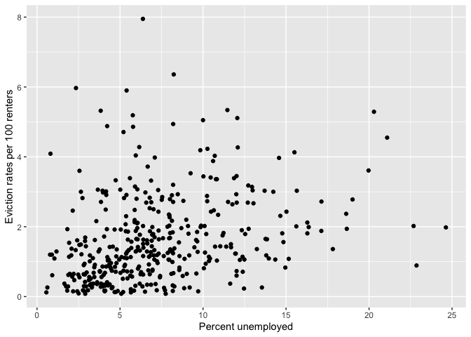

<style>
p.comment {
background-color: #DBDBDB;
padding: 10px;
border: 1px solid black;
margin-left: 25px;
border-radius: 5px;
font-style: normal;
}

.figure {
   margin-top: 20px;
   margin-bottom: 20px;
}

h1.title {
  font-weight: bold;
  font-family: Arial;  
}

h2.title {
  font-family: Arial;  
}

</style>


<style type="text/css">
#TOC {
  font-size: 13px;
  font-family: Arial;
}
</style>


\


Linear regression is the workhorse of applied statistics. Its robustness and easy interpretation are but two of the many reasons that it is often the first and frequently the last stop on the way to characterizing empirical relationships among observed variables. We will start with covering the functions and tools to run simple linear regression models in R, closely following this week's handout and lecture. The objectives of this lab are as follows

1. Learn how to run and evaluate a simple linear regression model
2. Learn how to calculate and evaluate model fit

To help us accomplish these learning objectives, we will examine the association between neighborhood characteristics and housing eviction rates in the Sacramento metropolitan area.  We will examine whether there are demographic and socioeconomic disparities in the types of neighborhoods that have higher eviction rates.

<div style="margin-bottom:25px;">
</div>
## **Installing and loading packages**
\

We'll be using a couple of new packages in this lab.  First, you'll need to install them.  The code below checks if you've already installed these packages before.  If you haven't, it will install them.


```r
install.packages(c("broom", "gridExtra", "classInt"))
```

Load these packages and others we will need for this lab.


```r
library(tidyverse)
library(gridExtra)
library(broom)
library(spdep)
library(sf)
```


<div style="margin-bottom:25px;">
</div>
## **Why linear regression**
\

There are three main reasons to run a linear regression:

1. You want to **describe** the relationship between two variables.
2. You want to **infer** the causal effect of one variable on another.
3. You want to **predict** the value of one variable from another.

Why linear and not something else? It's computationally easy. The estimated relationships are easy to describe. If certain assumptions are correct, it does a good job describing the relationship.  We will cover nonlinear regression techniques later in the quarter.


Our research question in this lab is: What ecological characteristics are associated with neighborhood eviction rates in the Sacramento metropolitan area?


<div style="margin-bottom:25px;">
</div>
## **Bringing in the data**
\

Download the csv file *sac_metro_eviction.csv* located on Canvas in the Week 3 Lab and Assignments folder.  Read in the csv file using the `read_csv()` function.


```r
sac_metro <- read_csv("sac_metro_eviction.csv")
```

2017 eviction rate case data were downloaded from the [Eviction Lab website](https://evictionlab.org/).  Socioeconomic and demographic data were downloaded from the 2013-2017 [American Community Survey](https://www.census.gov/programs-surveys/acs). A record layout of the data can be found [here](https://raw.githubusercontent.com/geo200cn/data/master/sacmetroeviction.txt).  We will not use all of these variables. We will do so next lab when we go through multiple linear regression.


<div style="margin-bottom:25px;">
</div>
## **Correlation**
\

We are interested in understanding the ecological characteristics associated with neighborhood level evictions per 100 renters (*evict*). Let's examine its association with neighborhood percent unemployed *punemp*.  One of the first steps in conducting a data analysis is to plot the two variables to detect whether a relationship exists.  Because eviction rates and percent unemployed are numeric variables, we can construct a scatter plot to examine the relationship, which we covered in [Week 2](https://geo200cn.github.io/eda.html#Scatterplot). Let's use our reliable friend `ggplot()` again.


```r
ggplot(sac_metro) +
    geom_point(mapping = aes(x = punemp, y = evict)) +
    xlab("Percent unemployed") +
    ylab("Eviction rates per 100 renters")
```

<!-- -->

The relationship is not super clear. The next step is to calculate the correlation between variables to get a numerical summary of the relationship, which we also covered in [Week 2](https://geo200cn.github.io/eda.html#Bivariate_statistics).  A picture and a numerical summary is a good combination.

Use the function `cor.test()` to calculate the Pearson correlation between eviction rates and percent unemployed.


```r
cor.test(sac_metro$evict, sac_metro$punemp) 
```

```
## 
## 	Pearson's product-moment correlation
## 
## data:  sac_metro$evict and sac_metro$punemp
## t = 6.2535, df = 397, p-value = 1.038e-09
## alternative hypothesis: true correlation is not equal to 0
## 95 percent confidence interval:
##  0.2073757 0.3862725
## sample estimates:
##       cor 
## 0.2994538
```

Correlation ranges from -1 to 0 to 1, with -1 indicating perfect negative correlation and 1 indicating perfect positive correlation. The function conducts a hypothesis test.  What is the test statistic, alternative and null hypotheses? The correlation is 0.31 with a p-value near 0.  What does this suggest about the relationship between the two variables?


<div style="margin-bottom:25px;">
</div>
## **Simple linear regression**
\

In correlation analysis, the two variables whose association is being measured are treated interchangeably.  In contrast, a regression analysis designates a response or dependent variable *Y* and an independent or explanatory variable *X*.  The idea is that there is a direction in the relationship.  *X* leads to, predicts or potentially *causes* *Y*. In most regression applications, showing causality is difficult, so findings are more descriptive in nature.

We will designate eviction rates as the dependent variable.  We will examine its relationship with percent unemployed, which is the independent variable.  The most common regression model is a linear regression model.  The most common approach to estimating a regression model is ordinary least squares (OLS). A linear regression model containing only one independent variable is known as a simple linear regression.  

<div style="margin-bottom:25px;">
</div>
### **Quantitative independent variable**
\

Let's first run a model where our independent variable is numeric. We use the function `lm()` to run a regression of eviction rates on percent unemployed.


```r
lm1 <- lm(evict ~ punemp, 
          data = sac_metro)
```

The first argument in `lm()` is the outcome. This is followed by the `~` operator and then the independent variable. We indicate the data underlying the model using the argument `data =`.

“Printing” the object gives a very short summary


```r
lm1
```

```
## 
## Call:
## lm(formula = evict ~ punemp, data = sac_metro)
## 
## Coefficients:
## (Intercept)       punemp  
##     0.95715      0.09143
```

`names()` function reveals what’s contained in the *lm1* object.


```r
names(lm1)
```

```
##  [1] "coefficients"  "residuals"     "effects"       "rank"         
##  [5] "fitted.values" "assign"        "qr"            "df.residual"  
##  [9] "xlevels"       "call"          "terms"         "model"
```

We find out we can extract neat things like the residuals


```r
lm1$residuals
```

Also the fitted values


```r
lm1$fitted.values
```


The `summary()` function provides more detailed results.


```r
summary(lm1)
```

```
## 
## Call:
## lm(formula = evict ~ punemp, data = sac_metro)
## 
## Residuals:
##     Min      1Q  Median      3Q     Max 
## -2.1572 -0.8287 -0.3145  0.5179  6.4098 
## 
## Coefficients:
##             Estimate Std. Error t value Pr(>|t|)    
## (Intercept)  0.95715    0.12183   7.856 3.75e-14 ***
## punemp       0.09143    0.01462   6.254 1.04e-09 ***
## ---
## Signif. codes:  0 '***' 0.001 '**' 0.01 '*' 0.05 '.' 0.1 ' ' 1
## 
## Residual standard error: 1.2 on 397 degrees of freedom
## Multiple R-squared:  0.08967,	Adjusted R-squared:  0.08738 
## F-statistic: 39.11 on 1 and 397 DF,  p-value: 1.038e-09
```

We get the following information:

* *Call*: The regression formula.
* *Residuals*: Shows percentiles of the residuals.
* *Coefficients*: Provides the regression coefficient estimates along with their standard errors and the results (t-stat and p-value) of t-tests for each coefficient.
* *Significance threshold codes*: Asterisks showing whether the coefficient estimate p-values meet standard significance thresholds.
* *Residual standard errors*:  The standard deviation of the residuals. The smaller the residual standard error, the better a regression model fits a dataset. 
* *R-squared and adjusted R-squared*: Measures of fit.
* *F-statistic*: A test of overall model fit (i.e., does the model fit the data). 

You can also create a *tidy* table of regression results using the `tidy()` function, which is a part of the **broom** package


```r
tidy(lm1)
```

```
## # A tibble: 2 × 5
##   term        estimate std.error statistic  p.value
##   <chr>          <dbl>     <dbl>     <dbl>    <dbl>
## 1 (Intercept)   0.957     0.122       7.86 3.75e-14
## 2 punemp        0.0914    0.0146      6.25 1.04e- 9
```


<br>

<p class="comment">**Question 1**:  Write the equation of the regression line. What is the interpretation of the intercept?  What is the interpretation of the slope coefficient?  </p>

<br>

<p class="comment">**Question 2**: What is the predicted value of eviction rates at 10 percent unemployed?  50 percent? </p>

<br>

<p class="comment">**Question 3**: Plot the independent and dependent variables. Also plot the least squares regression best fit line. You want something that looks like one of the figures in Figure 2 in the linear regression handout. </p>

<br>


<div style="margin-bottom:25px;">
</div>
### **Qualitative independent variable**
\

The variables *punemp* is quantitative or numeric.  Let's examine a qualitative or categorical independent variable.  First, let's examine the variable *poor*, which categorizes the neighborhood as a poor (poverty rate greater than 30%) and nonpoor (poverty rate less than or equal to 30%) neighborhood.  It's qualitative because the values are "Poor" and "Nonpoor".  


```r
lm2 <- lm(evict ~  poor, 
          data = sac_metro)
summary(lm2)
```

```
## 
## Call:
## lm(formula = evict ~ poor, data = sac_metro)
## 
## Residuals:
##     Min      1Q  Median      3Q     Max 
## -2.4780 -0.8331 -0.2431  0.5219  5.3920 
## 
## Coefficients:
##             Estimate Std. Error t value Pr(>|t|)    
## (Intercept)   1.4731     0.0647  22.768  < 2e-16 ***
## poorPoor      1.0849     0.1759   6.168  1.7e-09 ***
## ---
## Signif. codes:  0 '***' 0.001 '**' 0.01 '*' 0.05 '.' 0.1 ' ' 1
## 
## Residual standard error: 1.202 on 397 degrees of freedom
## Multiple R-squared:  0.08746,	Adjusted R-squared:  0.08516 
## F-statistic: 38.05 on 1 and 397 DF,  p-value: 1.701e-09
```

<br>

<p class="comment">**Question 4**: What is the interpretation of the coefficient estimate for the *poorPoor* variable? </p>

<br>

Next, let's examine a multi-categorical variable.  Here, instead of two categories, we have multiple.  Let's examine the variable *county*, which identifies the county (El Dorado, Placer, Sacramento, Yolo) the neighborhood is located. It's qualitative because the values are the names of the 4 counties. 


```r
lm3 <- lm(evict ~  county, 
          data = sac_metro)
summary(lm3)
```

```
## 
## Call:
## lm(formula = evict ~ county, data = sac_metro)
## 
## Residuals:
##     Min      1Q  Median      3Q     Max 
## -1.6872 -0.7748 -0.1978  0.4978  6.1428 
## 
## Coefficients:
##                  Estimate Std. Error t value Pr(>|t|)    
## (Intercept)        2.0354     0.1919  10.607  < 2e-16 ***
## countyPlacer      -1.6676     0.2714  -6.145 1.96e-09 ***
## countySacramento  -0.2282     0.2038  -1.120    0.264    
## countyYolo        -1.0831     0.2752  -3.935 9.81e-05 ***
## ---
## Signif. codes:  0 '***' 0.001 '**' 0.01 '*' 0.05 '.' 0.1 ' ' 1
## 
## Residual standard error: 1.167 on 395 degrees of freedom
## Multiple R-squared:  0.1435,	Adjusted R-squared:  0.137 
## F-statistic: 22.06 on 3 and 395 DF,  p-value: 3.154e-13
```

<br>

<p class="comment">**Question 5**: What is the interpretation of the  coefficient estimates for *countyPlacer*, *countySacramento*, and *countyYolo*? </p>

<br>


<div style="margin-bottom:25px;">
</div>
## **Statistical Inference**
\

So far, we've asked you to interpret the coefficients in terms of how they characterize the relationship between the dependent and independent variables.  We have not asked you, however, to make any statistical inferences regarding the significance of the coefficients (e.g. is the coefficient statistically significant from 0). Let's get a summary of our regression results and make some inferences.


```r
#eliminate scientific notation
options(scipen=999)

summary(lm1)
```

```
## 
## Call:
## lm(formula = evict ~ punemp, data = sac_metro)
## 
## Residuals:
##     Min      1Q  Median      3Q     Max 
## -2.1572 -0.8287 -0.3145  0.5179  6.4098 
## 
## Coefficients:
##             Estimate Std. Error t value           Pr(>|t|)    
## (Intercept)  0.95715    0.12183   7.856 0.0000000000000375 ***
## punemp       0.09143    0.01462   6.254 0.0000000010381178 ***
## ---
## Signif. codes:  0 '***' 0.001 '**' 0.01 '*' 0.05 '.' 0.1 ' ' 1
## 
## Residual standard error: 1.2 on 397 degrees of freedom
## Multiple R-squared:  0.08967,	Adjusted R-squared:  0.08738 
## F-statistic: 39.11 on 1 and 397 DF,  p-value: 0.000000001038
```

We briefly described what these results are showing, but let's get into more detail for the section providing coefficient results (*Coefficients*).

* The values under "Estimate" provide the coefficient estimates. 
* The values under "Std. Error" provide the standard error of each coefficient.  We are conducting two hypothesis tests, one for each coefficient.  
* The values under "t value" show the values of the test statistic *t* for these hypothesis tests. The use of the *t* value indicates that were going to be using the *t* distribution as the null distribution (hence we conduct a *t*-test). More precisely, if the null hypothesis is true, the test statistic has a *t* distribution with degrees of freedom of 175, which is denoted next to "Residual standard error". 
* The values under the column  "Pr(>|t|)" indicate the p-value, which is the probability of obtaining an effect at least as extreme as the one in your sample data, assuming the truth of the null hypothesis.  
* The asterisks after the p-value indicate the significance level of the test: 0.001, 0.01, 0.05 and 0.1.  

<br>

<p class="comment">**Question 6**: What is the null and alternative hypotheses for the t-test of the punemp coefficient shown in the output above? Would you reject or fail to reject the null hypothesis? Why?</p>

<br>

Let's look at our regression summary for *lm3*


```r
summary(lm3)
```

```
## 
## Call:
## lm(formula = evict ~ county, data = sac_metro)
## 
## Residuals:
##     Min      1Q  Median      3Q     Max 
## -1.6872 -0.7748 -0.1978  0.4978  6.1428 
## 
## Coefficients:
##                  Estimate Std. Error t value             Pr(>|t|)    
## (Intercept)        2.0354     0.1919  10.607 < 0.0000000000000002 ***
## countyPlacer      -1.6676     0.2714  -6.145        0.00000000196 ***
## countySacramento  -0.2282     0.2038  -1.120                0.264    
## countyYolo        -1.0831     0.2752  -3.935        0.00009813245 ***
## ---
## Signif. codes:  0 '***' 0.001 '**' 0.01 '*' 0.05 '.' 0.1 ' ' 1
## 
## Residual standard error: 1.167 on 395 degrees of freedom
## Multiple R-squared:  0.1435,	Adjusted R-squared:  0.137 
## F-statistic: 22.06 on 3 and 395 DF,  p-value: 0.0000000000003154
```

<br>

<p class="comment">**Question 7**: What is the null and alternative hypotheses for the t-test of the *countySacramento* coefficient shown in the output above? Would you reject or fail to reject the null hypothesis? Why? </p>

<br>

<div style="margin-bottom:25px;">
</div>
## **Goodness of fit**
\

The Handout goes through measures of best fit, emphasizing that it is important that we assess how well this line fits the actual data.  The most popular measure is the coefficient of determination, also known as $R^2$. The measure relies on the residual and model sum of squares. We don't need to calculate the value by hand, as it is conveniently given to us when you use the `summary()` function.  Let's go back to the model *lm1*


```r
summary(lm1)
```

```
## 
## Call:
## lm(formula = evict ~ punemp, data = sac_metro)
## 
## Residuals:
##     Min      1Q  Median      3Q     Max 
## -2.1572 -0.8287 -0.3145  0.5179  6.4098 
## 
## Coefficients:
##             Estimate Std. Error t value           Pr(>|t|)    
## (Intercept)  0.95715    0.12183   7.856 0.0000000000000375 ***
## punemp       0.09143    0.01462   6.254 0.0000000010381178 ***
## ---
## Signif. codes:  0 '***' 0.001 '**' 0.01 '*' 0.05 '.' 0.1 ' ' 1
## 
## Residual standard error: 1.2 on 397 degrees of freedom
## Multiple R-squared:  0.08967,	Adjusted R-squared:  0.08738 
## F-statistic: 39.11 on 1 and 397 DF,  p-value: 0.000000001038
```

"Multiple R-squared" gives the value $R^2$ of 0.08967.

<br>

<p class="comment">**Question 8**: If you were trying to explain the $R^2$ value 0.08967 to your friend, what would you say? </p>

<br>

Another measure that the Handout goes through is the F-test, which also relies on the sum of squares.

<br>

<p class="comment">**Question 9**: Interpret the F-test results (F-statistic and p-value) that are provided in the regression summary above.  </p>

<br>


***

<a rel="license" href="http://creativecommons.org/licenses/by-nc/4.0/"></a><br />This work is licensed under a <a rel="license" href="http://creativecommons.org/licenses/by-nc/4.0/">Creative Commons Attribution-NonCommercial 4.0 International License</a>.


Website created and maintained by [Noli Brazil](https://nbrazil.faculty.ucdavis.edu/)
