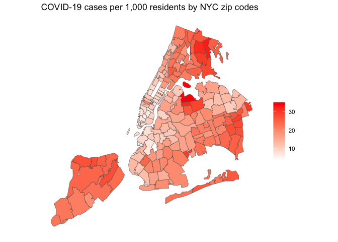

<style>
p.comment {
background-color: #DBDBDB;
padding: 10px;
border: 1px solid black;
margin-left: 25px;
border-radius: 5px;
}

.figure {
   margin-top: 20px;
   margin-bottom: 20px;
}

h1.title {
  font-weight: bold;
  font-family: Arial;  
}

h2.title {
  font-family: Arial;  
}

</style>


<style type="text/css">
#TOC {
  font-size: 13px;
  font-family: Arial;
}
</style>


\


Linear regression is the workhorse of applied statistics. Its robustness and easy interpretation are but two of the many reasons that it is often the first and frequently the last stop on the way to characterizing empirical relationships among observed variables. We will start with covering the functions and tools to run simple linear regression models in R, closely following this week's handout and lecture. The objectives of this lab are as follows

1. Learn how to run and evaluate a simple linear regression model
2. Learn how to calculate and evaluate model fit

To help us accomplish these learning objectives, we will examine the association between neighborhood characteristics and COVID-19 case rates in New York City zip codes. New York City was the [epicenter of the initial COVID-19 outbreak in the United States](https://www.cdc.gov/mmwr/volumes/69/wr/mm6946a2.htm).  We will examine whether there are disparities in the types of neighborhoods that were first hit the hardest in the city.

<div style="margin-bottom:25px;">
</div>
## **Installing and loading packages**
\

We'll be using a couple of new packages in this lab.  First, you'll need to install them.  The code below checks if you've already installed these packages before.  If you haven't, it will install them.


```r
install.packages(c("broom", "gridExtra", "classInt"))
```

Load these packages and others we will need for this lab.


```r
library(tidyverse)
library(gridExtra)
library(broom)
library(spdep)
library(sf)
```


<div style="margin-bottom:25px;">
</div>
## **Why linear regression**
\

There are three main reasons to run a linear regression:

1. You want to **describe** the relationship between two variables.
2. You want to **infer** the causal effect of one variable on another.
3. You want to **predict** the value of one variable from another.

We will be covering reasons 1 and 2 in the next couple of labs.  We will cover reason 3 later in the quarter when we dive into prediction modelling.

Why linear and not something else? It's computationally easy. The estimated relationships are easy to describe. If certain assumptions are correct, it does a good job describing the relationship.  We will cover nonlinear regression techniques later in the quarter.


Our research question in this lab is: What ecological characteristics are associated with zip code COVID-19 case rates in New York City when COVID was first being reported in the United States in 2020?


<div style="margin-bottom:25px;">
</div>
## **Bringing in the data**
\

Download the csv file *zctanyccovid.csv* and the shapefile (zipped) *zctanyc.shp* located on Canvas in the Lab and Assignments Week 6 folder.  Read in the New York City zipcode csv file using the `read_csv()` function.


```r
zctanyc <- read_csv("zctanyccovid.csv")
```

COVID-19 case data were downloaded from the [NYC Department of Health and Mental Hygiene](https://github.com/nychealth/coronavirus-data) (confirmed cases up through May 1, 2020).  Socioeconomic and demographic data were downloaded from the 2014-2018 [American Community Survey](https://www.census.gov/programs-surveys/acs). A record layout of the data can be found [here](https://raw.githubusercontent.com/geo200cn/data/master/zctanyccovidRL.txt).  We will not use all of these variables. We will do so next lab when we go through multiple linear regression.

Next bring in the New York City zipcode shape file using `st_read()`


```r
zctanyc.sf <- st_read("zctanyc.shp")
```

<div style="margin-bottom:25px;">
</div>
## **Mapping**
\

Your first instinct as a Geographer when given new data is to map. MAP, Map, map (not MAUP, because Geographers don't like that).  We won't be using any spatial analysis tools in this lab, but mapping is fun and gives you a sense of how the values of your variables are distributed across geographic space. 

First, we need to join the zipcode data *zctanyc* to the **sf** object *zctanyc.sf* using `left_join()`


```r
zctanyc.sf <- left_join(zctanyc.sf, zctanyc, by = "GEOID")
```

We can now map our main variable of interest, COVID-19 cases per 1,000 residents (*covidrate*). I use `ggplot()`, but you can load in **tmap** if you like `tm_shape()` more.


```r
ggplot(zctanyc.sf) +
  geom_sf(aes(fill = covidrate)) +
  scale_fill_gradient(low= "white", high = "red",  name ="") + 
  labs(title = "COVID-19 cases per 1,000 residents by NYC zip codes") +  
  theme( axis.text =  element_blank(),
    axis.ticks =  element_blank(),
    panel.background = element_blank())
```

<!-- -->

Let's visually compare this map to the independent variable we will examine, percent black (*pblk*).  


```r
ggplot(zctanyc.sf) +
  geom_sf(aes(fill = pblk)) +
  scale_fill_gradient(low= "white", high = "red",  name ="") + 
  labs(title = "Percent black") +  
  theme( axis.text =  element_blank(),
    axis.ticks =  element_blank(),
    panel.background = element_blank())
```

<!-- -->

Do you detect any patterns?

<div style="margin-bottom:25px;">
</div>
## **Correlation**
\

We are interested in understanding the ecological characteristics associated with zipcode level COVID-19 cases per 1,000 residents (*covidrate*). Let's examine its association with neighborhood percent black *pblk*.  One of the first steps in conducting a data analysis is to plot the two variables to detect whether a relationship exists.  Because COVID-19 rates and percent black are numeric variables, we can construct a scatter plot to examine the relationship, which we covered in [Week 2](https://geo200cn.github.io/eda.html#Scatterplot). Let's use our reliable friend `ggplot()` again.


```r
ggplot(zctanyc) +
    geom_point(mapping = aes(x = pblk, y = covidrate)) +
    xlab("Percent black") +
    ylab("COVID-19 cases per 1,000")
```

<!-- -->

The relationship is not super clear. The next step is to calculate the correlation between variables to get a numerical summary of the relationship, which we also covered in [Week 2](https://geo200cn.github.io/eda.html#Bivariate_statistics).  A picture and a numerical summary is a good combination.

Use the function `cor.test()` to calculate the Pearson correlation between COVID-19 case rates and median household income.


```r
cor.test(zctanyc$covidrate, zctanyc$pblk) 
```

```
## 
## 	Pearson's product-moment correlation
## 
## data:  zctanyc$covidrate and zctanyc$pblk
## t = 4.7144, df = 175, p-value = 4.929e-06
## alternative hypothesis: true correlation is not equal to 0
## 95 percent confidence interval:
##  0.1980004 0.4604006
## sample estimates:
##       cor 
## 0.3356969
```

The correlation ranges from -1 to 0 to 1, with -1 indicating perfect negative correlation and 1 indicating perfect positive correlation. The function conducts a hypothesis test.  What is the test statistic, alternative and null hypotheses? The correlation is 0.34 with a p-value near 0.  What does this suggest about the relationship between the two variables?


<div style="margin-bottom:25px;">
</div>
## **Simple linear regression**
\

In correlation analysis, the two variables whose association is being measured are treated interchangeably.  In contrast, a regression analysis designates a response or dependent variable *Y* and an independent or explanatory variable *X*.  The idea is that there is a direction in the relationship.  *X* leads to, predicts or potentially *causes* *Y*.

We will designate COVID-19 rates as the dependent variable.  We will examine its relationship with percent black, which is the independent variable.  The most common regression model is a linear regression model.  The most common approach to estimating a regression model is ordinary least squares (OLS). A linear regression model containing only one independent variable is known as a simple linear regression.  

<div style="margin-bottom:25px;">
</div>
### **Quantitative independent variable**
\

We use the function `lm()` to run a regression of COVID-19 case rates on percent black.


```r
lm1 <- lm(covidrate ~ pblk, data = zctanyc)
```

The first argument in `lm()` is the outcome. This is followed by the `~` operator and then the independent variable. 

“Printing” the object gives a very short summary


```r
lm1
```

```
## 
## Call:
## lm(formula = covidrate ~ pblk, data = zctanyc)
## 
## Coefficients:
## (Intercept)         pblk  
##    15.58486      0.09636
```

`names()` function reveals what’s contained in the *lm1* object.


```r
names(lm1)
```

```
##  [1] "coefficients"  "residuals"     "effects"       "rank"         
##  [5] "fitted.values" "assign"        "qr"            "df.residual"  
##  [9] "xlevels"       "call"          "terms"         "model"
```

We find out we can extract neat things like the residuals


```r
lm1$residuals
```

Also the fitted values


```r
lm1$fitted.values
```


The `summary()` function provides more detailed results


```r
summary(lm1)
```

```
## 
## Call:
## lm(formula = covidrate ~ pblk, data = zctanyc)
## 
## Residuals:
##      Min       1Q   Median       3Q      Max 
## -12.0235  -5.2758  -0.1771   4.4919  17.8935 
## 
## Coefficients:
##             Estimate Std. Error t value Pr(>|t|)    
## (Intercept) 15.58486    0.63189  24.664  < 2e-16 ***
## pblk         0.09636    0.02044   4.714 4.93e-06 ***
## ---
## Signif. codes:  0 '***' 0.001 '**' 0.01 '*' 0.05 '.' 0.1 ' ' 1
## 
## Residual standard error: 6.464 on 175 degrees of freedom
## Multiple R-squared:  0.1127,	Adjusted R-squared:  0.1076 
## F-statistic: 22.23 on 1 and 175 DF,  p-value: 4.929e-06
```

You can also create a *tidy* table of regression results using the `tidy()` function, which is a part of the **broom** package


```r
tidy(lm1)
```

```
## # A tibble: 2 × 5
##   term        estimate std.error statistic  p.value
##   <chr>          <dbl>     <dbl>     <dbl>    <dbl>
## 1 (Intercept)  15.6       0.632      24.7  7.60e-59
## 2 pblk          0.0964    0.0204      4.71 4.93e- 6
```


<br>

<p class="comment">**Question 1**:  Write the equation of the regression line. What is the interpretation of the intercept?  What is the interpretation of the slope coefficient?  </p>

<br>

<p class="comment">**Question 2**: What is the predicted value of COVID-19 rates at 10 percent black?  100 percent? </p>

<br>

<p class="comment">**Question 3**: Plot the independent and dependent variables. Also plot the least squares regression best fit line. You want something that looks like one of the figures in Figure 2 in this week's handout. </p>

<br>


<div style="margin-bottom:25px;">
</div>
### **Qualitative independent variable**
\

The variables *pblk* is quantitative or numeric.  Let's examine a qualitative independent variable.  First, let's examine the variable *poor*, which categorizes the zipcode as a poor (poverty rate greater than 30%) and nonpoor (poverty rate less than or equal to 30%) neighborhood.  It's qualitative because the values are "Poor" and "Nonpoor".  In regression lingo, this is also known as a dummy variable where "Yes" is coded as 1 and "No" is coded as 0.


```r
lm2 <- lm(covidrate ~  poor, data = zctanyc)
summary(lm2)
```

```
## 
## Call:
## lm(formula = covidrate ~ poor, data = zctanyc)
## 
## Residuals:
##      Min       1Q   Median       3Q      Max 
## -13.3951  -5.2474  -0.4543   4.6464  17.7834 
## 
## Coefficients:
##             Estimate Std. Error t value Pr(>|t|)    
## (Intercept)  17.1249     0.5373  31.874   <2e-16 ***
## poorPoor      3.5874     1.6848   2.129   0.0346 *  
## ---
## Signif. codes:  0 '***' 0.001 '**' 0.01 '*' 0.05 '.' 0.1 ' ' 1
## 
## Residual standard error: 6.775 on 175 degrees of freedom
## Multiple R-squared:  0.02525,	Adjusted R-squared:  0.01968 
## F-statistic: 4.534 on 1 and 175 DF,  p-value: 0.03463
```

<br>

<p class="comment">**Question 4**: What is the interpretation of the  coefficient for the *poorPoor* variable? </p>

<br>

Next, let's examine a multi-categorical variable.  Here, instead of two categories, we have multiple.  Let's examine the variable *borough*, which identifies the New York City Borough (Bronx, Brooklyn, Manhattan, Queens and Staten Island) the zipcode is located. It's qualitative because the values are the names of the 5 boroughs. 


```r
lm3 <- lm(covidrate ~  borough, data = zctanyc)
summary(lm3)
```

```
## 
## Call:
## lm(formula = covidrate ~ borough, data = zctanyc)
## 
## Residuals:
##      Min       1Q   Median       3Q      Max 
## -13.6669  -3.2796  -0.0014   3.2316  14.5503 
## 
## Coefficients:
##                      Estimate Std. Error t value Pr(>|t|)    
## (Intercept)            23.754      1.019  23.316  < 2e-16 ***
## boroughBrooklyn        -8.645      1.319  -6.555 6.23e-10 ***
## boroughManhattan      -13.058      1.287 -10.148  < 2e-16 ***
## boroughQueens          -3.396      1.219  -2.786  0.00593 ** 
## boroughStaten Island   -2.897      1.664  -1.742  0.08338 .  
## ---
## Signif. codes:  0 '***' 0.001 '**' 0.01 '*' 0.05 '.' 0.1 ' ' 1
## 
## Residual standard error: 5.094 on 172 degrees of freedom
## Multiple R-squared:  0.4584,	Adjusted R-squared:  0.4458 
## F-statistic: 36.39 on 4 and 172 DF,  p-value: < 2.2e-16
```

<br>

<p class="comment">**Question 5**: What is the interpretation of the  coefficients *boroughBrooklyn*, *boroughManhattan*, *boroughQueens* and *boroughStaten Island*? </p>

<br>


<div style="margin-bottom:25px;">
</div>
## **Statistical Inference**
\

So far, we've asked you to interpret the coefficients in terms of how they characterize the relationship between the dependent and independent variables.  We have not asked you, however, to make any statistical inferences regarding the significance of the coefficients (e.g. is the coefficient statistically significant from 0). Let's get a summary of our regression results and make some inferences.


```r
#eliminate scientific notation
options(scipen=999)

summary(lm1)
```

```
## 
## Call:
## lm(formula = covidrate ~ pblk, data = zctanyc)
## 
## Residuals:
##      Min       1Q   Median       3Q      Max 
## -12.0235  -5.2758  -0.1771   4.4919  17.8935 
## 
## Coefficients:
##             Estimate Std. Error t value             Pr(>|t|)    
## (Intercept) 15.58486    0.63189  24.664 < 0.0000000000000002 ***
## pblk         0.09636    0.02044   4.714           0.00000493 ***
## ---
## Signif. codes:  0 '***' 0.001 '**' 0.01 '*' 0.05 '.' 0.1 ' ' 1
## 
## Residual standard error: 6.464 on 175 degrees of freedom
## Multiple R-squared:  0.1127,	Adjusted R-squared:  0.1076 
## F-statistic: 22.23 on 1 and 175 DF,  p-value: 0.000004929
```

What is this output showing?

* The values under "Estimate" provide the coefficient estimates. 
* The values under "Std. Error" provide the standard error of each coefficient.  We are conducting two hypothesis tests, one for each coefficient.  
* The values under "t value" show the values of the test statistic *t* for these hypothesis tests. The use of the *t* value indicates that were going to be using the *t* distribution as the null distribution (hence we conduct a *t*-test). More precisely, if the null hypothesis is true, the test statistic has a *t* distribution with degrees of freedom of 175, which is denoted next to "Residual standard error". 
* The values under the column  "Pr(>|t|)" indicate the p-value, which is the probability of obtaining an effect at least as extreme as the one in your sample data, assuming the truth of the null hypothesis.  
* The asterisks after the p-value indicate the significance level of the test: 0.001, 0.01, 0.05 and 0.1.  

<br>

<p class="comment">**Question 6**: What is the null and alternative hypotheses for the t-test of the pblk coefficient shown in the output above? Would you reject or fail to reject the null hypothesis? Why?</p>

<br>

Let's look at our regression summary for *lm3*


```r
summary(lm3)
```

```
## 
## Call:
## lm(formula = covidrate ~ borough, data = zctanyc)
## 
## Residuals:
##      Min       1Q   Median       3Q      Max 
## -13.6669  -3.2796  -0.0014   3.2316  14.5503 
## 
## Coefficients:
##                      Estimate Std. Error t value             Pr(>|t|)    
## (Intercept)            23.754      1.019  23.316 < 0.0000000000000002 ***
## boroughBrooklyn        -8.645      1.319  -6.555       0.000000000623 ***
## boroughManhattan      -13.058      1.287 -10.148 < 0.0000000000000002 ***
## boroughQueens          -3.396      1.219  -2.786              0.00593 ** 
## boroughStaten Island   -2.897      1.664  -1.742              0.08338 .  
## ---
## Signif. codes:  0 '***' 0.001 '**' 0.01 '*' 0.05 '.' 0.1 ' ' 1
## 
## Residual standard error: 5.094 on 172 degrees of freedom
## Multiple R-squared:  0.4584,	Adjusted R-squared:  0.4458 
## F-statistic: 36.39 on 4 and 172 DF,  p-value: < 0.00000000000000022
```

<br>

<p class="comment">**Question 7**: What is the null and alternative hypotheses for the t-test of the boroughBrooklyn coefficient shown in the output above? Would you reject or fail to reject the null hypothesis? Why? </p>

<br>

<div style="margin-bottom:25px;">
</div>
## **Goodness of fit**
\

The Handout goes through measures of best fit, emphasizing that it is important that we assess how well this line fits the actual data.  The most popular measure is the coefficient of determination, also known as $R^2$. The measure relies on the residual and model sum of squares. We don't need to calculate the value by hand, as it is conveniently given to us when you use the `summary()` function.  Let's go back to the model *lm1*


```r
summary(lm1)
```

```
## 
## Call:
## lm(formula = covidrate ~ pblk, data = zctanyc)
## 
## Residuals:
##      Min       1Q   Median       3Q      Max 
## -12.0235  -5.2758  -0.1771   4.4919  17.8935 
## 
## Coefficients:
##             Estimate Std. Error t value             Pr(>|t|)    
## (Intercept) 15.58486    0.63189  24.664 < 0.0000000000000002 ***
## pblk         0.09636    0.02044   4.714           0.00000493 ***
## ---
## Signif. codes:  0 '***' 0.001 '**' 0.01 '*' 0.05 '.' 0.1 ' ' 1
## 
## Residual standard error: 6.464 on 175 degrees of freedom
## Multiple R-squared:  0.1127,	Adjusted R-squared:  0.1076 
## F-statistic: 22.23 on 1 and 175 DF,  p-value: 0.000004929
```

"Multiple R-squared" gives the value $R^2$ of 0.113.

<br>

<p class="comment">**Question 8**: If you were trying to explain the $R^2$ value 0.113 to your friend, what would you say? </p>

<br>

Another measure that the Handout goes through is the F-test, which also relies on the sum of squares.

<br>

<p class="comment">**Question 9**: Interpret the F-test results that are provided in the regression summary above.  </p>

<br>

You're done. [Good job](https://www.youtube.com/watch?v=cB7IAXrCkO8).


***

<a rel="license" href="http://creativecommons.org/licenses/by-nc/4.0/"></a><br />This work is licensed under a <a rel="license" href="http://creativecommons.org/licenses/by-nc/4.0/">Creative Commons Attribution-NonCommercial 4.0 International License</a>.


Website created and maintained by [Noli Brazil](https://nbrazil.faculty.ucdavis.edu/)
