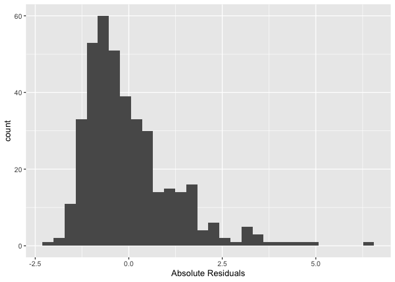
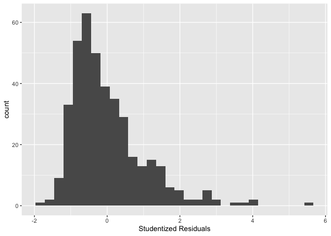
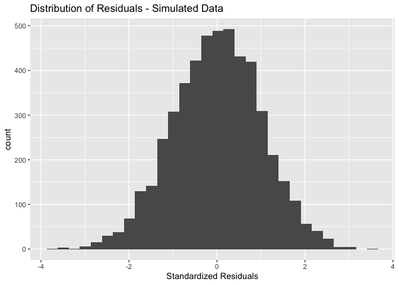
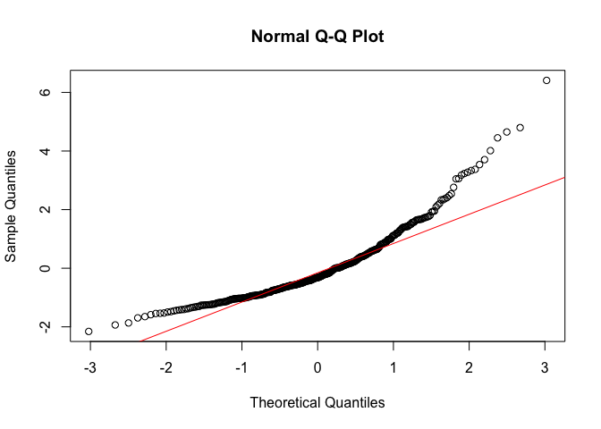
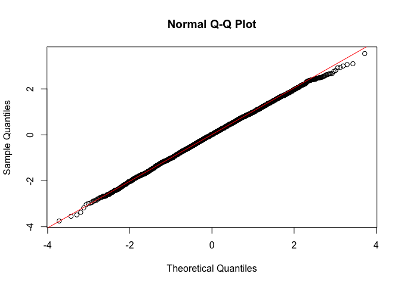
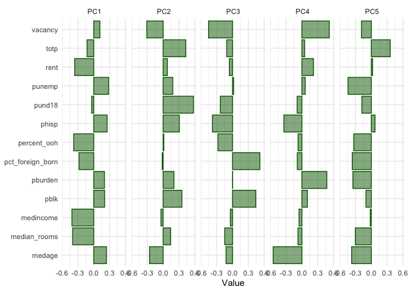

<style>
p.comment {
background-color: #DBDBDB;
padding: 10px;
border: 1px solid black;
margin-left: 25px;
border-radius: 5px;
font-style: normal;
}

.figure {
   margin-top: 20px;
   margin-bottom: 20px;
}

h1.title {
  font-weight: bold;
  font-family: Arial;  
}

h2.title {
  font-family: Arial;  
}

</style>


<style type="text/css">
#TOC {
  font-size: 13px;
  font-family: Arial;
}
</style>


\


We're in the second leg of our journey into linear regression. In [last lab](https://geo200cn.github.io/linearregression.html), we learned about simple and multiple linear regression and model fit.  In this lab, we go through the R functions for running regression diagnostics. We also cover other aspects of linear regression modelling. The objectives of this lab are as follows

1. Learn how to run diagnostic tools to evaluate Ordinary Least Squares (OLS) regression assumptions
2. Learn how to include interactions terms 
3. Learn how to detect and deal with multicollinearity


To help us accomplish these learning objectives, we will continue examining the association between neighborhood characteristics and housing eviction rates in the Sacramento metropolitan area. We'll be closely following the material presented in Handout 4.


<div style="margin-bottom:25px;">
</div>
## **Loading packages**
\

We don't need to install any new packages for this lab. Load the packages we need.


``` r
library(MASS)
library(tidyverse)
```


<div style="margin-bottom:25px;">
</div>
## **Bringing in the data**
\

We'll be using the same Sacramento eviction data from last lab. Download the csv file *sac_metro_eviction.csv* located on Canvas in the Week 4 Lab and Assignments folder.  Read in the csv file using the `read_csv()` function.


``` r
sac_metro <- read_csv("sac_metro_eviction.csv")
```

2017 eviction rate case data were downloaded from the [Eviction Lab website](https://evictionlab.org/).  Socioeconomic and demographic data were downloaded from the 2013-2017 [American Community Survey](https://www.census.gov/programs-surveys/acs). A record layout of the data can be found [here](https://raw.githubusercontent.com/geo200cn/data/master/sacmetroeviction.txt).  Our research question in this lab is: What ecological characteristics are associated with neighborhood eviction rates in the Sacramento metropolitan area?


<div style="margin-bottom:25px;">
</div>
## **Checking OLS assumptions**
\

The linear regression handout outlines the core assumptions that need to be met in order to obtain unbiased regression estimates from an OLS model.  The handout also goes through several diagnostic tools for examining whether an OLS model breaks these assumptions. In this section, we will go through how to run most of these diagnostics in R. 

Let's also create a fake dataset that meets the OLS assumptions to act as a point of comparison along the way. We'll call this the *goodreg* model.


``` r
#sets a seed so the following is reproducible
set.seed(08544)
x <-rnorm(5000, mean = 7, sd = 1.56)# just some normally distributed data

## We're establishing here a linear relationship,
## What's this "true" linear relationship we're setting up?
## So that y = 12 - .4x + some normally distributed error values
y <- 12 - 0.4*x +rnorm(5000, mean = 0, sd = 1)

goodreg <- lm(y ~ x)
summary(goodreg)
```

```
## 
## Call:
## lm(formula = y ~ x)
## 
## Residuals:
##     Min      1Q  Median      3Q     Max 
## -3.7188 -0.6658  0.0158  0.6944  3.5102 
## 
## Coefficients:
##              Estimate Std. Error t value Pr(>|t|)    
## (Intercept) 12.033221   0.064450  186.71   <2e-16 ***
## x           -0.402152   0.008986  -44.75   <2e-16 ***
## ---
## Signif. codes:  0 '***' 0.001 '**' 0.01 '*' 0.05 '.' 0.1 ' ' 1
## 
## Residual standard error: 0.9932 on 4998 degrees of freedom
## Multiple R-squared:  0.2861,	Adjusted R-squared:  0.2859 
## F-statistic:  2003 on 1 and 4998 DF,  p-value: < 2.2e-16
```

To be clear, we know the exact functional form of this model, all OLS assumptions should be met, and therefore this model should pass all diagnostics.

In the last lab guide, we ran a simple regression model using ordinary least squares (OLS) to estimate the relationship between eviction rates per 100 renting households and percent unemployed at the neighborhood level. Let's run this model using `lm()` and save its results in an object named *lm1*. Our dependent variable is *evict* and the independent variable is *punemp*.


``` r
#eliminate scientific notation
options(scipen=999)

lm1 <- lm(evict ~ punemp, 
          data = sac_metro)

#results
summary(lm1)
```

```
## 
## Call:
## lm(formula = evict ~ punemp, data = sac_metro)
## 
## Residuals:
##     Min      1Q  Median      3Q     Max 
## -2.1572 -0.8287 -0.3145  0.5179  6.4098 
## 
## Coefficients:
##             Estimate Std. Error t value           Pr(>|t|)    
## (Intercept)  0.95715    0.12183   7.856 0.0000000000000375 ***
## punemp       0.09143    0.01462   6.254 0.0000000010381178 ***
## ---
## Signif. codes:  0 '***' 0.001 '**' 0.01 '*' 0.05 '.' 0.1 ' ' 1
## 
## Residual standard error: 1.2 on 397 degrees of freedom
## Multiple R-squared:  0.08967,	Adjusted R-squared:  0.08738 
## F-statistic: 39.11 on 1 and 397 DF,  p-value: 0.000000001038
```


<div style="margin-bottom:25px;">
</div>
### **Normally distributed errors**
\

We can rely on several tools for testing the errors are normally distributed assumption.   The first is a histogram of residuals.   We can extract the residuals from an *lm* object using the function `resid()`. We will need to use the residuals for other diagnostics, so let's save them into the *sac_metro*  data frame under the variable *resid* using the `mutate()` function.


``` r
sac_metro <- sac_metro %>%
            mutate(resid = resid(lm1))
```

The order of the tracts in`resid(lm1)` is the same as the order of the tracts in *sac_metro* and that's why we were able to directly column bind it like we did in the above code.

Now, we create a histogram of residuals using our best bud `ggplot()` which we met in [Week 2](https://geo200cn.github.io/eda.html#Data_visualization).


``` r
sac_metro %>%
  ggplot() + 
  geom_histogram(mapping = (aes(x=resid))) + 
  xlab("Absolute Residuals")
```

<!-- -->


We're trying to see if its shape is that of a normal distribution (bell curve). This is a histogram of absolute residuals. To get a histogram of standardized residuals use the function `stdres()`, where the main argument is our model results *lm1*


``` r
sac_metro %>%
  ggplot() + 
  geom_histogram((aes(x=stdres(lm1)))) + 
  xlab("Standardized Residuals")
```

<!-- -->

You can also plot a histogram of the studentized residuals using the function `rstudent()`


``` r
sac_metro %>% ggplot() + 
  geom_histogram((aes(x=rstudent(lm1)))) + 
  xlab("Studentized Residuals")
```

<!-- -->

For comparison, the following is what the residuals from our simulated good data look like 


``` r
ggplot() + geom_histogram(aes(x = stdres(goodreg))) +
  xlab("Standardized Residuals") +
  ggtitle("Distribution of Residuals - Simulated Data")
```

<!-- -->


You can also examine a normal probability plot, also known as a Q-Q plot, to check error normality. Use the function `qqnorm()` and just plug in the model residuals. The function `qqline()` adds the line for what normally distributed data should theoretically follow.


``` r
qqnorm(sac_metro$resid)
qqline(sac_metro$resid,col="red")
```

<!-- -->

In short, if the points of the plot do not closely follow a straight line, this would suggest that the data do not come from a normal distribution.  What does the Q-Q plot look like for our good model?


``` r
qqnorm(stdres(goodreg))
qqline(stdres(goodreg),col="red")
```

<!-- -->

<br>

<p class="comment">**Question 1**: What do you conclude by visually examining the histogram and Q-Q plot of the *lm1* residuals?</p>

<br>

Histograms and Q-Q plots give a nice visual presentation of the residual distribution, however if we are interested in formal hypothesis testing, there are a number of options available. A commonly used test is the Shapiro–Wilk test, which is implemented in R using the function `shapiro.test()`. The null is that the data are normally distributed.  Our good model *goodreg* should not reject the null


``` r
shapiro.test(resid(goodreg))
```

```
## 
## 	Shapiro-Wilk normality test
## 
## data:  resid(goodreg)
## W = 0.9994, p-value = 0.1026
```

What about our simple linear regression model?


``` r
shapiro.test(resid(lm1))
```

```
## 
## 	Shapiro-Wilk normality test
## 
## data:  resid(lm1)
## W = 0.88656, p-value < 0.00000000000000022
```

What's the conclusion?

<div style="margin-bottom:25px;">
</div>
### **Residual scatterplots**
\

You can use a plot of the residuals against the fitted values for checking both the linearity and homoscedasticity assumptions.  We should look for three things in this plot.

* At any fitted value, the mean of the residuals should be roughly 0. If this is the case, the linearity assumption is valid. For this reason, we generally add a horizontal line in the plot at y = 0 to emphasize this point.
* At every fitted value, the spread of the residuals should be roughly the same. If this is the case, the homoscedasticity (equal variance) assumption is valid.
* There should be no pattern in the residuals.

We know what diagnostic plots should look like when we have good data. But what about for bad data? Below is an example of some bad data that breaks the linearity assumption. Don't worry too much about the intricacies of the code below - we're creating simulated data that is deliberately not normal so you can see what nonlinearity looks like in the context of the diagnostic tools we've been running.


``` r
#set a random seed so reproducible
set.seed(42)
sim_3 = function(sample_size = 500) {
  x = runif(n = sample_size) * 5
  y = 3 + 5 * x ^ 2 + rnorm(n = sample_size, mean = 0, sd = 5)
  data.frame(x, y)
}

sim_data_3 = sim_3()
badreg = lm(y ~ x, 
            data = sim_data_3)
```

Here is the residual vs fitted values plot for *badreg*. What do you see that let's you know this model breaks OLS assumptions?


``` r
plot(fitted(badreg), resid(badreg), col = "grey", pch = 20,
     xlab = "Fitted", ylab = "Residuals", main = "Data from Bad Model")
abline(h = 0, col = "darkorange", lwd = 2)
```

<!-- -->

<br>

<p class="comment">**Question 2**: Create a residual against fitted value plot as described by Handout 4 for the *lm1* model.  Do the same for the *goodreg* model. What do you conclude from these plots?</p>

<br>


<div style="margin-bottom:25px;">
</div>
## **Controlling for variables**
\

The most common reason why your model is breaking OLS assumptions is because you've failed to include a variable that is confounding the relationship between your primary independent variable(s) and the outcome.  Here, we are interested in examining the impact of a variable X on the outcome Y controlling for the impact of another variable Z.  In other words, we don't really care about the effect of Z, but simply want to control for it so we can get an unbiased estimate of the effect of X.  In this case, Z is a confounding variable.  Let's try to make clear what we mean by confounding.  Here are three ways to define a confounding variable, all saying the same thing, but in different ways. 

* Confounding variables or confounders are often defined as variables that correlate (positively or negatively) with both the dependent variable and the independent variable

* A confounder is an extraneous variable whose presence affects the variables being studied so that the results do not reflect the actual relationship between the variables under study.

*  A third variable, not the dependent (outcome) or main independent (exposure) variable of interest, that distorts the observed relationship between the exposure and outcome. 

Confounding can have serious consequences for your results. Going back to our case study of Sacramento let's say we ran a simple linear regression of eviction rates on the median age of housing units in the neighborhood.


``` r
summary(lm(evict ~  medage, 
           data = sac_metro))
```

```
## 
## Call:
## lm(formula = evict ~ medage, data = sac_metro)
## 
## Residuals:
##     Min      1Q  Median      3Q     Max 
## -1.8200 -0.8991 -0.2816  0.5505  6.3894 
## 
## Coefficients:
##             Estimate Std. Error t value      Pr(>|t|)    
## (Intercept)  1.16320    0.18663   6.233 0.00000000117 ***
## medage       0.01104    0.00425   2.597       0.00975 ** 
## ---
## Signif. codes:  0 '***' 0.001 '**' 0.01 '*' 0.05 '.' 0.1 ' ' 1
## 
## Residual standard error: 1.247 on 397 degrees of freedom
## Multiple R-squared:  0.01671,	Adjusted R-squared:  0.01423 
## F-statistic: 6.745 on 1 and 397 DF,  p-value: 0.009753
```

We would conclude that a one year increase in the median age of housing units is associated with an increase of 0.01104 eviction cases per 100 renting households. The results also show that the coefficient has a p-value of 0.00975, which indicates that the *medage* coefficient is statistically significant at the 0.01 level. This means that the probability that the association between *medage* and *evict* is due to chance is 100*0.00975 = 0.975 percent.  In other words, the probability of seeing the association 0.01104 just by chance if the null hypothesis is true is a little less than one percent.

But, when you include median gross rent, you get


``` r
summary(lm(evict ~ medage + rent, 
           data = sac_metro))
```

```
## 
## Call:
## lm(formula = evict ~ medage + rent, data = sac_metro)
## 
## Residuals:
##     Min      1Q  Median      3Q     Max 
## -1.8670 -0.8370 -0.2701  0.5416  6.3404 
## 
## Coefficients:
##               Estimate Std. Error t value       Pr(>|t|)    
## (Intercept)  2.6975817  0.4226376   6.383 0.000000000487 ***
## medage       0.0008342  0.0048798   0.171          0.864    
## rent        -0.0009009  0.0002236  -4.028 0.000067339161 ***
## ---
## Signif. codes:  0 '***' 0.001 '**' 0.01 '*' 0.05 '.' 0.1 ' ' 1
## 
## Residual standard error: 1.224 on 396 degrees of freedom
## Multiple R-squared:  0.05541,	Adjusted R-squared:  0.05064 
## F-statistic: 11.62 on 2 and 396 DF,  p-value: 0.00001253
```


<br>

<p class="comment">**Question 3**: In your own words, explain why the statistically significant relationship between median age of housing units and eviction rates disappeared when we included median rent.</p>

<br>


This example illustrates the importance of accounting for potential confounding in your model.  This includes confounding introduced by spatial dependency or autocorrelation, which we will discuss later in the quarter.  

<div style="margin-bottom:25px;">
</div>
## **Interactions**
\

The multiple linear regressions models we've run so far assume that the effects of each of the independent variables are additive. However, as discussed in this week's handout, that may be incorrect. Instead, the impact of a variable on the outcome may depend on the level of another variable (and vice versa). To test this, we include an interaction term in the model.

It is easy to include interaction terms in a linear model using the `lm()` function. Let's interact the variables *medage* and *punemp*. The syntax `medage*punemp` simultaneously includes *medage*, *punemp*, and the interaction term *medage* x *punemp* as predictors.


``` r
summary(lm(evict ~ medage*punemp, 
           data = sac_metro))
```

```
## 
## Call:
## lm(formula = evict ~ medage * punemp, data = sac_metro)
## 
## Residuals:
##     Min      1Q  Median      3Q     Max 
## -2.3396 -0.8315 -0.2920  0.5086  6.4454 
## 
## Coefficients:
##                Estimate Std. Error t value Pr(>|t|)   
## (Intercept)    1.137917   0.376065   3.026  0.00264 **
## medage        -0.002722   0.008179  -0.333  0.73943   
## punemp         0.029268   0.057101   0.513  0.60854   
## medage:punemp  0.001211   0.001153   1.050  0.29437   
## ---
## Signif. codes:  0 '***' 0.001 '**' 0.01 '*' 0.05 '.' 0.1 ' ' 1
## 
## Residual standard error: 1.2 on 395 degrees of freedom
## Multiple R-squared:  0.09493,	Adjusted R-squared:  0.08805 
## F-statistic: 13.81 on 3 and 395 DF,  p-value: 0.00000001396
```

The coefficient estimate for the interaction term is in the row designated by `medage:punemp`. In this case, the coefficient is not statistically significant at conventional levels.

How about including an interaction between the categorical variable *county* and *punemp*?


``` r
lm.int <- lm(evict ~ county*punemp, 
           data = sac_metro)

summary(lm.int)
```

```
## 
## Call:
## lm(formula = evict ~ county * punemp, data = sac_metro)
## 
## Residuals:
##     Min      1Q  Median      3Q     Max 
## -2.2645 -0.7400 -0.1558  0.4142  6.2578 
## 
## Coefficients:
##                         Estimate Std. Error t value       Pr(>|t|)    
## (Intercept)              2.91924    0.43999   6.635 0.000000000109 ***
## countyPlacer            -2.56317    0.58467  -4.384 0.000014998655 ***
## countySacramento        -1.79286    0.45984  -3.899       0.000114 ***
## countyYolo              -2.49384    0.59635  -4.182 0.000035722490 ***
## punemp                  -0.12269    0.05552  -2.210       0.027683 *  
## countyPlacer:punemp      0.12507    0.08821   1.418       0.156995    
## countySacramento:punemp  0.21141    0.05755   3.673       0.000273 ***
## countyYolo:punemp        0.20743    0.07971   2.602       0.009610 ** 
## ---
## Signif. codes:  0 '***' 0.001 '**' 0.01 '*' 0.05 '.' 0.1 ' ' 1
## 
## Residual standard error: 1.116 on 391 degrees of freedom
## Multiple R-squared:  0.2252,	Adjusted R-squared:  0.2114 
## F-statistic: 16.24 on 7 and 391 DF,  p-value: < 0.00000000000000022
```

<br>

<p class="comment">**Question 4**: What is the estimated slope coefficient of *punemp* for Sacramento county? Put another way, what is the association between *punemp* and the eviction rate for neighborhoods in Sacramento county?</p>

<br>

<div style="margin-bottom:25px;">
</div>
## **Multicollinearity**
\

It might seem that if confounding is such a big problem (and it is when trying to make causal inferences)  you should aim to try to control for *everything.*  Including the kitchen sink.  The downside of this strategy is that including too many variables will likely introduce multicollinearity in your model.  Multicollinearity is defined to be high, but not perfect, correlation between two independent variables in a regression.

What are the effects of multicollinearity? Mainly you will get blown up standard errors for the coefficient on one of your correlated variables.  In other words, you will not detect a relationship even if one does exist because the standard error on the coefficient is artificially inflated.

What to do? First, run a correlation matrix for all your proposed independent variables.  Let's say we wanted to run an OLS model including *pblk*, *phisp*, *pund18*, *totp*, *punemp*, *rent*, *vacancy*, *medage*, *pburden*, *medincome*, *median_rooms*, *pct_foreign_born* and *percent_ooh* as independent variables. One way of obtaining a correlation matrix is to use the `cor()` function.  We use the function `select()` to keep the variables we need from *sac_metro*. We use the `round()` function to round up the correlation values to two significant digits after the decimal point.


``` r
round(cor(dplyr::select(sac_metro, pblk, phisp, pund18, punemp, totp, rent, vacancy, medage,
                        pburden, medincome, median_rooms, pct_foreign_born,percent_ooh )),2)
```

```
##                   pblk phisp pund18 punemp  totp  rent vacancy medage pburden
## pblk              1.00  0.29   0.30   0.39  0.06 -0.26   -0.09   0.01    0.25
## phisp             0.29  1.00   0.36   0.34  0.07 -0.38   -0.01   0.26    0.24
## pund18            0.30  0.36   1.00   0.13  0.36  0.15   -0.24  -0.25    0.13
## punemp            0.39  0.34   0.13   1.00 -0.03 -0.45    0.12   0.26    0.32
## totp              0.06  0.07   0.36  -0.03  1.00  0.21   -0.25  -0.35    0.00
## rent             -0.26 -0.38   0.15  -0.45  0.21  1.00   -0.17  -0.52   -0.25
## vacancy          -0.09 -0.01  -0.24   0.12 -0.25 -0.17    1.00   0.17    0.04
## medage            0.01  0.26  -0.25   0.26 -0.35 -0.52    0.17   1.00    0.08
## pburden           0.25  0.24   0.13   0.32  0.00 -0.25    0.04   0.08    1.00
## medincome        -0.43 -0.50   0.05  -0.55  0.20  0.70   -0.20  -0.42   -0.45
## median_rooms     -0.31 -0.35   0.29  -0.41  0.30  0.68   -0.25  -0.40   -0.27
## pct_foreign_born -0.09 -0.44  -0.03  -0.30  0.09  0.38   -0.25  -0.25   -0.24
## percent_ooh      -0.45 -0.36   0.15  -0.41  0.21  0.62   -0.10  -0.30   -0.31
##                  medincome median_rooms pct_foreign_born percent_ooh
## pblk                 -0.43        -0.31            -0.09       -0.45
## phisp                -0.50        -0.35            -0.44       -0.36
## pund18                0.05         0.29            -0.03        0.15
## punemp               -0.55        -0.41            -0.30       -0.41
## totp                  0.20         0.30             0.09        0.21
## rent                  0.70         0.68             0.38        0.62
## vacancy              -0.20        -0.25            -0.25       -0.10
## medage               -0.42        -0.40            -0.25       -0.30
## pburden              -0.45        -0.27            -0.24       -0.31
## medincome             1.00         0.82             0.51        0.73
## median_rooms          0.82         1.00             0.51        0.88
## pct_foreign_born      0.51         0.51             1.00        0.44
## percent_ooh           0.73         0.88             0.44        1.00
```

Any correlation that is high is worth flagging.  In this case, we see a few pairwise correlations that are close to and above 0.5 that should be worth keeping in mind.

You can also run your regression and then detect multicollinearity in your results.  Signs of multicollinearity include

* Large changes in the estimated regression coefficients when a predictor variable is added or deleted
* Lack of statistical significance despite high $R^2$
* Estimated regression coefficients have an opposite sign from predicted

A formal and likely the most common indicator of multicollinearity is the Variance Inflation Factor (VIF). Use the function `vif()` in the **car** package to get the VIFs for each variable.  Let's check the VIFs for the proposed model.  First, run the model and save it into *lm2*. 


``` r
lm2 <- lm(evict ~  pblk + phisp + pund18 + punemp + totp + rent+ vacancy + 
            medage + pburden + medincome + median_rooms + pct_foreign_born + percent_ooh, 
          data = sac_metro)
```

Then get the VIF values using `vif()`. As described in the handout, another measure of multicollinearity - tolerance - can be obtained from the VIF values.

<br>

<p class="comment"> **Question 5**: Assess the presence of multicollinearity using the VIF. </p>

<br>

<div style="margin-bottom:25px;">
</div>
### **Principal components analysis**
\

One approach to resolving problems with multicollinearity is dimension reduction, which transforms the predictors into a series of dimensions that represent the variance in the predictors but are uncorrelated with one another. One of the most popular methods for dimension reduction is Principal Components Analysis (PCA). PCA reduces a higher-dimensional dataset into a lower-dimensional representation based on linear combinations of the variables used. The first principal component is the linear combination of variables that explains the most overall variance in the data; the second principal component explains the second-most overall variance but is also constrained to be uncorrelated with the first component; and so on.

PCA can be computed with the `prcomp()` function, which is a part of the package **stats**, a pre-installed package.


``` r
pca<-prcomp(~pblk + phisp + pund18 + punemp + totp + rent+ vacancy + 
             medage + pburden + medincome + median_rooms + pct_foreign_born + percent_ooh, 
                  center=T, scale=T, data=sac_metro, na.action = na.exclude)
```

The first argument specifies the variables we want to include in the index, starting first with a tilde sign `~` then followed by each variable separated by a `+`. The arguments center=T and scale=T effectively standardize our variables. Always use z-scored variables when doing a PCA - scale is very important, as we want correlations going in, not covariances. And then `data=` specifies the dataset. The argument `na.action = na.exclude` tells the function to exclude the observations with NA values, but retain them as NA when computing the scores (we did not need this here).


``` r
summary(pca)
```

```
## Importance of components:
##                           PC1    PC2     PC3     PC4     PC5     PC6     PC7
## Standard deviation     2.2125 1.4412 1.01658 0.96058 0.89527 0.87183 0.82483
## Proportion of Variance 0.3765 0.1598 0.07949 0.07098 0.06165 0.05847 0.05233
## Cumulative Proportion  0.3765 0.5363 0.61581 0.68679 0.74844 0.80691 0.85924
##                           PC8     PC9    PC10    PC11    PC12    PC13
## Standard deviation     0.7147 0.64232 0.59521 0.52833 0.45098 0.26384
## Proportion of Variance 0.0393 0.03174 0.02725 0.02147 0.01565 0.00535
## Cumulative Proportion  0.8985 0.93028 0.95753 0.97900 0.99465 1.00000
```

Printing the `summary()` of the PCA model shows 13 components that collectively explain 100% of the variance in the original predictors. The first principal component explains 37.6 percent of the overall variance; the second explains 15.9 percent; and so forth.


To understand what the different principal components now mean, it is helpful to plot the variable loadings. This represents the relationships between the original variables in the model and the derived components. The variable loading matrix (stored in the rotation element of the pca object) is converted to a tibble so we can view it easier.


``` r
pca_tibble <- pca$rotation %>%
  as_tibble(rownames = "predictor")
```

Positive values for a given row mean that the original variable is positively loaded onto a given component, and negative values mean that the variable is negatively loaded. Larger values in each direction are of the most interest to us; values near 0 mean the variable is not meaningfully explained by a given component. To explore this further, we can visualize the first five components with `ggplot()`:


``` r
pca_tibble %>%
  select(predictor:PC5) %>%
  pivot_longer(PC1:PC5, names_to = "component", values_to = "value") %>%
  ggplot(aes(x = value, y = predictor)) + 
  geom_col(fill = "darkgreen", color = "darkgreen", alpha = 0.5) + 
  facet_wrap(~component, nrow = 1) + 
  labs(y = NULL, x = "Value") + 
  theme_minimal()
```

<!-- -->

With respect to PC1, which explains nearly 38 percent of the variance in the overall predictor set, the variables *totp*, *rent*, *pund18*, *percent_ooh*, *pct_foreign_born*, *medincome*, and *median_rooms* load negatively, whereas the rest load positively. We can attach these principal components to our original data with `predict()` and `cbind()`.


``` r
#create separate data object containing just the variables used in the pca
sac_metro_pred <- sac_metro %>%
              dplyr::select(pblk, phisp, pund18, punemp, totp, rent, vacancy, medage, pburden,
                        medincome, median_rooms, pct_foreign_born,percent_ooh)

#calculate component scores for each tract
components <- predict(pca, sac_metro_pred)

#add components to original data set
sac_metro_pca <- sac_metro %>%
                  cbind(components) 
```

<div style="margin-bottom:25px;">
</div>
### **Selecting components**
\

The principal components can be used for principal components regression, in which the derived components themselves are used as model predictors. But how many should you use? As described in the Handout there are multiple approaches for doing this.

<br>

<p class="comment">**Question 6**:  What is the number of components you would use according to the proportion of variance explained criterion? What about the scree plot criterion? Eigenvalue criterion? To create a scree plot, use the function `fviz_eig()`. To find the eigenvalues, use the function `get_eigenvalue()`</p>

<p class="comment">**Question 7**:  Run three principal components regressions using the principal components selected using the three criteria above and the eviction rate as the outcome variable. Summarize the presence of multicollinearity in the models. Which of the three models would you choose and why?</p>

<br>

***

<a rel="license" href="http://creativecommons.org/licenses/by-nc/4.0/"></a><br />This work is licensed under a <a rel="license" href="http://creativecommons.org/licenses/by-nc/4.0/">Creative Commons Attribution-NonCommercial 4.0 International License</a>.


Website created and maintained by [Noli Brazil](https://nbrazil.faculty.ucdavis.edu/)
