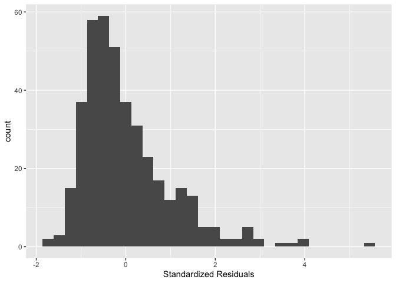
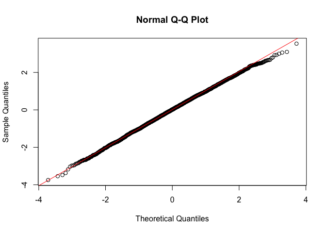

<style>
p.comment {
background-color: #DBDBDB;
padding: 10px;
border: 1px solid black;
margin-left: 25px;
border-radius: 5px;
}

.figure {
   margin-top: 20px;
   margin-bottom: 20px;
}

h1.title {
  font-weight: bold;
  font-family: Arial;  
}

h2.title {
  font-family: Arial;  
}

</style>


<style type="text/css">
#TOC {
  font-size: 13px;
  font-family: Arial;
}
</style>


\


We're in the second leg of our journey into linear regression.  In this lab, we go through the R functions for running regression diagnostics and multiple linear regression. The objectives of this lab are as follows

1. Learn how to run diagnostic tools to test Ordinary Least Squares (OLS) regression assumptions
2. Learn how to run and evaluate a multiple linear regression model
3. Learn how to detect multicollinearity


To help us accomplish these learning objectives, we will continue examining the association between neighborhood characteristics and early COVID-19 case rates in New York City. We'll be closely following this week's handout.


<div style="margin-bottom:25px;">
</div>
## **Installing and loading packages**
\

We'll be using a couple of new packages in this lab.  First, you'll need to install them if you have not already done so.


```r
install.packages(c("GGally", "lmtest", "car"))
```

Load these packages and others we will need for this lab.


```r
library(MASS)
library(tidyverse)
library(GGally)
library(car)
library(gridExtra)
library(lmtest)
library(sf)
```


<div style="margin-bottom:25px;">
</div>
## **Bringing in the data**
\

Download the csv file *zctanyccovid.csv* located on Canvas in the Lab and Assignments Week 6 folder.  Read in the New York City zipcode csv file using the `read_csv()` function.


```r
zctanyc <- read_csv("zctanyccovid.csv")
```

COVID-19 case data were downloaded from the [NYC Department of Health and Mental Hygiene](https://github.com/nychealth/coronavirus-data) (confirmed cases up through May 1, 2020).  Socioeconomic and demographic data were downloaded from the 2014-2018 [American Community Survey](https://www.census.gov/programs-surveys/acs). A record layout of the data can be found [here](https://raw.githubusercontent.com/geo200cn/data/master/zctanyccovidRL.txt).  Our research question in this guide is: What ecological characteristics are associated with zip code COVID-19 case rates in New York City when COVID cases were first being reported in the United States in 2020?

<div style="margin-bottom:25px;">
</div>
## **Checking OLS assumptions**
\

This week's Handout outlines the core assumptions that need to be met in order to obtain unbiased regression estimates from an OLS model.  The handout also goes through several diagnostic tools for examining whether an OLS model breaks these assumptions. In this section, we will go through how to run these diagnostics in R. 

Let's also create a fake dataset that meets the OLS assumptions to act as a point of comparison along the way. We'll call this the *goodreg* model.


```r
set.seed(08544)
x <-rnorm(5000, mean = 7, sd = 1.56)# just some normally distributed data

## We're establishing here a linear relationship,
## What's this "true" linear relationship we're setting up?
## So that y = 12 - .4x + some normally distributed error values
y <- 12 - 0.4*x +rnorm(5000, mean = 0, sd = 1)

goodreg <- lm(y ~ x)
summary(goodreg)
```

```
## 
## Call:
## lm(formula = y ~ x)
## 
## Residuals:
##     Min      1Q  Median      3Q     Max 
## -3.7188 -0.6658  0.0158  0.6944  3.5102 
## 
## Coefficients:
##              Estimate Std. Error t value Pr(>|t|)    
## (Intercept) 12.033221   0.064450  186.71   <2e-16 ***
## x           -0.402152   0.008986  -44.75   <2e-16 ***
## ---
## Signif. codes:  0 '***' 0.001 '**' 0.01 '*' 0.05 '.' 0.1 ' ' 1
## 
## Residual standard error: 0.9932 on 4998 degrees of freedom
## Multiple R-squared:  0.2861,	Adjusted R-squared:  0.2859 
## F-statistic:  2003 on 1 and 4998 DF,  p-value: < 2.2e-16
```

To be clear, we know the exact functional form of this model, all OLS assumptions should be met, and therefore this model should pass all diagnostics.

In the last lab guide, we ran a simple regression model using ordinary least squares (OLS) to estimate the relationship between COVID-19 cases per 1,000 residents and percent black at the zip code level. Let's run this model using `lm()` and save its results in an object named *lm1*. Our dependent variable is *covidrate* and the independent variable is *pblk*.


```r
#eliminate scientific notation
options(scipen=999)

lm1 <- lm(covidrate ~ pblk, data = zctanyc)
```


<div style="margin-bottom:25px;">
</div>
### **Normally distributed errors**
\

We can rely on several tools for testing the errors are normally distributed assumption.   The first is a histogram of residuals.   We can extract the residuals from an *lm* object using the function `resid()`. We will need to use the residuals for other diagnostics, so let's save them into the *zctanyc*  data frame under the variable *resid* using the `mutate()` function.


```r
zctanyc <- zctanyc %>%
            mutate(resid = resid(lm1))
```

The order of the tracts in`resid(lm1)` is the same as the order of the tracts in *zctanyc* and that's why we were able to directly column bind it like we did in the above code rather than doing a `left_join()`.

Now, we create a histogram of residuals using our best bud `ggplot()`


```r
zctanyc %>%
  ggplot() + 
  geom_histogram(mapping = (aes(x=resid))) + 
  xlab("Absolute Residuals")
```

<!-- -->


We're trying to see if its shape is that of a normal distribution (bell curve). This is a histogram of absolute residuals. To get a histogram of standardized residuals use the function `stdres()`, where the main argument is our model results *lm1*


```r
zctanyc %>%
  ggplot() + 
  geom_histogram((aes(x=stdres(lm1)))) + 
  xlab("Standardized Residuals")
```

<!-- -->

You can also plot a histogram of the studentized residuals using the function `rstudent()`


```r
zctanyc %>% ggplot() + 
  geom_histogram((aes(x=rstudent(lm1)))) + 
  xlab("Studentized Residuals")
```

<!-- -->

For comparison, the following is what the residuals from our simulated good data look like 


```r
ggplot() + geom_histogram(aes(x = stdres(goodreg))) +
  xlab("Standardized Residuals") +
  ggtitle("Distribution of Residuals - Simulated Data")
```

<!-- -->


You can also examine a normal probability plot, also known as a Q-Q plot, to check error normality. Use the function `qqnorm()` and just plug in the model residuals. The function `qqline()` adds the line for what normally distributed data should theoretically follow.


```r
qqnorm(zctanyc$resid)
qqline(zctanyc$resid,col="red")
```

<!-- -->

In short, if the points of the plot do not closely follow a straight line, this would suggest that the data do not come from a normal distribution.  What does the Q-Q plot look like for our good model?


```r
qqnorm(stdres(goodreg))
qqline(stdres(goodreg),col="red")
```

<!-- -->

<br>

<p class="comment">**Question 1**: What do you conclude by visually examining the histogram and Q-Q plot of the *lm1* residuals?</p>

<br>

Histograms and Q-Q plots give a nice visual presentation of the residual distribution, however if we are interested in formal hypothesis testing, there are a number of options available. A commonly used test is the Shapiro–Wilk test, which is implemented in R using the function `shapiro.test()`. The null is that the data are normally distributed.  Our good model *goodreg* should not reject the null


```r
shapiro.test(resid(goodreg))
```

```
## 
## 	Shapiro-Wilk normality test
## 
## data:  resid(goodreg)
## W = 0.9994, p-value = 0.1026
```

What about our simple linear regression model?


```r
shapiro.test(resid(lm1))
```

```
## 
## 	Shapiro-Wilk normality test
## 
## data:  resid(lm1)
## W = 0.97764, p-value = 0.006004
```

What's the conclusion?

<div style="margin-bottom:25px;">
</div>
### **Residual scatterplots**
\

You can use a plot of the residuals against the fitted values for checking both the linearity and homoscedasticity assumptions.  We should look for two things in this plot.

* At any fitted value, the mean of the residuals should be roughly 0. If this is the case, the linearity assumption is valid. For this reason, we generally add a horizontal line in the plot at y = 0 to emphasize this point.
* At every fitted value, the spread of the residuals should be roughly the same. If this is the case, the homoscedasticity (equal variance) assumption is valid.


<br>

<p class="comment">**Question 2**: Create a residual against fitted value plot as described by the Handout for the *lm1* model.  Do the same for the *goodreg* model. What do you conclude from these plots?</p>

<br>


We know what diagnostic plots should like when we have good data. But what about for bad data? Below is an example of some bad data that breaks the linearity assumption. Don't worry too much about the intricacies of the code - were just trying creating simulated data that is deliberately not normal so you can see what nonlinearity looks like in the context of the diagnostic tools we've been running.


```r
set.seed(42)
sim_3 = function(sample_size = 500) {
  x = runif(n = sample_size) * 5
  y = 3 + 5 * x ^ 2 + rnorm(n = sample_size, mean = 0, sd = 5)
  data.frame(x, y)
}

sim_data_3 = sim_3()
badreg = lm(y ~ x, data = sim_data_3)
```

Here is the residual vs fitted values plot for *badreg*


```r
plot(fitted(badreg), resid(badreg), col = "grey", pch = 20,
     xlab = "Fitted", ylab = "Residuals", main = "Data from Bad Model")
abline(h = 0, col = "darkorange", lwd = 2)
```

<!-- -->


<div style="margin-bottom:25px;">
</div>
## **Multiple linear regression**
\

A simple linear regression is, well, too simple.  You'll want to add more variables in your model to

1. Obtain more precise predictions
2. Examine the relationship between the response and more than one variable
3. Control for variables that are confounding the relationship between *X* and *Y*. 

Reason (3) is particularly important for avoiding violations of the OLS assumptions.  Let's go through this reason first to help motivate why to include more than one variable in the model.


<div style="margin-bottom:25px;">
</div>
### **Controlling for variables**
\

The most common reason why your model is breaking OLS assumptions is because you've failed to include a variable that is confounding the relationship between your primary independent variable(s) and the outcome.  Here, we are interested in examining the impact of a variable X on the outcome Y controlling for the impact of another variable Z.  In other words, we don't really care about the effect of Z, but simply want to control for it so we can get an unbiased estimate of the effect of X.  In this case, Z is a confounding variable.  Let's try to make clear what we mean by confounding.  Here are three ways to define a confounding variable, all saying the same thing, but in different ways. 

* Confounding variables or confounders are often defined as variables that correlate (positively or negatively) with both the dependent variable and the independent variable

* A confounder is an extraneous variable whose presence affects the variables being studied so that the results do not reflect the actual relationship between the variables under study.

*  A third variable, not the dependent (outcome) or main independent(exposure) variable of interest, that distorts the observed relationship between the exposure and outcome. 

Confounding can have serious consequences on your results.  For example, consider the COVID-19 case rate in Florida, which is much higher than in Michigan. Before concluding that Florida is a riskier place to live, one needs to consider confounding factors such as age. Florida has a higher proportion of people of retirement age and older than does Michigan, and older people are at higher risk of getting COVID-19. Therefore, one must "adjust" or control for age before drawing any conclusions about the influence of some other variable on COVID-19 case rates.

Going back to our case study of New York City let's say we ran a simple linear regression of COVID-19 rates on percent unemployment


```r
summary(lm(covidrate ~  punemp, data = zctanyc))
```

```
## 
## Call:
## lm(formula = covidrate ~ punemp, data = zctanyc)
## 
## Residuals:
##     Min      1Q  Median      3Q     Max 
## -11.970  -5.625  -0.926   4.463  17.840 
## 
## Coefficients:
##             Estimate Std. Error t value             Pr(>|t|)    
## (Intercept)  12.8605     1.2641  10.174 < 0.0000000000000002 ***
## punemp        0.8267     0.2078   3.978             0.000101 ***
## ---
## Signif. codes:  0 '***' 0.001 '**' 0.01 '*' 0.05 '.' 0.1 ' ' 1
## 
## Residual standard error: 6.571 on 175 degrees of freedom
## Multiple R-squared:  0.08294,	Adjusted R-squared:  0.0777 
## F-statistic: 15.83 on 1 and 175 DF,  p-value: 0.0001015
```

We would conclude that a one percentage point increase in percent unemployment in a neighborhood is associated with an increase of 0.8267 COVID-19 cases per 1,000 residents. The results also show that the coefficient has a p-value of 0.000101, which indicates that the *punemp* coefficient is statistically significant at the 0.001 level. This means that the probability that the association between *punemp* and *covidrate* is due to chance is less than 100*0.001 = 0.1 percent.  In other words, the probability of seeing the association 0.8267 just by chance if the null hypothesis is true is 0.1 percent.

But, when you include percent black, you get


```r
summary(lm(covidrate ~  pblk + punemp, data = zctanyc))
```

```
## 
## Call:
## lm(formula = covidrate ~ pblk + punemp, data = zctanyc)
## 
## Residuals:
##      Min       1Q   Median       3Q      Max 
## -11.5354  -5.0580  -0.7489   4.3570  17.7511 
## 
## Coefficients:
##             Estimate Std. Error t value            Pr(>|t|)    
## (Intercept) 13.69444    1.26782  10.802 <0.0000000000000002 ***
## pblk         0.07294    0.02448   2.980              0.0033 ** 
## punemp       0.42024    0.24478   1.717              0.0878 .  
## ---
## Signif. codes:  0 '***' 0.001 '**' 0.01 '*' 0.05 '.' 0.1 ' ' 1
## 
## Residual standard error: 6.428 on 174 degrees of freedom
## Multiple R-squared:  0.1275,	Adjusted R-squared:  0.1174 
## F-statistic: 12.71 on 2 and 174 DF,  p-value: 0.000007044
```

And just like that, [gone](https://www.imdb.com/title/tt2267998/). 

<br>

<p class="comment">**Question 3**:  Write the equation of the regression line for the model above. What is the interpretation of the slope coefficient for *pblk*?  What about the slope coefficient for the intercept?</p>

<p class="comment">**Question 4**: In your own words, explain why the statistically significant relationship between percent unemployment and COVID-19 rates disappeared when we included percent black.</p>

<br>


This example illustrates the importance of accounting for potential confounding in your model.  This includes confounding introduced by spatial dependency or autocorrelation, which we will discuss later in the quarter.  


<div style="margin-bottom:25px;">
</div>
## **Multicollinearity**
\

It might seem that if confounding is such a big problem (and it is when trying to make causal inferences)  you should aim to try to control for *everything.*  Including the kitchen sink.  The downside of this strategy is that including too many variables will likely introduce multicollinearity in your model.  Multicollinearity is defined to be high, but not perfect, correlation between two independent variables in a regression.

What are the effects of multicollinearity? Mainly you will get blown up standard errors for the coefficient on one of your correlated variables.  In other words, you will not detect a relationship even if one does exist because the standard error on the coefficient is artificially inflated.

What to do? First, run a correlation matrix for all your proposed independent variables.  Let's say we wanted to run a OLS model including *pblk*, *phisp*, *medincome*, *totp*, and *p65old* as independent variables. One way of obtaining a correlation matrix is to use the `cor()` function.  We use the function `select()` to keep the variables we need from *zctanyc*. We use the `round()` function to round up the correlation values to two significant digits after the decimal point.


```r
round(cor(dplyr::select(zctanyc, pblk, phisp, medincome, totp, p65old)),2)
```

```
##            pblk phisp medincome  totp p65old
## pblk       1.00 -0.01     -0.36  0.17  -0.13
## phisp     -0.01  1.00     -0.57  0.28  -0.33
## medincome -0.36 -0.57      1.00 -0.47   0.01
## totp       0.17  0.28     -0.47  1.00  -0.08
## p65old    -0.13 -0.33      0.01 -0.08   1.00
```

Any correlation that is high is worth flagging.  In this case, we see a few pairwise correlations greater than 0.5 that might be worth keeping in mind.

You can also run your regression and then detect multicollinearity in your results.  Signs of multicollinearity include

* Large changes in the estimated regression coefficients when a predictor variable is added or deleted
* Lack of statistical significance despite high $R^2$
* Estimated regression coefficients have an opposite sign from predicted

A formal and likely the most common indicator of multicollinearity is the Variance Inflation Factor (VIF). Use the function `vif()` in the **car** package to get the VIFs for each variable.  Let's check the VIFs for the proposed model.  First, run the model and save it into *lm2*. 


```r
lm2 <- lm(covidrate ~  pblk + phisp +  medincome +totp + p65old, data = zctanyc)
```

Then get the VIF values using `vif()`. As described in the handout, another measure of multicollinearity - tolerance - can be obtained from the VIF values.

<br>

<p class="comment"> **Question 5**: Assess the presence of multicollinearity using the VIF. </p>

<br>


<div style="margin-bottom:25px;">
</div>
## **Goodness of fit**
\

We can measure the overall fit of the model by looking at the multiple $R^2$. The multiple $R^2$ is the square of the correlation between the observed values of
Y and the values of Y predicted by the multiple regression model. Therefore, large values of multiple $R^2$ represent a large correlation between the predicted and observed values of the outcome. A multiple $R^2$ of 1 represents a situation in which the model perfectly predicts the observed data. As such, multiple $R^2$ is a gauge of how well the model predicts the observed data. It follows that the resulting $R^2$ can be interpreted in the same way as in simple regression: it is the amount of variation in the outcome variable that is accounted for by the model.

$R^2$ is located in the summary of the regression model. Let's run a regression of COVID rates on percent black and percent unemployment and save the results in an object called *lm3*.


```r
lm3 <- lm(covidrate ~  pblk + punemp, data = zctanyc)
summary(lm3)          
```

```
## 
## Call:
## lm(formula = covidrate ~ pblk + punemp, data = zctanyc)
## 
## Residuals:
##      Min       1Q   Median       3Q      Max 
## -11.5354  -5.0580  -0.7489   4.3570  17.7511 
## 
## Coefficients:
##             Estimate Std. Error t value            Pr(>|t|)    
## (Intercept) 13.69444    1.26782  10.802 <0.0000000000000002 ***
## pblk         0.07294    0.02448   2.980              0.0033 ** 
## punemp       0.42024    0.24478   1.717              0.0878 .  
## ---
## Signif. codes:  0 '***' 0.001 '**' 0.01 '*' 0.05 '.' 0.1 ' ' 1
## 
## Residual standard error: 6.428 on 174 degrees of freedom
## Multiple R-squared:  0.1275,	Adjusted R-squared:  0.1174 
## F-statistic: 12.71 on 2 and 174 DF,  p-value: 0.000007044
```


Let's compare the model fit to the model we ran earlier that contained more variables 


```r
summary(lm2) 
```

```
## 
## Call:
## lm(formula = covidrate ~ pblk + phisp + medincome + totp + p65old, 
##     data = zctanyc)
## 
## Residuals:
##      Min       1Q   Median       3Q      Max 
## -10.5625  -4.2955  -0.8762   3.7455  15.4670 
## 
## Coefficients:
##                Estimate  Std. Error t value  Pr(>|t|)    
## (Intercept) 12.57451167  3.21496495   3.911  0.000132 ***
## pblk         0.09056056  0.02013347   4.498 0.0000126 ***
## phisp        0.12825817  0.03007490   4.265 0.0000331 ***
## medincome   -0.00004588  0.00001737  -2.642  0.009012 ** 
## totp        -0.00004357  0.00001757  -2.480  0.014097 *  
## p65old       0.36634418  0.09276337   3.949  0.000114 ***
## ---
## Signif. codes:  0 '***' 0.001 '**' 0.01 '*' 0.05 '.' 0.1 ' ' 1
## 
## Residual standard error: 5.48 on 171 degrees of freedom
## Multiple R-squared:  0.3767,	Adjusted R-squared:  0.3585 
## F-statistic: 20.67 on 5 and 171 DF,  p-value: 0.0000000000000004017
```

<br>

<p class="comment">**Question 6**:  Which model yields a better fit, lm3 or lm2? Explain why. </p>

<p class="comment">**Question 7**:  For the model you picked in Question 6, run diagnostics to determine whether it meets the OLS assumptions of normally distributed errors, homoscedasticity, and linearity. Summarize the results.</p>

<br>


You're done! [Woohoo!](https://www.youtube.com/watch?v=-kFUSgR7ujI)


***

<a rel="license" href="http://creativecommons.org/licenses/by-nc/4.0/"></a><br />This work is licensed under a <a rel="license" href="http://creativecommons.org/licenses/by-nc/4.0/">Creative Commons Attribution-NonCommercial 4.0 International License</a>.


Website created and maintained by [Noli Brazil](https://nbrazil.faculty.ucdavis.edu/)
