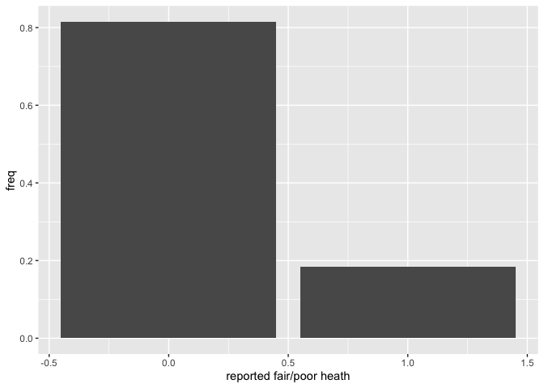
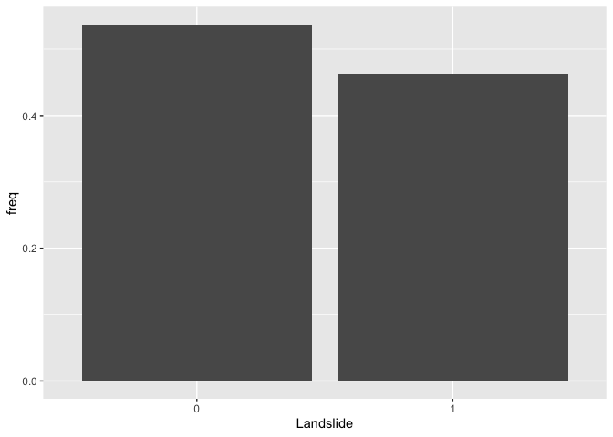

<style>
p.comment {
background-color: #DBDBDB;
padding: 10px;
border: 1px solid black;
margin-left: 25px;
border-radius: 5px;
font-style: normal;
}

.figure {
   margin-top: 20px;
   margin-bottom: 20px;
}

h1.title {
  font-weight: bold;
  font-family: Arial;  
}

h2.title {
  font-family: Arial;  
}

</style>


<style type="text/css">
#TOC {
  font-size: 13px;
  font-family: Arial;
}
</style>


\


In the past couple of labs we've learned how to run and interpret linear regression models. Linear regression models are used when your outcome is a continuous numeric variable. But what if you're outcome is categorical? Specifically, it has two classes, Yes or No. In this case, we use the logistic regression model. The objectives of this lab are as follows

1. Learn how to run and evaluate a logistic regression model
2. Learn how to calculate and evaluate model fit

To help us accomplish these learning objectives, we will examine the association between landslide occurrence and various environmental factors in the [San Pedro Creek Watershed](https://storymaps.arcgis.com/stories/62705877a9f64ac5956a64230430c248) in Pacifica, CA.

<div style="margin-bottom:25px;">
</div>
## **Installing and loading packages**
\

We introduce one new package in today's lab


```r
install.package("lmtest")
```

Load this package along with others we need. 


```r
library(tidyverse)
library(lmtest)
```


<div style="margin-bottom:25px;">
</div>
## **Why logistic regression?**
\


The reasons why you run a logistic regression are the same as the reasons for [running a regular linear regression](https://geo200cn.github.io/linearregression.html#Why_linear_regression).  However, there is one additional important motivation: we want to model the relationship between a set of independent variables and a *binary* outcome.

In many situations in your work as a Geographer, your outcome will be of a qualitative nature. When we speak of qualitative outcomes, we generally are concerned with the observation of:

* A particular classification
    + Invasive species or not; urban or not
* A particular behavior 
    + Migrated or not; fire ignition
* A transition 
    + Riverbank erosion; employed to unemployed;
* A threshold characteristic 
    + Income below poverty level; concentrations exceeding a particular anthropogenic pollution threshold

In general, each of these outcomes would be coded as a binary variable (1 or 0; Yes or No).   You can use a linear regression to model a binary outcome, but you'll typically break the assumption of homoskedastic residuals and you may get predictions outside of 1 or 0. That's why you'll need to turn to logistic regression to model the relationship.


<div style="margin-bottom:25px;">
</div>
## **Bring in the data**
\


Download the file *landslides.csv* from Canvas in the Week 4 Lab and Assignment folder.  Bring in the file in


```r
landslides <- read_csv("landslides.csv")
```

The data contain various locations in the San Pedro Creek Watershed in Pacifica, CA.  The main goal of the analysis is to examine the characteristics that are associated with landslide occurrence. Landslides were detected on aerial photography from 1941, 1955, 1975, 1983, and 1997, and confirmed in the field during a study in the early 2000’s. We’ll create a logistic regression to compare landslide probability to various environmental factors. We’ll use elevation *elev*, slope *slope*, [hillshade](https://earthquake.usgs.gov/education/geologicmaps/hillshades.php) *hillshade*, distance to nearest stream *stD*, distance to nearest trail *trD*, and the results of a physical model predicting slope stability as a [stability index](https://www.mdpi.com/1099-4300/17/6/4271) *SI*.

Our research question is: What environmental characteristics are associated with landslide occurrence? 

We will be diving into spatial data next lab, but that should not stop us from doing some rudimentary mapping. Specifically, we have latitude and longitude points for each location in the dataset, so we can map the data using our good friend `ggplot()`. We'll indicate which area experienced a landslide or not using the variable *IsSlide*. We need to convert it to a factor to "color" it as a categorical.


```r
ggplot(landslides) +
  geom_point(mapping = aes(x = lon,
                           y = lat, col = as.factor(IsSlide))) +
  xlab("Longitude") +
  ylab("Latitude") +
  labs(color = "Landslide")
```

<!-- -->


<div style="margin-bottom:25px;">
</div>
## **Simple Logistic Regression**
\


We first examine the distribution of our binary dependent variable *IsSlide*.  We create a bar chart showing the distribution of the landslide indicator.


```r
landslides %>%
  group_by(IsSlide) %>%
  summarize (n = n()) %>%
  mutate(freq = n / sum(n))  %>%
  ggplot() +
    geom_bar(mapping=aes(x=as.factor(IsSlide), y=freq),stat="identity") +
    xlab("Landslide")
```

<!-- -->


Let's now run a logistic regression model.  We'll start simple, regressing *IsSlide* on *slope*. Instead of using the function `lm()` to run a logistic regression model as we did when running linear regression models, we will use the function `glm()`, which stands for Generalized Linear Models.  `glm()` is similar to `lm()`, but gives us the option of a variety of families to use in fitting the model (the shape that we hypothesize represents the shape of the function *f*  that defines the relationship between Y and X).  

We specify  a family by using the argument `family =`. If we wanted a standard linear regression, which assumes a normal distribution, `family` will equal `gaussian` (fancy word for normal).  For a list of `glm` families, check the help documentation `? glm`. We use `family = binomial` for a logistic regression.  


```r
logit1.fit <- glm(IsSlide ~ slope, 
                  family = binomial, 
                  data = landslides)
```


We can summarize the modelling results using `summary()`.  The resulting output is very similar to the output from `lm()`.


```r
summary(logit1.fit)
```

```
## 
## Call:
## glm(formula = IsSlide ~ slope, family = binomial, data = landslides)
## 
## Coefficients:
##             Estimate Std. Error z value Pr(>|z|)    
## (Intercept) -3.39142    0.37008  -9.164   <2e-16 ***
## slope        0.13471    0.01387   9.715   <2e-16 ***
## ---
## Signif. codes:  0 '***' 0.001 '**' 0.01 '*' 0.05 '.' 0.1 ' ' 1
## 
## (Dispersion parameter for binomial family taken to be 1)
## 
##     Null deviance: 668.29  on 483  degrees of freedom
## Residual deviance: 513.54  on 482  degrees of freedom
## AIC: 517.54
## 
## Number of Fisher Scoring iterations: 5
```

<br>

<p class="comment">**Question 1**: What is the interpretation of the *slope* coefficient?</p>

<br>


Let’s compare our results to those from an OLS regression model.  An OLS for a binary response variable is known as a linear probability model. We use `glm()` again, but this time use the (default) Gaussian distribution.


```r
ols.fit <-glm(IsSlide ~ slope, 
              family = gaussian, 
              data = landslides)
```

and a summary


```r
summary(ols.fit)
```

```
## 
## Call:
## glm(formula = IsSlide ~ slope, family = gaussian, data = landslides)
## 
## Coefficients:
##              Estimate Std. Error t value Pr(>|t|)    
## (Intercept) -0.076552   0.044594  -1.717   0.0867 .  
## slope        0.023734   0.001767  13.429   <2e-16 ***
## ---
## Signif. codes:  0 '***' 0.001 '**' 0.01 '*' 0.05 '.' 0.1 ' ' 1
## 
## (Dispersion parameter for gaussian family taken to be 0.181679)
## 
##     Null deviance: 120.331  on 483  degrees of freedom
## Residual deviance:  87.569  on 482  degrees of freedom
## AIC: 552.06
## 
## Number of Fisher Scoring iterations: 2
```

<br>

<p class="comment">**Question 2**: What is the interpretation of the *slope* coefficient in ols.fit?</p>

<br>


You can create a plot like the one showed in Handout 5 (right hand plot) by predicting the probability of a landslide for given values of *slope*.  The minimum and maximum slope for our data set are 0 and 42.29, respectively, so let's predict landslide occurence for slopes between 0 to 43 using the `predict()` function. The function below tells R to give predicted landslide occurrence for values of *slope* between 0 and 43.


```r
pfit1 <- predict(logit1.fit, 
                 slope = c(0:43))
```

In predicting using a regression model, you can either predict landslides for the 484 observations in the original data set or predict for a new set of observations.  In the code above, we are predicting for a new set of observations - areas with slopes between 0 and 43 - i.e. 0, 1, 2, 3 ... 41, 42, and 43.

Let's get a summary of our predicted values


```r
summary(pfit1)
```

```
##    Min. 1st Qu.  Median    Mean 3rd Qu.    Max. 
## -3.3914 -1.1843  0.0494 -0.3301  0.7812  2.3059
```

We get values ranging from -3.4 to 2.3.  But, these are not probabilities.  Remember, as described in the handout, the response variable is modelled as a logit, so R will give us logits in return.  To convert the logit to a probability, use the argument `type = "response"` inside `predict()`


```r
pfit1 <- predict(logit1.fit, 
                 data.frame(slope = c(0:43)), 
                 type = "response")
summary(pfit1)
```

```
##    Min. 1st Qu.  Median    Mean 3rd Qu.    Max. 
## 0.03256 0.12543 0.37882 0.42496 0.72158 0.91692
```

The predicted probability of a landslide ranges from 3.3% to 91.7%. 

<br>

<p class="comment">**Question 3**: Create a plot similar to the one shown in this week's handout (right hand plot) showing the predicted probabilities from logit1.fit and the observed data. </p>

<p class="comment">**Question 4**: Create a plot similar to the one shown in this week's handout (left hand plot) showing the predicted probabilities from ols.fit and the observed data. </p>

<br>

<div style="margin-bottom:25px;">
</div>
## **Multiple Logistic Regression**
\

We now move to the multiple logistic regression framework by adding more than one independent variable.  Let's add the variable *hillshade*, which is a categorical variable (*High*, *Mid*, and *Low*).


```r
logit2.fit <- glm(IsSlide ~ slope + hillshade, 
                  family = binomial, 
                  data = landslides)
summary(logit2.fit)
```

```
## 
## Call:
## glm(formula = IsSlide ~ slope + hillshade, family = binomial, 
##     data = landslides)
## 
## Coefficients:
##              Estimate Std. Error z value Pr(>|z|)    
## (Intercept)  -3.18010    0.44451  -7.154 8.42e-13 ***
## slope         0.14545    0.01582   9.195  < 2e-16 ***
## hillshadeLow -0.92891    0.30165  -3.079  0.00207 ** 
## hillshadeMid -0.49244    0.27044  -1.821  0.06862 .  
## ---
## Signif. codes:  0 '***' 0.001 '**' 0.01 '*' 0.05 '.' 0.1 ' ' 1
## 
## (Dispersion parameter for binomial family taken to be 1)
## 
##     Null deviance: 668.29  on 483  degrees of freedom
## Residual deviance: 503.68  on 480  degrees of freedom
## AIC: 511.68
## 
## Number of Fisher Scoring iterations: 5
```
  
Let's calculate the predicted probability of a landslide at each value of *hillshade*, holding the slope at its mean.  We need to create a data frame containing the values for *slope* and *hillshade* that we want to predict for.  What are the categories of *hillshade*?


```r
table(landslides$hillshade)
```

```
## 
## High  Low  Mid 
##  121  121  242
```

Let's save these categories in a vector.


```r
hillshade <- c("High", "Mid", "Low")
```

Now you need to create a data frame containing the vector *hillshade* we created above as one column and the overall mean of *slope* as another column (name the column *slope* because it needs to match the variable name used in the prediction model). So you should have a 3 x 2 data frame. Then plug this data frame into the `predict()` function following what we did earlier.

<br>

<p class="comment">**Question 5**: What is the difference in the probability of a landslide between a Low hillshade area and a High hillshade area holding the slope at its mean? </p>

<br>

Handout 5 goes through the various ways we can interpret logistic regression coefficients.  We already went through a few above.  What about the odds ratio interpretation?

<br>

<p class="comment">**Question 6**: Convert the logit2.fit coefficients to interpret them as the change in the odds ratio with a one unit increase in the independent variables. For a one unit increase in slope, the odds of a landslide (versus no landslide) increase by a factor of what amount? </p>

<br>

<div style="margin-bottom:25px;">
</div>
## **Goodness of fit**
\

The Handout goes through measures of best fit for a logistic regression model. Fortunately, some of these measures are reported in the model summary.  Let's run a multiple logistic regression model adding more variables to the model. Below, we've added curvature, elevation, distance to the nearest stream, and distance to the nearest trail.


```r
logit3.fit<- glm(IsSlide ~ slope + hillshade + curv + elev + stD + trD, 
                 family = binomial, 
                 data = landslides)
```

How does this model compare to one that also includes the slope stability index?


```r
logit4.fit<- glm(IsSlide ~ slope + hillshade + curv + elev + stD + trD + SI, 
                 family = binomial, 
                 data = landslides)
```

Executing `summary()` on these results will give us some but not all of the fit measures discussed in the handout. The likelihood ratio test can be run using the function `lrtest()`, which is part of the **lmtest** package.  The function allows you compare the fit between two different models.

<br>

<p class="comment">**Question 7**: What are the null and alternative hypotheses for the Likelihood ratio test? </p>

<p class="comment">**Question 8**: Based on the fit measures discussed in the handout, which model, logit3.fit and logit4.fit, provides the best fit? Explain why.  </p>

<br>


***

<a rel="license" href="http://creativecommons.org/licenses/by-nc/4.0/"></a><br />This work is licensed under a <a rel="license" href="http://creativecommons.org/licenses/by-nc/4.0/">Creative Commons Attribution-NonCommercial 4.0 International License</a>.


Website created and maintained by [Noli Brazil](https://nbrazil.faculty.ucdavis.edu/)
