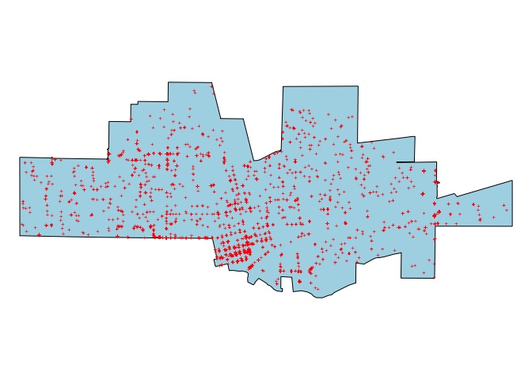
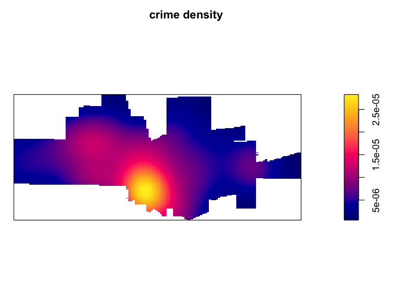
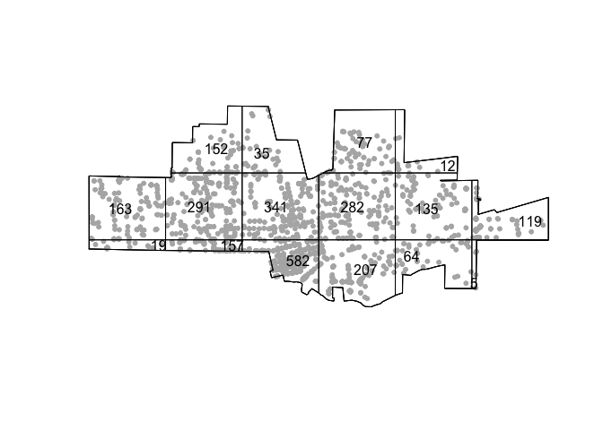
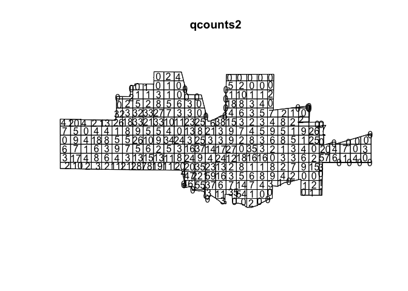
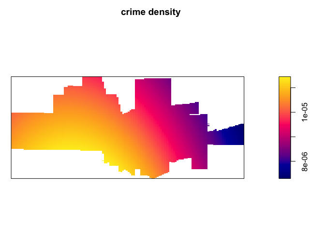
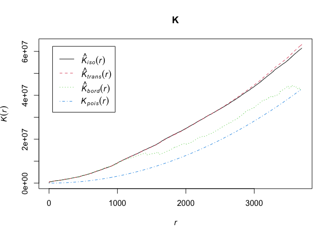

<style>
p.comment {
background-color: #DBDBDB;
padding: 10px;
border: 1px solid black;
margin-left: 25px;
border-radius: 5px;
font-style: italic;
}

.figure {
   margin-top: 20px;
   margin-bottom: 20px;
}

h1.title {
  font-weight: bold;
  font-family: Arial;  
}

h2.title {
  font-family: Arial;  
}

</style>


<style type="text/css">
#TOC {
  font-size: 13px;
  font-family: Arial;
}
</style>


\


The fundamental building blocks of vector or object data are points. As such, we start out journey into spatial data analysis by going through the basic methods for examining point patterns.  This guide follows closely OSU Chapter 4.

<div style="margin-bottom:25px;">
</div>
## **Installing and loading packages**
\

We'll be using a couple of new packages in this lab.  First, you'll need to install them.  The code checks if you've already installed these packages before.  If you haven't, it will install them.


```r
if (!require("rspatial")) devtools::install_github('rspatial/rspatial')
if (!require("spatstat")) install.packages("spatstat")
if (!require("maptools")) install.packages("maptools")
```

Next, load these and the **sf** package for this lab using the function `library()`


```r
library(sf)
library(maptools)
library(spatstat)
library(rspatial)
```


<div style="margin-bottom:25px;">
</div>
## **Setting up the data**
\

We are using a dataset of crimes in a city. You can get these data from the **rspatial** package that you can install from GitHub using the **devtools** package.  Bring in the data using the following code


```r
city <- sp_data("city")
crime <- sp_data("crime.rds")
```

*city* is an **sp** spatial polygon object containing the boundaries of a city.  *crime* is an **sp** spatial points object containing crimes in the city.  To see what we got, plot it


```r
par(mai=c(0,0,0,0))
plot(city, col='light blue')
points(crime, col='red', cex=.5, pch='+')
```

<!-- -->

All point pattern analysis tools used in this tutorial are available in the **spatstat** package. These tools are designed to work with points stored as *ppp* objects and not *SpatialPointsDataFrame* or *sf* objects. So, yes, another spatial object to learn about.

To convert our **sp** *crime* points object into a *ppp*, use the `as()` function


```r
crime.ppp <- as(crime, "ppp")
```

Note that a *ppp* object may or may not have attribute information (also referred to as *marks* or *Mark variables* in the **spatstat** world).


```r
crime.ppp
```

```
## Marked planar point pattern: 2661 points
## Mark variables: 
##    CATEGORY CASEN ODT1 OFFDESC1 OFFDESC2 OFFDESC3 OFFDESC4 OFFDESC5 OFFDESC6
## window: rectangle = [6620751, 6653993] x [1957331.9, 1971237.4] units
```

Knowing whether or not a function requires that an attribute table be present in the *ppp* object matters if the operation is to complete successfully. In this lab we will only concern ourselves with the pattern generated by the points and not their attributes. We’ll therefore remove all marks from the point object.


```r
marks(crime.ppp)  <- NULL
```

Many point pattern analyses should have their study boundaries explicitly defined. This is the window through which we are observing the points. **spatstat** uses a special boundary object - an *owin*, which stands for observation window.  We will need to coerce *city* to an object of class *owin* using the function `as.owin()`


```r
cityOwin <- as.owin(city)
class(cityOwin)
```

```
## [1] "owin"
```

To set or “bind” the city boundary *owin* to the *crime* point feature object, use the `Window()` function, which is a **spatstat** function. 


```r
Window(crime.ppp) <- cityOwin
```

We can now plot the data to see what we have


```r
par(mai=c(0,0,0,0))
plot(city, col='light blue')
points(crime.ppp, col='red', cex=.5, pch='+')
```

<!-- -->

<div style="margin-bottom:25px;">
</div>
## **Centrography**
\

Before considering more complex approaches, let's compute the mean center and standard distance for the crime data as described on page 125 of OSU.  To calculate these values, you'll need to extract the x and y coordinates from the *crime.ppp* object using the function `coords()`


```r
xy <- coords(crime.ppp)
```

And then compute the values following equations on page 125


```r
# mean center
mc <- apply(xy, 2, mean)
# standard distance
sd <- sqrt(sum((xy[,1] - mc[1])^2 + (xy[,2] - mc[2])^2) / nrow(xy))
```


<div style="margin-bottom:25px;">
</div>
## **Density based measures**
\

A point pattern can be thought of as a “realization” of an underlying process whose intensity λ is estimated from the observed point pattern’s density. The overall density given in the formula 5.3 in OSU can be calculated as


```r
CityArea <- area(city)
dens <- nrow(xy) / CityArea
```

As OSU states, we lose a lot of information when we calculate a single summary statistic like overall density.  We go through the two "local" density approaches covered in OSU: Kernel and Quadrat density.

<div style="margin-bottom:25px;">
</div>
### **Kernel density**
\

The **spatstat** package has a function called `density()` which computes an isotropic kernel intensity estimate of the point pattern.   Its bandwidth defines the kernel’s window extent.


```r
ds <- density(crime.ppp, bandwidth = 0.5)
par(mai=c(0,0,0.5,0.5))
plot(ds, main='crime density')
```

<!-- -->

A discussion of kernel density maps is located in page 68-71 in OSU.  Many of the parameters discussed, such as the bandwidth and the type of smoothing function, can be changed in `density()`.


<div style="margin-bottom:25px;">
</div>
### **Quadrat counts**
\

To compute quadrat counts (as on p.127-130), use **spatstat**'s `quadratcount()` function. The following code chunk divides the city boundary into a grid of 3 rows and 6 columns then tallies the number of points falling in each quadrat.


```r
qcounts1 <- quadratcount(crime.ppp, nx= 6, ny=3)
```

The object Q stores the number of points inside each quadrat. You can plot the quadrats along with the counts as follows:


```r
plot(crime.ppp, pch=20, cols="grey70", main=NULL)  # Plot points
plot(qcounts1, add=TRUE)  # Add quadrat grid
```

<!-- -->

Three-by-six might be too small. Let’s instead make a 15 by 30 grid.


```r
qcounts2 <- quadratcount(crime.ppp, nx= 30, ny=15)
plot(crime.ppp, pch=20, cols="grey70", main=NULL)  # Plot points
```

<!-- -->

```r
plot(qcounts2)  # Add quadrat grid. 
```

<!-- -->

We’ll need to convert the resulting *qcounts2* object into a data frame to calculate the variance-mean ratio (VMR).


```r
Qcount<-data.frame(qcounts2)
```

And the VMR is


```r
var(Qcount$Freq)/mean(Qcount$Freq)
```

```
## [1] 32.25635
```

In real life one should always try a range of row and column sizes to get a sense of how sensitive your results are.

<br>

<p class="comment", style="font-style:normal">**Question 1**: What does this VMR score tell us about the point pattern?</p>

<br>

<div style="margin-bottom:25px;">
</div>
## **Distance based measures **
\

An alternative to density based methods are distance based methods whereby the interest lies in how the points are distributed relative to one another (a second-order property of the point pattern) as opposed to how the points are distributed relative to the study extent.  

<div style="margin-bottom:25px;">
</div>
### **Nearest-Neighbor Distances**
\

The first distance-based method that OSU goes through is calculating the mean nearest neighbor (MNN) distance. Here, you calculate for each point the distance to its nearest neighbor. You do this using the function `nndist()`, which is a part of the **spatstat** package.


```r
mnn.p <- mean(nndist(crime.ppp, k=1))
mnn.p
```

```
## [1] 53.7598
```

We plug *crime.ppp* into `nndist()`, resulting in a numeric vector containing nearest distance for each point, and take the mean. The argument `k=1`, which is the default, calculates the distance to the first nearest neighbor.  This gives us a mean nearest neighbor distance of 53.7598 feet (check `crs(crime)` to find how we got feet as the units of distance).

<div style="margin-bottom:25px;">
</div>
#### **Hypothesis testing**
\

The value 53.7598 seems small, indicating that crime clusters.  But, we can formally test this using the Clark and Evan’s R statistic described on OSU page 143. The **spatstat** package has the function `clarkevans.test()` for calculating this statistic.


```r
clarkevans.test(crime.ppp)
```

```
## 
## 	Clark-Evans test
## 	No edge correction
## 	Z-test
## 
## data:  crime.ppp
## R = 0.33215, p-value < 2.2e-16
## alternative hypothesis: two-sided
```

<br>

<p class="comment", style="font-style:normal">**Question 2**: What does this results of the Clark Evans test tell us about the point pattern?</p>

<br>

OSU Ch. 5.4 discusses using Monte Carlo testing to statistically test for point clustering.  Rather than assume a distribution, as the Clark Evans test does, we create a random distribution non parametrically.  

First, generate the distribution of expected MNN values given a homogeneous (CSR/IRP) point process using Monte Carlo methods. This is our null model.


```r
# Number of simulations
n <- 599               
# Create an empty object to be used to store simulated MNN values
mnn.r <- vector(length = n) 
for (i in 1:n){
  # Generate random point locations
  rand.p   <- rpoint(n=crime.ppp$n, win = cityOwin)  
  # Tally the MNN values
  mnn.r[i] <- mean(nndist(rand.p, k=1))  
}
```

In the above loop, the function `rpoint()` is passed two parameters: `crime.ppp$n`, which tells the function how many points to randomly generate, and *cityOwin*, which tells the function to confine the points to the extent defined by the city boundary.

You can plot the last realization of the homogeneous point process to see what a completely random placement of crime could look like.


```r
plot(rand.p, pch=1, cex = 0.5, main=NULL, cols=rgb(0,0,0,0.5))
```

<!-- -->

Next, let’s plot the histogram of expected values under the null and add a blue vertical line showing where our observed ANN value lies relative to this distribution.


```r
hist(mnn.r, main=NULL, las=1, breaks=5, col="bisque", xlim=range(mnn.p, mnn.r))
abline(v=mnn.p, col="blue")
```

<!-- -->

It’s obvious that the observed value is far smaller than the expected  values one could expect under the null hypothesis. A smaller observed value indicates that the stores are far more clustered than expected under the null.

A (pseudo) p-value can be extracted from a Monte Carlo simulation. First, we need to find the number of simulated MNN values greater than our observed MNN value.


```r
N.greater <- sum(mnn.r > mnn.p)
```

To compute the p-value, find the end of the distribution closest to the observed MNN value, then divide that count by the total count. 


```r
p <- min(N.greater + 1, n + 1 - N.greater) / (n +1)
p
```

```
## [1] 0.001666667
```

In the histogram produced above, you’ll note that the observed MNN value was nowhere near the range of MNN values computed under the null yet we don’t have a p-value of zero. This is by design since the strength of our estimated p-value will be proportional to the number of simulations–this reflects the chance that given an infinite number of simulations at least one realization of a point pattern could produce an MNN value more extreme than ours.

<div style="margin-bottom:25px;">
</div>
### **Distance Functions**
\

The F, G, K and L functions are discussed on pages 145-148.  Our good friend **spatstat** provides canned functions for estimating these distributions. 

The K-function which summarizes the distance between points for all distances. The calculation of K consists of dividing the mean of the sum of the number of points at different distance lags for each point by the area event density. 

To compute the K function, type:


```r
K <- Kest(crime.ppp)
```

Then plot it like on page 146.


```r
par(mfrow=c(1,1))
plot(K)
```

<!-- -->

The plot returns different estimates of K depending on the edge correction chosen. By default, the isotropic, translate and border corrections are implemented.  Edge corrections were discussed on pages 137-139.

Unsurprisingly perhaps, to calculate the G, F and L functions, use the functions `Gest()`, `Fest()`, and `Lest()`, respectively.  

OSU discusses calculating envelopes around the functions to examine whether the observed functions are simply due to chance.  Use the `envelope()` function to create the envelopes.  Here, we use 49 Monte Carlo simulations.


```r
envK <- envelope(crime.ppp, fun = Kest, nsim = 49)
```

```
## Generating 49 simulations of CSR  ...
## 1, 2,  [etd 6:20] 3,  [etd 6:09] 4,
##  [etd 5:57] 5,  [etd 5:51] 6,  [etd 5:43] 7,  [etd 5:40] 8,
##  [etd 5:33] 9,  [etd 5:23] 10,  [etd 5:16] 11,  [etd 5:08] 12,
##  [etd 5:01] 13,  [etd 4:53] 14,  [etd 4:47] 15,  [etd 4:45] 16,
##  [etd 4:37] 17,  [etd 4:30] 18,  [etd 4:21] 19,  [etd 4:12] 20,
##  [etd 4:03] 21,  [etd 3:55] 22,  [etd 3:49] 23,  [etd 3:44] 24,
##  [etd 3:37] 25,  [etd 3:29] 26,  [etd 3:23] 27,  [etd 3:18] 28,
##  [etd 3:10] 29,  [etd 3:03] 30,  [etd 2:54] 31,  [etd 2:44] 32,
##  [etd 2:36] 33,  [etd 2:27] 34,  [etd 2:18] 35,  [etd 2:08] 36,
##  [etd 1:59] 37,  [etd 1:50] 38,  [etd 1:40] 39,  [etd 1:31] 40,
##  [etd 1:22] 41,  [etd 1:13] 42,  [etd 1:04] 43,  [etd 54 sec] 44,
##  [etd 45 sec] 45,  [etd 36 sec] 46,  [etd 27 sec] 47,  [etd 18 sec] 48,
##  [etd 9 sec]  49.
## 
## Done.
```

```r
plot(envK)
```

<!-- -->

It’s hard to see, but R is plotting the envelopes. They are just really narrow. Replace `Kest` with `Gest`, `Fest`, and `Lest` to get envelopes for the other alphabet functions.

<br>

<p class="comment", style="font-style:normal">**Question**: Have them calculate G, F and L. Interpret. Also maybe have them calculate for separate crime types.</p>

<br>

<div style="margin-bottom:25px;">
</div>
## **Resources**
\

The procedures in this lab heavily relies on the **spatstat** package, which is very well [documented](https://spatstat.org/).

The data used in this lab was taken from [rspatial](https://rspatial.org/).  Robert also shows how you can create "home-brew" versions of some of the **spatstat** functions [here](https://rspatial.org/raster/rosu/Chapter5.html).


***


Website created and maintained by [Noli Brazil](https://nbrazil.faculty.ucdavis.edu/)
