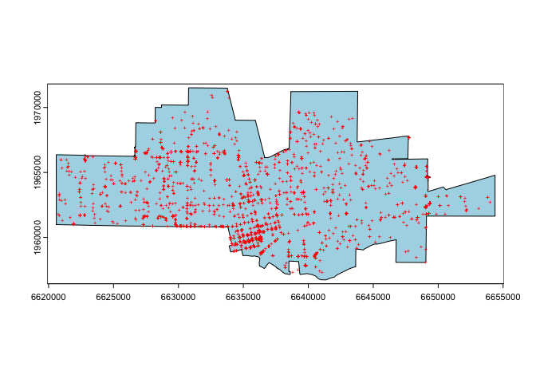
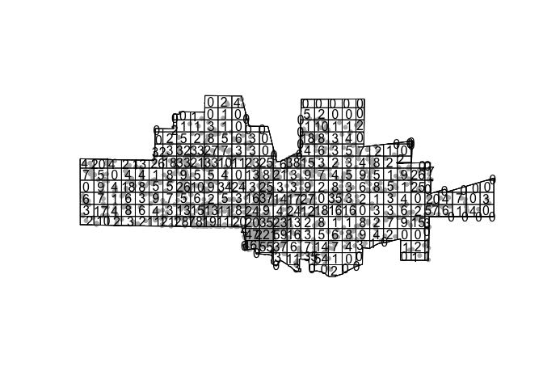
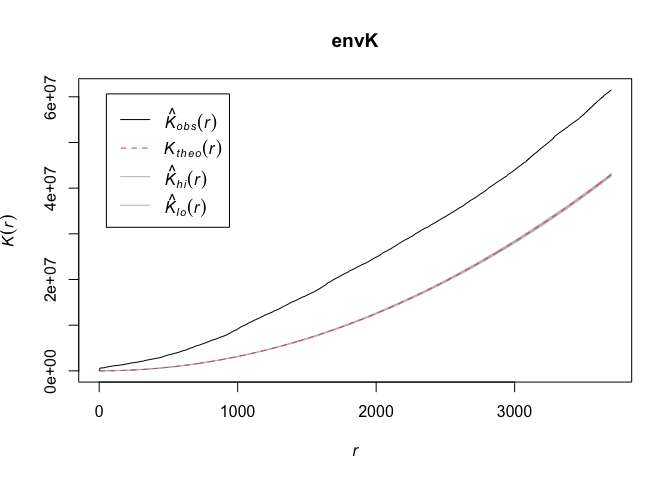
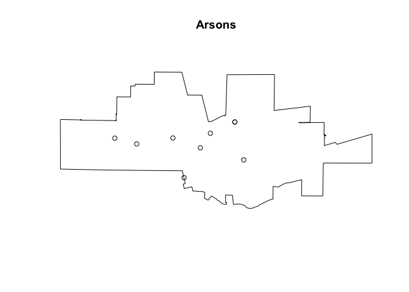

<style>
p.comment {
background-color: #DBDBDB;
padding: 10px;
border: 1px solid black;
margin-left: 25px;
border-radius: 5px;
}

.figure {
   margin-top: 20px;
   margin-bottom: 20px;
}

h1.title {
  font-weight: bold;
  font-family: Arial;  
}

h2.title {
  font-family: Arial;  
}

</style>


<style type="text/css">
#TOC {
  font-size: 13px;
  font-family: Arial;
}
</style>


\


The fundamental building blocks of vector or object data are points. As such, we start our journey into spatial data analysis by going through the basic methods for examining point patterns.  This guide follows closely OSU Chapter 5.  The objectives of the guide are as follows

1. Learn **spatstat** package functions for setting up point data for analysis
2. Learn first-order or density based measures for examining point patterns
3. Learn second-order or distance based measures for examining point patterns

To help us accomplish these learning objectives, we will be examining crime in a nondescript city (sounds like the plot to a [David Lynch movie](https://www.imdb.com/title/tt0090756/?ref_=nm_flmg_dr_73)).

<div style="margin-bottom:25px;">
</div>
## **Installing and loading packages**
\

We'll be using a couple of new packages in this lab.  First, you'll need to install them if you haven't already done so.


```r
install.packages(c("spatstat", "maptools"))
```

Next, load these and other required packages for this lab using the function `library()`


```r
library(sf)
library(rgdal)
library(raster)
library(maptools)
library(spatstat)
library(tidyverse)
```


<div style="margin-bottom:25px;">
</div>
## **Why point pattern analysis?**
\

Point data give us the locations of objects or events within an area.  Objects can be things like trees or where an animal was last seen.  They can also be houses, jump bikes or even people, such as the locations of where people were standing during a protest.  Events can be things like the epicenter of an earthquake or where a wildfire was ignited.  They can also be crimes or where someone tweeted something.  Point pattern analysis cas answer such questions like

1. What is the density of a process? If you work on crime, you may want to find out where crime is concentrated. If you work in public health, you might want to know where the density of cholera deaths are highest.
2. How are points distributed across space? If you are a plant scientist, perhaps you are curious as to whether an invasive species is randomly dispersed or clustered across a study area.
3. Are events or objects influencing the location of other similar events or objects? Back to our crime example, you might be interested in whether a crime will trigger future crimes to occur in the same area, following a contagion effect.
4. Do (1)-(3) differ across some characteristic? You might be interested in whether certain crimes are more clustered than others so that you can employ different safety programs more efficiently.

You can also examine whether the density of your points covary or are influenced by other processes - such as species density and elevation.  


Our research questions in this lab are: Does crime cluster in a nondescript American city? Does clustering vary by type of crime?

<div style="margin-bottom:25px;">
</div>
## **Bringing in the data**
\

I zipped up and uploaded onto GitHub a folder containing files for this lab.  Set your working directory to an appropriate folder and use the following code to download and unzip the file.


```r
#insert the pathway to the folder you want your data stored into
setwd("insert your pathway here")
#downloads file into your working directory 
download.file(url = "https://raw.githubusercontent.com/geo200cn/data/master/assignment4_data.zip", destfile = "assignment4_data.zip")
#unzips the zipped file
unzip(zipfile = "assignment4_data.zip")
```


The data are also located on Canvas in the Labs and Assignments Week 5 folder. 

We are using a dataset of crimes in a city. Bring in crime data and a shapefile of our city
using the following code


```r
city <- shapefile("assignment4_city.shp")
crime <- shapefile("assignment4_crime.shp")
```

*city* is an **sp** spatial polygon object containing the boundaries of a city.  *crime* is an **sp** spatial points object containing crimes in the city.  To see what we got, plot it


```r
par(mai=c(0,0,0,0))
plot(city, col='light blue')
points(crime, col='red', cex=.5, pch='+')
```

<!-- -->

Does this city look familiar to you?

All point pattern analysis tools used in this tutorial are available in the **spatstat** package. These tools are designed to work with points stored as *ppp* objects and not *SpatialPointsDataFrame* or *sf* objects. So, yes, another spatial object to learn about.   We won't go through the nuts and bolts of how **ppp** objects work.  We'll cover what is only necessary for running our analyses. 

We need to convert our **sp** *crime* points object into a *ppp* object. Use the `as()` function


```r
crime.ppp <- as(crime, "ppp")
```

As we defined above, point data give the location of objects or events within an area. In addition to coordinates, points have other data attached to them called marks. Marks are essentially attributes of the point (i.e. species of tree, type of crime). Marks could be categorical (type of crime) or continuous (diameter of tree). We can see that our crime points have marks.


```r
summary(crime.ppp)
```

```
## Marked planar point pattern:  2661 points
## Average intensity 5.756729e-06 points per square unit
## 
## Coordinates are given to 1 decimal place
## i.e. rounded to the nearest multiple of 0.1 units
## 
## Mark variables: CATEGORY, CASEN, ODT1, OFFDESC1, OFFDESC2, OFFDESC3, OFFDESC4, 
## OFFDESC5, OFFDESC6
## Summary:
##    CATEGORY             CASEN              ODT1             OFFDESC1        
##  Length:2661        Min.   :11101199   Length:2661        Length:2661       
##  Class :character   1st Qu.:11102435   Class :character   Class :character  
##  Mode  :character   Median :11103645   Mode  :character   Mode  :character  
##                     Mean   :11125352                                        
##                     3rd Qu.:11104804                                        
##                     Max.   :11201168                                        
##    OFFDESC2           OFFDESC3           OFFDESC4           OFFDESC5        
##  Length:2661        Length:2661        Length:2661        Length:2661       
##  Class :character   Class :character   Class :character   Class :character  
##  Mode  :character   Mode  :character   Mode  :character   Mode  :character  
##                                                                             
##                                                                             
##                                                                             
##    OFFDESC6        
##  Length:2661       
##  Class :character  
##  Mode  :character  
##                    
##                    
##                    
## 
## Window: rectangle = [6620751, 6653993] x [1957331.9, 1971237.4] units
##                     (33240 x 13910 units)
## Window area = 462242000 square units
```

For now, we will only concern ourselves with the pattern generated by the points and not their attributes. We’ll therefore remove all marks from the point object.


```r
marks(crime.ppp)  <- NULL
```

Point pattern analyses should have their study boundaries explicitly defined. This is the window through which we are observing the points. One example is the boundaries of a forest if you are studying tree species distribution. In the current example, it is the boundaries of our nondescript city.  **spatstat** uses a special boundary object - an *owin*, which stands for observation window.  We will need to coerce *city* to an object of class *owin* using the function `as.owin()`


```r
cityOwin <- as.owin(city)
class(cityOwin)
```

```
## [1] "owin"
```

To set or “bind” the city boundary *owin* to the *crime* point feature object, use the `Window()` function, which is a **spatstat** function. 


```r
Window(crime.ppp) <- cityOwin
```

We're now set and ready to roll. Let's do some analysis!

<div style="margin-bottom:25px;">
</div>
## **Centrography**
\

Before considering more complex approaches, let's compute the mean center and standard distance for the crime data as described on page 125 of OSU.  To calculate these values, you'll need to extract the x and y coordinates from the *crime.ppp* object using the **spatstat** function `coords()`


```r
xy <- coords(crime.ppp)
```

And then compute the mean center following equation 5.1 on page 125. We’ll use our friend `summarize()` to help us out here.


```r
# mean center
mc <- summarize(xy, xmean = mean(x), ymean = mean(y))
mc
```

```
##     xmean   ymean
## 1 6635644 1962882
```

And then standard distance using equation 5.2 on page 125.


```r
# standard distance
sd <- sqrt(sum((xy[,1] - mc[1])^2 + (xy[,2] - mc[2])^2) / nrow(xy))
sd
```

```
## [1] 132.8583
```


<div style="margin-bottom:25px;">
</div>
## **Density based measures**
\

Centrography is rather dull because it ignores spatial variation in the data.  Instead, we can explicitly examine the distribution of points across a geographic area. This is measuring first-order effects or examining point density.  First-order effects or patterns look at trends over space.

<div style="margin-bottom:25px;">
</div>
### **Overall density**
\

The overall density given in equation 5.3 in OSU on page 126 can be calculated as follows


```r
CityArea <- area(city)
nrow(xy) / CityArea
```

```
## [1] 9.543104e-06
```

The command `area(city)` calculates the area (in feet squared) of our city, which represents the value *a* in formula 5.3. `nrow(xy)` represents the number of crimes in the city, which represents the value *n*.

Overall density is a little bit better than the centrography measures, but it is still a single number, and thus we can do better. As OSU states on page 127, we lose a lot of information when we calculate a single summary statistic.  Let's go through the two "local" density approaches covered in OSU: Quadrat and Kernel density. 


<div style="margin-bottom:25px;">
</div>
### **Quadrat counts**
\

A basic yet descriptively useful visualization of point density is to create a grid (often called quadrats) of your study area and count the number of crimes in each grid cell. To compute quadrat counts (as on p.127-130), use **spatstat**'s `quadratcount()` function. The following code chunk divides the city boundary into a grid of 3 rows and 6 columns and tallies the number of points falling in each quadrat.


```r
qcounts1 <- quadratcount(crime.ppp, nx= 6, ny=3)
```

The object *qcounts1* stores the number of points inside each quadrat. You can plot the quadrats along with the counts as follows:


```r
plot(crime.ppp, pch=20, cols="grey70", main=NULL)  # Plot points
plot(qcounts1, add=TRUE)  # Add quadrat grid
```

<!-- -->

Wow, 582 crimes in that one bottom cell. That place must be *really* dangerous. Three-by-six might be too small. Let’s instead make a 15 by 30 grid.


```r
qcounts2 <- quadratcount(crime.ppp, nx= 30, ny=15)
```

then plot


```r
plot(crime.ppp, pch=20, cols="grey70", main=NULL)  # Plot points
plot(qcounts2, add=TRUE)  # Add quadrat grid. 
```

<!-- -->

In real life one should always try a range of row and column sizes to get a sense of how sensitive the results are.

We’ll need to convert the resulting *qcounts2* object into a data frame to calculate the variance-mean ratio (VMR) described on page 130 in OSU.


```r
Qcount<-data.frame(qcounts2)
```

And the VMR is


```r
var(Qcount$Freq)/mean(Qcount$Freq)
```

```
## [1] 32.25635
```

<br>

<p class="comment">**Question 1**: Explain why a VMR greater than 1 indicates spatial clustering. </p>

<br>

<div style="margin-bottom:25px;">
</div>
#### **Hypothesis testing**
\

We can employ the Chi-square test for spatial randomness that OSU describes on page 142-43 using the handy dandy `quadrat.test()` function. 


```r
quadrat.test(crime.ppp, nx= 30, ny=15)
```

```
## 
## 	Chi-squared test of CSR using quadrat counts
## 
## data:  crime.ppp
## X2 = 8022.1, df = 295, p-value < 2.2e-16
## alternative hypothesis: two.sided
## 
## Quadrats: 296 tiles (irregular windows)
```

<br>

<p class="comment">**Question 2**: What are the null and alternative hypotheses for this test? What does the VMR score combined with the chi-square test tell us about the point pattern?</p>

<br>

<div style="margin-bottom:25px;">
</div>
### **Kernel density**
\

The kernel density approach is an extension of the quadrat method: Like the quadrat density, the kernel approach computes a localized density for subsets of the study area, but unlike its quadrat density counterpart, the sub-regions overlap one another providing a moving sub-region window.  

The **spatstat** package has a function called `density.ppp()` that computes a kernel density estimate of the point pattern. A discussion of kernel density maps is located in page 68-71 in OSU. That discussion points to two tuning parameters that are important to consider when creating a kernel density map: the bandwidth, which controls the size and shape of the radius, and the kernel function, which controls how point counts are smoothed.   We can just accept the defaults and get the following map.


```r
ds <- density.ppp(crime.ppp)
par(mai=c(0,0,0.5,0.5))
plot(ds, main='crime density')
```

<!-- -->

We can alter the bandwidth using the `sigma =` argument.  A really large `sigma` makes the map too smooth


```r
ds <- density.ppp(crime.ppp, sigma = 10000)
par(mai=c(0,0,0.5,0.5))
plot(ds, main='crime density')
```

<!-- -->

A small `sigma` creates a map that captures really localized clusters


```r
ds <- density.ppp(crime.ppp, sigma = 1000)
par(mai=c(0,0,0.5,0.5))
plot(ds, main='crime density')
```

<!-- -->

You can also change the kernel function by specifying `kernel =` to one of four options "gaussian" (the default), "epanechnikov", "quartic" or "disc". 
<div style="margin-bottom:25px;">
</div>
## **Distance based measures**
\

An alternative to density based methods are distance based methods whereby the interest lies in how the points are distributed relative to one another (a second-order property of the point pattern) as opposed to how the points are distributed relative to the study's extent.  

<div style="margin-bottom:25px;">
</div>
### **Mean Nearest-Neighbor Distance**
\

The first distance-based method that OSU goes through is calculating the mean nearest neighbor (MNN) distance. Here, you calculate for each point the distance to its nearest neighbor. You do this using the function `nndist()`, which is a part of the **spatstat** package.


```r
nn.p <- nndist(crime.ppp, k=1)
```

We plug *crime.ppp* into `nndist()`, resulting in a numeric vector containing the distance to each nearest neighbor (`k=1` specifies distance just to the nearest neighbor.  Try `k=` some other number and see what you get) for each point


```r
head(nn.p)
```

```
## [1]   0.0000   0.0000   0.0000 140.8069   0.0000   0.0000
```

We find that the nearest crime to the crime in the 4th row of *crime.ppp* is 140.8069 feet. We need to take the mean to get the mean nearest neighbor


```r
mnn.p <- mean(nn.p)
```

The mean nearest neighbor distance of 53.7598 feet (check `crs(crime)` to find how we got feet as the units of distance).

<div style="margin-bottom:25px;">
</div>
#### **Hypothesis testing**
\

The value 53.7598 seems small, indicating that crime clusters.  But, we can formally test this using the Clark and Evan’s R statistic described on OSU page 143. The **spatstat** package has the function `clarkevans.test()` for calculating this statistic.


```r
clarkevans.test(crime.ppp)
```

```
## 
## 	Clark-Evans test
## 	No edge correction
## 	Z-test
## 
## data:  crime.ppp
## R = 0.33215, p-value < 2.2e-16
## alternative hypothesis: two-sided
```

<br>

<p class="comment">**Question 3**: What do the Clark Evans test results tell us about the point pattern? Explain why an R less than 1 indicates spatial clustering?</p>

<br>


<div style="margin-bottom:25px;">
</div>
### **Distance Functions**
\

The F, G, K and L functions are discussed on pages 145-148.  Our new friend **spatstat** provides canned functions for estimating these distributions. 

The K-function summarizes the distance between points for all distances. The calculation of K consists of dividing the mean of the sum of the number of points at different distance lags for each point by the area's density. 

To compute the K function, type:


```r
K <- Kest(crime.ppp)
```

Then plot it like on page 146 in OSU.


```r
par(mfrow=c(1,1))
plot(K)
```

<!-- -->

The plot returns different estimates of K depending on the edge correction chosen. By default, the isotropic, translate and border corrections are implemented.  Edge corrections are discussed on pages 137-139 in OSU.

Unsurprisingly, to calculate the G, F and L functions, use the functions `Gest()`, `Fest()`, and `Lest()`, respectively, which take on the same form as `Kest()`.  

OSU discusses calculating envelopes around the functions to examine whether the observed functions are simply due to chance.  Use the `envelope()` function to create the envelopes.  Here, we use 49 Monte Carlo simulations. This might take some time, so kick back a bit, and grab a cool be..., errr, i mean a glass of organic non-GMO electrolyte coconut water (no offense if you like this, it's all good).


```r
#takes awhile
envK <- envelope(crime.ppp, fun = Kest, nsim = 49)
plot(envK)
```

<!-- -->

It’s hard to see, but R is plotting the envelopes. They are just really narrow. The default envelopes are the maximum and minimum values. This is set by `nrank` in `envelope()`, which is `nrank=1`. This means your confidence interval is 


```r
1-(2/50)
```

```
## [1] 0.96
```

The highest and lowest gives you two. And there are 50 K functions (49 simulations + observed K). Hence 2/50. Subtract by 1 to get the confidence level.  OSU talks about the disadvantages of a simulation approach for computationally intensive calculations on page 151.

Replace `Kest` with `Gest`, `Fest`, and `Lest` to get envelopes for the other alphabet functions.

<br>

<p class="comment">**Question 4**: Calculate the F and G functions. Interpret the results.  </p>

<br>


<div style="margin-bottom:25px;">
</div>
## **Marked Data**
\

Marked data means data points with attributes. Like the height of a tree. In the crime data, we have a categorical variable indicating type of crime.  As I mentioned in the beginning of our journey today, we are not going to do extensive work with marked point pattern analyses, but let's do a little just to whet the appetite. For example, does the extent of clustering vary by crime type?

We have to go back to the *crime* **sp** object to create a marked crime **ppp** object. If your marks are categorical, make sure they are stored as factors in your ppp object.


```r
crime$fcat <- as.factor(crime$CATEGORY)
```

Convert to **ppp**, set the mark, and set the window


```r
crime2.ppp <- as(crime, "ppp")
marks(crime2.ppp) <- as.factor(crime$CATEGORY)
Window(crime2.ppp) <- cityOwin
```

We can automatically split *mpp* by crime type using the `split.ppp()` function


```r
spp <- split.ppp(crime2.ppp)
```

We can plot arsons


```r
plot(spp$Arson, main = "Arsons")
```

<!-- -->

<br>

<p class="comment">**Question 5**: Using the *spp* object we created, use one first order and one second order method to compare the clustering of crime across the following types: Residential Burglary, Auto Theft, Drunk in Public, and Assaults.  Summarize your results. </p>

<br>

<div style="margin-bottom:25px;">
</div>
## **Resources**
\

The procedures in this lab heavily relies on the **spatstat** package, which is very well [documented](https://spatstat.org/). The data used in this lab were taken from [rspatial](https://rspatial.org/).  


***

<a rel="license" href="http://creativecommons.org/licenses/by-nc/4.0/"></a><br />This work is licensed under a <a rel="license" href="http://creativecommons.org/licenses/by-nc/4.0/">Creative Commons Attribution-NonCommercial 4.0 International License</a>.


Website created and maintained by [Noli Brazil](https://nbrazil.faculty.ucdavis.edu/)
