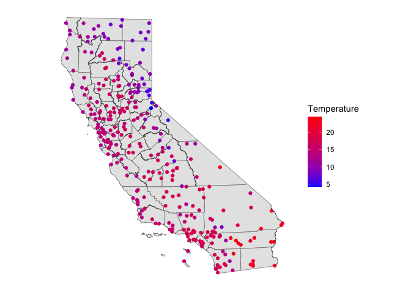
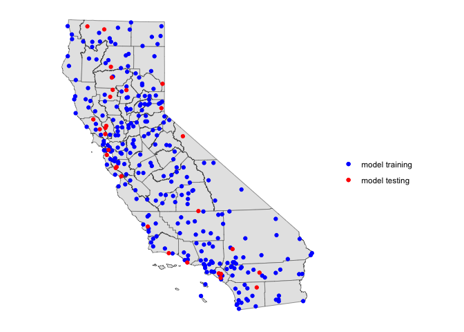

<style>
p.comment {
background-color: #DBDBDB;
padding: 10px;
border: 1px solid black;
margin-left: 25px;
border-radius: 5px;
}

.figure {
   margin-top: 20px;
   margin-bottom: 20px;
}

h1.title {
  font-weight: bold;
  font-family: Arial;  
}

h2.title {
  font-family: Arial;  
}

</style>


<style type="text/css">
#TOC {
  font-size: 13px;
  font-family: Arial;
}
</style>


\


In the past several labs, we've learned how to use regression models for description and inference. In this lab, we learn how to employ regression (and quantitative tools more generally) for predictive purposes.  Specifically, the objectives of this lab are as follows

1. Learn how to use regression in a prediction framework
2. Learn about testing and training your data
3. Learn how to run cross validation to calculate test error rates

To help us accomplish these learning objectives, we will use temperature data for California weather stations to predict a numeric outcome and a data set from the previous lab - the [Behavioral Risk Factor Surveillance System](https://www.cdc.gov/brfss/index.html) (BRFSS) to predict a categorical (binary) outcome.  The lab follows closely this week's lecture and handout.

<div style="margin-bottom:25px;">
</div>
## **Installing and loading packages**
\

We'll be using two new packages in this lab.  First, install them if you haven't already.


```r
install.packages(c("dismo", "boot"))
```

Next load them and the other packages we need using `library()`.


```r
library(dismo)
library(boot)
library(sf)
library(tidyverse)
```


<div style="margin-bottom:25px;">
</div>
## **Bring in the data**
\

Download the data for this lab guide from Canvas in the Labs and Assignments Week 8 folder.  All the data are zipped into the file *prediction.zip*. First, bring in the BRFSS file *brfss16.csv* file into R.


```r
brfss16 <- read_csv("brfss16.csv")
```

Information about this data set, including the record layout, were provided in the [last lab](https://geo200cn.github.io/logistic.html).  The data set *brfss17.csv* contains the 2017 BRFSS data, which we will bring in and use later in the lab.

Next, bring in the California temperature dataset *temperature.csv*


```r
ca.temp <- read_csv("temperature.csv")
```

The file contains the average monthly temperature in Celsius. We need to do some data prep before we can start using this data set. Let's take mean monthly temperature, which will be our response variable.


```r
ca.temp <- mutate(ca.temp, temp = rowMeans(dplyr::select(ca.temp, JAN:DEC)))
```

Let's map the stations. We have longitude and latitude. First, we need to convert *ca.temp* into a spatial **sf** object. Here, we use the function `st_as_sf()` and use an appropriate coordinate reference system.


```r
ca.temp.sf <- st_as_sf(ca.temp, coords = c("LONG", "LAT"), crs ="+proj=longlat +datum=NAD83 +ellps=GRS80")
```

Let's then bring in a California counties layer.


```r
cacounties <- st_read("counties_2000.shp")
```

Next, we need to transform both layers to a planar CRS (Teale Albers in this case) to assure that the computations we perform later are OK. That is, we want to avoid interpreting angles as if they were planar coordinates.


```r
st_crs(ca.temp.sf)
```

```
## Coordinate Reference System:
##   User input: +proj=longlat +datum=NAD83 +ellps=GRS80 
##   wkt:
## GEOGCRS["unknown",
##     DATUM["North American Datum 1983",
##         ELLIPSOID["GRS 1980",6378137,298.257222101,
##             LENGTHUNIT["metre",1]],
##         ID["EPSG",6269]],
##     PRIMEM["Greenwich",0,
##         ANGLEUNIT["degree",0.0174532925199433],
##         ID["EPSG",8901]],
##     CS[ellipsoidal,2],
##         AXIS["longitude",east,
##             ORDER[1],
##             ANGLEUNIT["degree",0.0174532925199433,
##                 ID["EPSG",9122]]],
##         AXIS["latitude",north,
##             ORDER[2],
##             ANGLEUNIT["degree",0.0174532925199433,
##                 ID["EPSG",9122]]]]
```

```r
st_crs(cacounties)
```

```
## Coordinate Reference System:
##   User input: NAD83 
##   wkt:
## GEOGCRS["NAD83",
##     DATUM["North American Datum 1983",
##         ELLIPSOID["GRS 1980",6378137,298.257222101,
##             LENGTHUNIT["metre",1]]],
##     PRIMEM["Greenwich",0,
##         ANGLEUNIT["degree",0.0174532925199433]],
##     CS[ellipsoidal,2],
##         AXIS["latitude",north,
##             ORDER[1],
##             ANGLEUNIT["degree",0.0174532925199433]],
##         AXIS["longitude",east,
##             ORDER[2],
##             ANGLEUNIT["degree",0.0174532925199433]],
##     ID["EPSG",4269]]
```

```r
TA <- crs(" +proj=aea +lat_1=34 +lat_2=40.5 +lat_0=0 +lon_0=-120 +x_0=0
+y_0=-4000000 +datum=NAD83 +units=m +no_defs +ellps=GRS80 +towgs84=0,0,0")

ca.temp.sf<- st_transform(ca.temp.sf, TA)
cacounties<- st_transform(cacounties, TA)
```


```r
st_crs(ca.temp.sf) == st_crs(cacounties)
```

```
## [1] TRUE
```

Finally, mapification happens.


```r
ggplot(data = cacounties) +geom_sf() +
          geom_sf(data = ca.temp.sf, aes(color = temp)) +
      scale_color_gradient(low = "blue", high = "red", name ="Temperature") + 
    theme( axis.text =  element_blank(),
    axis.ticks =  element_blank(),
    panel.background = element_blank())
```

<!-- -->

Now on to the modelling!!


<div style="margin-bottom:25px;">
</div>
## **Classification**
\

As we discussed in lecture and handout, we're now entering the phase of the class where we go from using models and methods to *describe* and *infer* to those that *predict*. In the prediction world, we're primarily concerned about the quality of our predictions rather than trying to describe a relationship or infer causality. In other words, we create a model to predict a phenomena and then test whether our model does a good job of predicting that phenomena. We learned about logistic regression in the  [last lab](https://geo200cn.github.io/logistic.html). For a logistic regression model or any model that has a categorical outcome variable, prediction is known as classification. 

In the case of a binary outcome, we are trying to predict whether an observation belongs in one class or another.  For example, predicting whether a person will report they're in poor/fair health or not. In practice, a binary classifier can make two types of errors: it can incorrectly assign an individual who is in bad health, or it can incorrectly assign an individual who is not in bad health.  A simple approach to assessing the prediction quality of a classification model is to examine a confusion matrix.  A confusion matrix is a convenient way of displaying this information.

First, let's run a multiple logistic regression predicting the variable reporting Fair/Poor health or not *badhealth*.


```r
logit.fit <- glm(badhealth ~ bmi + race_eth + agec + male + smoke + educ + inc + employ + marst , family = binomial, data = brfss16)
```


Next, we predict the probability of reporting bad health for the 367,873 observations in our original data.  We use the `predict()` function.


```r
pfit <- predict(logit.fit, type = "response")
```

We used the `predict()` function before when we predicted bad health using BMIs between 10 and 90.  Here, we are not predicting for a new set of observations (i.e. people with BMIs between 10 and 90), but rather for our original 367,873 observations. In other words, *pfit* contains the fitted values based on the model *logit.fit*.

Remember that our original variable is a 0, 1 variable - "not bad health", "bad health."  So, we now need to convert the probabilities into one of these categories.  What is typically done is if the predicted probability is greater than 0.5, designate it a 1 ("bad health").  We do so in the following code using the `ifelse()` command.    We save the classification back into the data set using `mutate()`.


```r
brfss16 <- mutate(brfss16, pprob = pfit, pclass = ifelse(pprob > 0.5, 1, 0))
```

The first argument in the `mutate` command saves the vector of predicted probabilities. The second argument creates a variable that transforms to 1 all of the probabilities that are greater than 0.5.  We then use the `table()` function to produce a confusion matrix


```r
table(brfss16$pclass, brfss16$badhealth)
```

```
##    
##          0      1
##   0 290051  48782
##   1   9813  19227
```

The diagonal elements of the confusion matrix indicate correct predictions,
while the off-diagonals represent incorrect predictions. Hence our model
correctly predicted non bad health status for 290,051 persons and bad health status for 19,227 persons, for a total of 309,278 correct predictions.  In this case, logistic regression correctly predicted the health status of 84.1% individuals.

Is the model better at predicting health status compared to a logistic regression model? We run an OLS using the same variables.


```r
ols.fit <- glm(badhealth ~ bmi + race_eth + agec + male + smoke + educ + inc + employ + marst , family = gaussian, data = brfss16)
```

<br>

<p class="comment">**Question 1**: Create the confusion matrix for the OLS model *ols.fit*.  What percent of predictions did the OLS model get correct?</p>

<br>

<div style="margin-bottom:25px;">
</div>
## **Training and Testing**
\

It looks like our model does a good job predicting bad health status. However, the results are misleading because we trained and tested the model on the same set of 367,873 observations.  The training error rate is typically overly optimistic - it tends to underestimate the test error rate.  

In order to better assess the accuracy of the logistic regression model, we can fit the model using new data. We can do this two ways.  First, we can use (or train) part of the original data to create our model, and then examine how well it predicts the held out (test) data.  This will yield a more realistic error rate, in the sense that in practice we will be interested in our model's performance not on the data that we used to fit the model. 

We'll first need to get a sample of the original data to train on.  How much to sample? The literature is not clear.  Let's set aside 25% of the data to test, and train the rest.  We use the the tidy friendly `sample_frac()` to sample 75% of the data to train. We use `seed.set()` to give us a pseudorandom set of numbers to replicate the results.


```r
set.seed(1234)
brfss16$id <- 1:nrow(brfss16)
#75% of data are used to train the model
train <- brfss16 %>% dplyr::sample_frac(.75)
#25% of data are used to test the model predictions
test  <- anti_join(brfss16, train, by = 'id')
```

Now run the model on the training data set


```r
logit.train.fit <- glm(badhealth ~ bmi + race_eth + agec + male + smoke + educ + inc + employ + marst , family = binomial, data = train)
```

Take a looksie at the results


```r
summary(logit.train.fit)
```

```
## 
## Call:
## glm(formula = badhealth ~ bmi + race_eth + agec + male + smoke + 
##     educ + inc + employ + marst, family = binomial, data = train)
## 
## Deviance Residuals: 
##     Min       1Q   Median       3Q      Max  
## -2.8366  -0.5776  -0.3996  -0.2626   3.0449  
## 
## Coefficients:
##                       Estimate Std. Error z value Pr(>|z|)    
## (Intercept)          -1.878760   0.062852 -29.892  < 2e-16 ***
## bmi                   0.054633   0.000863  63.304  < 2e-16 ***
## race_ethnh black     -0.414729   0.026493 -15.654  < 2e-16 ***
## race_ethnh multirace -0.104400   0.040498  -2.578 0.009940 ** 
## race_ethnh other     -0.247123   0.032811  -7.532 5.01e-14 ***
## race_ethnhwhite      -0.485699   0.020462 -23.736  < 2e-16 ***
## agec(24,39]           0.366907   0.040023   9.167  < 2e-16 ***
## agec(39,59]           0.823166   0.038986  21.114  < 2e-16 ***
## agec(59,79]           0.959662   0.040258  23.838  < 2e-16 ***
## agec(79,99]           1.312480   0.044473  29.512  < 2e-16 ***
## maleMale              0.092994   0.011796   7.883 3.19e-15 ***
## smokeFormer          -0.308237   0.016591 -18.579  < 2e-16 ***
## smokeNeverSmoked     -0.609946   0.015802 -38.599  < 2e-16 ***
## educ1somehs          -0.267665   0.036181  -7.398 1.38e-13 ***
## educ2hsgrad          -0.598346   0.031903 -18.755  < 2e-16 ***
## educ3somecol         -0.720753   0.032464 -22.202  < 2e-16 ***
## educ4colgrad         -1.028077   0.033348 -30.829  < 2e-16 ***
## inc                  -0.279518   0.004751 -58.831  < 2e-16 ***
## employnilf            0.539075   0.019129  28.182  < 2e-16 ***
## employretired         0.629023   0.017071  36.847  < 2e-16 ***
## employunable          2.127378   0.019817 107.353  < 2e-16 ***
## marstdivorced        -0.025365   0.035883  -0.707 0.479631    
## marstmarried         -0.086159   0.034296  -2.512 0.011998 *  
## marstnm              -0.141429   0.036171  -3.910 9.23e-05 ***
## marstseparated        0.143162   0.046700   3.066 0.002172 ** 
## marstwidowed         -0.134139   0.037267  -3.599 0.000319 ***
## ---
## Signif. codes:  0 '***' 0.001 '**' 0.01 '*' 0.05 '.' 0.1 ' ' 1
## 
## (Dispersion parameter for binomial family taken to be 1)
## 
##     Null deviance: 264392  on 275904  degrees of freedom
## Residual deviance: 210224  on 275879  degrees of freedom
## AIC: 210276
## 
## Number of Fisher Scoring iterations: 5
```

Then predict probabilities using the *test* data set by using the argument `newdata =`


```r
pfit2 <- predict(logit.train.fit, newdata = test, type = "response")
```

Confusion matrix time.


```r
test <- mutate(test, pprob = pfit2, pclass = ifelse(pprob > 0.5, 1, 0))
```


```r
table(test$pclass, test$badhealth)
```

```
##    
##         0     1
##   0 72579 12068
##   1  2468  4853
```

The test error rate is 15.8, not far from the 15.9 training error rate calculated above.

The second way to test the predictive quality of your model is to model past data to predict future data.   The file *brfss17.csv* contains individual data from the the 2017 version of the BRFSS.  The data file contains the same exact variables as the 2016 file you have been using in this lab.  Bring this data set into R.

<br>

<p class="comment">**Question 2**: Calculate the test error rate using the 2017 BRFSS data for the prediction model logit.train.fit.  </p>


<div style="margin-bottom:25px;">
</div>
## **Cross-Validation**
\

With the BRFSS example, we have the fortune of having "future" observations to test our model.  Everyone is not that lucky.  One way to getting test error rates without a test data set is to run cross-validation,  which is covered in section 2.2 in the Handout. To demonstrate cross validation, let's turn to the CA temperature data.  

The goal is to create a model that predicts temperature, which is a continuous numeric variable. We first run a linear regression model with no independent variables (known as a null model).  Such a model uses the mean annual temperature across the stations as an estimator of temperature at every location. 


```r
null <- lm(temp ~ 1, data = ca.temp.sf)
```

Save the predicted values (which is just the mean) and the residuals (observed - predicted) into our data frame. The function `predict()` gives us the predicted values and the function `resid()` gives us the residuals.


```r
ca.temp.sf <- mutate(ca.temp.sf, nullpred = predict(null), nullresid = resid(null))
```

And we make a map of the residuals.


```r
ggplot(data = cacounties) +geom_sf() +
          geom_sf(data = ca.temp.sf, aes(color = nullresid)) +
    scale_color_gradient(low = "blue", high = "red", name ="Residual") + 
    theme( axis.text =  element_blank(),
    axis.ticks =  element_blank(),
    panel.background = element_blank())
```

<!-- -->

This does not look very good. There are large differences. Moreover, there is some spatial autocorrelation in the residuals, indicating that some places have better predictions than others. 

Because we are now in prediction land, we are very concerned about fit.  Instead of the error rate, the Root Mean Squared Error (RMSE) is used to measure fit when your outcome is continuous numeric. 

Let’s define an RMSE function so we can compute RMSE for all the models we run in this lab.


<br>

<p class="comment">**Question 3**:  Create a function called *RMSE* that calculates the root mean squared error for a model's predictions.  The inputs should be the observed  values and the predicted values from the model. The output should be one value representing the RMSE. Your function should look something like below </p>


```r
RMSE <- function(observed, predicted) {
#Calculate the RMSE
}
```

<p class="comment">**Question 4**:  What is the RMSE of the null model for predicting temperature? </p>


<br>


<div style="margin-bottom:25px;">
</div>
### **k-fold Cross-Validation**
\

We can probably do better than use the mean to predict temperature. Let's try a linear regression model with independent variables.  The only meaningful attribute we have in our *ca.temp.sf* dataset is the geographic coordinates, i.e. the location of each weather station.  A regression of any variable on geographic coordinates is known as a trend surface model, which we'll cover in more detail next week (Ch. 9 in OSU).  But, for now, let's regress temperature on a station's longitude and latitude. Let's also compute an error rate using k-cross validation, which is described in section 2.2.2 in the handout.

We first need to cut up the data set into *k* sets.  Let's set *k* = 10. We can use the function `kfold()`, which is a part of the **dismo** package, to conveniently partition our data into *k* folds.  For replication purposes, I `set.seed()` because `kfold()` randomly partitions the data set. Make sure to use this seed for your assignment.


```r
set.seed(5162016)
k <- kfold(ca.temp.sf, k = 10)
table(k)
```

```
## k
##  1  2  3  4  5  6  7  8  9 10 
## 30 30 31 30 30 30 30 31 30 30
```

The output shows that 30 observations are in the test set of the first fold, 30 different observations are in the second fold, 31 different observations are in the third fold, and so on. Let's visualize what we have done for one fold:


```r
test <- ca.temp.sf[k==1, ]
train <- ca.temp.sf[k!=1, ]

ggplot(data = cacounties) +geom_sf() +
          geom_sf(data = train, aes(color = "blue"), show.legend = "point") +
          geom_sf(data = test, aes(color = "red"), show.legend = "point")  +
    scale_color_manual(labels = c("model training", "model testing"), values = c("blue", "red"), name = "") +
    theme( axis.text =  element_blank(),
    axis.ticks =  element_blank(),
    panel.background = element_blank())
```

<!-- -->

Let's run a linear regression on our first fold. First, save the coordinates and temperature into a single data frame.


```r
df <- data.frame(st_coordinates(train), temp=train$temp)
```

Then fit a linear regression model to these data.  We'll use `glm()`.


```r
m <- glm(temp ~ X+Y, data=df)
summary(m)
```

```
## 
## Call:
## glm(formula = temp ~ X + Y, data = df)
## 
## Deviance Residuals: 
##     Min       1Q   Median       3Q      Max  
## -9.4411  -1.5265   0.1872   1.7846   8.9485  
## 
## Coefficients:
##               Estimate Std. Error t value Pr(>|t|)    
## (Intercept)  1.390e+01  1.984e-01  70.055  < 2e-16 ***
## X            5.125e-07  1.428e-06   0.359     0.72    
## Y           -8.464e-06  1.025e-06  -8.257  6.8e-15 ***
## ---
## Signif. codes:  0 '***' 0.001 '**' 0.01 '*' 0.05 '.' 0.1 ' ' 1
## 
## (Dispersion parameter for gaussian family taken to be 7.891022)
## 
##     Null deviance: 3803.0  on 271  degrees of freedom
## Residual deviance: 2122.7  on 269  degrees of freedom
## AIC: 1338.8
## 
## Number of Fisher Scoring iterations: 2
```

<br>

<p class="comment">**Question 5**: According to this model, how much does the temperature in California change if you travel [500 miles](https://www.youtube.com/watch?v=Cwkej79U3ek) to the north? </p>

<br>

We can now estimate temperature values for our hold-out (test) sample


```r
v <- data.frame(st_coordinates(test))
p <- predict(m, v)
#First several predictions
head(p)
```

```
##        1        2        3        4        5        6 
## 18.49892 17.27353 17.99420 16.04129 13.71275 12.06281
```

And then evaluate the results by comparing them with the known values for these locations using the `RMSE()` function we created above

<br>

<p class="comment">**Question 6**:  What is the RMSE of the linear regression model predicting temperature? Did the linear regression model improve upon the null model?</p>

<br>

We did this for one fold. But, we have to do this for all 10 folds.  We can accomplish this by running a forgotten friend the for loop.  Here, we plug in the `RMSE()` function that we created above.


```r
r <- rep(NA,5)
for (i in 1:10) {
  test <- ca.temp.sf[k==i, ]
  train <- ca.temp.sf[k!=i, ]
  df <- data.frame(st_coordinates(train), temp=train$temp)
  m <- glm(temp ~ ., data=df)
  v <- data.frame(st_coordinates(test))
  p <- predict(m, v)
  r[i] <- RMSE(p, test$temp)
}
```


The result is the RMSE for each of the 10 folds.  


```r
r
```

```
##  [1] 3.289749 2.248640 3.043732 3.422114 2.533438 2.819896 2.794843 2.838339
##  [9] 3.011162 2.470722
```


We then calculate the average, which is equation 5.3 shown on ISLR page 181 (we show the RMSE, ISLR shows the MSE, the only difference being MSE is squared).


```r
mean(r)
```

```
## [1] 2.847263
```

The model is not great, but it did capture something, and it is better than the null model.

<div style="margin-bottom:25px;">
</div>
### **Leave-One-Out Cross-Validation**
\

We did the *k*-fold cross-validation technique. Now do the leave-one-out cross-validation technique described in section 2.2.1 in the handout. You can use the function `cv.glm()`, which is a part of the **boot** package. You don't need to separate the data set into training and test data sets as `cv.glm()` will automatically do that for you.  So, you can save the coordinates and the temperature for the entire set of locations in a data frame


```r
df2 <- data.frame(st_coordinates(ca.temp.sf), temp = ca.temp.sf$temp)
```

and go from there.

<br>

<p class="comment">**Question 7**:  What is the RMSE using leave-one-out cross validation?</p>

<br>


***

<a rel="license" href="http://creativecommons.org/licenses/by-nc/4.0/"></a><br />This work is licensed under a <a rel="license" href="http://creativecommons.org/licenses/by-nc/4.0/">Creative Commons Attribution-NonCommercial 4.0 International License</a>.


Website created and maintained by [Noli Brazil](https://nbrazil.faculty.ucdavis.edu/)
