<style>
p.comment {
background-color: #DBDBDB;
padding: 10px;
border: 1px solid black;
margin-left: 25px;
border-radius: 5px;
font-style: normal;
}

.figure {
   margin-top: 20px;
   margin-bottom: 20px;
}

h1.title {
  font-weight: bold;
  font-family: Arial;  
}

h2.title {
  font-family: Arial;  
}

</style>


<style type="text/css">
#TOC {
  font-size: 13px;
  font-family: Arial;
}
</style>


\


This lab guide goes through the use of regression trees to make spatial predictions. It follows closely the material presented in ISLR Ch. 8. The objectives of this lab guide are as follows

1. Learn how to run classification trees
2. Learn how to prune classification trees
3. Learn how to run regression and classification random forest models
4. Learn how to make predictions using a random forest model

To achieve these objectives, you will be applying regression tree methods in [species distribution modelling](https://rspatial.org/sdm) or ecological niche modeling. The objective in species distribution modelling is to predict the entire range of a species based on a set of locations where it has been observed. In this lab guide, we use the hominid species Imaginus magnapedum (also known under the vernacular names of “bigfoot” and “sasquatch”). This species is so hard to find (at least by scientists) that its very existence is commonly denied by the mainstream media! For more information about this controversy, see the article by Lozier, Aniello and Hickerson: [Predicting the distribution of Sasquatch in western North America: anything goes with ecological niche modelling](http://onlinelibrary.wiley.com/doi/10.1111/j.1365-2699.2009.02152.x/abstract). Note that much of this lab guide has been adapted from [Spatial Data Science](https://rspatial.org/).


<div style="margin-bottom:25px;">
</div>
## **Installing and loading packages**
\

We'll be using several new packages in this lab guide.  First, install them


```r
install.packages(c("tree", "randomForest", "geodata", "predicts"))
```

Second, load these packages and the others we will need for executing the commands in this lab guide.


```r
library(tree)
library(randomForest)
library(geodata)
library(predicts)
library(tidyverse)
library(terra)
library(rspat)
```


<div style="margin-bottom:25px;">
</div>
## **Bringing in the data**
\

The research objectives are to find out

1. What the complete range of the bigfoot species might be.
2. How good (general) our model is by predicting the range of the Eastern bigfoot sub-species, with data from the Western sub-species.
3. How good (general) our model is by predicting into the future.

<div style="margin-bottom:25px;">
</div>
### **Observations**
\


First bring in the bigfoot location data *bigfoot* from the **rspat** package.


```r
bf <- spat_data("bigfoot")
```

What kind of object is this? And how many cases and variables are we working with?


```r
class(bf)
```

```
## [1] "data.frame"
```

```r
dim(bf)
```

```
## [1] 3092    3
```

```r
head(bf)
```

```
##         lon      lat Class
## 1 -142.9000 61.50000     A
## 2 -132.7982 55.18720     A
## 3 -132.8202 55.20350     A
## 4 -141.5667 62.93750     A
## 5 -149.7853 61.05950     A
## 6 -141.3165 62.77335     A
```

These data show the latitude and longitude information of the known locations of bigfoot sightings.  Let's plot where these fellas like to roam. We'll also add country borders for Canada, Mexico and the United States taken from the **geodata** package.


```r
plot(bf[,1:2], cex=0.5, col='red')

wrld <- geodata::world(path=".")
class(wrld)
```

```
## [1] "SpatVector"
## attr(,"package")
## [1] "terra"
```

```r
bnds <- wrld[wrld$NAME_0 %in% c("Canada", "Mexico", "United States"), ]
class(bnds)
```

```
## [1] "SpatVector"
## attr(,"package")
## [1] "terra"
```

```r
lines(bnds)
```

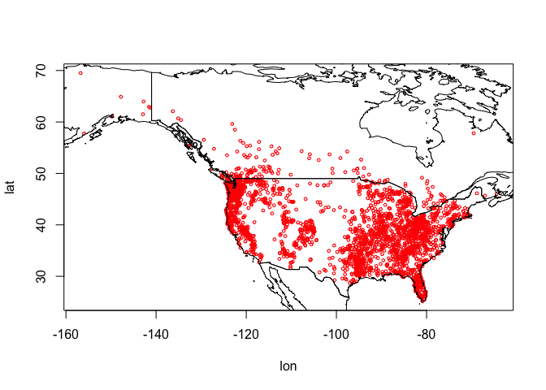<!-- -->

So they are in Canada and in the United States, but no reports from Mexico...so far.

<div style="margin-bottom:25px;">
</div>
### **Predictor variables**
\

We want to predict bigfoot locations, so we need predictors. The main predictors typically used in species distribution modeling are climate data. Specifically, we use [‘bioclimatic variables’](https://pubs.usgs.gov/ds/691/ds691.pdf). A record layout of the variables can be found [here](https://www.worldclim.org/data/bioclim.html).  Here we used a spatial resolution of 10 minutes (one sixth of a degree). That is relatively coarse but it makes the download and processing faster. We'll bring this data in from the package **geodata**. 


```r
wc <- geodata::worldclim_global("bio", res=10, ".")
class(wc)
```

```
## [1] "SpatRaster"
## attr(,"package")
## [1] "terra"
```

What does these data look like? Plot the variables *bio1* (Annual Mean Temperature) and *bio12* (Annual Precipitation) for the world.


```r
plot(wc[[c(1, 12)]], nr=2)
```

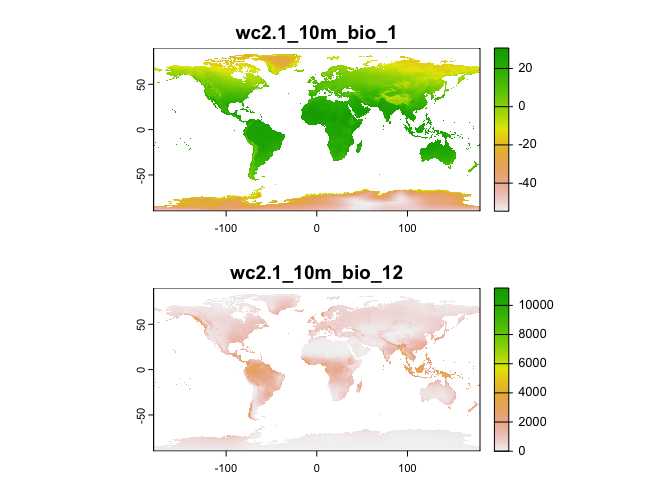<!-- -->

Now extract climate data for the locations of our observations. That is, get data about the climate where the species have been spotted. We use the `extract()` function from the package **terra**.


```r
bfc <- terra::extract(wc, bf[,1:2])
head(bfc, 3)
```

```
##   ID wc2.1_10m_bio_1 wc2.1_10m_bio_2 wc2.1_10m_bio_3 wc2.1_10m_bio_4
## 1  1       -1.832979       12.504708        28.95899       1152.4308
## 2  2        6.360650        5.865935        32.27475        462.5731
## 3  3        6.360650        5.865935        32.27475        462.5731
##   wc2.1_10m_bio_5 wc2.1_10m_bio_6 wc2.1_10m_bio_7 wc2.1_10m_bio_8
## 1        20.34075      -22.840000        43.18075        5.327750
## 2        16.65505       -1.519947        18.17500        3.964495
## 3        16.65505       -1.519947        18.17500        3.964495
##   wc2.1_10m_bio_9 wc2.1_10m_bio_10 wc2.1_10m_bio_11 wc2.1_10m_bio_12
## 1      -0.6887083         11.80792       -16.038542              991
## 2      10.4428196         12.28183         1.467686             3079
## 3      10.4428196         12.28183         1.467686             3079
##   wc2.1_10m_bio_13 wc2.1_10m_bio_14 wc2.1_10m_bio_15 wc2.1_10m_bio_16
## 1              120               42         31.32536              337
## 2              448              141         35.27518             1127
## 3              448              141         35.27518             1127
##   wc2.1_10m_bio_17 wc2.1_10m_bio_18 wc2.1_10m_bio_19
## 1              157              288              216
## 2              468              630              873
## 3              468              630              873
```

We remove the first column with the ID that we do not need.


```r
bfc <- bfc %>%
        dplyr::select(-ID)
```


Now we can plot the species’ distribution in a part of the environmental space. For example, here is a plot of temperature vs rainfall of sites where Bigfoot was observed.


```r
plot(bfc[ ,"wc2.1_10m_bio_1"], bfc[, "wc2.1_10m_bio_12"], col="red",
        xlab="Annual mean temperature (°C)", ylab="Annual precipitation (mm)")
```

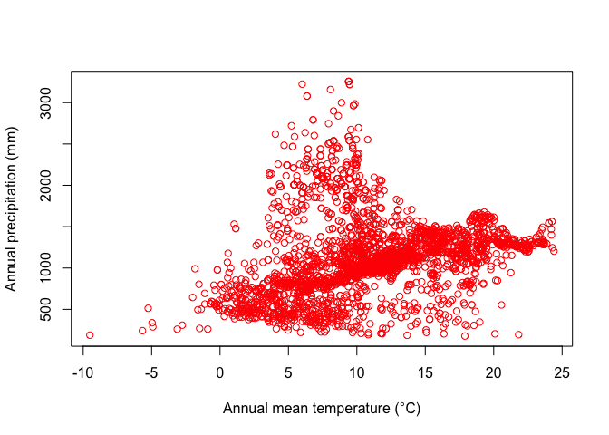<!-- -->

<div style="margin-bottom:25px;">
</div>
### **Background data**
\


The dataset *bf* gives us data for bigfoot sightings. The dataset *bfc* gives us the climate data for the locations of these sightings. But, in order to build a prediction model, we also need the locations and their climate data for where bigfoot was *not observed*. But we do not have data from a systematic survey that determined both presence and absence. We have presence-only data. 

The common trick to deal with this is to not model presence versus absence, but presence versus a ‘random expectation’. This random expectation (also referred to as ‘background’, or ‘random-absence’ data) is what you would get if the species had no preference for any of the predictor variables.

There is not much point in taking absence data from very far away (tropical Africa or Antarctica). Typically they are taken from more or less the entire study area for which we have presence data. Our study region is North America. So, you create a set of random climate observations from within the area of North America where bigfoot observations have been made.

To do so, we first get the extent of all points using the function `ext()`. Note that we have to use `vect()` from **terra** to transform *bf* into a *SpatVector*. We add a little buffer to the extent.


```r
#measures extent of area for bigfoot observations
ext_bf <- ext(vect(bf[, 1:2])) + 1
ext_bf
```

```
## SpatExtent : -157.75, -63.4627, 24.141, 70.5 (xmin, xmax, ymin, ymax)
```

And then we take 5,000 random samples (excluding *NA* cells) from *SpatExtent* *ext_bf*, by using it as a “window” (blacking out all other areas) on the climate *SpatRaster* *wc*.


```r
#set seed for reproducibility since we are random sampling
set.seed(0)
window(wc) <- ext_bf
#takes a 5000 random samples from wc within the extent e for bigfoot observations
bg <- spatSample(wc, 5000, "random", na.rm=TRUE, xy=TRUE)
dim(bg)
```

```
## [1] 5000   21
```

```r
#5000 random points with climate variables
head(bg)
```

```
##           x        y wc2.1_10m_bio_1 wc2.1_10m_bio_2 wc2.1_10m_bio_3
## 1  -99.2500 66.75000     -13.2934895        7.870646        14.96619
## 2 -106.0833 42.08333       5.6722708       14.530958        36.82943
## 3 -111.9167 46.58333       6.7605939       14.135854        35.23372
## 4 -106.9167 54.75000       0.4086979       11.528605        24.43290
## 5 -118.2500 67.08333      -9.1363859        8.185354        16.34505
## 6 -111.2500 38.91667       8.4194584       15.997125        38.84047
##   wc2.1_10m_bio_4 wc2.1_10m_bio_5 wc2.1_10m_bio_6 wc2.1_10m_bio_7
## 1       1638.6833        15.42850       -37.16100        52.58950
## 2        894.3715        27.86600       -11.58875        39.45475
## 3        927.7927        28.14375       -11.97650        40.12025
## 4       1290.1088        22.55225       -24.63250        47.18475
## 5       1567.0846        17.46575       -32.61275        50.07850
## 6        904.0610        30.49050       -10.69625        41.18675
##   wc2.1_10m_bio_8 wc2.1_10m_bio_9 wc2.1_10m_bio_10 wc2.1_10m_bio_11
## 1        6.484917      -31.617332         7.518209        -31.76942
## 2        9.226916       -4.839750        17.168291         -4.83975
## 3       15.638333       -4.921750        18.186209         -4.92175
## 4       15.417084      -13.864500        15.417084        -16.31392
## 5        8.609292      -21.353209        10.573625        -27.49783
## 6       19.076958        3.179209        19.812834         -2.50475
##   wc2.1_10m_bio_12 wc2.1_10m_bio_13 wc2.1_10m_bio_14 wc2.1_10m_bio_15
## 1              171               33                4         70.29919
## 2              288               42               13         38.78144
## 3              293               48                9         53.40759
## 4              471               86               16         58.32499
## 5              223               43                7         61.21693
## 6              228               28               11         32.40370
##   wc2.1_10m_bio_16 wc2.1_10m_bio_17 wc2.1_10m_bio_18 wc2.1_10m_bio_19
## 1               90               13               78               13
## 2              112               41               90               41
## 3              129               35              115               35
## 4              220               53              220               56
## 5              108               27               93               29
## 6               83               40               72               44
```

Above, with `spatSample()`, we used the argument `xy=TRUE` to be able to show were these points are from.


```r
plot(bg[, c("x", "y")])
```

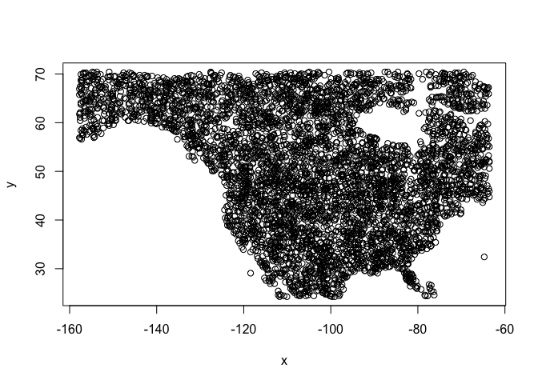<!-- -->

But we otherwise do not need them so we remove them.


```r
bg <- bg[, -c(1:2)]
```

We can now compare the climate of the presence and background points, for example, for temperature and rainfall


```r
plot(bg[,1], bg[,12], xlab="Annual mean temperature (°C)",
          ylab="Annual precipitation (mm)", cex=.8)
points(bfc[,1], bfc[,12], col="red", cex=.6, pch="+")
legend("topleft", c("observed", "background"), col=c("red", "black"), pch=c("+", "o"), pt.cex=c(.6, .8))
```

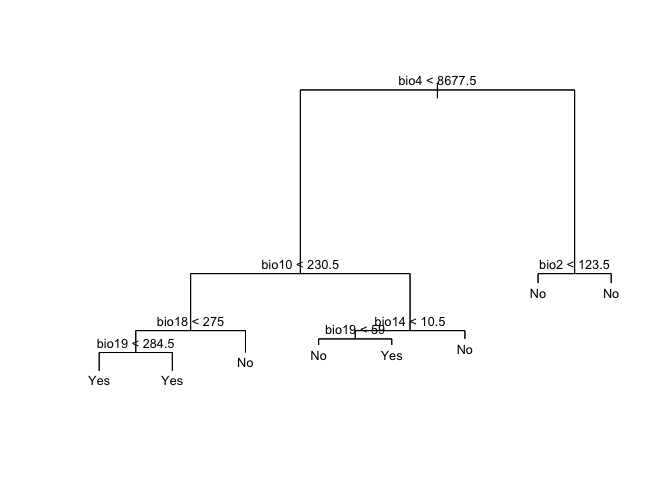<!-- -->

So we see that while Bigfoot is widespread, it is not common in cold areas, nor in hot and dry areas.

<div style="margin-bottom:25px;">
</div>
### **East vs West**
\

Now we have the data to fit a model. But let's split the data into East (greater than -102 longitude) and West. In this case, we may believe Western and Eastern bigfoots are actually different, albeit related, sub-species (for example, the Eastern Sasquatch is darker and less hairy). We are going to fit the model using Western data and then see if it predicts well for the Eastern data.


```r
#eastern points
bfe <- bfc[bf[,1] > -102, ]
#western points
bfw <- bfc[bf[,1] <= -102, ]
```

And now we combine the presence (“1”) with the background (“0”) data (We use the same background data for both subspecies) for the western and eastern portions of North America, separately. Our predictive models will be based on the western dataset.


```r
dw <- rbind(cbind(pa=1, bfw), cbind(pa=0, bg))
de <- rbind(cbind(pa=1, bfe), cbind(pa=0, bg))
dw <- data.frame(dw)
de <- data.frame(na.omit(de))
dim(dw)
```

```
## [1] 6224   20
```

```r
dim(de)
```

```
## [1] 6866   20
```

Now, we are ready. Let's run some regression trees!!

<div style="margin-bottom:25px;">
</div>
## **Classification trees**
\

Our response variable is whether bigfoot is located in a particular location (Yes) or not (No).  We can use a classification method to predict this binary variable.  Here, we use a Classification Tree (CART), which is discussed on page 311 in ISLR.  To run a CART in R, we'll need to convert the (0,1) numeric indicator *pa* into a new (No, Yes) factor variable we'll name *fpa*.


```r
dw$fpa <- as.factor(ifelse(dw$pa == 1, "Yes", "No"))
```

Use the `tree()` function in the **tree** package to run a CART.  The syntax of the function is similar to `lm()` and other linear regression modelling functions we've used extensively in this class. Note that we take out the (0,1) indicator from the dataset using the function `select()` when we run the model. Also note that there is another package in R that runs regression trees, **rpart**, that many [prefer](https://daviddalpiaz.github.io/r4sl/trees.html#rpart-package) over **tree** since its functions provide better visualizations, among a few advantages. We go with **tree** to follow ISLR (see pages 323-331).


```r
#use the western data in all the predictor columns with the climate except "pa" which is the response variable
cart1 <- tree(fpa~., data=dplyr::select(dw,-pa))
```

Here is a summary of the results.


```r
summary(cart1)
```

```
## 
## Classification tree:
## tree(formula = fpa ~ ., data = dplyr::select(dw, -pa))
## Variables actually used in tree construction:
## [1] "wc2.1_10m_bio_4"  "wc2.1_10m_bio_10" "wc2.1_10m_bio_15" "wc2.1_10m_bio_3" 
## [5] "wc2.1_10m_bio_19" "wc2.1_10m_bio_18" "wc2.1_10m_bio_16" "wc2.1_10m_bio_12"
## Number of terminal nodes:  10 
## Residual mean deviance:  0.4149 = 2578 / 6214 
## Misclassification error rate: 0.09512 = 592 / 6224
```

The misclassification error rate is the training error rate, which is around 10%. And here we plot the decision tree diagram, like the one shown in Figure 8.6 in ISLR, which they describe in detail on pages 312-314.


```r
plot(cart1, main="Classification Tree")
text(cart1, cex=.8, digits=1)
```

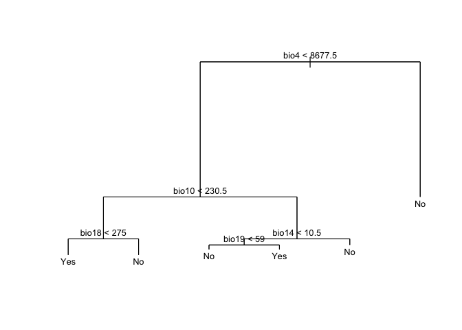<!-- -->


<br>

<p class="comment">**Question 1**: Which variable is the most important indicator of where our species might be located? </p>

<p class="comment">**Question 2**: Describe the conditions under which you are likely to find our species? </p>

<br>

<div style="margin-bottom:25px;">
</div>
### **Tree Pruning**
\

Next, we consider whether pruning the tree might lead to improved results. Pruning is described in ISLR starting on page 307.  The algorithm is located on page 309.  The key step is step 3, which describes using k-fold cross validation to find the best tuning parameter alpha, which dictates the number of terminal nodes of the best fit tree.  The function `cv.tree()` performs cross-validation in order to determine the optimal level of tree complexity.  Plug in the big tree *cart1* produced by `tree()` in the section above followed by `FUN = prune.misclass`, which indicates that we want the classification error rate to guide the cross-validation and pruning process. We set the seed for reproducibility. 


```r
#kfold cuts the fold in random so set a seed.
set.seed(123)
cv.cart <- cv.tree(cart1, FUN = prune.misclass)
```

Let's see what we get 


```r
names(cv.cart)
```

```
## [1] "size"   "dev"    "k"      "method"
```

and their values


```r
cv.cart
```

```
## $size
## [1] 10  7  5  4  1
## 
## $dev
## [1]  632  632  621  640 1203
## 
## $k
## [1]     -Inf   0.0000   9.0000  27.0000 195.6667
## 
## $method
## [1] "misclass"
## 
## attr(,"class")
## [1] "prune"         "tree.sequence"
```

Note that, despite the name, *dev* corresponds to the cross-validation error rate in this instance. The results under *size* give the number of terminal nodes (size of the tree).  The tree with five terminal nodes (see *size*) results in the lowest cross-validation error rate, with 621 cross-validation errors (see *dev*). We plot the error rate as a function of the size.


```r
plot(cv.cart$size, cv.cart$dev, type = "b")
```

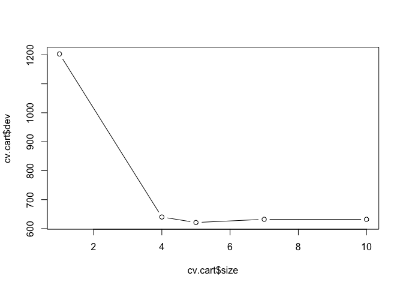<!-- -->

Let's be parsimonious and choose 5 as the best fit tree. We then apply the `prune.misclass()` function in order to prune the tree to obtain the five-node tree.


```r
prune.cart <- prune.misclass(cart1, best = 5)
```

And now the decision tree diagram


```r
plot(prune.cart, main="Regression Tree")
text(prune.cart, cex=.8, digits=1)
```

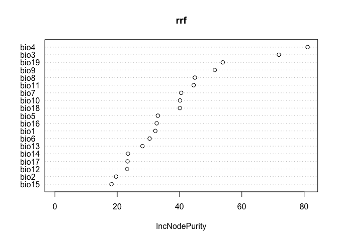<!-- -->

Differ much from the tree we got from *cart1*?

<div style="margin-bottom:25px;">
</div>
## **Random Forest**
\

CART gives us a nice result to look at that can be easily interpreted. But the approach suffers from high variance (meaning that the model will be over-fit, it is different each time a somewhat different datasets are used). Random Forest does not have that problem as much. The method, which is an extension of Bagging, is discussed starting on page 319 in ISLR.


<div style="margin-bottom:25px;">
</div>
### **Classification**
\

We fit the Random Forest model using the function `randomForest()` from the package **randomForest**.


```r
#use the western data in all the predictor columns with the climate except "pa" which is the response variable
crf <- randomForest(fpa~., data=dplyr::select(dw,-pa))
crf
```

```
## 
## Call:
##  randomForest(formula = fpa ~ ., data = dplyr::select(dw, -pa)) 
##                Type of random forest: classification
##                      Number of trees: 500
## No. of variables tried at each split: 4
## 
##         OOB estimate of  error rate: 7.18%
## Confusion matrix:
##       No Yes class.error
## No  4797 203   0.0406000
## Yes  244 980   0.1993464
```

The variable importance plot shows which variables are most important in fitting the model. Variable importance is described in ISLR on page 319. The plot is generated by randomizing each predictor variable one by one and then computing the decline in model prediction.


```r
varImpPlot(crf)
```

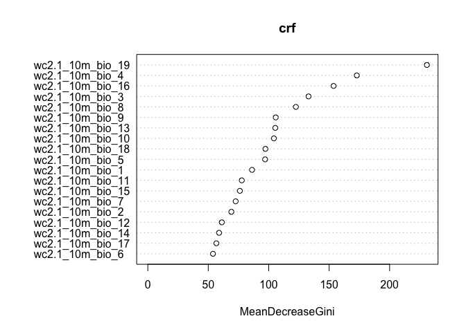<!-- -->

<div style="margin-bottom:25px;">
</div>
### **Regression**
\

In the above sections, we've modelled bigfoot locations from a classification perspective.  But, we can also use regression.  In this case, by using a (0,1) numeric variable as the response, we are modelling the probability that bigfoot is located in a location. We still use the `randomForest()` function to run a Random Forest regression model.

Note that there is an important parameter that differentiates Random Forests from regular bagging (page 319 in ISLR talks about this parameter).  In the `randomForest()` function, this parameter is designated by the argument `mtry =`.  We did not specify `mtry =` above, and thus took whatever the default is.  

Instead of the default, we can instead find the best value for this parameter by using the function `tuneRF()`.


```r
trf <- tuneRF(dplyr::select(dw,-c(pa,fpa)), dw[, 'pa'])
```

```
## mtry = 6  OOB error = 0.05558451 
## Searching left ...
## mtry = 3 	OOB error = 0.05530499 
## 0.005028692 0.05 
## Searching right ...
## mtry = 12 	OOB error = 0.05752334 
## -0.0348808 0.05
```

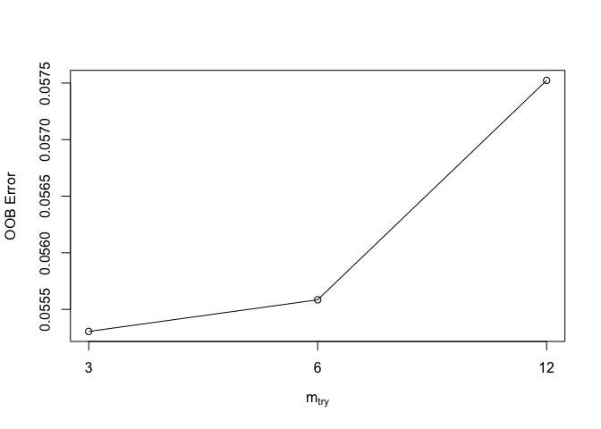<!-- -->

We then find the best value (lowest error).


```r
trf
```

```
##    mtry   OOBError
## 3     3 0.05530499
## 6     6 0.05558451
## 12   12 0.05752334
```

```r
mt <- trf[which.min(trf[,2]), 1]
mt
```

```
## [1] 3
```

We can then plug this value into the `randomForest()` function in the argument `mtry =`


```r
rrf <- randomForest(dw[, 2:ncol(bfc)], dw[, 'pa'], mtry=mt)
rrf
```

```
## 
## Call:
##  randomForest(x = dw[, 2:ncol(bfc)], y = dw[, "pa"], mtry = mt) 
##                Type of random forest: regression
##                      Number of trees: 500
## No. of variables tried at each split: 3
## 
##           Mean of squared residuals: 0.0535169
##                     % Var explained: 66.13
```

<br>

<p class="comment">**Question 3**: What did tuneRF help us find? What does the value of *mt* represent? </p>

<br>

Here we show the variable importance plot for the model.


```r
varImpPlot(rrf)
```

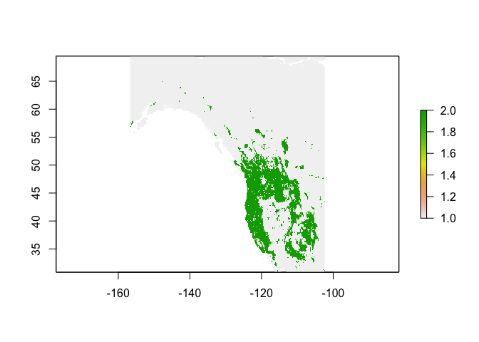<!-- -->


<div style="margin-bottom:25px;">
</div>
## **Predict**
\

We can use the random forest models we constructed above to make predictions to any other place for which we have values for the predictor variables. Our climate data is global so we could find suitable places for bigfoot anywhere. But before we start placing sasquatch anywhere we please, let's first predict their locations in the western portion of North America. 

We need to establish the spatial extent of the observed western locations to make predictions.


```r
ew <- ext(vect(bf[bf[,1] <= -102, 1:2]))
#get climate data across raster covering western extent
west <- geodata::worldclim_global("bio", res=10, ".")
window(west) <- ew
```

<div style="margin-bottom:25px;">
</div>
### **Regression**
\

Let's interpolate the probability that bigfoot will be present in a location using the regression random forest model *rrf*


```r
rp <- predict(west, rrf, ext = ew, na.rm=TRUE)
```

Show a raster map of the predicted range for the probability of our species presence across the study area.


```r
plot(rp)
```

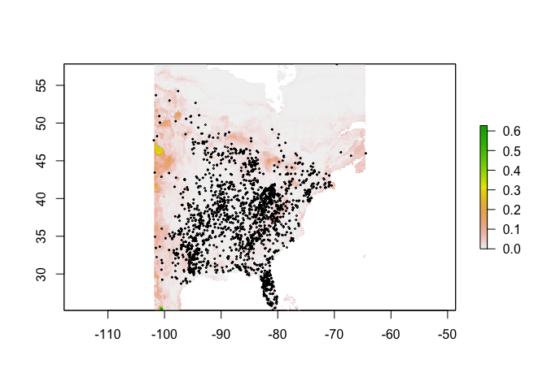<!-- -->

Note that the regression predictions are well-behaved, in the sense that they are between 0 and 1. However, they are continuous within that range, and if you wanted presence/absence, you would need a threshold (i.e. if it is above the threshold, bigfoot is present, otherwise absent). To get the optimal threshold, you would normally have a hold out data set (see ISLR 8.3 for examples of using test and training data), but here we use a training data for simplicity.


```r
#set seed for reproducibility since we are random sampling
set.seed(123)
i <- sample(nrow(dw), 0.2 * nrow(dw))
test <- dw[i,]
train <- dw[-i,]
```

We then predict.


```r
eva <- pa_evaluate(predict(rrf, test[test$pa==1, ]), predict(rrf, test[test$pa==0, ]))
eva
```

```
## @stats
##    np   na prevalence auc  cor pcor   ODP
## 1 241 1003      0.194   1 0.96    0 0.806
## 
## @thresholds
##   max_kappa max_spec_sens no_omission equal_prevalence equal_sens_spec
## 1      0.44          0.44        0.44            0.194           0.494
## 
## @tr_stats
##     treshold kappa  CCR  TPR  TNR  FPR  FNR  PPP  NPP  MCR  OR
## 1          0     0 0.19    1    0    1    0 0.19  NaN 0.81 NaN
## 2          0  0.22 0.53    1 0.42 0.58    0 0.29    1 0.47 Inf
## 3          0  0.22 0.53    1 0.42 0.58    0 0.29    1 0.47 Inf
## 4        ...   ...  ...  ...  ...  ...  ...  ...  ...  ... ...
## 659        1  0.11 0.82 0.07    1    0 0.93    1 0.82 0.18 Inf
## 660        1  0.11 0.82 0.07    1    0 0.93    1 0.82 0.18 Inf
## 661        1     0 0.81    0    1    0    1  NaN 0.81 0.19 NaN
```

To get a good threshold to determine presence/absence and plot the prediction, we can use the “max specificity + sensitivity” threshold.


```r
#uses the evaluation to find an optimal threshold
tr <- threshold(eva)
tr
```

```
##   max_kappa max_spec_sens no_omission equal_prevalence equal_sens_spec
## 1 0.4401238     0.4401238   0.4401238         0.194123       0.4937809
```

```r
#choosing max_spec_sens at the threshold value and plotting range as a binary
plot(rp > tr$max_spec_sens)
```

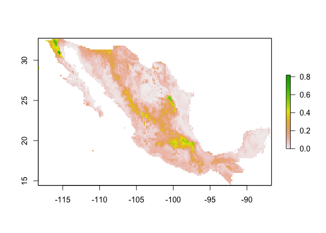<!-- -->

The *max_spec_sens* represents the point at which the combined sensitivity (true positive rate) and specificity (true negative rate) are maximized.

<div style="margin-bottom:25px;">
</div>
### **Classification**
\

We can also use the classification Random Forest model *crf* to make a categorical  present/absent prediction.


```r
rc <- predict(west, crf, na.rm=TRUE)
plot(rc)
```

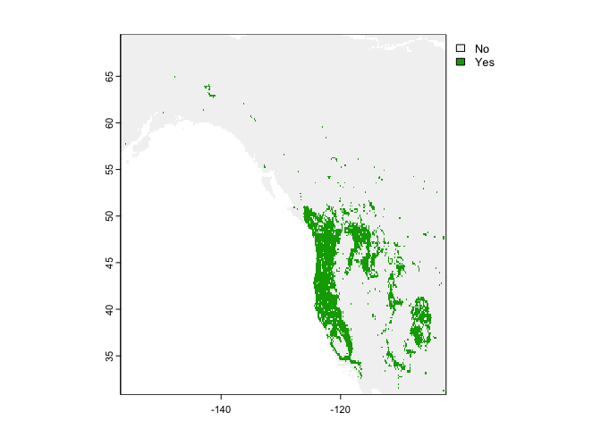<!-- -->

They are different because the classification used a threshold of 0.5, which is not necessarily appropriate.

You can get probabilities for the classes (in this case there are 2 classes, presence and absence, and we only plot presence).


```r
rc2 <- predict(west, crf, type="prob", na.rm=TRUE)
#shows the probability of sightings in the U.S.
plot(rc2, 2)
```

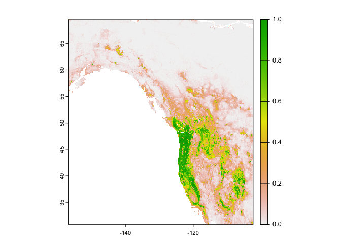<!-- -->


<div style="margin-bottom:25px;">
</div>
## **Extrapolation**
\

Remember that we fitted our model using the Western portion of the region. Now, let’s see if our model is general enough to predict the distribution of the Eastern species.  We'll use the regression random forest model to predict. We need to establish the spatial extent of the observed eastern locations to make predictions, and get climate data.


```r
ee <- ext(vect(bf[bf[,1] > -102, 1:2]))
east <- geodata::worldclim_global("bio", res=10, ".")
window(east) <- ee
```

Now we predict species location for the eastern location using our random forest model *rrf*.


```r
rcusa <- predict(east, rrf, ext=ee, na.rm=TRUE)
```

Plot the predictions.


```r
plot(rcusa)
```

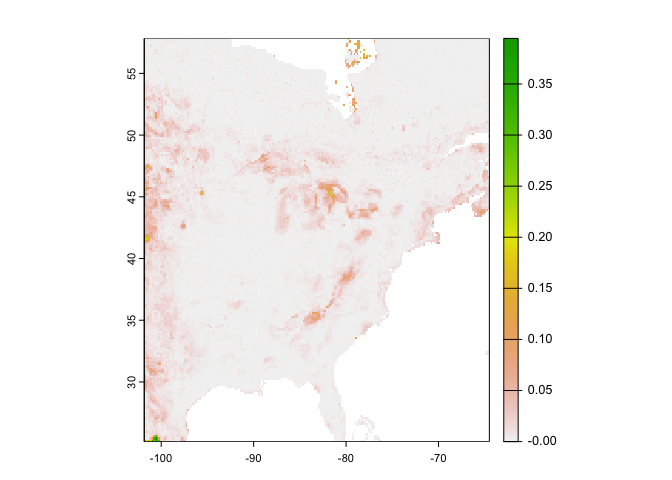<!-- -->

Plot the predictions with the observed locations


```r
plot(rcusa)
points(bf[bf[,1] > -102,1:2], cex=.25)
```

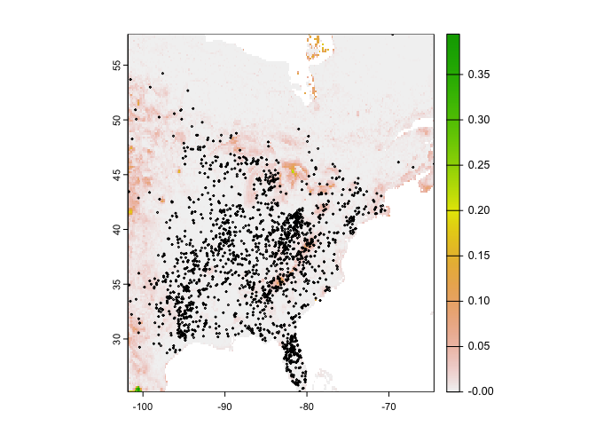<!-- -->

Let’s get the predictions we got for the western and eastern sides together.


```r
#predict for the entire region using rrf
allrusa <- predict(wc, rrf, na.rm = TRUE)
#plot the predictions and observed points
plot(allrusa)
points(bf[,1:2], cex=.25)
```

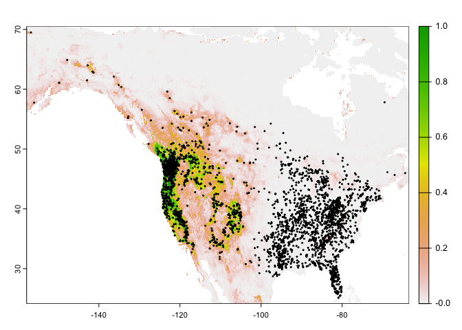<!-- -->

<br>

<p class="comment">**Question 4**: Why would it be that the model does not extrapolate well to eastern North America? </p>

<br>


We can also estimate range shifts due to climate change. In other words, we can use the same model, but now extrapolate in time (and space). We grab forecasted (future) versions of our climate variables.


```r
fut <- cmip6_world("CNRM-CM6-1", "585", "2061-2080", var="bio", res=10, path=".")
names(fut)
```

```
##  [1] "bio01" "bio02" "bio03" "bio04" "bio05" "bio06" "bio07" "bio08" "bio09"
## [10] "bio10" "bio11" "bio12" "bio13" "bio14" "bio15" "bio16" "bio17" "bio18"
## [19] "bio19"
```

We need to convert the names of these variables to the same names used in our random forest model. 


```r
names(wc)
```

```
##  [1] "wc2.1_10m_bio_1"  "wc2.1_10m_bio_2"  "wc2.1_10m_bio_3"  "wc2.1_10m_bio_4" 
##  [5] "wc2.1_10m_bio_5"  "wc2.1_10m_bio_6"  "wc2.1_10m_bio_7"  "wc2.1_10m_bio_8" 
##  [9] "wc2.1_10m_bio_9"  "wc2.1_10m_bio_10" "wc2.1_10m_bio_11" "wc2.1_10m_bio_12"
## [13] "wc2.1_10m_bio_13" "wc2.1_10m_bio_14" "wc2.1_10m_bio_15" "wc2.1_10m_bio_16"
## [17] "wc2.1_10m_bio_17" "wc2.1_10m_bio_18" "wc2.1_10m_bio_19"
```

```r
names(fut) <- names(wc)
```

We'll predict for all of North America.


```r
window(fut) <- ext_bf
pfut <- predict(fut, rrf, na.rm=TRUE)
plot(pfut)
```

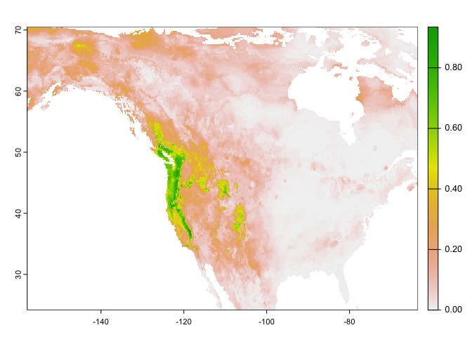<!-- -->


<br>

<p class="comment">**Question 5**: Make a map to show where conditions are improving for western bigfoot, and where they are not. Is the species headed toward extinction? </p>


<br>

You're done with the last lab of the class. Hooray!! [Where'd all the time go?](https://www.youtube.com/watch?v=bmZQpbNK7t4)

***

<a rel="license" href="http://creativecommons.org/licenses/by-nc/4.0/"></a><br />This work is licensed under a <a rel="license" href="http://creativecommons.org/licenses/by-nc/4.0/">Creative Commons Attribution-NonCommercial 4.0 International License</a>.


Website created and maintained by [Noli Brazil](https://nbrazil.faculty.ucdavis.edu/)
