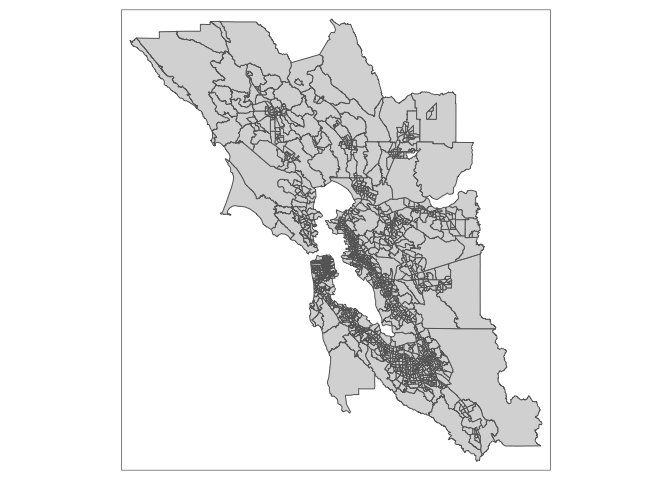
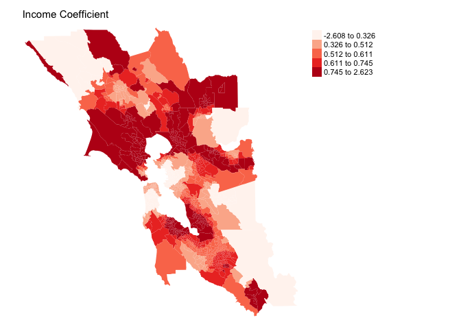

<style>
p.comment {
background-color: #DBDBDB;
padding: 10px;
border: 1px solid black;
margin-left: 25px;
border-radius: 5px;
}

.figure {
   margin-top: 20px;
   margin-bottom: 20px;
}

h1.title {
  font-weight: bold;
  font-family: Arial;  
}

h2.title {
  font-family: Arial;  
}

</style>


<style type="text/css">
#TOC {
  font-size: 13px;
  font-family: Arial;
}
</style>


\


What separates Geographers from everyone else (other than their wonderful sense of humor) is that when they encounter  a phenomenon or process - physical, social, economic or otherwise -  their gut reaction is to ask whether this process varies from place to place. Geographers often use global models like the ones we've covered in the linear regression labs for convenience, but deep in their hearts they know that the relationships they estimate in these regressions likely vary across space.  This is the concept of Spatial Heterogeneity, which is the topic we will cover in this lab guide.

We will be closely following this week's handout and lecture on Spatial Heterogeneity. In this lab, we will learn how to run the following models that incorporate spatial heterogeneity

1. Interaction model
2. Stratified model
3. Spatial regime model
4. Geographically weighted regression model

To help us accomplish these learning objectives, we will examine the association between neighborhood characteristics and housing values in the [San Francisco Bay Area](http://www.bayareacensus.ca.gov/counties/counties.htm).

<div style="margin-bottom:25px;">
</div>
## **Installing and loading packages**
\

We'll be using one new package in this lab.  First, install it if you have not already done so.
.

```r
install.packages("spgwr")
```

Second, load this package and the others we will need for executing the commands in this lab.


```r
library(sf)
library(tidyverse)
library(tmap)
library(spgwr)
library(spdep)
library(spatialreg)
```


<div style="margin-bottom:25px;">
</div>
## **Why examine spatial heterogeneity**
\

You should

1. Not expect things to be the same everywhere
2. Expect to find that phenomena cluster
3. Be interested in how and where processes and relationships vary spatially

In statistical terminology, you are interested in spatial non-stationarity or spatial heterogeneity in relationships. What this means is that instead of just one general relationship, the association  between two variables will be different in different places. 

Put differently, the motivation behind running models that incorporate spatial heterogeneity is that we're interested in examining differences in the effects of variables on an outcome across space.  For example, you might be interested in examining whether the positive relationship between percent black and COVID-19 rates that we found in a [previous lab guide](https://geo200cn.github.io/linearregression2.html) varies across neighborhoods in New York City.  Perhaps this relationship is true only in certain types of residential neighborhoods.  In another example, [this study](https://www.biorxiv.org/content/10.1101/384115v3) found that places with low humidity – dry air – and high temperature were particularly good indicators of fire risk.  However, the conditions that affected fires varied greatly from one “ecoregion” to another in terms of terrain and vegetation.

To be clear, we're not interested in spatial variation in individual variables.  We've already covered this topic when we went through [Spatial Autocorrelation](https://geo200cn.github.io/spatialautocorrelation.html).  We're also not interested in controlling for differences across geography and space so that we can examine the average effect of a variable on an outcome.  This is basically what we've been doing throughout all of our regression modelling thus far. Instead, we are interested in examining how the relationship between two variables vary across space.  Or, in the regression framework, we are interested in examining the spatial heterogeneity of the regression coefficients.

Our research questions in this lab guide are: What socioeconomic and built environment characteristics are associated with housing values in the Bay Area? Do these relationships vary across Bay Area region? 


<div style="margin-bottom:25px;">
</div>
## **Bringing in the data**
\

I zipped up a Bay Area census tract shapefile and uploaded it onto GitHub.  Download it onto your local folder.  The file is also located on Canvas in the Lab and Assignments Week 7 folder.


```r
#insert the pathway to the folder you want your data stored into
setwd("insert your pathway here")
#downloads file into your working directory 
download.file(url = "https://raw.githubusercontent.com/geo200cn/data/master/bayareatracts.zip", destfile = "bayareatracts.zip")
#unzips the zipped file
unzip(zipfile = "bayareatracts.zip")
```


Read in the shapefile using the `st_read()` function.


```r
bayarea <- st_read("bayareatracts.shp", stringsAsFactors = FALSE)
```

And plot it to see what we got


```r
tm_shape(bayarea) + tm_polygons()
```

<!-- -->


The Bay Area is composed of the following nine counties: Alameda, Contra Costa, Marin, Napa, San Francisco, San Mateo, Santa Clara, Solano, and Sonoma.  You can categorize these counties according to where in the Bay Area they are located: East Bay (Alameda and Contra Costa), North Bay (Marin, Napa, Solano and Sonoma),  South Bay (Santa Clara), Peninsula (San Mateo) and San Francisco.  


The data were downloaded from the 2013-2017 American Community Survey. A record layout of the data can be found [here](https://raw.githubusercontent.com/geo200cn/data/master/bayareatractsRL.txt).

We'll need to reproject the file into a [Coordinate Reference System](https://rspatial.org/raster/spatial/6-crs.html) that uses meters as the units of distance. Let's use [UTM](https://en.wikipedia.org/wiki/Universal_Transverse_Mercator_coordinate_system) Zone 10. We use the `st_transform()` function.


```r
bayarea <-st_transform(bayarea, crs = "+proj=utm +zone=10 +datum=NAD83 +ellps=GRS80") 
```


<div style="margin-bottom:25px;">
</div>
## **Basic linear regression**
\

Let's first run a basic multiple linear regression model, regressing *lmedhval*  on log total population *ltotp*, median household income *lmedinc*, median age of housing *medage*, median number of rooms *medrooms*, the median number of years current residents have been residing in their houses *meddur*, the number of parks within a 10 minute walk *parks*, and the percent of 4th graders attending the nearest school who scored proficient and above on the California's English Language Arts standardized test *edppl13*.  Use the `lm()` function to run this model using Ordinary Least Squares (OLS) regression.


```r
fit.ols <- lm(lmedhval ~ ltotp + lmedinc + medage + medrooms + meddur + parks + edppl3, data = bayarea)
```

Here is a summary of results


```r
#eliminate scientific notation
options(scipen=999)

summary(fit.ols)
```

```
## 
## Call:
## lm(formula = lmedhval ~ ltotp + lmedinc + medage + medrooms + 
##     meddur + parks + edppl3, data = bayarea)
## 
## Residuals:
##      Min       1Q   Median       3Q      Max 
## -1.84833 -0.18460 -0.01965  0.16931  1.44107 
## 
## Coefficients:
##               Estimate Std. Error t value             Pr(>|t|)    
## (Intercept)  4.1986398  0.3034919  13.834 < 0.0000000000000002 ***
## ltotp       -0.0382342  0.0176646  -2.164               0.0306 *  
## lmedinc      0.7675167  0.0263889  29.085 < 0.0000000000000002 ***
## medage       0.0061966  0.0005512  11.241 < 0.0000000000000002 ***
## medrooms    -0.0856691  0.0095095  -9.009 < 0.0000000000000002 ***
## meddur       0.0117370  0.0023333   5.030          0.000000546 ***
## parks        0.0102368  0.0012140   8.432 < 0.0000000000000002 ***
## edppl3       0.8972933  0.0647460  13.859 < 0.0000000000000002 ***
## ---
## Signif. codes:  0 '***' 0.001 '**' 0.01 '*' 0.05 '.' 0.1 ' ' 1
## 
## Residual standard error: 0.3129 on 1568 degrees of freedom
## Multiple R-squared:  0.6422,	Adjusted R-squared:  0.6406 
## F-statistic:   402 on 7 and 1568 DF,  p-value: < 0.00000000000000022
```

The linear model is a global model in the sense that it estimates an average effect and assumes that this effect applies to all places.  We now turn to the four methods covered by handout that deal with spatial heterogeneity in the regression coefficients.


<div style="margin-bottom:25px;">
</div>
## **Interaction model**
\


The first model is the interaction regression model.  Here, we interact the variable *region* with one or more of the independent variables.  To get the interaction between *medage* and *region*, we multiply them in `lm()` using the operator `*`


```r
fit.int <- lm(lmedhval ~ ltotp + lmedinc + medage*region + medrooms + meddur + parks + edppl3, data = bayarea)
```

Summarize the results


```r
summary(fit.int)
```

```
## 
## Call:
## lm(formula = lmedhval ~ ltotp + lmedinc + medage * region + medrooms + 
##     meddur + parks + edppl3, data = bayarea)
## 
## Residuals:
##      Min       1Q   Median       3Q      Max 
## -1.83400 -0.16412 -0.00931  0.15247  1.27117 
## 
## Coefficients:
##                              Estimate Std. Error t value             Pr(>|t|)
## (Intercept)                 6.1506997  0.3125779  19.677 < 0.0000000000000002
## ltotp                      -0.0614002  0.0165147  -3.718             0.000208
## lmedinc                     0.5957876  0.0267336  22.286 < 0.0000000000000002
## medage                      0.0040160  0.0007772   5.167          0.000000269
## regionNorth Bay            -0.0676059  0.0688656  -0.982             0.326396
## regionPeninsula            -0.2307712  0.1273507  -1.812             0.070164
## regionSan Francisco         0.5371517  0.1104769   4.862          0.000001278
## regionSouth Bay            -0.0315589  0.0690407  -0.457             0.647659
## medrooms                   -0.0379107  0.0095196  -3.982          0.000071368
## meddur                      0.0064221  0.0022256   2.885             0.003962
## parks                       0.0058858  0.0013373   4.401          0.000011492
## edppl3                      1.0073740  0.0604405  16.667 < 0.0000000000000002
## medage:regionNorth Bay      0.0007567  0.0014485   0.522             0.601484
## medage:regionPeninsula      0.0095904  0.0023297   4.117          0.000040476
## medage:regionSan Francisco -0.0027678  0.0015792  -1.753             0.079847
## medage:regionSouth Bay      0.0056334  0.0014471   3.893             0.000103
##                               
## (Intercept)                ***
## ltotp                      ***
## lmedinc                    ***
## medage                     ***
## regionNorth Bay               
## regionPeninsula            .  
## regionSan Francisco        ***
## regionSouth Bay               
## medrooms                   ***
## meddur                     ** 
## parks                      ***
## edppl3                     ***
## medage:regionNorth Bay        
## medage:regionPeninsula     ***
## medage:regionSan Francisco .  
## medage:regionSouth Bay     ***
## ---
## Signif. codes:  0 '***' 0.001 '**' 0.01 '*' 0.05 '.' 0.1 ' ' 1
## 
## Residual standard error: 0.2878 on 1560 degrees of freedom
## Multiple R-squared:  0.6988,	Adjusted R-squared:  0.6959 
## F-statistic: 241.3 on 15 and 1560 DF,  p-value: < 0.00000000000000022
```

You will notice that the reference region East Bay is excluded in the interaction because it is the reference group.

The interaction results in the R output are shown in the form of *variable:region*.  For example, *medage:regionNorth Bay* is the interaction between *medage* and the North Bay.  

<br>

<p class="comment"> **Question 1**:  What is the interpretation of the coefficient for the variable *medage:regionSouth Bay*?  </p>


<br>


<div style="margin-bottom:25px;">
</div>
## **Stratified model**
\

The next method partitions or stratifies data by region and fits regression models separately for each region.  We have 5 Bay Area regions.  We can make a color patch map to see them.


```r
tm_shape(bayarea) + tm_polygons("region", style ="cat", border.alpha = 0)
```

<!-- -->

In a stratified modelling approach, we run 5 separate regressions with the same variables.  We can subset the file *bayarea* to each region and run `lm()` five times.  The `lm()` function has the argument `subset` which allows us to subset the data (like `filter()` in tidy). First, the South Bay


```r
fit.olsSB <- lm(lmedhval ~ ltotp + lmedinc + medage + medrooms + meddur + parks + edppl3, data = bayarea, subset = region =="South Bay")
summary(fit.olsSB)
```

```
## 
## Call:
## lm(formula = lmedhval ~ ltotp + lmedinc + medage + medrooms + 
##     meddur + parks + edppl3, data = bayarea, subset = region == 
##     "South Bay")
## 
## Residuals:
##      Min       1Q   Median       3Q      Max 
## -1.84101 -0.15034  0.00893  0.16786  0.88445 
## 
## Coefficients:
##              Estimate Std. Error t value             Pr(>|t|)    
## (Intercept)  6.080576   0.668705   9.093 < 0.0000000000000002 ***
## ltotp       -0.070409   0.039637  -1.776              0.07651 .  
## lmedinc      0.591643   0.060995   9.700 < 0.0000000000000002 ***
## medage       0.008557   0.001494   5.729         0.0000000212 ***
## medrooms    -0.055558   0.018619  -2.984              0.00304 ** 
## meddur       0.011573   0.005930   1.952              0.05175 .  
## parks        0.003732   0.002973   1.255              0.21011    
## edppl3       1.344884   0.150797   8.918 < 0.0000000000000002 ***
## ---
## Signif. codes:  0 '***' 0.001 '**' 0.01 '*' 0.05 '.' 0.1 ' ' 1
## 
## Residual standard error: 0.295 on 364 degrees of freedom
## Multiple R-squared:  0.6519,	Adjusted R-squared:  0.6452 
## F-statistic: 97.37 on 7 and 364 DF,  p-value: < 0.00000000000000022
```

<br>

<p class="comment">**Question 2**:  What is the interpretation the coefficient for the variable *medage*? </p>

<br>

We run the model for the other four regions. You can run the `summary()` function to see the differences.

<br>

<p class="comment">**Question 3**:  Run stratified models for the other four regions.  Which region has the strongest association between *medage* and housing values? </p>

<br>


<div style="margin-bottom:25px;">
</div>
## **Spatial regime model**
\

Spatial regime models allow the regression coefficients to vary between discrete spatial subsets of the data. A spatial regime model fits to the entire data set, which the interaction model does but not the stratified model, and at the same time can estimate different sets of coefficients for subsets of the data, which the stratified model does but not the interaction model.  The goal is to determine whether the regression coefficients vary across geographic space, in our case across region.

We can fit a spatial regime model by using `lm()` but wrapping `region/` around the independent variables. Also note the inclusion of `0` in the equation.  This will allow for the intercept to also vary by region.  


```r
fit.regime <- lm(lmedhval ~ 0 + region/(ltotp + lmedinc + medage + medrooms + meddur + parks + edppl3), data = bayarea)
```


```r
summary(fit.regime)
```

In the R output, any coefficient with *regionEast Bay* is for tracts in the East Bay. The first coefficient *regionEast Bay* is the intercept. The coefficient *regionEast Bay:ltotp* is the association between *ltotp* and housing values in the East Bay. The coefficient *regionEast Bay:lmedinc* is the association between *lmedinc* and housing values in the East Bay. 

<br>

<p class="comment"> **Question 4**:  Explain the differences and similarities in the interpretation of the coefficient on *regionSouth Bay:medage* in the spatial regime model, the coefficient *medage:regionSouth Bay* in the interacted model, and the coefficient *medage* in the stratified regression model for the South Bay.</p>

<br>

Is the spatial regime a better model than the non-interacted OLS? We can run the spatial chow test described in the handout to determine whether there is evidence that the relationships between the independent variables and housing values differ across region. There is no canned R command that allows us to run a chow test. Luckily, Anselin (2007) wrote a function for us


```r
#create a function that runs the spatial chow test (Anselin, 2007)
chow.test <- function(rest,unrest) {
  #extracts residuals from the regime and regular regression models
  er <- residuals(rest)
  eu <- residuals(unrest)
  #sum of squared errors
  er2 <- sum(er^2)
  eu2 <- sum(eu^2)
  #calculates degrees of freedom 
  k <- rest$rank
  n2k <- rest$df.residual - k
  #calculates chow statistic
  c <- ((er2 - eu2)/k) / (eu2 / n2k)
  #pvalue from F distribution
  pc <- pf(c,k,n2k,lower.tail=FALSE)
  #returns chow stat, pvalue, rank (number of estimated parameters) and degrees of freedom
  list(c,pc,k,n2k)
}
```

This spatial chow test examines whether fit as defined by the sum of squared errors improves significantly using the unrestrained (spatial regime) model. The null is the basic OLS and the alternative is the spatial regime. Use this function in R to compare the standard OLS model and the spatial regime model.


```r
chow.test( fit.ols, fit.regime)
```

```
## [[1]]
## [1] 78.49631
## 
## [[2]]
## [1] 0.0000000000000000000000000000000000000000000000000000000000000000000000000000000000000000000000000000000000004832431
## 
## [[3]]
## [1] 8
## 
## [[4]]
## [1] 1560
```

The 2nd value in the list gives the p-value. Using a cutoff of 0.05, we can reject the null of the restrained model (non spatial regime OLS).

An advantage of the spatial regime method over the other two above approaches is that you can incorporate a spatial lag or error in the model.  

<br>

<p class="comment"> **Question 5**: Run a spatial regime spatial error model using Queen contiguity and row-standardized weights. Is there evidence of a spatial dependency?</p>

<p class="comment"> **Question 6**: What is the interpretation of the coefficient for the variable  *regionSouth Bay:medage* in the spatial regime spatial error model?</p>

<br>


<div style="margin-bottom:25px;">
</div>
## **Geographically weighted regression**
\

All the spatial heterogeneity models we've run so far treat geography as something that is split up into regions with hard boundaries, like region or county. In contrast, geographically weighted regression (GWR) attempts to treat your study area like a continuous surface.  

GWR runs a local regression for each observation in your study area.  GWR uses the coordinates of each tract centroid as the target point. GWR runs a regression using the target tract and its neighbors.  The neighbors are weighted based on how close they are to the target tract. There are two major decisions to make when running a GWR: (1) the kernel density function assigning weights $w_{ij}$ for neighbor $j$ and target point $i$; and (2) the bandwidth $h$ of the function, which determines the subset of observations to include in the local regression. 

<div style="margin-bottom:25px;">
</div>
### **Kernel density function and bandwidth h**
\

The kernel density function determines the weight assigned to neighboring units.   Usually, the weight depends on the distance of the point $j$ from the target point $i$. That is, we want to weight tracts that are closer to the target tract more heavily in the regression than tracts that are farther out.  A common density function is a Gaussian weighting function


\[
w_{ij} = exp(-\frac{d_{ij}^2}{h^2})
\]


where $d_{ij}$ is the distance between location $i$ and $j$ and $h$ is the bandwidth. This is the default kernel function in R.

Another common density function is the bi-square function, which is described in the handout.

$$w_{ij} = (1-(\frac{d_{ij}^2}{h^2}))^2$$

Choosing a weighting function also involves choosing a bandwidth *h*.  The bandwidth is the distance band or number of neighbors used for each local regression equation and is a very important parameter, as it controls the degree of smoothing in the model.

There are several ways to choose an *h*. First, you might already have a bandwidth in mind. This can be the case, for example, if prior studies have already established an appropriate bandwidth.  Second, you can derive an optimal bandwidth using a data-driven approach. R offers two methods to select *h*.  The first uses a cross-validation (CV) method to choose the optimal kernel bandwidth. The method finds the optimal bandwidth *h* that minimizes the sum of squared errors at all locations $i$.  The other method chooses a bandwidth that minimizes the Akaike Information Criterion (AIC).

In order to calculate an optimal bandwidth in R, use the command `gwr.sel()`, which is a part of the **spgwr** package. This function has a similar format to all the `lm()` type of functions we've used in this class so far. The function only likes **sp** objects.  So we need to convert *bayarea* to an **sp** object using the `as()` function


```r
bayarea.sp <- as(bayarea, "Spatial")
```

Now we can run `gwr.sel()`. The default method is cross-validation


```r
gwr.b1<-gwr.sel(lmedhval ~ ltotp + lmedinc + medrooms + medage + meddur + parks + edppl3, bayarea.sp)
```

Let's see what the the estimated optimal bandwidth is.


```r
gwr.b1
```

```
## [1] 7040.378
```

This is the distance (in meters, because our data are projected in a system measured in meters), which the weighting function will search, and include all tracts whose centroids are within this radius. 

Plug the cross validation based bandwidth into the function `gwr()`, which runs the GWR model, using the argument `bandwidth`.


```r
#this might take some time to run as GWR is running weighted regressions on all 1,576 tracts 
gwr.fit1<-gwr(lmedhval ~ ltotp + lmedinc + medrooms + medage + meddur + parks + edppl3, data = bayarea.sp, bandwidth = gwr.b1, se.fit=T, hatmatrix=T)
```

Don't use `summary()` to get the results.  Instead, just type the model object name and you will get back the relevant summary information of the model.


```r
gwr.fit1
```

```
## Call:
## gwr(formula = lmedhval ~ ltotp + lmedinc + medrooms + medage + 
##     meddur + parks + edppl3, data = bayarea.sp, bandwidth = gwr.b1, 
##     hatmatrix = T, se.fit = T)
## Kernel function: gwr.Gauss 
## Fixed bandwidth: 7040.378 
## Summary of GWR coefficient estimates at data points:
##                     Min.     1st Qu.      Median     3rd Qu.        Max.
## X.Intercept. -14.8367737   4.7192789   6.4927353   9.0014006  37.9782726
## ltotp         -1.3257556  -0.0812652  -0.0249426   0.0083518   0.3033374
## lmedinc       -2.6077789   0.3291706   0.5705322   0.7039981   2.6226948
## medrooms      -0.8227822  -0.0525912  -0.0224669   0.0188203   1.7695621
## medage        -0.0351063   0.0027374   0.0051062   0.0069553   0.0493152
## meddur        -0.0664802   0.0012466   0.0056096   0.0124948   0.2522683
## parks         -0.0414050   0.0022049   0.0067550   0.0108894   0.0717151
## edppl3        -3.0989630   0.6059132   0.7902467   1.0476815   2.6368919
##               Global
## X.Intercept.  4.1986
## ltotp        -0.0382
## lmedinc       0.7675
## medrooms     -0.0857
## medage        0.0062
## meddur        0.0117
## parks         0.0102
## edppl3        0.8973
## Number of data points: 1576 
## Effective number of parameters (residual: 2traceS - traceS'S): 284.4856 
## Effective degrees of freedom (residual: 2traceS - traceS'S): 1291.514 
## Sigma (residual: 2traceS - traceS'S): 0.2262557 
## Effective number of parameters (model: traceS): 219.4385 
## Effective degrees of freedom (model: traceS): 1356.561 
## Sigma (model: traceS): 0.2207646 
## Sigma (ML): 0.2048194 
## AICc (GWR p. 61, eq 2.33; p. 96, eq. 4.21): -12.45143 
## AIC (GWR p. 96, eq. 4.22): -305.9629 
## Residual sum of squares: 66.11474 
## Quasi-global R2: 0.8458944
```


Remember that the GWR estimates regressions for all 1,576 tracts, which means we have 1,576 intercepts and coefficients for *ltotp*, *lmedinc* and all independent variables. The R output above shows that the minimum coefficient value for the variable *ltotp* is -1.32 and the maximum value is 0.30. The values under Global are the coefficients using a regular multiple linear regression (should match the values from *fit.ols*). At the bottom of the output are various fit statistics (AIC, $R^2$). You can compare the AIC with the OLS AIC to see which has a better fit. 

The GWR models we ran above yielded  a fixed distance to search for neighbors to include in the local regression. But there are places in our data where tracts are more densely occurring  (such as in San Francisco).  This means that in some areas, specifically in downtown areas, you'll include a larger number of neighboring tracts in the local regression compared to other areas, such as large tracts in more rural areas. In this case, an adaptive kernel is suitable. 

In order to use an adaptive kernel, specify `adapt = TRUE` when finding the optimal bandwidth using `gwr.sel()`. Then plug the bandwidth into the function `gwr()` using the argument `adapt =`

<div style="margin-bottom:25px;">
</div>
### **Presenting GWR results**
\

In addition to a summary table showing the distribution of GWR coefficient values, you should also map the coefficients to know where high and low coefficients are located.  We need to extract the coefficients from the object *gwr.fit1*, which is a `gwr` object.  The object contains a number of other objects.  For example, typing in `gwr.fit1$results` gives you overall model results such as the AIC.  Typing in `gwr.fit1$bandwidth` gives you the bandwidth values for each of the 1,576 tracts in the data set.  

An important object within the `gwr` object is called `SDF` and this is the spatial polygons data frame containing the regression model estimates.  Get the names of the objects within SDF


```r
names(gwr.fit1$SDF)
```

```
##  [1] "sum.w"               "X.Intercept."        "ltotp"              
##  [4] "lmedinc"             "medrooms"            "medage"             
##  [7] "meddur"              "parks"               "edppl3"             
## [10] "X.Intercept._se"     "ltotp_se"            "lmedinc_se"         
## [13] "medrooms_se"         "medage_se"           "meddur_se"          
## [16] "parks_se"            "edppl3_se"           "gwr.e"              
## [19] "pred"                "pred.se"             "localR2"            
## [22] "X.Intercept._se_EDF" "ltotp_se_EDF"        "lmedinc_se_EDF"     
## [25] "medrooms_se_EDF"     "medage_se_EDF"       "meddur_se_EDF"      
## [28] "parks_se_EDF"        "edppl3_se_EDF"       "pred.se.1"
```

The variables *X.Intercept.* to *edppl3* give the regression coefficients. *X.Intercept.se* to *edppl3_se* give the coefficient standard errors.  Let's extract the *parks*, *edppl3*, *lmedinc* and *medage* coefficients and save them as variables in *bayarea* using `mutate()`


```r
bayarea <- mutate(bayarea, parks.b = gwr.fit1$SDF$parks, edppl3.b = gwr.fit1$SDF$edppl3, medincome.b = gwr.fit1$SDF$lmedinc, medage.b = gwr.fit1$SDF$medage)
```

You can then map the effects of parks 


```r
tm_shape(bayarea, unit = "mi") +
  tm_polygons(col = "parks.b",palette = "Reds", style = "quantile",
              border.alpha = 0, title = "") +
  tm_layout(main.title = "Parks Coefficient",  main.title.size = 0.95, frame = FALSE, legend.outside = TRUE)
```

<!-- -->

What about the impact of student performance?


```r
tm_shape(bayarea, unit = "mi") +
  tm_polygons(col = "edppl3.b",palette = "Reds", style = "quantile",
              border.alpha = 0, title = "") +
  tm_layout(main.title = "Student Peformance Coefficient",  main.title.size = 0.95, frame = FALSE, legend.outside = TRUE)
```

<!-- -->

And log median income


```r
tm_shape(bayarea, unit = "mi") +
  tm_polygons(col = "medincome.b",palette = "Reds", style = "quantile",
              border.alpha = 0, title = "") +
  tm_layout(main.title = "Income Coefficient",  main.title.size = 0.95, frame = FALSE, legend.outside = TRUE)
```

<!-- -->

Finally, the median age of the housing unit


```r
tm_shape(bayarea, unit = "mi") +
  tm_polygons(col = "medage.b",palette = "Reds", style = "quantile",
              border.alpha = 0, title = "") +
  tm_layout(main.title = "Housing Age Coefficient",  main.title.size = 0.95, frame = FALSE, legend.outside = TRUE)
```

<!-- -->


In addition to mapping coefficient sizes, you should also map whether these coefficients are statistically significant.  Unfortunately, R doesn't have that information neatly compiled for you.  But, you can use the coefficient size and standard error to get a *t*-statistic, which you can then map onto a *t* distribution to find the pvalue.  The null hypothesis is the coefficient is 0 and the alternative is that it is not 0.

Under the null hypothesis, the $t$ statistic follows a $t$ distribution, and hence one can calculate the appropriate p-value.  To do this in R, first get the degrees of freedom from the gwr results object.  You will need this to get the p-value from the *t* distribution.


```r
dfree<-gwr.fit1$results$edf
```

Next, calculate the *t* statistic, which is the estimated coefficient minus 0 divided by the estimated standard error (the equation was covered in Handout 3).  Save this in your spatial data frame.  Let's do this for the variable *parks* 


```r
bayarea <- mutate(bayarea, parks.t = gwr.fit1$SDF$parks/gwr.fit1$SDF$parks_se)
```

Next, calculate the pvalue using the `pt()` command.  The command looks up the p-value associated with your *t* statistic from a *t* distribution table. You'll have to multiply the value by 2 to get a two-tail *t* test


```r
bayarea <- mutate(bayarea, parks.t.p = 2*pt(-abs(bayarea$parks.t), dfree))
```

You can map the pvalue according to different levels of statistical significance (0.10, 0.05 and 0.01).


<br>

<p class="comment">**Question 7**: Create a p-value map for the *medage* variable. </p>


<p class="comment">**Question 8**: Using the *medage* coefficient and p-value maps, summarize the spatial heterogeneity in the relationship between housing values and the median age of housing in the Bay Area. </p>


***

<a rel="license" href="http://creativecommons.org/licenses/by-nc/4.0/"></a><br />This work is licensed under a <a rel="license" href="http://creativecommons.org/licenses/by-nc/4.0/">Creative Commons Attribution-NonCommercial 4.0 International License</a>.


Website created and maintained by [Noli Brazil](https://nbrazil.faculty.ucdavis.edu/)
