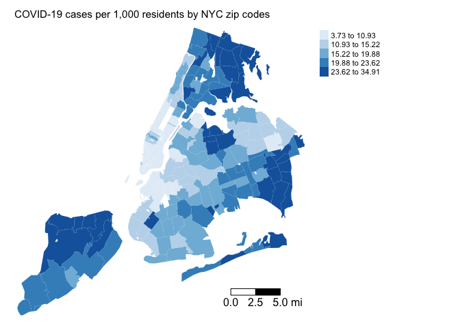
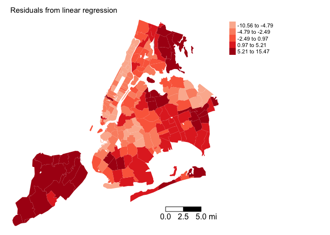
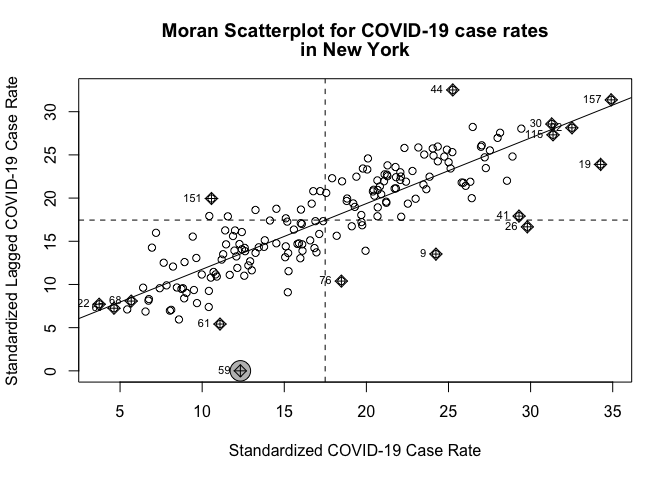

<style>
p.comment {
background-color: #DBDBDB;
padding: 10px;
border: 1px solid black;
margin-left: 25px;
border-radius: 5px;
}

.figure {
   margin-top: 20px;
   margin-bottom: 20px;
}

h1.title {
  font-weight: bold;
  font-family: Arial;  
}

h2.title {
  font-family: Arial;  
}

</style>


<style type="text/css">
#TOC {
  font-size: 13px;
  font-family: Arial;
}
</style>


\


In this lab guide, we formally incorporate spatial dependency between units of observations in a regression framework.  We will be closely following this week's handout and lecture on Spatial Regression. The objectives of this lab are as follows

1. Learn how to run and interpret a spatial lag model
2. Learn how to run and interpret a spatial error model
3. Learn how to decide between a standard linear regression, spatial lag, and spatial error model.

To help us accomplish these learning objectives, we will continue examining the association between neighborhood characteristics and COVID-19 case rates in New York City when COVID was first detected in the United States.

<div style="margin-bottom:25px;">
</div>
## **Installing and loading packages**
\

We’ll be using one new package in this lab, **spatialreg**, which contains the functions we need to perform spatial regression models in R. First, install the package if you have not already done so.
 

```r
install.packages("spatialreg")
```

Then load it and the other packages we'll be using in this lab.


```r
library(tidyverse)
library(sf)
library(spdep)
library(tmap)
library(spatialreg)
```


<div style="margin-bottom:25px;">
</div>
## **Why run a spatial regression**
\

The reasons why you run a spatial regression significantly overlap with the reasons for [running a regular linear regression](https://geo200cn.github.io/linearregression.html#Why_linear_regression).  However, there is one additional important motivation: to explicitly incorporate spatial dependency in the model.  There are two common flavors of spatial regression: the spatial error model (SEM) and the spatial lag model (SLM). The main reason to run a spatial error model is to control for general spatial autocorrelation.  We want to do this because spatial autocorrelation breaks the very important assumption that our regression errors are not correlated.  The main reason to run a spatial lag model is to formally model spatial contagion.  We are modelling the impact of our neighbors' outcomes on our own outcome. For example, the impact of nearby crime on neighborhood crime. Or the impact of a plot's crop yield on its neighboring plot's yield. 

So, in one case, we are using spatial regression because we see spatial dependency as a nuisance to control for. In the other case, we are using spatial regression because there is substantive interest in formally examining the impact of neighboring areas.

Our research questions in this lab is: What ecological characteristics are associated with zip code COVID-19 case rates in New York City? Do these relationships change after accounting for unobserved spatial dependency? Do nearby COVID-19 rates influence the rates in a neighborhood?


<div style="margin-bottom:25px;">
</div>
## **Bringing in the data**
\

We will bring in a shape file containing COVID-19 cases per 1,000 residents and demographic and socioeconomic characteristics for New York city zip codes. I zipped up the file and uploaded it onto Github.  Set your working directory to an appropriate folder and use the following code to download and unzip the file.  I also uploaded the file in Canvas in the Lab and Assignments Week 7 folder.


```r
#insert the pathway to the folder you want your data stored into
setwd("insert your pathway here")
#downloads file into your working directory 
download.file(url = "https://raw.githubusercontent.com/geo200cn/data/master/zctanyccovidwk7.zip", destfile = "zctanyccovidwk7.zip")
#unzips the zipped file
unzip(zipfile = "zctanyccovidwk7.zip")
```


Bring in the New York City zip code shape file into R using `st_read()`


```r
zctanyc <- st_read("zctanyccovidwk7.shp")
```

COVID-19 case data were downloaded from the [NYC Department of Health and Mental Hygiene](https://github.com/nychealth/coronavirus-data) (confirmed cases up through May 1, 2020).  Socioeconomic and demographic data were downloaded from the 2014-2018 [American Community Survey](https://www.census.gov/programs-surveys/acs). A record layout of the data can be found [here](https://raw.githubusercontent.com/geo200cn/data/master/zctanyccovidRL.txt).   

<div style="margin-bottom:25px;">
</div>
## **Basic multiple linear regression**
\

We're interested in examining the zip code characteristics associated with the number of COVID-19 cases per 1,000 residents.  We should first run through the various exploratory data analysis tools we went through [several weeks ago](https://geo200cn.github.io/eda.html) to get a feel for the data. We would then run a standard multiple linear regression model, which we should always do first before running any type of spatial regression model. Let's run the regression model we left off with in the last lab guide.  Our dependent variable is *covidrate* and our independent variables are percent black *pblk*, percent Hispanic *phisp*, median household income *medincome*, total population *totp*, and percent of residents 65 years old and older *p65old*. Use the function `lm()`.  Save the results in an object named *fit.ols*.


```r
#eliminate scientific notation
options(scipen=999)

fit.ols <- lm(covidrate ~  pblk + phisp +  medincome +totp + p65old, data = zctanyc)
```

What are the results? Use `summary()`


```r
summary(fit.ols)
```

```
## 
## Call:
## lm(formula = covidrate ~ pblk + phisp + medincome + totp + p65old, 
##     data = zctanyc)
## 
## Residuals:
##      Min       1Q   Median       3Q      Max 
## -10.5625  -4.2955  -0.8762   3.7455  15.4670 
## 
## Coefficients:
##                Estimate  Std. Error t value  Pr(>|t|)    
## (Intercept) 12.57451167  3.21496495   3.911  0.000132 ***
## pblk         0.09056056  0.02013347   4.498 0.0000126 ***
## phisp        0.12825817  0.03007490   4.265 0.0000331 ***
## medincome   -0.00004588  0.00001737  -2.642  0.009012 ** 
## totp        -0.00004357  0.00001757  -2.480  0.014097 *  
## p65old       0.36634418  0.09276337   3.949  0.000114 ***
## ---
## Signif. codes:  0 '***' 0.001 '**' 0.01 '*' 0.05 '.' 0.1 ' ' 1
## 
## Residual standard error: 5.48 on 171 degrees of freedom
## Multiple R-squared:  0.3767,	Adjusted R-squared:  0.3585 
## F-statistic: 20.67 on 5 and 171 DF,  p-value: 0.0000000000000004017
```

After running the standard linear regression model, use the various diagnostic tools we learned [last week](https://geo200cn.github.io/linearregression2.html) to test for the OLS assumptions and detect for multicollinearity.


<div style="margin-bottom:25px;">
</div>
## **Exploratory spatial data analysis**
\

The next step is to conduct an Exploratory Spatial Data Analysis (ESDA) to gain an understanding of how your data are spatially structured. Perhaps there is no spatial dependency present in your data. So, why fancy it up if when you don't need to? 

<div style="margin-bottom:25px;">
</div>
### **Map your data**
\

The first step in ESDA is to map your dependent variable.  Map the COVID-19 case rates


```r
tm_shape(zctanyc, unit = "mi") +
  tm_polygons(col = "covidrate", style = "quantile",palette = "Blues", 
              border.alpha = 0, title = "") +
  tm_scale_bar(breaks = c(0, 2.5, 5), text.size = 1, position = c("right", "bottom")) +
  tm_layout(main.title = "COVID-19 cases per 1,000 residents by NYC zip codes",  main.title.size = 0.95, frame = FALSE, legend.outside = TRUE)
```

<!-- -->


Does it look like our dependent variable exhibits spatial autocorrelation?

Next, you'll want to map the residuals from your OLS regression model. To extract the residuals from *fit.ols*, use the `resid()` function.  Save it back into *zctanyc*.


```r
zctanyc <- mutate(zctanyc, olsresid = resid(fit.ols))
```

Next, map the residuals


```r
tm_shape(zctanyc, unit = "mi") +
  tm_polygons(col = "olsresid", style = "quantile",palette = "Reds", 
              border.alpha = 0, title = "", midpoint = 0) +
  tm_scale_bar(breaks = c(0, 2.5, 5), text.size = 1, position = c("right", "bottom")) +
  tm_layout(main.title = "Residuals from linear regression",  main.title.size = 0.95, frame = FALSE, legend.outside = TRUE)
```

<!-- -->

Looks spatially clustered. 

<div style="margin-bottom:25px;">
</div>
### **Spatial weights matrix**
\

The exploratory maps show signs of spatial dependency. Rather than eyeballing it, let's formally test it using a measure of spatial autocorrelation.  Fortunately, we already know how to measure spatial autocorrelation thanks to a [previous lab](https://geo200cn.github.io/spatialautocorrelation.html).

We need to create a neighbor object and its associated spatial weights matrix. You need to define

1. Neighbor connectivity (who is you neighbor?)
2. Neighbor weights (how much does your neighbor matter?)


Neighbor relationships in R are represented by neighbor *nb* objects.  An *nb* object identifies the neighbors for each feature in the dataset.  We use the command `poly2nb()` from the **spdep** package to create a contiguity-based neighbor object.  Let's specify Queen connectivity.  


```r
nycb<-poly2nb(zctanyc, queen=T)
```

The other two neighbor types we discussed in the spatial autocorrelation lab include [k-nearest neighbor](https://geo200cn.github.io/spatialautocorrelation.html#Neighbor_connectivity:_k-nearest_neighbors) and [distance based neighbor](https://geo200cn.github.io/spatialautocorrelation.html#Neighbor_connectivity:_Distance).

The next step is to assign weights to each neighbor relationship. The weight determines *how much* each neighbor counts.  You will need to employ the `nb2listw()` command. Let's create a weights object *nycw* for our Queen contiguity defined neighbor object *nycb*.  We might have zero neighbor zip codes, so include the `zero.policy = TRUE` argument. 


```r
nycw<-nb2listw(nycb, style="W", zero.policy = TRUE)
```

Here, style = "W" indicates that the weights for each spatial unit are standardized to sum to 1 (this is known as row standardization).


<div style="margin-bottom:25px;">
</div>
### **Moran Scatterplot**
\

We’ve now defined what we mean by neighbor by creating an *nb* object and the influence of each neighbor by creating a spatial weights matrix.  Now we can examine the Moran scatter plot for the dependent variable *covidrate*.


```r
moran.plot(zctanyc$covidrate, listw=nycw, xlab="Standardized COVID-19 Case Rate", ylab="Standardized Lagged COVID-19 Case Rate",
main=c("Moran Scatterplot for COVID-19 case rates", "in New York"), zero.policy = TRUE )
```

<!-- -->

Does it look like there is an association? Yes.

<div style="margin-bottom:25px;">
</div>
### **Spatial autocorrelation**
\

The map and Moran scatter plot provide descriptive visualizations of clustering (autocorrelation) in COVID-19 case rates. But, rather than eyeballing the correlation, we can calculate a global index of spatial autocorrelation, and attach statistical significance to it.

The most popular test of spatial autocorrelation is the Global Moran’s I test. We'll use the command `moran.mc()` in the **spdep** package to calculate the Moran’s I using Monte Carlo simulation to obtain statistical inference. 

<br>

<p class="comment"> **Question 1**: Calculate the Moran's I for the outcome variable using 999 Monte Carlo simulations.  Is the outcome spatially autocorrelated?  </p>

We should also test spatial autocorrelation in the residuals. Use the `lm.morantest()` function.  

<p class="comment"> **Question 2**: Calculate the Moran's I for the residuals. Are the residuals spatially autocorrelated?  </p>

<br>

<div style="margin-bottom:25px;">
</div>
## **Spatial lag model**
\

Based on the exploratory mapping, Moran scatter plot, and the Moran's I, there appears to be spatial autocorrelation in the dependent variable.  This means that if there is a spatial lag process going on and we fit an OLS model our coefficients will be biased and inefficient.  That is, the coefficient size and sign are not close to their true value and its standard errors are underestimated. This means [trouble](https://www.youtube.com/watch?v=FPzI4dpEcF8). [Big trouble](https://www.youtube.com/watch?v=cGIIhcMCquc). [Real big trouble](https://www.youtube.com/watch?v=AXsBBqPb5YE).

A spatial lag model (SLM) can be estimated in R using the command `lagsarlm()`, which is in the **spatialreg** package.   Fit the SLM


```r
fit.lag<-lagsarlm(covidrate ~  pblk + phisp +  medincome +totp + p65old, data = zctanyc, listw = nycw, zero.policy=TRUE) 
```

The only difference between the code for `lm()` and `lagsarlm()` is the argument `listw`, which you use to specify the spatial weights matrix.  Also note that `lm()` uses OLS to estimate the model whereas `lagsarlm()` uses [Maximum Likelihood Estimation](https://online.stat.psu.edu/stat415/lesson/1/1.2).

Let's calculate the Moran's I on the model's residuals


```r
moran.mc(resid(fit.lag), nycw, nsim=999, zero.policy=TRUE)
```

```
## 
## 	Monte-Carlo simulation of Moran I
## 
## data:  resid(fit.lag) 
## weights: nycw  
## number of simulations + 1: 1000 
## 
## statistic = 0.023944, observed rank = 729, p-value = 0.271
## alternative hypothesis: greater
```

A summary of results


```r
summary(fit.lag)
```

```
## 
## Call:lagsarlm(formula = covidrate ~ pblk + phisp + medincome + totp + 
##     p65old, data = zctanyc, listw = nycw, zero.policy = TRUE)
## 
## Residuals:
##      Min       1Q   Median       3Q      Max 
## -7.70893 -2.21115 -0.51621  2.03252 12.76569 
## 
## Type: lag 
## Regions with no neighbours included:
##  59 
## Coefficients: (asymptotic standard errors) 
##                 Estimate   Std. Error z value Pr(>|z|)
## (Intercept)  2.181482373  2.056079141  1.0610 0.288694
## pblk         0.040057707  0.013213379  3.0316 0.002433
## phisp        0.062861580  0.020085387  3.1297 0.001750
## medincome   -0.000014023  0.000010870 -1.2900 0.197057
## totp        -0.000023471  0.000010986 -2.1365 0.032641
## p65old       0.186119523  0.059389122  3.1339 0.001725
## 
## Rho: 0.70864, LR test value: 132.91, p-value: < 0.000000000000000222
## Asymptotic standard error: 0.046717
##     z-value: 15.169, p-value: < 0.000000000000000222
## Wald statistic: 230.09, p-value: < 0.000000000000000222
## 
## Log likelihood: -482.7463 for lag model
## ML residual variance (sigma squared): 11.661, (sigma: 3.4148)
## Number of observations: 177 
## Number of parameters estimated: 8 
## AIC: 981.49, (AIC for lm: 1112.4)
## LM test for residual autocorrelation
## test value: 0.54636, p-value: 0.45981
```

The results are formatted in a similar way as the OLS results. The major difference is the inclusion of the results for the spatial lag coefficient labelled "Rho".  R provides different ways to test the statistical significance of Rho depending on the null distribution. Right next to Rho, R shows the LR test value and its associated p-value. Below Rho is the test statistic "z-value" and its associated p-value, which are based on the standard normal distribution. Finally, R shows the Wald statistic and its associated p-value.  To be clear, all are testing the statistical significance of the spatial lag term (null hypothesis is Rho is equal to 0).

<br>

<p class="comment"> **Question 3**: What are the null and alternative hypotheses for the test of the coefficient Rho?  </p>


<p class="comment"> **Question 4**: In your own words, interpret the meaning of the coefficient pblk value 0.040057707.  </p>

<br>

As described in lecture, we'll need to estimate the direct and indirect effects to get the total effects of each variable on the outcome.  To do this, use the function `impacts()`.  You need to include the lag model object, the spatial weights matrix, and the number of Monte Carlo simulations to obtain simulated distributions of the impacts (this used primarily for getting the standard errors for statistical inference).


```r
fit.lag.effects <- impacts(fit.lag, listw = nycw, R = 999)
fit.lag.effects
```

```
## Impact measures (lag, exact):
##                   Direct       Indirect          Total
## pblk       0.04856330610  0.08892199157  0.13748529767
## phisp      0.07620920924  0.13954310786  0.21575231710
## medincome -0.00001700018 -0.00003112824 -0.00004812842
## totp      -0.00002845456 -0.00005210181 -0.00008055636
## p65old     0.22563896245  0.41315691883  0.63879588128
```

To get the standard errors, you use the `summary()` function and ask it to report the test statistic (*Z*) and the associated p-values.


```r
summary(fit.lag.effects, zstats = TRUE, short = TRUE)
```

```
## Impact measures (lag, exact):
##                   Direct       Indirect          Total
## pblk       0.04856330610  0.08892199157  0.13748529767
## phisp      0.07620920924  0.13954310786  0.21575231710
## medincome -0.00001700018 -0.00003112824 -0.00004812842
## totp      -0.00002845456 -0.00005210181 -0.00008055636
## p65old     0.22563896245  0.41315691883  0.63879588128
## ========================================================
## Simulation results ( variance matrix):
## ========================================================
## Simulated standard errors
##                  Direct      Indirect         Total
## pblk      0.01557869964 0.03119251231 0.04494148517
## phisp     0.02297539656 0.04582889942 0.06559027606
## medincome 0.00001301256 0.00002563818 0.00003825134
## totp      0.00001351677 0.00002896489 0.00004166174
## p65old    0.07339886572 0.15549607666 0.22024836038
## 
## Simulated z-values:
##              Direct  Indirect     Total
## pblk       3.074927  2.839278  3.036561
## phisp      3.314189  3.071947  3.307331
## medincome -1.315059 -1.245481 -1.282156
## totp      -2.095123 -1.839402 -1.958568
## p65old     3.082009  2.711698  2.941563
## 
## Simulated p-values:
##           Direct     Indirect  Total     
## pblk      0.00210554 0.0045216 0.00239293
## phisp     0.00091909 0.0021267 0.00094189
## medincome 0.18848993 0.2129549 0.19978809
## totp      0.03616010 0.0658561 0.05016337
## p65old    0.00205609 0.0066939 0.00326560
```

<br>

<p class="comment"> **Question 5**: In your own words, interpret the meaning of the direct and indirect effects of pblk. </p>

<br>


<div style="margin-bottom:25px;">
</div>
## **Spatial error model**
\

The spatial error model (SEM) incorporates spatial dependence in the errors. If there is a spatial error process going on and we fit an OLS model our coefficients will be unbiased but inefficient.  That is, the coefficient size and sign are asymptotically correct but its standard errors are underestimated. 

We can estimate a  spatial error model in R using the command `errorsarlm()` also in the **spatialreg** package.


```r
fit.err<-errorsarlm(covidrate ~  pblk + phisp +  medincome +totp + p65old, data = zctanyc, listw = nycw, zero.policy=TRUE) 
```

And the Moran's I of the residuals


```r
moran.mc(resid(fit.err), nycw, nsim=999, zero.policy=TRUE)
```

```
## 
## 	Monte-Carlo simulation of Moran I
## 
## data:  resid(fit.err) 
## weights: nycw  
## number of simulations + 1: 1000 
## 
## statistic = -0.04723, observed rank = 201, p-value = 0.799
## alternative hypothesis: greater
```

[Are the residuals spatially autocorrelated?](https://www.youtube.com/watch?v=GM-e46xdcUo)

A summary of the model


```r
summary(fit.err)
```

```
## 
## Call:errorsarlm(formula = covidrate ~ pblk + phisp + medincome + totp + 
##     p65old, data = zctanyc, listw = nycw, zero.policy = TRUE)
## 
## Residuals:
##     Min      1Q  Median      3Q     Max 
## -7.2334 -1.9737 -0.3498  1.6442 13.4324 
## 
## Type: error 
## Regions with no neighbours included:
##  59 
## Coefficients: (asymptotic standard errors) 
##                 Estimate   Std. Error z value    Pr(>|z|)
## (Intercept) 12.226926447  2.689463319  4.5462 0.000005461
## pblk         0.061604533  0.022419247  2.7478    0.005999
## phisp        0.122124864  0.029625877  4.1222 0.000037521
## medincome   -0.000019168  0.000014531 -1.3191    0.187120
## totp        -0.000020288  0.000011160 -1.8180    0.069068
## p65old       0.188907342  0.070122943  2.6939    0.007061
## 
## Lambda: 0.78837, LR test value: 136.64, p-value: < 0.000000000000000222
## Asymptotic standard error: 0.042485
##     z-value: 18.556, p-value: < 0.000000000000000222
## Wald statistic: 344.34, p-value: < 0.000000000000000222
## 
## Log likelihood: -480.8819 for error model
## ML residual variance (sigma squared): 10.804, (sigma: 3.287)
## Number of observations: 177 
## Number of parameters estimated: 8 
## AIC: 977.76, (AIC for lm: 1112.4)
```

<br>

<p class="comment"> **Question 6**: In your own words, interpret the meaning of the spatial error lag coefficient Lambda value 0.78837. </p>

<p class="comment"> **Question 7**: Explain the differences and similarities in the interpretation of the coefficient on *medincome* in the OLS, Spatial Lag and Spatial Error models.  </p>

<br>

<div style="margin-bottom:25px;">
</div>
## **Model Selection**
\

We've run all three models, so the question then is which one to choose: OLS, Spatial lag, or Spatial error? You can make this decision a couple of ways. First, rely on comparisons of goodness of fit measures, specifically the Akaike Information Criterion (AIC) and Bayesian Information Criterion (BIC). Second, run formal hypothesis tests comparing the models using Lagrange Multiplier tests.

<div style="margin-bottom:25px;">
</div>
### **AIC and BIC**
\

AIC and BIC rely on the log likelihood, which captures the probability of the observed data given the model parameters. The lower the AIC and BIC, the better model fit.  Rather than rely on one vs another, in general, it might be best to use AIC and BIC together in model selection. 

The `lagsarlm()` and `errorsarlm()` already provide the AIC at the bottom of the summary output.  But, you can call it up by using the `AIC()` function.  To get the BIC, use the function `BIC()`

<br>

<p class="comment"> **Question 8**:  Run the AIC and BIC for the OLS, SLM and SEM models.  Based on the AIC and BIC, which model would you choose and why?  </p>


<div style="margin-bottom:25px;">
</div>
### **Lagrange Multiplier Tests**
\

A popular set of tests to determine the appropriate model was proposed by [Anselin (1988)](https://onlinelibrary.wiley.com/doi/abs/10.1111/j.1538-4632.1988.tb00159.x) (also see [Anselin et al. 1996](https://www.sciencedirect.com/science/article/abs/pii/0166046295021116)),  These tests are elegantly known as Lagrange Multiplier (LM) tests and are discussed by Chi and Zhu throughout Chapter 3. The null in these tests is the OLS model.  A test showing statistical significance rejects this null. 

The LM test uses the likelihood of the models being compared to assess their fit. The likelihood is the probability the data given the parameter estimates.  The goal of a model is to find values for the regression coefficients that maximize the likelihood, that is, to find the set of parameter estimates that make the data most likely. The Lagrange multiplier compares the likelihood of two models.  In our case, you are comparing whether the likelihood of a spatial model (alternative) is statistically higher than that of an OLS (null). We'll use $LM_{lag}$ to refer to a test of SLM vs. OLS and $LM_{err}$ to refer to a test of SEM vs. OLS.

The issue with the Lagrange Multiplier test is when you are comparing the OLS to the spatial lag, you are not taking into account the presence of the spatial error (and vice versa).  In other words, a test of the SLM against the null of an OLS may be rejecting the null in the presence of the spatial error model.  Recognizing this issue, [Anselin et al. (1996)](https://www.sciencedirect.com/science/article/abs/pii/0166046295021116) make an asymptotic adjustment to the LM test to correct for this.  They formulate robust versions of the LM tests - robust to the presence of the other spatial model.  


We will not go into great detail on how these LM tests are derived.  If you are interested in these details, I suggest reading [Anselin (1988)](https://onlinelibrary.wiley.com/doi/abs/10.1111/j.1538-4632.1988.tb00159.x), which formulates the non robust LM tests, and [Anselin et al. (1996)](https://www.sciencedirect.com/science/article/abs/pii/0166046295021116), which constructs the robust LM tests.


We're still not quite there in terms of how to choose between the three different models.  The LM test tests  between the OLS and SLM and the OLS and SEM, but cannot directly compare SLM and SEM.  The SLM and SEM  are non-nested models (the OLS is a nested model of SLM - take out $Wy$ and you get the OLS), and thus statistical tests like the LM (and others using the likelihood and other fit statistics) cannot make direct comparisons.  However, Anselin (1996) formulated a set of decision steps using the LM tests to decide between SLM and SEM (and OLS).  The steps are as follows

<br>

1. Run the non robust LM tests. If neither $LM_{lag}$ nor $LM_{err}$ reject the null, go with the OLS.
2. If one of $LM_{lag}$ or $LM_{err}$ rejects the null but the other does not, select the model that rejects the null
3. When both reject the null, turn to the robust LM tests
4. If one of robust $LM_{lag}$ or robust $LM_{err}$ rejects the null but the other does not, select the model that rejects the null
5. When both reject the null, choose the one that is "More significant" (higher LM test statistic)

<br>

Although it is important to run these tests, whether SLM or SEM is most appropriate is really a prior theoretical question, which must be considered relative to the goals of a specific research question. If we expect to see, or are interested in estimating, spatial feedback, then SLM would be a more appropriate model.  For example, if you are interested in understanding whether crime diffuses across neighborhood borders, an SLM is the most appropriate model.  If you are interested in understanding whether airbnb rates in a neighborhood are influenced by the airbnb rates in nearby neighbors, run SLM.  If you are interested in simply controlling for spatial dependency as a nuisance, run an SEM.


To run the LM tests in R, use the `lm.LMtests()` command in the **spatialreg** package.  The argument `test = "all"` runs all the tests.  You should look at *LMerr* (Spatial Error), *LMlag* (Spatial Lag), *RLMerr* (Robust Spatial Error) and *RLMlag* (Robust Spatial Lag).


```r
lm.LMtests(fit.ols, listw = nycw, test = "all", zero.policy=TRUE)
```

```
## 
## 	Lagrange multiplier diagnostics for spatial dependence
## 
## data:  
## model: lm(formula = covidrate ~ pblk + phisp + medincome + totp +
## p65old, data = zctanyc)
## weights: nycw
## 
## LMerr = 139.96, df = 1, p-value < 0.00000000000000022
## 
## 
## 	Lagrange multiplier diagnostics for spatial dependence
## 
## data:  
## model: lm(formula = covidrate ~ pblk + phisp + medincome + totp +
## p65old, data = zctanyc)
## weights: nycw
## 
## LMlag = 137.42, df = 1, p-value < 0.00000000000000022
## 
## 
## 	Lagrange multiplier diagnostics for spatial dependence
## 
## data:  
## model: lm(formula = covidrate ~ pblk + phisp + medincome + totp +
## p65old, data = zctanyc)
## weights: nycw
## 
## RLMerr = 11.124, df = 1, p-value = 0.0008521
## 
## 
## 	Lagrange multiplier diagnostics for spatial dependence
## 
## data:  
## model: lm(formula = covidrate ~ pblk + phisp + medincome + totp +
## p65old, data = zctanyc)
## weights: nycw
## 
## RLMlag = 8.5867, df = 1, p-value = 0.003386
## 
## 
## 	Lagrange multiplier diagnostics for spatial dependence
## 
## data:  
## model: lm(formula = covidrate ~ pblk + phisp + medincome + totp +
## p65old, data = zctanyc)
## weights: nycw
## 
## SARMA = 148.55, df = 2, p-value < 0.00000000000000022
```


<br>

<p class="comment">**Question 9**: Using the steps outlined in the Handout, specify which model is "best" based on the LM test results? Explain why. </p>


***

<a rel="license" href="http://creativecommons.org/licenses/by-nc/4.0/"></a><br />This work is licensed under a <a rel="license" href="http://creativecommons.org/licenses/by-nc/4.0/">Creative Commons Attribution-NonCommercial 4.0 International License</a>.


Website created and maintained by [Noli Brazil](https://nbrazil.faculty.ucdavis.edu/)
