<style>
p.comment {
background-color: #DBDBDB;
padding: 10px;
border: 1px solid black;
margin-left: 25px;
border-radius: 5px;
font-style: italic;
}

.figure {
   margin-top: 20px;
   margin-bottom: 20px;
}

h1.title {
  font-weight: bold;
  font-family: Arial;  
}

h2.title {
  font-family: Arial;  
}

</style>


<style type="text/css">
#TOC {
  font-size: 13px;
  font-family: Arial;
}
</style>


\


In the first few  labs of the class, we went through the base and tidy approaches to processing *nonspatial* data in R. We're now transitioning out of the statistical foundations portion of the course and into spatial descriptive and inferential data analysis.  As such, last lab and this lab will focus on acquiring the skills needed to process and present *spatial* data in R.  We're focusing on vector data.  We'll cover raster data later in the quarter. 

Unsurprisingly, there is more than one way to process spatial data in R. The two major packages for processing spatial data are **sp** and **sf**. In the last lab, you went through **sp**. This guide will go through the **sf** package. There are other packages that deal with other spatial data types, which we will cover as they come up.

You might be wondering why go through both **sp** and **sf**. Just pick one!! Well, just like with base and tidy R, **sp** and **sf** are two separate approaches.  And both approaches are important to understanding the ecosystem of spatial analysis tools available in R.  The one really important difference between the two packages is that **sf** is tidy friendly.  Which means we can use most of the functions we went through in the [tidy R lab](https://geo200cn.github.io/tidyr) to clean and process **sf** spatial objects.  As you likely have already discovered in last lab, **sp** objects are complicated. In contrast, **sf** objects are relatively straight forward to understand.

The best references for **sf** and, more broadly, cleaning, managing and analyzing spatial data in R are [Geocomputation with R](https://geocompr.robinlovelace.net/) (GWR) and [Spatial Data Science](https://keen-swartz-3146c4.netlify.com/) (SDS).  The SDS book is not complete, but what is there is really good (albeit a bit more complex in terms of the coding). Both are freely available through the links provided.  This guide relies heavily on these textbooks.


<div style="margin-bottom:25px;">
</div>
## **Installing and loading packages**
\


Install **sf** if you have not already done so. The following code checks if you've already installed the package.  If you haven't, it will install it.


```r
if (!require("sf")) install.packages("sf")
```

We will also be using the packages **rmapshaper** and **tmap** in this lab.


```r
if (!require("rmapshaper")) install.packages("rmapshaper")
if (!require("tmap")) install.packages("tmap")
```

Load **sf** and **rmapshaper** using `library()`.  We'll also be using the package **tidyverse**, so load it up as well.  Remember, you always need to use `library()` at the top of your R Markdown files.


```r
library(sf)
library(rmapshaper)
library(tmap)
library(tidyverse)
```


<div style="margin-bottom:25px;">
</div>
## **sf package**
\

The **sf** package conceives of spatial objects as **s**imple **f**eatures. What is a feature? A feature is thought of as a thing, or an object in the real world, such as a building or a tree. A county can be a feature. As can a city and a neighborhood. Features have a geometry describing where on Earth the features are located, and they have attributes, which describe other properties.  The main application of simple feature geometries is to describe two-dimensional geometries by points, lines, or polygons. The “simple” adjective refers to the fact that the line or polygon geometries are represented by sequences of points connected with straight lines.

The most commonly used simple features geometries, used to represent a single feature are:

* POINT: A single point geometry (e.g. A tree)
* MULTIPOINT: Set of points (e.g. A forest of trees)
* LINESTRING: Single line (e.g. An alley)
* MULTILINESTRING: Set of lines (e.g. Streets in Davis)
* POLYGON: A single polygon (e.g. City of Davis)
* MULTIPOLYGON: Set of polygons (e.g. All cities in Yolo county)
* GEOMETRYCOLLECTION: Set of the geometries above

We won't go through the intricacies and nitty gritty details of **sf** objects as it is beyond the scope of this class. If you want to take a deeper dive in **sf**, I recommend going through [Chapter 3](https://keen-swartz-3146c4.netlify.com/geometries.html) in SDS.


<div style="margin-bottom:25px;">
</div>
## **Reading spatial data**
\

The function for reading in spatial data into R is `st_read()`.  The shapefile is the most commonly used file format for vector data.  I zipped up and uploaded onto GitHub a folder containing four shapefiles. Set your working directory to an appropriate folder and use the following code to download and unzip the file.


```r
setwd("insert your pathway here")
download.file(url = "https://raw.githubusercontent.com/geo200cn/data/master/spatialsflab.zip", destfile = "spatialsflab.zip")
unzip(zipfile = "spatialsflab.zip")
```

Don’t worry if you don’t understand these commands - they are more for you to simply copy and paste so that you can download files that I zipped up and uploaded onto GitHub. You can look at the help documentation for each function if you are curious. The data is also located on Canvas in the Lab and Assignments Week 4 folder. 

You should see four shapefiles in the folder you specified in `setwd()`: *californiatracts.shp*, *sacmetroarea.shp*, *sacramentocity.shp*, and *city_trees.shp*. First, bring in *californiatracts.shp*, which contains non-Hispanic white and total population for all [census tracts](https://www2.census.gov/geo/pdfs/education/CensusTracts.pdf) in California.


```r
ca.tracts <- st_read("californiatracts.shp", stringsAsFactors = FALSE)
```


The argument `stringsAsFactors = FALSE` tells R to keep any variables that look like a character as a character and not a factor.  Next, bring in *sacmetroarea.shp*, which contains Sacramento [metropolitan area](https://www2.census.gov/geo/pdfs/reference/GARM/Ch13GARM.pdf) boundaries. 


```r
sac.metro <- st_read("sacmetroarea.shp", stringsAsFactors = FALSE)
```


Finally, bring in *sacramentocity.shp*, which contains Sacramento [city](https://www.census.gov/content/dam/Census/data/developers/understandingplace.pdf) boundaries


```r
sac.city <- st_read("sacramentocity.shp", stringsAsFactors = FALSE)
```


We will bring in *city_trees.shp* later in the lab.

You can bring in other types of spatial data other than shapefiles.  See a list of these file types [here](https://cran.r-project.org/web/packages/sf/vignettes/sf2.htmls).


<div style="margin-bottom:25px;">
</div>
## **Data manipulation**
\

There is a lot of stuff [behind the curtain](https://r-spatial.github.io/sf/articles/sf1.html) of how R handles spatial data as simple features, but the main takeaway is that **sf** objects are data frames.  This means that they are tidy friendly.  You can use many of the functions we've learned in the past couple labs to manipulate **sf** objects, and this includes our new best bud the pipe `%>%` operator.  For example, let's do the following data wrangling tasks on *ca.tracts*.

1. Convert the dataset from long to wide
2. Create the variable *pwh* which is the percent of the tract population that is non-Hispanic white
3. Break up the column *NAME* into separate tract, county and state variables using the `separate()` function

We do all of this in one line of continuous code using the pipe operator `%>%`


```r
ca.tracts <- ca.tracts %>%
            spread(key = variable, value = estimate) %>%
            mutate(pwh = nhwhite/tpopr) %>%
            separate(NAME, into = c("tract", "county", "state"), sep=", ")
```


The main takeaway: **sf** objects are tidy friendly, so you can use many of the tidy functions you learned in the tidy R lab on these objects to manipulate your data set.  This includes the function `ggplot()`, which we can use to map the data. We'll go into more detail later in this lab on how to use `ggplot()` for mapping, so for now just type in


```r
ggplot(ca.tracts) + geom_sf()
```

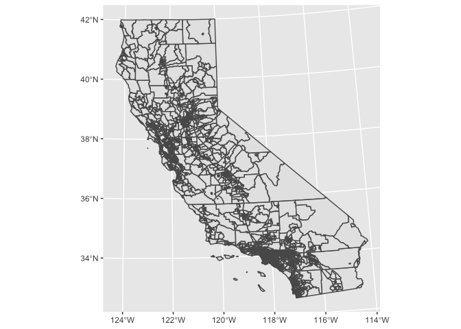<!-- -->

<br>

So, the geom for mapping is `geom_sf()`. If you are getting the following error when you map

````
---
Error in grid.Call(C_textBounds, as.graphicsAnnot(x$label), x$x, x$y,  : 
  polygon edge not found
---
````

rerun the code.  Keep rerunning it until the error does not come up. This is an [internal issue](https://github.com/tidyverse/ggplot2/issues/2252) that has not been resolved. If you are getting an error about R not being able to find the function `geom_sf()` see [here](https://stackoverflow.com/questions/46817128/error-could-not-find-function-geom-sf?rq=1) for some guidance.


<div style="margin-bottom:25px;">
</div>
## **Spatial data manipulation**
\

The **sf** package offers a suite of functions unique to managing and transforming spatial data. Most of these functions start out with the prefix `st_`.  The main umbrella function is `st_join()`.

We won’t go through all of the functions as the list is quite extensive. Check either the GWR or SDS sources linked above to learn more.  But, let’s go through some of the more important functions.


<div style="margin-bottom:25px;">
</div>
### **Intersect and Disjoint**
\

A common spatial data wrangling issue is to subset a set of spatial objects based on their location relative to another spatial object.  For example, we want to keep California tracts that are in the Sacramento metro area.  Think of what were doing here as something similar to taking a cookie cutter shaped like the Sacramento metro area (in our case, the **sf** object *sac.metro*) and cutting out the metro area from our cookie dough of census tracts (*ca.tracts*).  We can do this using the `join = st_intersects` argument within the`st_join()` function.


```r
sac.metro.tracts.int <- st_join(x = ca.tracts, y = sac.metro, 
                               join = st_intersects, left=FALSE)
```

The above code tells R to identify the polygons in *ca.tracts* that intersect with the polygon *sac.metro*.  We indicate we want a polygon intersection by specifying `join = st_intersects`.  The option `left=FALSE` tells R to eliminate the polygons from *ca.tracts* that do not intersect (make it `TRUE` and see what happens).

Mapping the Sacramento metropolitan area boundary *sac.metro* in red onto these cut out tracts in blue, we get


```r
ggplot() + 
  geom_sf(data = sac.metro.tracts.int, fill = "blue") +
  geom_sf(data = sac.metro, fill = NA, color = "red")
```

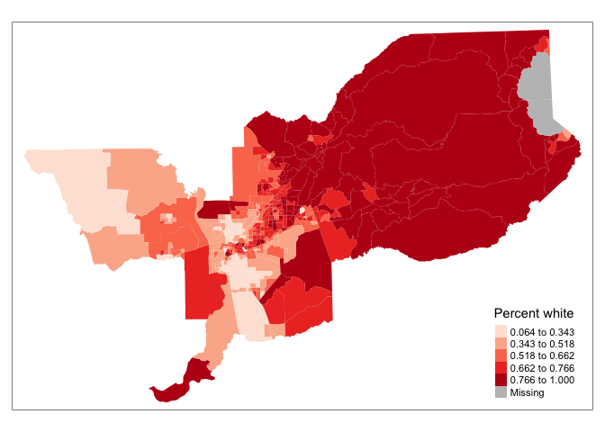<!-- -->

The map shows that the `st_join()` code we ran above returns all tracts that **intersect** *sac.metro*, which include those that **touch** the metro's boundary. So, we have tracts that are not actually inside the metro area boundaries but touch them.  We'll get to how we resolve this problem shortly.

The opposite of `st_intersects` is `st_disjoint`. If two geometries are disjoint, they do not intersect, and vice-versa. 


```r
sac.metro.tracts.dis <- st_join(x = ca.tracts, y = sac.metro, 
                               join = st_disjoint, left=FALSE)
```


```r
ggplot() + 
  geom_sf(data = sac.metro.tracts.dis, fill = "blue") +
  geom_sf(data = sac.metro, fill = NA, color = "red")
```

<!-- -->


<div style="margin-bottom:25px;">
</div>
### **Within and Overlap**
\

As we saw above, `st_intersects()` returns tracts that touch the Sacramento metropolitan area. We can use  `join = st_within()` to return tracts that are completely *within* the metro. 


```r
# subset ca.tracts to those in sac.metro
sac.metro.tracts.w <- st_join(ca.tracts, sac.metro, join = st_within, left=FALSE)

ggplot() + 
    geom_sf(data = sac.metro.tracts.w, fill = "blue") +
    geom_sf(data = sac.metro, fill = NA, color = "red")
```

<!-- -->

Perfect, this is what we wanted in the first place: census tracts located in the Sacramento metropolitan area boundary.

If you look at *sac.metro.tracts.w*'s attribute table, you'll see it includes all the variables from both *ca.tracts* and *sac.metro*. We don't need all of these variables, so use `select()` to filter them out.  You'll also notice that if variables from different data objects being joined together share the same name, `st_join()` (and also `left_join()`) will keep both and attach a *.x* and *.y*  to the end. For example, *GEOID* was found in both *ca.tracts* and *sac.metro*, so R named one *GEOID.x* and the other that was merged in was named *GEOID.y*.  You can use the `rename()` function to rename these variables.


```r
names(sac.metro.tracts.w)
```

```
##  [1] "GEOID.x"  "tract"    "county"   "state"    "nhwhite"  "tpopr"   
##  [7] "pwh"      "CSAFP"    "CBSAFP"   "AFFGEOID" "GEOID.y"  "NAME"    
## [13] "LSAD"     "ALAND"    "AWATER"   "geometry"
```


The opposite of `st_within` is `st_overlaps`.  Because tracts are completely nested within the Sacramento metropolitan area, you should get nothing in return when using `st_overlaps`


```r
# subset ca.tracts to those in sac.metro
sac.metro.tracts.o <- st_join(ca.tracts, sac.metro, join = st_overlaps, left=FALSE)

ggplot() + 
    geom_sf(data = sac.metro.tracts.o, fill = "blue") +
    geom_sf(data = sac.metro, fill = NA, color = "red")
```

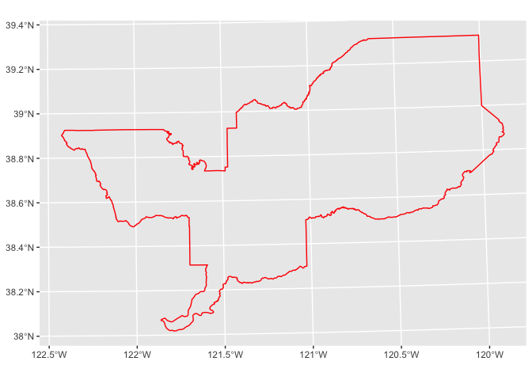<!-- -->

This is not the case if you look at Sacramento city, where tracts overlap city boundaries.  Compare `st_within` and `st_overlap` using *sac.city*


```r
# subset ca.tracts to those in sac.metro
sac.city.tracts.w <- st_join(ca.tracts, sac.city, join = st_within, left=FALSE)

sac.city.tracts.o <- st_join(ca.tracts, sac.city, join = st_overlaps, left=FALSE)
```

First, within


```r
ggplot() + 
    geom_sf(data = sac.city.tracts.w, fill = "blue") +
    geom_sf(data = sac.city, fill = NA, color = "red")
```

<!-- -->

Next overlaps


```r
ggplot() + 
    geom_sf(data = sac.city.tracts.o, fill = "blue") +
    geom_sf(data = sac.city, fill = NA, color = "red")
```

<!-- -->

Census tracts are nested within metropolitan areas, but are not nested within city boundaries.  There are tracts that cross city boundaries.  

<div style="margin-bottom:25px;">
</div>
### **Clipping**
\

Census tracts neatly fall within a metropolitan area's boundary.  In other words, tracts don't spill over.  But, as we see in the above two maps, tracts spill over city boundaries.  What if you wanted to just keep the portion of overlapping tracts that is in the city? You would clip the tract.  There is no clipping feature within the `st_join` function (or, rather, there is but it is a little iffy).  As such, we use the function `ms_clip()` which is in the [**rmapshaper**](https://cran.r-project.org/web/packages/rmapshaper/rmapshaper.pdf) package.

Because spatial data are not always precise, when you clip you'll sometimes get unwanted [sliver polygons](https://desktop.arcgis.com/en/arcmap/latest/manage-data/editing-fundamentals/removing-slivers-or-gaps-between-polygons.htm). 


```r
sac.city.tracts.c <- ms_clip(target = ca.tracts, clip = sac.city, remove_slivers = TRUE)
```

The argument `remove_slivers = TRUE` removes these slivers. Let's map what we've got.


```r
ggplot() + 
    geom_sf(data = sac.city.tracts.c, fill = "blue") +
    geom_sf(data = sac.city, fill = NA, color = "red")
```

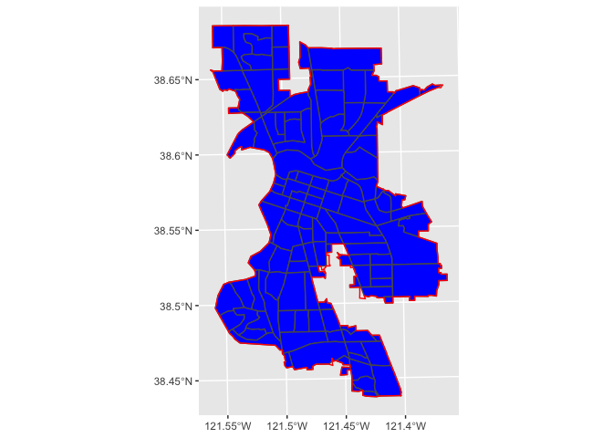<!-- -->


<div style="margin-bottom:25px;">
</div>
### **Calculate the area**
\

Another useful `st_` function is `st_area()`, which calculates the area of a polygon. You might need the area, for example, if you want to calculate the density of something (e.g. the number of residents, crimes or trees per meters squared). To calculate the area, just plug in your **sf** polygon object inside `st_area()`. Let’s find the area of *sac.city.tracts.w* and save it to a vector named *area*


```r
area <- st_area(sac.city.tracts.c)
```

We find that the object *area* is of class "units"


```r
class(area)
```

```
## [1] "units"
```

And area is in meters squared


```r
area
```

```
## Units: [m^2]
##   [1] 2326268.8 1512047.3 1462933.4  974745.3  865775.3  403236.9  498744.7
##   [8]  567853.8 1577281.7  667605.6  792468.3  794568.8 1744615.4 3054715.2
##  [15] 3522911.7 1716379.1 1105738.7 1037456.1 1540992.3 2724652.7 1218095.8
##  [22] 3222368.4  985066.2  934778.9 1283316.9  924532.4 2317653.4 2572397.7
##  [29] 1251958.1 1155627.5 1653783.4  983980.8 1599103.2 2381395.3 2259869.0
##  [36] 1195600.9 1259569.5 1269521.5 1427616.0 4901732.3 2434454.8 3411468.9
##  [43] 2995153.1 2178503.8 1967626.2 1651736.4 1887060.6 1645395.0 1207395.8
##  [50] 2022508.9 2027529.6 1904651.1 1624834.8 1646103.4 3769640.5  639050.9
##  [57]  251386.4  709021.5  539369.9  335670.4 1621829.7  279820.8 1780079.7
##  [64]  429864.1 1712352.1  952133.5  209405.1 2054957.6 1874149.7 2592924.3
##  [71] 8902444.3 6240388.8 5011894.0 1297105.6 1139244.7 2196478.2 1242201.9
##  [78] 2812390.7 3460566.3 3886719.3 2212094.3 3288505.5 3924861.2 2470537.7
##  [85] 5288852.8 3250739.2 2862545.1 3884454.1 2661186.0 1960695.0 1048292.3
##  [92]  673054.2 1978339.7 3165300.5 2176262.2  882787.9 4827186.5 2547137.3
##  [99] 2460739.2 2542771.7 4442269.6 2189243.1 2228108.2 1951035.3 3310514.1
## [106] 1858697.4 8182504.9 2844055.5  443556.4 8481213.0 6179993.9 2713099.1
## [113] 3773768.8 1460527.6 1871312.8  562668.0  707238.6  704788.6 1178694.5
## [120]  491649.3
```

Let’s convert it from type "units" to type "numeric" by using the function `as.numeric()` and save it back into *sac.city.tracts.c* using the `mutate()` function


```r
sac.city.tracts.w <- mutate(sac.city.tracts.c, area = as.numeric(st_area(sac.city.tracts.c)))
```

You should find that the variable *area* is now in your dataset.


```r
names(sac.city.tracts.c)
```

```
## [1] "GEOID"    "tract"    "county"   "state"    "nhwhite"  "tpopr"    "pwh"     
## [8] "geometry"
```

<div style="margin-bottom:25px;">
</div>
### **Aggregate**
\

Spatial aggregation involves either summing up the number or the attribute values of geometric features located within another geometric feature.  In the **tidyverse**, this is easily done by using the `summarize()` function.

For example, let's say we wanted to add the total population within the 58 counties in California using census tract data.  We have the variable *county* that we created above that identifies the county that each tract resides in.


```r
counties <- ca.tracts %>% group_by(county) %>%
  summarize(pop = sum(tpopr, na.rm = TRUE))
```

You'll notice that the data frame *counties* contains 58 counties. What is going on in terms of the geometries? Behind the scenes, `summarize()` combines the geometries and dissolves the boundaries between them using the function ` st_union()`.

<div style="margin-bottom:25px;">
</div>
### **Point data**
\

Aggregation also means adding up the number of features within a polygon. A typical task is to add the number of points within an area.  This is known as a points-in-polygon operation.  To illustrate this operation, bring in the shapefile *city_trees.shp*, which contains tree site locations maintained by the Urban Forestry section of the Department of Public Works downloaded from the [City of Sacramento Open Data GIS Portal](https://data.cityofsacramento.org/datasets/b9b716e09b5048179ab648bb4518452b_0).


```r
trees <- st_read("city_trees.shp", stringsAsFactors = FALSE)
```

We combine the functions `st_join()` and `summarize()` to get the number of trees located in each Sacramento city census tract. You use `group_by()` to group by the variable that uniquely identifies the census tracts, in our case *GEOID*. This operation might take a few minutes because there are over 97,000 city maintained trees in the city!!


```r
sac.tract.trees <- sac.city.tracts.c %>% 
      st_join(trees) %>%
      group_by(GEOID) %>% 
      summarize(n_trees = n()) 
```

<div style="margin-bottom:25px;">
</div>
#### **Centroids**
\

You can convert a polygon to a point.  A common way of doing this is to get the center point of the polygon, known as the centroid, by using the function `st_centroid()`


```r
neigh_cent_sac <- st_centroid(sac.city.tracts.c)
```

We can plot the centroids to see what we get


```r
ggplot() +
  geom_sf(data = sac.city.tracts.c) +
  geom_sf(data = neigh_cent_sac, col = "red") 
```

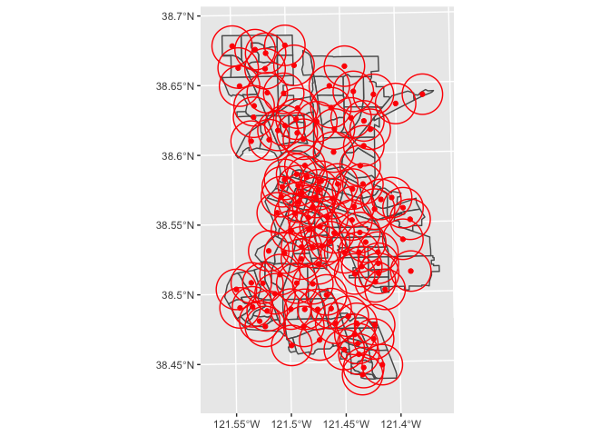<!-- -->

<br>

What can we do with centroids? GWR offers a nice [summary and application](https://geocompr.robinlovelace.net/geometric-operations.html#centroids).  Another application creates buffers around centroids.


<div style="margin-bottom:25px;">
</div>
#### **Buffers**
\

Perhaps you are interested in counting the number of trees within, say, 1 mile of the neighborhood. To do this, you are conducting a buffer analysis. The process involves generating a circle with a radius $r$ around existing geographic points. You connect other features to the points based on whether they fall inside or outside the boundary of the radius. 
 
The first thing to do is to create buffers of radius $r$ around each neighborhood centroid. The size of the buffer radius depends on the city you are examining and the context of your question. In this case, let’s use 1 mile.

We use the function `st_buffer()` to create buffers. The required arguments are your **sf** object and the distance. Remember that the units for our current coordinate reference system is meters, so specify `dist = 1609.34`, which is 1 mile in meters. 
 

```r
cent.buff <-st_buffer(neigh_cent_sac, dist = 1609.34)
dim(cent.buff)
```

```
## [1] 120   8
```

Plot the tracts, the centroids and the buffers to see what we got.


```r
ggplot() +
  geom_sf(data = sac.city.tracts.c) +
  geom_sf(data = neigh_cent_sac, col = "red") +
  geom_sf(data = cent.buff, fill = NA, color = "red")
```

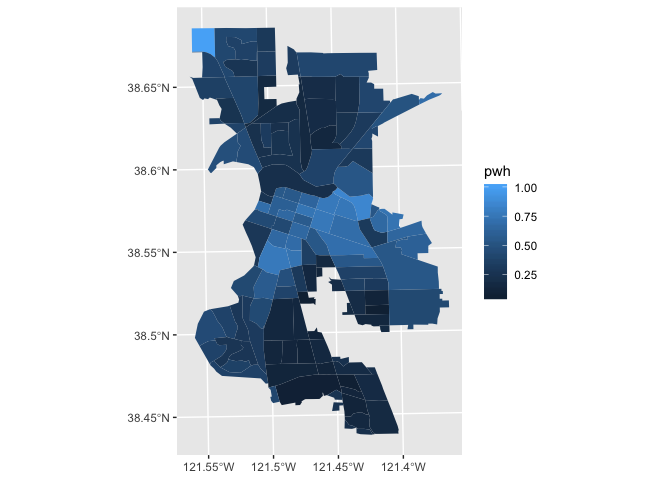<!-- -->

Counting the number of grocery stores inside a buffer is a points-in-polygons operation, which we did above using `lengths()` and `st_intersects()` functions.  I'll let you play around with this on your own.

The **sf** package has a number of other `st_` functions both within the `st_join()` function and separately.  In addition to GWR, check out [Chapter 5](https://keen-swartz-3146c4.netlify.com/geommanip.html) in SDS to learn more.

<div style="margin-bottom:25px;">
</div>
## **Mapping**
\

We've already done quite a bit of mapping already in this lab.  But, let's formally go through the details.  We'll focus on the function `ggplot()`, but there are other functions we can use to map **sf** objects. Because we love options, we will also show how to map using functions from the package **tmap**.

<div style="margin-bottom:25px;">
</div>
### **ggplot**
\


The way `ggplot()` works for mapping is similar to when we used it for making graphs.  `ggplot()` is the foundation and we add elements to it using other functions.  Recall from [the intro to the tidyverse](https://geo200cn.github.io/tidyr) the basic `ggplot()` template.

\

````
ggplot(data = <DATA>) +
      <GEOM_FUNCTION>(mapping = aes())
````
\


For mapping purposes,  `geom_sf()` is `<GEOM_FUNCTION>()`.  What if we wanted to map a variable, like tract percent white? Unlike with functions like `geom_histogram()` and `geom_boxplot()`, we don't specify an x and y axis.  Instead you use the argument `fill` if you want to map a variable.


Let's map Sacramento city tracts by percent white. We need to specify a numeric variable in the `fill =` argument within `geom_sf()`. 


```r
ggplot(sac.city.tracts.c) +
  geom_sf(aes(fill = pwh))
```

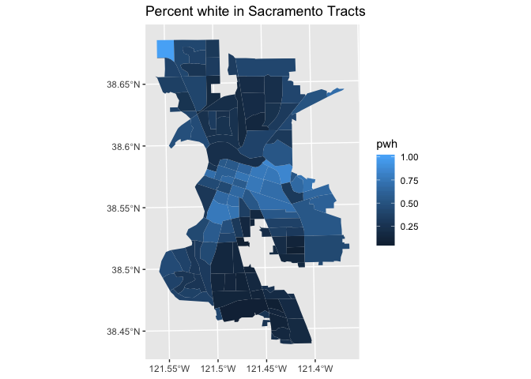<!-- -->

This is known as a choropleth map, which was discussed on pages 73-77 in OSU Ch. 3.

Notice that it is difficult to see the color variation in areas with small neighborhoods because of the gray tract borders, such as in downtown Sacramento.  Eliminate the tract borders by using `color = NA` inside `geom_sf()`. 


```r
ggplot(sac.city.tracts.c) +
  geom_sf(aes(fill = pwh), color = NA)
```

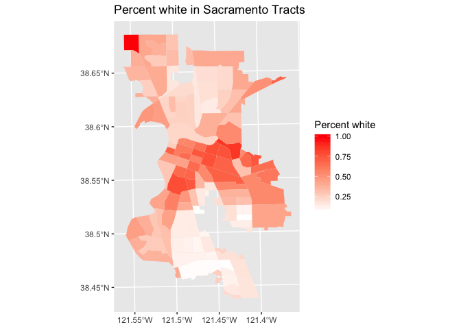<!-- -->

We make layout adjustments to the map by adding functions after `geom_sf()` using the addition operator `+`. For example, we can specify a title using the `labs()` function.  


```r
ggplot(sac.city.tracts.c) +
  geom_sf(aes(fill = pwh), color = NA) +
  labs(title = "Percent white in Sacramento Tracts")  
```

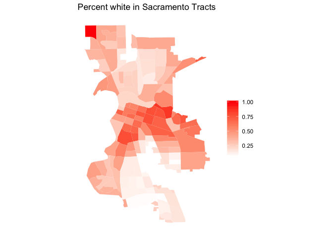<!-- -->


Don't like a blue color scale? You can change it using the `scale_fille_gradient()` function. 


```r
ggplot(sac.city.tracts.c) +   
  geom_sf(aes(fill = pwh), color = NA) +
  scale_fill_gradient(low = "white", high = "red", name = "Percent white") +  
  labs(title = "Percent white in Sacramento Tracts") 
```

<!-- -->

A few things to note about the above code.  First, `low = "white"` and `high = "red"` color tracts white to darker degrees of red from lowest to highest income. Second, we changed the legend title using the `name =` argument. 

I'm not a big fan of the border, the gridlines, and the geographic coordinate labels.  The function `theme()` controls these features.  We eliminate these features from the map using `element_blank()`.  


```r
ggplot(sac.city.tracts.c) +
  geom_sf(aes(fill = pwh), color = NA) +
  scale_fill_gradient(low= "white", high = "red", na.value ="gray", name ="") + 
  labs(title = "Percent white in Sacramento Tracts") +  
  theme( axis.text =  element_blank(),
    axis.ticks =  element_blank(),
    panel.background = element_blank())
```

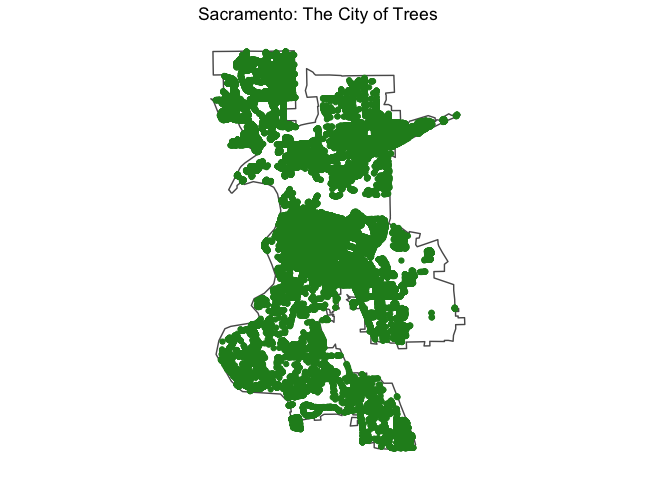<!-- -->

Want to save the map as a picture file into your working directory.  Use the function `ggsave()`


```r
ggsave("sacpwhite.png")
```

```
## Saving 7 x 5 in image
```

Check your working directory folder (type in `getwd()` to see where R studio is pointed at) and you should find your map saved as *sacpwhite.png*. Cool.

We can create a pin or dot map of trees as described in OSU page 66 by using.  This will take some time because Sacramento has over 40,000 trees!


```r
ggplot() +
  geom_sf(data = sac.city, fill = "NA") +  
  geom_sf(data = trees, color = "forestgreen") + 
  labs(title = "Sacramento: The City of Trees") +
  theme( axis.text =  element_blank(),
    axis.ticks =  element_blank(),
    panel.background = element_blank())
```

<!-- -->


<div style="margin-bottom:25px;">
</div>
### **tmap**
\


Another popular package for mapping is **tmap**. Whether one uses the **tmap** or **ggplot** is a matter of taste, but I find that **tmap** has some benefits, which I will point out below.

Similar to **ggplot**, **tmap** is a series of functions that build on one another. The foundation is `tm_shape()` which acts like `ggplot()`.  You then build on `tm_shape()` by adding one or more elements, in particular `tm_polygons()`. All additional functions take on the form of `tm_`.  Check the full list of `tm_` elements [here](https://www.rdocumentation.org/packages/tmap/versions/2.0/topics/tmap-element).

Let's make a choropleth map of percent white in Sacramento. 


```r
tm_shape(sac.city.tracts.c) +
  tm_polygons(col = "pwh", style = "quantile")
```

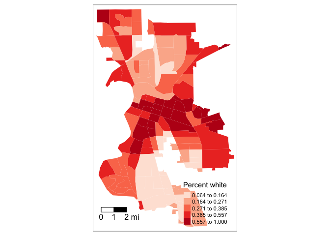<!-- -->

You first put the dataset *sac.city.tracts.c* inside `tm_shape()`. Because you are plotting polygons, you use `tm_polygons()` next. If you are plotting points, you will use `tm_dots()`. The argument `col = "medincome"` tells R to shade the tracts by the variable *pwh*.  The argument `style = "quantile"` tells R to break up the shading into quantiles, or equal groups of 5.  I find that this is where **tmap** offers a distinct advantage over **ggplot** in that users have greater control over the legend and bin breaks.  **tmap** allows users to specify algorithms to automatically create breaks with the `style` argument.  OSU discusses the importance of breaks and classifications on page 75.  Check out GWR's [breakdown](https://geocompr.robinlovelace.net/adv-map.html#color-settings) of the available classification styles in **tmap**.  Play around with `style` and see if your descriptive findings of percent white in Sacramento changes.

We can change the color scheme and tract borders using arguments within `tm_polygons()`. The argument `palette =` defines the color ranges associated with the bins and determined by the `style` arguments.  


```r
tm_shape(sac.city.tracts.c) +
  tm_polygons(col = "pwh", style = "quantile",palette = "Reds", 
              border.alpha = 0, title = "Percent white") 
```

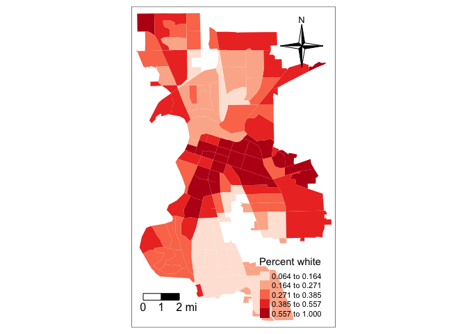<!-- -->

Also notice three additional arguments in the above code. `border.alpha` specifies the transparency of the polygon borders, which we set to 0 to indicate totally transparent. This eliminates the border colors between tracts, like `color = NA` inside `geom_sf()` did in `ggplot()`. The argument `title` specifies the title of the legend like `name =` in `ggplot()`. 

We need to add other key elements to the map. Here is where we start adding layout functions using the `+` operator.  First, the scale bar, which you can add using the function `tm_scale_bar()`


```r
tm_shape(sac.city.tracts.c, unit = "mi") +
  tm_polygons(col = "pwh", style = "quantile",palette = "Reds", 
              border.alpha = 0, title = "Percent white") +
  tm_scale_bar(breaks = c(0, 1, 2), size = 1, position = c("left", "bottom")) 
```

<!-- -->

The argument `breaks` tells R the distances to break up and end the bar.  Make sure you use reasonable break points. Sacramento city is not, for example, 200 miles wide, so you should not use `c(0,10,200)` (try it and see what happens. You won't like it). Note that the scale is in miles (were in America!).  The default is in kilometers (the rest of the world!), but you can specify the units within `tm_shape()` using the argument `unit`.  Here, we used `unit = "mi"`.  The `position =` argument specifies to locate the scale bar on the bottom left of the map.

<br>

The next element is the north arrow, which we can add using the function `tm_compass()`.  You can control for the type, size and location of the arrow within this function.  We place a 4-star arrow on the top right of the map.


```r
tm_shape(sac.city.tracts.c, unit = "mi") +
  tm_polygons(col = "pwh", style = "quantile",palette = "Reds", 
              border.alpha = 0, title = "Percent white") +
  tm_scale_bar(breaks = c(0, 1, 2), size = 1, position = c("left", "bottom")) +
  tm_compass(type = "4star", position = c("right", "top")) 
```

<!-- -->

The legend is in an odd place. We can move it around using the `tm_layout()` function. 


```r
tm_shape(sac.city.tracts.c, unit = "mi") +
  tm_polygons(col = "pwh", style = "quantile",palette = "Reds", 
              border.alpha = 0, title = "Percent white") +
  tm_scale_bar(breaks = c(0, 1, 2), size = 1, position = c("left", "bottom")) +
  tm_compass(type = "4star", position = c("right", "top")) +
  tm_layout(legend.outside = TRUE)
```

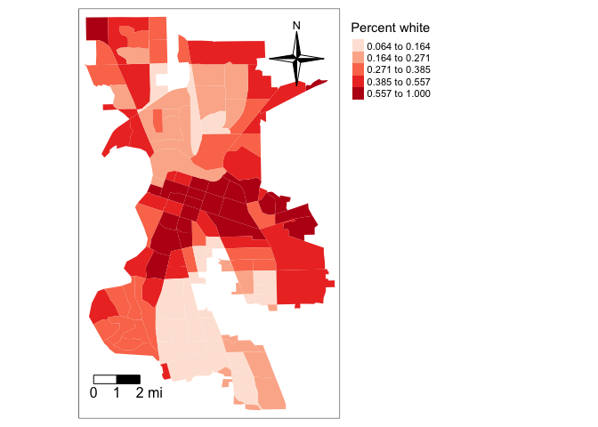<!-- -->
  
The function `tm_layout()` changes a variety of layout settings.  Here, we tossed the legend outside of the frame.

So far we've created static maps. That is, maps that don't "move".  But, we're all likely used to Google or Bing maps - maps that we can move around and zoom into.  You can make interactive maps in R using the package **tmap**.  Here is another benefit of using **tmap** over **ggplot** - the latter does not provide interactivity.

To make your **tmap** object interactive, use the function `tmap_mode()`


```r
tmap_mode("view")
```

Now that the interactive mode has been ‘turned on’, all maps produced with `tm_shape()` will launch. Next, map


```r
tm_shape(sac.city.tracts.c, unit = "mi") +
  tm_polygons(col = "pwh", style = "quantile",palette = "Reds", 
              border.alpha = 0, title = "Percent white")
```

<!--html_preserve--><div id="htmlwidget-419966640c5747de32dc" style="width:672px;height:480px;" class="leaflet html-widget"></div>
<script type="application/json" data-for="htmlwidget-419966640c5747de32dc">{"x":{"options":{"crs":{"crsClass":"L.CRS.EPSG3857","code":null,"proj4def":null,"projectedBounds":null,"options":{}}},"calls":[{"method":"createMapPane","args":["tmap401",401]},{"method":"addProviderTiles","args":["Esri.WorldGrayCanvas",null,"Esri.WorldGrayCanvas",{"minZoom":0,"maxZoom":18,"tileSize":256,"subdomains":"abc","errorTileUrl":"","tms":false,"noWrap":false,"zoomOffset":0,"zoomReverse":false,"opacity":1,"zIndex":1,"detectRetina":false,"pane":"tilePane"}]},{"method":"addProviderTiles","args":["OpenStreetMap",null,"OpenStreetMap",{"minZoom":0,"maxZoom":18,"tileSize":256,"subdomains":"abc","errorTileUrl":"","tms":false,"noWrap":false,"zoomOffset":0,"zoomReverse":false,"opacity":1,"zIndex":1,"detectRetina":false,"pane":"tilePane"}]},{"method":"addProviderTiles","args":["Esri.WorldTopoMap",null,"Esri.WorldTopoMap",{"minZoom":0,"maxZoom":18,"tileSize":256,"subdomains":"abc","errorTileUrl":"","tms":false,"noWrap":false,"zoomOffset":0,"zoomReverse":false,"opacity":1,"zIndex":1,"detectRetina":false,"pane":"tilePane"}]},{"method":"addPolygons","args":[[[[{"lng":[-121.450604,-121.449058,-121.447198,-121.437866,-121.429364,-121.423064,-121.420059,-121.419927999999,-121.421335,-121.42155,-121.422591999999,-121.431961,-121.432869,-121.433537,-121.434867,-121.436682,-121.439215,-121.444836,-121.44925,-121.450604],"lat":[38.5854369999997,38.5860599999997,38.5877300000003,38.582008,38.5825050000003,38.5836050000003,38.581383,38.5805929999999,38.5772839999997,38.5758570000004,38.568914,38.5673099999998,38.5709340000004,38.5735999999997,38.5766730000001,38.5784320000004,38.5796549999999,38.5818460000002,38.5836690000003,38.5854369999997]}]],[[{"lng":[-121.450475,-121.44787,-121.446743,-121.447136,-121.444836,-121.439215,-121.436682,-121.434867,-121.433537,-121.432869,-121.431961,-121.433328,-121.440678000001,-121.441705,-121.448571,-121.449873,-121.450475],"lat":[38.5712759999996,38.5761620000002,38.5784200000004,38.57869,38.5818460000002,38.5796549999999,38.5784320000004,38.5766730000001,38.5735999999997,38.5709340000004,38.5673099999998,38.5672030000001,38.5691330000004,38.5694049999996,38.5712109999997,38.5711230000002,38.5712759999996]}]],[[{"lng":[-121.461522,-121.458301,-121.454744,-121.451607,-121.450906,-121.450604,-121.44925,-121.444836,-121.447136,-121.446743,-121.44787,-121.450475,-121.454013999999,-121.455335,-121.464247,-121.462834,-121.461426,-121.461522],"lat":[38.5819699999996,38.5813399999996,38.581998,38.5838570000003,38.5853820000004,38.5854369999997,38.5836690000003,38.5818460000002,38.57869,38.5784200000004,38.5761620000002,38.5712759999996,38.572235,38.5725930000003,38.5749810000002,38.5782340000002,38.5814709999998,38.5819699999996]}]],[[{"lng":[-121.474761,-121.468138000001,-121.465208,-121.461522,-121.461426,-121.462834,-121.464247,-121.470933,-121.473609,-121.477613,-121.476192,-121.474761],"lat":[38.5850690000004,38.5834430000004,38.583056,38.5819699999996,38.5814709999998,38.5782340000002,38.5749810000002,38.5767370000004,38.5774520000003,38.57852,38.581802,38.5850690000004]}]],[[{"lng":[-121.486996,-121.474761,-121.476192,-121.477613,-121.484264,-121.489851,-121.488659,-121.488423,-121.486996],"lat":[38.5883500000004,38.5850690000004,38.581802,38.57852,38.5802950000003,38.5817849999997,38.5845240000001,38.5850690000002,38.5883500000004]}]],[[{"lng":[-121.486996,-121.488423,-121.488659,-121.489851,-121.49651,-121.495089,-121.494595,-121.489507,-121.486996],"lat":[38.5883500000004,38.5850690000002,38.5845240000001,38.5817849999997,38.5835599999998,38.5868460000001,38.5878020000002,38.5885869999997,38.5883500000004]}]],[[{"lng":[-121.506275000001,-121.501314,-121.498304,-121.49651,-121.498892,-121.501537,-121.508266,-121.506275000001],"lat":[38.5862880000001,38.5836199999997,38.5828179999998,38.5835599999998,38.5780469999995,38.5787490000003,38.5805050000002,38.5862880000001]}]],[[{"lng":[-121.511566,-121.508266,-121.501537,-121.498892,-121.501271,-121.503924,-121.508266,-121.509137,-121.511566],"lat":[38.5750049999997,38.5805050000002,38.5787490000003,38.5780469999995,38.5725389999997,38.5732459999996,38.5744130000003,38.5754329999998,38.5750049999997]}]],[[{"lng":[-121.498892,-121.49651,-121.489851,-121.484264,-121.477613,-121.480001,-121.485320999999,-121.486653,-121.488474,-121.492716,-121.493672,-121.494629,-121.501271,-121.498892],"lat":[38.5780469999995,38.5835599999998,38.5817849999997,38.5802950000003,38.57852,38.5730100000004,38.5744299999996,38.5747850000004,38.5740259999999,38.5751560000003,38.5729619999997,38.5707689999996,38.5725389999997,38.5780469999995]}]],[[{"lng":[-121.480001,-121.481434999999,-121.482383999999,-121.487703,-121.494629,-121.493672,-121.492716,-121.488474,-121.486653,-121.485320999999,-121.480001],"lat":[38.5730100000004,38.5696999999999,38.5675060000002,38.5689229999999,38.5707689999996,38.5729619999997,38.5751560000003,38.5740259999999,38.5747850000004,38.5744299999996,38.5730100000004]}]],[[{"lng":[-121.480001,-121.475993,-121.473326,-121.466652,-121.469039,-121.470369,-121.475714999999,-121.477033,-121.478373,-121.482383999999,-121.481434999999,-121.480001],"lat":[38.5730100000004,38.5719409999998,38.5712289999998,38.5694479999998,38.5639460000002,38.5643009999997,38.5657270000003,38.566079,38.566436,38.5675060000002,38.5696999999999,38.5730100000004]}]],[[{"lng":[-121.477613,-121.473609,-121.470933,-121.464247,-121.465934,-121.466652,-121.473326,-121.475993,-121.480001,-121.477613],"lat":[38.57852,38.5774520000003,38.5767370000004,38.5749810000002,38.5710990000003,38.5694479999998,38.5712289999998,38.5719409999998,38.5730100000004,38.57852]}]],[[{"lng":[-121.466652,-121.465934,-121.464247,-121.455335,-121.454013999999,-121.450475,-121.449873,-121.451759,-121.454449,-121.460645,-121.465064,-121.469039,-121.466652],"lat":[38.5694479999998,38.5710990000003,38.5749810000002,38.5725930000003,38.572235,38.5712759999996,38.5711230000002,38.5661750000002,38.559917,38.5616180000001,38.5628349999999,38.5639460000002,38.5694479999998]}]],[[{"lng":[-121.449873,-121.448571,-121.441705,-121.440678000001,-121.433328,-121.431961,-121.431228,-121.43056,-121.421645,-121.423299,-121.436626,-121.44443,-121.454449,-121.451759,-121.449873],"lat":[38.5711230000002,38.5712109999997,38.5694049999996,38.5691330000004,38.5672030000001,38.5673099999998,38.5644010000001,38.5621250000001,38.5510199999998,38.5513570000004,38.5550080000004,38.5571609999997,38.559917,38.5661750000002,38.5711230000002]}]],[[{"lng":[-121.454449,-121.44443,-121.436626,-121.423299,-121.421645,-121.416577,-121.427857,-121.42787,-121.432953,-121.434173,-121.438210999999,-121.439162,-121.444012,-121.45384,-121.456384,-121.459803,-121.460532,-121.465064,-121.460645,-121.454449],"lat":[38.559917,38.5571609999997,38.5550080000004,38.5513570000004,38.5510199999998,38.5446440000003,38.5446340000002,38.5468580000004,38.5467960000003,38.5467810000003,38.5467320000001,38.5467219999999,38.5466710000003,38.5467570000003,38.5531980000003,38.5567009999999,38.557484,38.5628349999999,38.5616180000001,38.559917]}]],[[{"lng":[-121.469039,-121.465064,-121.460532,-121.459803,-121.456384,-121.45384,-121.4578,-121.460101,-121.461677,-121.46472,-121.466562,-121.470459,-121.472436,-121.471151,-121.469039],"lat":[38.5639460000002,38.5628349999999,38.557484,38.5567009999999,38.5531980000003,38.5467570000003,38.5467480000002,38.5467889999999,38.5468009999999,38.5471839999997,38.5491849999999,38.5538559999998,38.5561250000001,38.5590820000002,38.5639460000002]}]],[[{"lng":[-121.482383999999,-121.478373,-121.477033,-121.475714999999,-121.470369,-121.469039,-121.471151,-121.472436,-121.474412,-121.475844,-121.480354000001,-121.485698,-121.482383999999],"lat":[38.5675060000002,38.566436,38.566079,38.5657270000003,38.5643009999997,38.5639460000002,38.5590820000002,38.5561250000001,38.556821,38.5572030000003,38.5584040000003,38.5598280000002,38.5675060000002]}]],[[{"lng":[-121.494629,-121.487703,-121.482383999999,-121.485698,-121.48971,-121.491047,-121.498471999999,-121.498325,-121.497004,-121.496056,-121.494629],"lat":[38.5707689999996,38.5689229999999,38.5675060000002,38.5598280000002,38.5608930000003,38.5612490000004,38.5632220000002,38.5656719999999,38.5653200000003,38.5674930000004,38.5707689999996]}]],[[{"lng":[-121.518966,-121.511566,-121.509137,-121.508266,-121.503924,-121.501271,-121.494629,-121.496056,-121.497004,-121.498325,-121.498471999999,-121.505909,-121.507251000001,-121.517868,-121.518966],"lat":[38.5687049999996,38.5750049999997,38.5754329999998,38.5744130000003,38.5732459999996,38.5725389999997,38.5707689999996,38.5674930000004,38.5653200000003,38.5656719999999,38.5632220000002,38.5652319999998,38.5655939999996,38.5685029999996,38.5687049999996]}]],[[{"lng":[-121.518966,-121.517868,-121.507251000001,-121.505909,-121.498471999999,-121.499371,-121.500329,-121.502176,-121.502227000001,-121.503588,-121.507598,-121.50854,-121.508598,-121.509531,-121.509923,-121.510905,-121.512618,-121.51129,-121.514066,-121.516537,-121.518451,-121.520965,-121.518966],"lat":[38.5687049999996,38.5685029999996,38.5655939999996,38.5652319999998,38.5632220000002,38.5611419999999,38.5595330000004,38.5564340000004,38.5563469999999,38.5540319999999,38.547272,38.5457480000004,38.5447530000002,38.5409890000001,38.5404009999998,38.5407840000001,38.5416659999996,38.5462899999997,38.553105,38.5578949999996,38.5612750000003,38.5662049999998,38.5687049999996]}]],[[{"lng":[-121.502176,-121.500329,-121.499371,-121.498471999999,-121.491047,-121.48971,-121.485698,-121.487232,-121.487469,-121.488236,-121.488267,-121.488670000001,-121.496039,-121.497139,-121.500395,-121.502176],"lat":[38.5564340000004,38.5595330000004,38.5611419999999,38.5632220000002,38.5612490000004,38.5608930000003,38.5598280000002,38.5558589999998,38.555094,38.5526400000005,38.5525420000002,38.5512780000002,38.5526000000003,38.5528009999999,38.5548380000004,38.5564340000004]}]],[[{"lng":[-121.502176,-121.500395,-121.497139,-121.496039,-121.488670000001,-121.488267,-121.484323,-121.487086999999,-121.492829,-121.493612,-121.493768,-121.503146,-121.503631,-121.505036,-121.506206,-121.509923,-121.509531,-121.508598,-121.50854,-121.507598,-121.503588,-121.502227000001,-121.502176],"lat":[38.5564340000004,38.5548380000004,38.5528009999999,38.5526000000003,38.5512780000002,38.5525420000002,38.5396130000001,38.5391380000001,38.5381350000002,38.5356359999998,38.5351479999997,38.5371449999997,38.5374670000002,38.5383860000003,38.5389120000001,38.5404009999998,38.5409890000001,38.5447530000002,38.5457480000004,38.547272,38.5540319999999,38.5563469999999,38.5564340000004]}]],[[{"lng":[-121.488236,-121.487856,-121.483623,-121.481608,-121.479826,-121.475812,-121.475758,-121.478938000001,-121.484323,-121.488267,-121.488236],"lat":[38.5526400000005,38.5517459999996,38.5499660000004,38.5498950000001,38.5499110000004,38.5499350000002,38.5410640000004,38.5405400000002,38.5396130000001,38.5525420000002,38.5526400000005]}]],[[{"lng":[-121.488236,-121.487469,-121.487232,-121.485698,-121.480354000001,-121.475844,-121.475785,-121.475812,-121.479826,-121.481608,-121.483623,-121.487856,-121.488236],"lat":[38.5526400000005,38.555094,38.5558589999998,38.5598280000002,38.5584040000003,38.5572030000003,38.5536050000002,38.5499350000002,38.5499110000004,38.5498950000001,38.5499660000004,38.5517459999996,38.5526400000005]}]],[[{"lng":[-121.475844,-121.474412,-121.472436,-121.470459,-121.466562,-121.46472,-121.464716,-121.464767,-121.467459,-121.471217,-121.473931000001,-121.475758,-121.475812,-121.475785,-121.475844],"lat":[38.5572030000003,38.556821,38.5561250000001,38.5538559999998,38.5491849999999,38.5471839999997,38.5462750000002,38.541193,38.5411390000004,38.5412129999997,38.5411580000002,38.5410640000004,38.5499350000002,38.5536050000002,38.5572030000003]}]],[[{"lng":[-121.464767,-121.464716,-121.46472,-121.461677,-121.460101,-121.4578,-121.45384,-121.451646,-121.449713,-121.45549,-121.459125,-121.460094,-121.463748,-121.46476,-121.464767],"lat":[38.541193,38.5462750000002,38.5471839999997,38.5468009999999,38.5467889999999,38.5467480000002,38.5467570000003,38.5428430000002,38.5394180000002,38.5394439999998,38.5394450000002,38.539446,38.5394460000003,38.5395269999997,38.541193]}]],[[{"lng":[-121.45384,-121.444012,-121.439162,-121.438210999999,-121.434173,-121.432953,-121.42787,-121.427857,-121.416577,-121.414636,-121.413173,-121.421167,-121.427673,-121.43293,-121.434482999999,-121.438574999999,-121.441969000001,-121.443942,-121.449713,-121.451646,-121.45384],"lat":[38.5467570000003,38.5466710000003,38.5467219999999,38.5467320000001,38.5467810000003,38.5467960000003,38.5468580000004,38.5446340000002,38.5446440000003,38.5420090000004,38.5395640000004,38.5396049999996,38.5395970000004,38.5395420000001,38.5395260000004,38.5394829999997,38.5394469999997,38.5394389999999,38.5394180000002,38.5428430000002,38.5467570000003]}]],[[{"lng":[-121.449713,-121.443942,-121.441969000001,-121.438574999999,-121.434482999999,-121.43293,-121.427673,-121.421167,-121.413173,-121.410181,-121.415146000001,-121.421153,-121.421147,-121.427541,-121.432758,-121.434458,-121.435292,-121.442113,-121.445746,-121.447398,-121.449713],"lat":[38.5394180000002,38.5394389999999,38.5394469999997,38.5394829999997,38.5395260000004,38.5395420000001,38.5395970000004,38.5396049999996,38.5395640000004,38.5322089999997,38.5319700000004,38.531984,38.5323649999996,38.5323030000003,38.5323470000002,38.5323310000003,38.5322619999999,38.5321460000003,38.531788,38.5351709999996,38.5394180000002]}]],[[{"lng":[-121.427541,-121.421147,-121.421153,-121.415146000001,-121.410181,-121.409149,-121.409124,-121.411799,-121.414432,-121.419937,-121.420091,-121.427514999999,-121.427763,-121.427541],"lat":[38.5323030000003,38.5323649999996,38.531984,38.5319700000004,38.5322089999997,38.5292700000002,38.5250630000001,38.5250649999996,38.5250660000002,38.5250710000001,38.5250710000002,38.5250770000003,38.5307680000001,38.5323030000003]}]],[[{"lng":[-121.445746,-121.442113,-121.435292,-121.434458,-121.432758,-121.427541,-121.427763,-121.427514999999,-121.432848,-121.433813000001,-121.438691,-121.442590000001,-121.445559,-121.445746],"lat":[38.531788,38.5321460000003,38.5322619999999,38.5323310000003,38.5323470000002,38.5323030000003,38.5307680000001,38.5250770000003,38.5250409999997,38.525034,38.5250010000003,38.5249739999998,38.5313919999996,38.531788]}]],[[{"lng":[-121.442590000001,-121.438691,-121.433813000001,-121.432848,-121.427514999999,-121.427481000001,-121.427459,-121.427454,-121.427447,-121.435862,-121.438352,-121.439229,-121.439757,-121.440148,-121.44197,-121.442590000001],"lat":[38.5249739999998,38.5250010000003,38.525034,38.5250409999997,38.5250770000003,38.5197319999997,38.5159929999998,38.5138940000001,38.5105219999997,38.5105069999998,38.5158550000002,38.5177040000003,38.5188179999997,38.51967,38.523625,38.5249739999998]}]],[[{"lng":[-121.427459,-121.419918999999,-121.414297,-121.409108,-121.409081,-121.415222,-121.415862999999,-121.422496,-121.427447,-121.427454,-121.427459],"lat":[38.5159929999998,38.5160609999998,38.5161099999998,38.5161559999997,38.5105510000003,38.5105420000002,38.5105419999998,38.5105300000002,38.5105219999997,38.5138940000001,38.5159929999998]}]],[[{"lng":[-121.427514999999,-121.420091,-121.419937,-121.414432,-121.411799,-121.409124,-121.409108,-121.414297,-121.419918999999,-121.427459,-121.427481000001,-121.427514999999],"lat":[38.5250770000003,38.5250710000002,38.5250710000001,38.5250660000002,38.5250649999996,38.5250630000001,38.5161559999997,38.5161099999998,38.5160609999998,38.5159929999998,38.5197319999997,38.5250770000003]}]],[[{"lng":[-121.506206,-121.505036,-121.503631,-121.503146,-121.493768,-121.49536,-121.495899,-121.497206,-121.49842,-121.498601,-121.505773,-121.512474,-121.513413,-121.512824,-121.513276000001,-121.511248,-121.506206],"lat":[38.5389120000001,38.5383860000003,38.5374670000002,38.5371449999997,38.5351479999997,38.5302139999997,38.5286289999999,38.524723,38.5209820000003,38.5204290000003,38.5216119999998,38.5212490000001,38.5214189999996,38.522729,38.5282269999997,38.5313919999998,38.5389120000001]}]],[[{"lng":[-121.513413,-121.512474,-121.505773,-121.498601,-121.500932,-121.505238999999,-121.505883000001,-121.506339,-121.508406999999,-121.511780999999,-121.515557,-121.516569,-121.516269,-121.513413],"lat":[38.5214189999996,38.5212490000001,38.5216119999998,38.5204290000003,38.5133139999998,38.5046409999995,38.5045929999997,38.5027750000003,38.5033079999996,38.5061470000003,38.5077679999999,38.5077899999996,38.5167229999999,38.5214189999996]}]],[[{"lng":[-121.493768,-121.493612,-121.492829,-121.487086999999,-121.484323,-121.481879,-121.480952,-121.486250000001,-121.494310000001,-121.495899,-121.49536,-121.493768],"lat":[38.5351479999997,38.5356359999998,38.5381350000002,38.5391380000001,38.5396130000001,38.5317010000003,38.528677,38.528304,38.5283509999996,38.5286289999999,38.5302139999997,38.5351479999997]}]],[[{"lng":[-121.49842,-121.497206,-121.495899,-121.494310000001,-121.486250000001,-121.480952,-121.47972,-121.478672,-121.483144,-121.487431,-121.498017,-121.49842],"lat":[38.5209820000003,38.524723,38.5286289999999,38.5283509999996,38.528304,38.528677,38.5248349999998,38.521312,38.521114,38.5209699999999,38.5207159999999,38.5209820000003]}]],[[{"lng":[-121.484323,-121.478938000001,-121.475758,-121.47396,-121.473437,-121.471747000001,-121.47972,-121.480952,-121.481879,-121.484323],"lat":[38.5396130000001,38.5405400000002,38.5410640000004,38.5336649999998,38.5315900000003,38.5248899999999,38.5248349999998,38.528677,38.5317010000003,38.5396130000001]}]],[[{"lng":[-121.475758,-121.473931000001,-121.471217,-121.467459,-121.464767,-121.46476,-121.464713000001,-121.4647,-121.464626,-121.465853,-121.470148,-121.471747000001,-121.473437,-121.47396,-121.475758],"lat":[38.5410640000004,38.5411580000002,38.5412129999997,38.5411390000004,38.541193,38.5395269999997,38.5336059999996,38.5321369999996,38.5249509999998,38.5249430000001,38.5249029999999,38.5248899999999,38.5315900000003,38.5336649999998,38.5410640000004]}]],[[{"lng":[-121.505238999999,-121.500932,-121.498601,-121.49842,-121.498017,-121.487431,-121.483144,-121.483036,-121.48291,-121.482839,-121.482759,-121.482736,-121.491264,-121.503261,-121.506064,-121.505964,-121.505864,-121.505238999999],"lat":[38.5046409999995,38.5133139999998,38.5204290000003,38.5209820000003,38.5207159999999,38.5209699999999,38.521114,38.5102219999998,38.5065990000003,38.5045629999997,38.4994050000001,38.4957600000003,38.4957270000003,38.4956790000003,38.4956319999998,38.4994030000003,38.5027469999997,38.5046409999995]}]],[[{"lng":[-121.512618,-121.510905,-121.509923,-121.506206,-121.511248,-121.513276000001,-121.512824,-121.513413,-121.521849,-121.523966,-121.525566,-121.530767,-121.528467000001,-121.520366,-121.513199000001,-121.512618],"lat":[38.5416659999996,38.5407840000001,38.5404009999998,38.5389120000001,38.5313919999998,38.5282269999997,38.522729,38.5214189999996,38.5231629999998,38.5228060000001,38.5231059999997,38.5279059999998,38.5321059999998,38.5353670000001,38.5407430000002,38.5416659999996]}]],[[{"lng":[-121.521849,-121.513413,-121.516269,-121.516569,-121.515557,-121.511780999999,-121.508406999999,-121.506339,-121.505883000001,-121.505238999999,-121.505864,-121.505964,-121.506064,-121.506189,-121.505073,-121.504467,-121.50423,-121.508848,-121.510714,-121.516668,-121.517292,-121.517767,-121.518264,-121.521998,-121.522311,-121.522148,-121.521849],"lat":[38.5231629999998,38.5214189999996,38.5167229999999,38.5077899999996,38.5077679999999,38.5061470000003,38.5033079999996,38.5027750000003,38.5045929999997,38.5046409999995,38.5027469999997,38.4994030000003,38.4956319999998,38.4895930000004,38.4812690000002,38.4768310000004,38.4751089999999,38.4786690000001,38.4812,38.4954759999996,38.4976409999999,38.5013170000004,38.5027950000002,38.509266,38.5108439999999,38.5161699999996,38.5231629999998]}]],[[{"lng":[-121.547267,-121.545334,-121.542764,-121.541951,-121.537911,-121.535364,-121.534872,-121.534985,-121.544121,-121.543404,-121.548803,-121.552481999999,-121.555311,-121.5554,-121.559167,-121.558069,-121.556747,-121.551865999999,-121.547267],"lat":[38.5152060000003,38.5139159999998,38.5100620000002,38.5084990000004,38.5042229999997,38.4992840000001,38.4986970000003,38.4981979999995,38.4975960000002,38.4963219999999,38.4959039999998,38.494536,38.4932079999996,38.4925980000003,38.4980070000003,38.5018759999998,38.5065300000001,38.5138060000003,38.5152060000003]}]],[[{"lng":[-121.547267,-121.533211,-121.531767,-121.531637,-121.530532,-121.53027,-121.527612,-121.52724,-121.52624,-121.525988,-121.527225,-121.528691,-121.530902000001,-121.533674,-121.534872,-121.535364,-121.537911,-121.541951,-121.542764,-121.545334,-121.547267],"lat":[38.5152060000003,38.5168660000004,38.5172430000003,38.5164429999998,38.5138780000003,38.512957,38.5066659999997,38.5067559999997,38.5050340000001,38.5034129999998,38.5010740000003,38.4969549999996,38.4974069999996,38.4980049999999,38.4986970000003,38.4992840000001,38.5042229999997,38.5084990000004,38.5100620000002,38.5139159999998,38.5152060000003]}]],[[{"lng":[-121.531767,-121.525178,-121.52465,-121.525566,-121.523966,-121.521849,-121.522148,-121.522311,-121.521998,-121.518264,-121.517767,-121.517292,-121.516668,-121.521601999999,-121.52355,-121.528691,-121.527225,-121.525988,-121.52624,-121.52724,-121.527612,-121.53027,-121.530532,-121.531637,-121.531767],"lat":[38.5172430000003,38.5189619999997,38.5208660000001,38.5231059999997,38.5228060000001,38.5231629999998,38.5161699999996,38.5108439999999,38.509266,38.5027950000002,38.5013170000004,38.4976409999999,38.4954759999996,38.4955800000001,38.4959060000001,38.4969549999996,38.5010740000003,38.5034129999998,38.5050340000001,38.5067559999997,38.5066659999997,38.512957,38.5138780000003,38.5164429999998,38.5172430000003]}]],[[{"lng":[-121.543404,-121.542106,-121.540593,-121.53473,-121.534727,-121.53495,-121.535595000001,-121.537785,-121.538928,-121.544963,-121.547315,-121.547772999999,-121.5554,-121.555311,-121.552481999999,-121.548803,-121.543404],"lat":[38.4963219999999,38.4941580000003,38.4933419999997,38.4935590000002,38.4915319999999,38.490927,38.4899320000002,38.4876360000002,38.4867409999999,38.4839029999996,38.4829520000003,38.481647,38.4925980000003,38.4932079999996,38.494536,38.4959039999998,38.4963219999999]}]],[[{"lng":[-121.544963,-121.538928,-121.537785,-121.535595000001,-121.53495,-121.534727,-121.53473,-121.540593,-121.542106,-121.543404,-121.544121,-121.534985,-121.534872,-121.533674,-121.530902000001,-121.528691,-121.52355,-121.523768,-121.522562000001,-121.521822,-121.522819999999,-121.525758,-121.53092,-121.532176,-121.533057999999,-121.533623,-121.534336,-121.535153,-121.536971,-121.540054999999,-121.544963],"lat":[38.4839029999996,38.4867409999999,38.4876360000002,38.4899320000002,38.490927,38.4915319999999,38.4935590000002,38.4933419999997,38.4941580000003,38.4963219999999,38.4975960000002,38.4981979999995,38.4986970000003,38.4980049999999,38.4974069999996,38.4969549999996,38.4959060000001,38.4933219999998,38.4920519999997,38.49172,38.4905510000002,38.4893559999996,38.4877159999997,38.4869500000003,38.4859589999996,38.48465,38.483155,38.4824660000002,38.4812829999998,38.4799730000004,38.4839029999996]}]],[[{"lng":[-121.52355,-121.521601999999,-121.516668,-121.510714,-121.514438,-121.516197999999,-121.517543,-121.51766,-121.518501,-121.520055,-121.52155,-121.522905,-121.527868000001,-121.533623,-121.533057999999,-121.532176,-121.53092,-121.525758,-121.522819999999,-121.521822,-121.522562000001,-121.523768,-121.52355],"lat":[38.4959060000001,38.4955800000001,38.4954759999996,38.4812,38.4811189999999,38.4805199999997,38.4827629999997,38.483768,38.4837230000001,38.483203,38.483341,38.4838390000004,38.4835149999996,38.48465,38.4859589999996,38.4869500000003,38.4877159999997,38.4893559999996,38.4905510000002,38.49172,38.4920519999997,38.4933219999998,38.4959060000001]}]],[[{"lng":[-121.533623,-121.527868000001,-121.522905,-121.52155,-121.520055,-121.518501,-121.51766,-121.517543,-121.516197999999,-121.517561999999,-121.517995000001,-121.51877,-121.519641,-121.524051,-121.524735,-121.533003,-121.540054999999,-121.536971,-121.535153,-121.534336,-121.533623],"lat":[38.48465,38.4835149999996,38.4838390000004,38.483341,38.483203,38.4837230000001,38.483768,38.4827629999997,38.4805199999997,38.4800459999996,38.4798090000002,38.479267,38.4788189999997,38.4766090000004,38.4764319999995,38.4769300000001,38.4799730000004,38.4812829999998,38.4824660000002,38.483155,38.48465]}]],[[{"lng":[-121.547772999999,-121.547315,-121.544963,-121.540054999999,-121.533003,-121.524735,-121.524051,-121.519641,-121.51877,-121.517995000001,-121.517561999999,-121.516197999999,-121.514438,-121.510714,-121.508848,-121.50423,-121.503221,-121.504135,-121.50509,-121.508867,-121.522245,-121.538766,-121.543083,-121.544740000001,-121.547467,-121.547772999999],"lat":[38.481647,38.4829520000003,38.4839029999996,38.4799730000004,38.4769300000001,38.4764319999995,38.4766090000004,38.4788189999997,38.479267,38.4798090000002,38.4800459999996,38.4805199999997,38.4811189999999,38.4812,38.4786690000001,38.4751089999999,38.4697440000002,38.4696919999999,38.4695629999997,38.4728089999997,38.4736580000003,38.4747070000004,38.4773559999997,38.4791699999999,38.4812069999995,38.481647]}]],[[{"lng":[-121.483144,-121.478672,-121.477548,-121.475265,-121.473596,-121.472346,-121.470798,-121.48035,-121.482736,-121.482759,-121.482839,-121.48291,-121.483036,-121.483144],"lat":[38.521114,38.521312,38.5176909999998,38.5103280000002,38.5049159999996,38.5009469999997,38.4958680000002,38.4957700000004,38.4957600000003,38.4994050000001,38.5045629999997,38.5065990000003,38.5102219999998,38.521114]}]],[[{"lng":[-121.506064,-121.503261,-121.491264,-121.491876,-121.491963,-121.49239,-121.49335,-121.494648000001,-121.496695,-121.505073,-121.506189,-121.506064],"lat":[38.4956319999998,38.4956790000003,38.4957270000003,38.4939269999998,38.4890439999998,38.4838280000003,38.4814119999998,38.4813960000004,38.4813709999998,38.4812690000002,38.4895930000004,38.4956319999998]}]],[[{"lng":[-121.491264,-121.482736,-121.48035,-121.480722000001,-121.480345,-121.480341,-121.480336,-121.486859000001,-121.49335,-121.49239,-121.491963,-121.491876,-121.491264],"lat":[38.4957270000003,38.4957600000003,38.4957700000004,38.4922090000003,38.4904480000002,38.4869420000004,38.481431,38.481422,38.4814119999998,38.4838280000003,38.4890439999998,38.4939269999998,38.4957270000003]}]],[[{"lng":[-121.48035,-121.470798,-121.469127,-121.466353999999,-121.480336,-121.480341,-121.480345,-121.480722000001,-121.48035],"lat":[38.4957700000004,38.4958680000002,38.4905069999996,38.4815260000002,38.481431,38.4869420000004,38.4904480000002,38.4922090000003,38.4957700000004]}]],[[{"lng":[-121.505073,-121.496695,-121.494648000001,-121.49335,-121.486859000001,-121.480336,-121.466353999999,-121.464188,-121.467712,-121.479375,-121.494188,-121.497895,-121.503123,-121.503221,-121.50423,-121.504467,-121.505073],"lat":[38.4812690000002,38.4813709999998,38.4813960000004,38.4814119999998,38.481422,38.481431,38.4815260000002,38.4744870000003,38.4745080000002,38.4733790000003,38.4688719999997,38.4681730000002,38.4671889999999,38.4697440000002,38.4751089999999,38.4768310000004,38.4812690000002]}]],[[{"lng":[-121.445746,-121.445559,-121.442590000001,-121.444403,-121.449409,-121.450325,-121.452774,-121.452801,-121.455717,-121.452819,-121.453621999999,-121.455255,-121.453327,-121.445746],"lat":[38.531788,38.5313919999996,38.5249739999998,38.5249580000002,38.5249230000003,38.5249220000001,38.5249189999998,38.5289549999996,38.530594,38.5313799999997,38.5313799999999,38.5336969999999,38.5322940000001,38.531788]}]],[[{"lng":[-121.46476,-121.463748,-121.460094,-121.460086,-121.461365,-121.464713000001,-121.46476],"lat":[38.5395269999997,38.5394460000003,38.539446,38.5340249999997,38.5340060000002,38.5336059999996,38.5395269999997]}]],[[{"lng":[-121.47972,-121.471747000001,-121.47086,-121.465946,-121.466904,-121.466579,-121.465524,-121.465854,-121.467277,-121.469706,-121.477548,-121.478672,-121.47972],"lat":[38.5248349999998,38.5248899999999,38.5211809999996,38.5214709999996,38.5210119999999,38.5203759999999,38.5204540000001,38.516679,38.5177599999996,38.5176099999999,38.5176909999998,38.521312,38.5248349999998]}]],[[{"lng":[-121.459275,-121.460444,-121.470798,-121.472346,-121.46702,-121.464996,-121.464485,-121.461421999999,-121.459275],"lat":[38.4960129999996,38.4960469999999,38.4958680000002,38.5009469999997,38.5009789999997,38.5031689999996,38.5004390000002,38.5000449999997,38.4960129999996]}]],[[{"lng":[-121.439229,-121.438352,-121.435862,-121.436855,-121.445145000001,-121.445203,-121.441457,-121.441526,-121.441562,-121.439229],"lat":[38.5177040000003,38.5158550000002,38.5105069999998,38.5104949999999,38.5104590000003,38.5120870000002,38.5121410000003,38.5157950000003,38.5176750000004,38.5177040000003]}]],[[{"lng":[-121.435862,-121.427447,-121.422496,-121.415862999999,-121.415222,-121.409081,-121.409042,-121.412333,-121.416679,-121.416684,-121.416685,-121.421221,-121.422855999999,-121.422939,-121.427404,-121.429708,-121.433196,-121.434576,-121.435862],"lat":[38.5105069999998,38.5105219999997,38.5105300000002,38.5105419999998,38.5105420000002,38.5105510000003,38.5036830000001,38.5037699999996,38.5037440000002,38.5032910000003,38.5032409999999,38.5032009999998,38.5036680000001,38.5042229999998,38.5046920000004,38.5039959999998,38.5047820000001,38.5077120000002,38.5105069999998]}]],[[{"lng":[-121.409042,-121.409037,-121.408979,-121.415351,-121.416152,-121.416258,-121.416685,-121.416684,-121.416679,-121.412333,-121.409042],"lat":[38.5036830000001,38.503334,38.4996780000002,38.4996479999999,38.5014280000002,38.5028479999996,38.5032409999999,38.5032910000003,38.5037440000002,38.5037699999996,38.5036830000001]}]],[[{"lng":[-121.470798,-121.460444,-121.459275,-121.456899,-121.454981,-121.454081000001,-121.453086,-121.45922,-121.463010000001,-121.464487,-121.466353999999,-121.469127,-121.470798],"lat":[38.4958680000002,38.4960469999999,38.4960129999996,38.4915359999999,38.4875430000004,38.4851279999999,38.4823029999996,38.4816820000001,38.480937,38.4814949999997,38.4815260000002,38.4905069999996,38.4958680000002]}]],[[{"lng":[-121.440706,-121.44159,-121.44511,-121.44725,-121.448925,-121.451029,-121.453086,-121.454081000001,-121.447402,-121.447181,-121.444435,-121.440733000001,-121.440706],"lat":[38.4815630000003,38.4813009999999,38.4792090000001,38.481152,38.4821280000004,38.4826020000003,38.4823029999996,38.4851279999999,38.4851609999998,38.4837680000003,38.4842529999999,38.4849119999998,38.4815630000003]}]],[[{"lng":[-121.430761,-121.427406,-121.422988,-121.427168,-121.436875,-121.446593999999,-121.450311,-121.453086,-121.451029,-121.448925,-121.44725,-121.44511,-121.44159,-121.440706,-121.430761],"lat":[38.4816159999998,38.4784419999999,38.474281,38.4742170000001,38.4742540000001,38.4742760000004,38.4742950000002,38.4823029999996,38.4826020000003,38.4821280000004,38.481152,38.4792090000001,38.4813009999999,38.4815630000003,38.4816159999998]}]],[[{"lng":[-121.453086,-121.450311,-121.454642,-121.457904,-121.461650000001,-121.462307,-121.464188,-121.466353999999,-121.464487,-121.463010000001,-121.45922,-121.453086],"lat":[38.4823029999996,38.4742950000002,38.474316,38.4746559999997,38.474516,38.4744710000002,38.4744870000003,38.4815260000002,38.4814949999997,38.480937,38.4816820000001,38.4823029999996]}]],[[{"lng":[-121.418969,-121.419923999999,-121.422988,-121.427406,-121.42085,-121.418969],"lat":[38.4743390000004,38.4743470000001,38.474281,38.4784419999999,38.4783780000001,38.4743390000004]}]],[[{"lng":[-121.431961,-121.422591999999,-121.422665,-121.419995,-121.419057,-121.414544,-121.412781,-121.409265000001,-121.409435,-121.409349,-121.421645,-121.43056,-121.431228,-121.431961],"lat":[38.5673099999998,38.568914,38.5683880000001,38.5624410000003,38.561347,38.5600209999999,38.5599420000001,38.5604340000001,38.5576779999998,38.5538100000001,38.5510199999998,38.5621250000001,38.5644010000001,38.5673099999998]}]],[[{"lng":[-121.409265000001,-121.399163,-121.393335,-121.382848,-121.382639,-121.382175,-121.379471,-121.390859999999,-121.393898,-121.409349,-121.409435,-121.409265000001],"lat":[38.5604340000001,38.5626049999998,38.5640650000004,38.566761,38.5641139999996,38.5628150000002,38.5588519999997,38.557614,38.5572480000002,38.5538100000001,38.5576779999998,38.5604340000001]}]],[[{"lng":[-121.393898,-121.390859999999,-121.379471,-121.375124,-121.377956,-121.378054,-121.386347,-121.386309,-121.390885,-121.398728,-121.398988,-121.39821,-121.399414,-121.400017,-121.403344,-121.402524,-121.396468,-121.395785,-121.393634,-121.393898],"lat":[38.5572480000002,38.557614,38.5588519999997,38.5530930000001,38.5514599999999,38.5470709999996,38.547038,38.543097,38.5443959999997,38.5466369999999,38.5470699999997,38.5490079999998,38.5508630000002,38.5507260000001,38.5507120000001,38.5544960000002,38.5559030000004,38.5553479999998,38.5556560000002,38.5572480000002]}]],[[{"lng":[-121.421645,-121.409349,-121.393898,-121.393634,-121.395785,-121.396468,-121.402524,-121.403344,-121.400017,-121.399414,-121.39821,-121.398988,-121.398728,-121.390885,-121.386309,-121.370952,-121.371,-121.370354,-121.370294,-121.390694,-121.409124,-121.409149,-121.410181,-121.413173,-121.414636,-121.416577,-121.421645],"lat":[38.5510199999998,38.5538100000001,38.5572480000002,38.5556560000002,38.5553479999998,38.5559030000004,38.5544960000002,38.5507120000001,38.5507260000001,38.5508630000002,38.5490079999998,38.5470699999997,38.5466369999999,38.5443959999997,38.543097,38.5387589999997,38.535138,38.5296599999996,38.5252450000002,38.5251790000003,38.5250630000001,38.5292700000002,38.5322089999997,38.5395640000004,38.5420090000004,38.5446440000003,38.5510199999998]}]],[[{"lng":[-121.508668,-121.505823999999,-121.505005,-121.504268999999,-121.496771,-121.488442,-121.487105,-121.484586,-121.476653,-121.476403,-121.473578,-121.463805,-121.461347000001,-121.450193,-121.448931,-121.447198,-121.449058,-121.450604,-121.450906,-121.451607,-121.454744,-121.458301,-121.461522,-121.465208,-121.468138000001,-121.474761,-121.486996,-121.489507,-121.494595,-121.495089,-121.49651,-121.498304,-121.501314,-121.506275000001,-121.507241,-121.508668],"lat":[38.5968030000003,38.5993520000003,38.6002900000004,38.6007019999999,38.602447,38.6020679999996,38.6019430000003,38.6009380000003,38.5963599999997,38.5961210000001,38.5926999999996,38.5885300000001,38.5887789999999,38.590167,38.5894169999996,38.5877300000003,38.5860599999997,38.5854369999997,38.5853820000004,38.5838570000003,38.581998,38.5813399999996,38.5819699999996,38.583056,38.5834430000004,38.5850690000004,38.5883500000004,38.5885869999997,38.5878020000002,38.5868460000001,38.5835599999998,38.5828179999998,38.5836199999997,38.5862880000001,38.5911509999999,38.5968030000003]}]],[[{"lng":[-121.446882,-121.441276000001,-121.43864,-121.435047,-121.430626,-121.419986,-121.420004999999,-121.419948,-121.420059,-121.423064,-121.429364,-121.437866,-121.447198,-121.448931,-121.450193,-121.450046,-121.449431,-121.44866,-121.446882],"lat":[38.6002109999999,38.6002520000003,38.6007600000004,38.6036220000002,38.6013469999999,38.5960790000002,38.5889419999995,38.582004,38.581383,38.5836050000003,38.5825050000003,38.582008,38.5877300000003,38.5894169999996,38.590167,38.5938390000004,38.5964460000003,38.5979879999996,38.6002109999999]}],[{"lng":[-121.415338,-121.41534,-121.415295,-121.416662,-121.41874,-121.42012,-121.422591999999,-121.42155,-121.421335,-121.415988,-121.415338],"lat":[38.5753480000004,38.5748699999997,38.5741119999998,38.5733920000003,38.5709599999998,38.5696139999997,38.568914,38.5758570000004,38.5772839999997,38.575333,38.5753480000004]}]],[[{"lng":[-121.422591999999,-121.42012,-121.41874,-121.416662,-121.415295,-121.414673,-121.410224,-121.409279999999,-121.409035,-121.40921,-121.409265000001,-121.412781,-121.414544,-121.419057,-121.419995,-121.422665,-121.422591999999],"lat":[38.568914,38.5696139999997,38.5709599999998,38.5733920000003,38.5741119999998,38.5729550000004,38.5708239999997,38.5699300000004,38.5653639999999,38.5623009999999,38.5604340000001,38.5599420000001,38.5600209999999,38.561347,38.5624410000003,38.5683880000001,38.568914]}]],[[{"lng":[-121.415295,-121.413287,-121.411226,-121.405235,-121.405197,-121.401492,-121.396574,-121.397192,-121.397457,-121.399791,-121.400331,-121.399163,-121.409265000001,-121.40921,-121.409035,-121.409279999999,-121.410224,-121.414673,-121.415295],"lat":[38.5741119999998,38.5743420000003,38.574323,38.570699,38.5720449999996,38.5714790000002,38.5706830000001,38.5688780000002,38.5680349999996,38.5678379999999,38.5638910000003,38.5626049999998,38.5604340000001,38.5623009999999,38.5653639999999,38.5699300000004,38.5708239999997,38.5729550000004,38.5741119999998]}]],[[{"lng":[-121.446882,-121.440636,-121.435403,-121.432337,-121.426878,-121.420775,-121.41993,-121.419943,-121.419957999999,-121.419957,-121.419953,-121.419986,-121.430626,-121.435047,-121.43864,-121.441276000001,-121.446882],"lat":[38.6002109999999,38.605988,38.6108210000002,38.6111150000003,38.6111929999998,38.6110790000004,38.610926,38.6086279999997,38.6036290000002,38.6023489999997,38.5960769999998,38.5960790000002,38.6013469999999,38.6036220000002,38.6007600000004,38.6002520000003,38.6002109999999]}]],[[{"lng":[-121.435403,-121.42271,-121.419808,-121.41991,-121.416419,-121.415281,-121.415282,-121.419687,-121.419697,-121.419919,-121.420403,-121.419874,-121.41993,-121.420775,-121.426878,-121.432337,-121.435403],"lat":[38.6108210000002,38.622536,38.6252300000001,38.6230230000004,38.6245060000002,38.6245410000001,38.618168,38.6200969999997,38.6186050000002,38.6178490000002,38.617051,38.6155059999998,38.610926,38.6110790000004,38.6111929999998,38.6111150000003,38.6108210000002]}]],[[{"lng":[-121.445025,-121.440396,-121.438209,-121.436117,-121.434292,-121.434092,-121.433619,-121.432225999999,-121.430594,-121.419931,-121.412988,-121.411775,-121.413082,-121.419808,-121.42271,-121.435403,-121.438118,-121.443877,-121.443882,-121.445025],"lat":[38.6138369999999,38.6174559999999,38.6193660000004,38.6212370000003,38.6235449999998,38.6237959999996,38.6244020000003,38.6274380000002,38.6329250000002,38.6327390000001,38.6324760000003,38.6326399999996,38.6314530000001,38.6252300000001,38.622536,38.6108210000002,38.6110640000001,38.6111209999998,38.6129340000001,38.6138369999999]}]],[[{"lng":[-121.429138,-121.421638,-121.421638,-121.423412000001,-121.419896,-121.417591,-121.417602,-121.410682999999,-121.410573,-121.405735,-121.405313,-121.406244,-121.411775,-121.412988,-121.419931,-121.430594,-121.429759,-121.429168,-121.429168,-121.429156000001,-121.429138],"lat":[38.6546069999998,38.6545239999999,38.6539089999998,38.6510080000001,38.6509709999997,38.6499540000003,38.647201,38.6471320000001,38.6398940000001,38.6398159999996,38.6386200000004,38.6377560000004,38.6326399999996,38.6324760000003,38.6327390000001,38.6329250000002,38.6364789999996,38.6389929999996,38.6401159999996,38.6429269999999,38.6546069999998]}]],[[{"lng":[-121.447756,-121.447745,-121.447739,-121.447344,-121.443513,-121.440926,-121.438415,-121.429138,-121.429156000001,-121.429168,-121.429168,-121.429759,-121.430594,-121.438394,-121.441658,-121.446660000001,-121.447346,-121.447364000001,-121.447311,-121.447787,-121.447756],"lat":[38.6414329999996,38.6475770000001,38.654827,38.6549569999999,38.6564630000001,38.6547349999999,38.6547080000002,38.6546069999998,38.6429269999999,38.6401159999996,38.6389929999996,38.6364789999996,38.6329250000002,38.633002,38.6330220000002,38.6330519999997,38.6328639999996,38.636693,38.6403090000004,38.6403200000001,38.6414329999996]}]],[[{"lng":[-121.447352,-121.447346,-121.446660000001,-121.441658,-121.438394,-121.430594,-121.432225999999,-121.433619,-121.434092,-121.434292,-121.436117,-121.438209,-121.440396,-121.445025,-121.446172999999,-121.450939,-121.449926,-121.448915,-121.447765999999,-121.447462,-121.447352],"lat":[38.6253949999998,38.6328639999996,38.6330519999997,38.6330220000002,38.633002,38.6329250000002,38.6274380000002,38.6244020000003,38.6237959999996,38.6235449999998,38.6212370000003,38.6193660000004,38.6174559999999,38.6138369999999,38.6147429999999,38.6147800000004,38.6156219999997,38.6165789999997,38.618647,38.620041,38.6253949999998]}]],[[{"lng":[-121.474322,-121.467086999999,-121.466149999999,-121.465178,-121.456912,-121.448435,-121.447739,-121.447745,-121.447756,-121.449837,-121.45692,-121.468121,-121.471690999999,-121.474322],"lat":[38.6553469999997,38.6553339999999,38.6551690000001,38.6550239999996,38.6549319999996,38.654869,38.654827,38.6475770000001,38.6414329999996,38.6413250000004,38.6415240000004,38.6418279999997,38.6415120000001,38.6553469999997]}]],[[{"lng":[-121.471690999999,-121.468121,-121.45692,-121.449837,-121.447756,-121.447787,-121.447311,-121.447364000001,-121.447346,-121.447352,-121.452146,-121.456942999999,-121.459016,-121.463687,-121.467588,-121.469519,-121.471523,-121.471690999999],"lat":[38.6415120000001,38.6418279999997,38.6415240000004,38.6413250000004,38.6414329999996,38.6403200000001,38.6403090000004,38.636693,38.6328639999996,38.6253949999998,38.6255240000001,38.6239389999999,38.62402,38.6220799999996,38.6197400000001,38.629945,38.6406319999997,38.6415120000001]}]],[[{"lng":[-121.467588,-121.463687,-121.459016,-121.456942999999,-121.452146,-121.447352,-121.447462,-121.447765999999,-121.448915,-121.449926,-121.450939,-121.446172999999,-121.445025,-121.443882,-121.443877,-121.448495,-121.457538,-121.45936,-121.461208,-121.466355,-121.466966,-121.466832,-121.467737,-121.467588],"lat":[38.6197400000001,38.6220799999996,38.62402,38.6239389999999,38.6255240000001,38.6253949999998,38.620041,38.618647,38.6165789999997,38.6156219999997,38.6147800000004,38.6147429999999,38.6138369999999,38.6129340000001,38.6111209999998,38.6111229999997,38.6111360000003,38.6111249999997,38.6110999999997,38.6111629999999,38.6111760000004,38.6117630000003,38.6173870000001,38.6197400000001]}]],[[{"lng":[-121.472905,-121.471668,-121.470249,-121.466821,-121.466355,-121.461208,-121.45936,-121.457538,-121.448495,-121.443877,-121.438118,-121.435403,-121.440636,-121.446882,-121.44866,-121.449431,-121.450046,-121.450193,-121.461347000001,-121.463805,-121.473578,-121.476403,-121.475558,-121.472905],"lat":[38.5978930000004,38.5984389999997,38.6003119999997,38.6083949999996,38.6111629999999,38.6110999999997,38.6111249999997,38.6111360000003,38.6111229999997,38.6111209999998,38.6110640000001,38.6108210000002,38.605988,38.6002109999999,38.5979879999996,38.5964460000003,38.5938390000004,38.590167,38.5887789999999,38.5885300000001,38.5926999999996,38.5961210000001,38.5966539999997,38.5978930000004]}]],[[{"lng":[-121.47613,-121.474322,-121.471690999999,-121.471523,-121.469519,-121.467588,-121.467737,-121.466832,-121.466966,-121.466355,-121.466821,-121.470249,-121.471668,-121.472905,-121.47451,-121.47555,-121.475561,-121.475536,-121.475537,-121.475527,-121.475538,-121.477782,-121.477810000001,-121.477773,-121.475488,-121.475885,-121.47516,-121.47613],"lat":[38.6552340000002,38.6553469999997,38.6415120000001,38.6406319999997,38.629945,38.6197400000001,38.6173870000001,38.6117630000003,38.6111760000004,38.6111629999999,38.6083949999996,38.6003119999997,38.5984389999997,38.5978930000004,38.5996799999996,38.6043659999998,38.6112430000003,38.6172639999999,38.617601,38.6296519999998,38.6352609999998,38.6385989999997,38.6407860000001,38.6419619999998,38.6458250000003,38.6505799999999,38.6506140000004,38.6552340000002]}]],[[{"lng":[-121.512483,-121.500517000001,-121.493202,-121.489341,-121.48416,-121.477810000001,-121.477782,-121.475538,-121.475527,-121.479116,-121.484272,-121.48847,-121.492895000001,-121.493242,-121.497898999999,-121.505744,-121.508451,-121.511117,-121.512483],"lat":[38.6275919999999,38.6338780000004,38.6377270000004,38.6391800000002,38.6400240000004,38.6407860000001,38.6385989999997,38.6352609999998,38.6296519999998,38.6295730000001,38.6275190000003,38.6274879999997,38.6274469999996,38.6274450000002,38.62742,38.62744,38.6274489999998,38.627435,38.6275919999999]}]],[[{"lng":[-121.49788,-121.491807,-121.490827,-121.48127,-121.483114,-121.484197,-121.484191,-121.484272,-121.479116,-121.475527,-121.475537,-121.475536,-121.475561,-121.47555,-121.47451,-121.472905,-121.475558,-121.476403,-121.476653,-121.484586,-121.487105,-121.488442,-121.496771,-121.504268999999,-121.505005,-121.508085,-121.506254,-121.49788],"lat":[38.6080649999998,38.6085420000002,38.6085160000002,38.6072880000003,38.6122910000003,38.6153410000004,38.6224209999999,38.6275190000003,38.6295730000001,38.6296519999998,38.617601,38.6172639999999,38.6112430000003,38.6043659999998,38.5996799999996,38.5978930000004,38.5966539999997,38.5961210000001,38.5963599999997,38.6009380000003,38.6019430000003,38.6020679999996,38.602447,38.6007019999999,38.6002900000004,38.6062329999998,38.6069190000003,38.6080649999998]}]],[[{"lng":[-121.524002,-121.52352,-121.517356,-121.51256,-121.508085,-121.505005,-121.505823999999,-121.508668,-121.511566,-121.515766,-121.51895,-121.524954,-121.524824,-121.524061,-121.524017,-121.521554,-121.523693,-121.524002],"lat":[38.6211999999999,38.6217659999997,38.6250270000002,38.6148579999996,38.6062329999998,38.6002900000004,38.5993520000003,38.5968030000003,38.6009040000004,38.6027040000004,38.6032120000002,38.6041709999996,38.605599,38.608103,38.6102039999996,38.6139950000002,38.6161039999998,38.6211999999999]}]],[[{"lng":[-121.517356,-121.512483,-121.511117,-121.508451,-121.505744,-121.505722000001,-121.505434000001,-121.50363,-121.503986,-121.497854,-121.49788,-121.506254,-121.508085,-121.51256,-121.517356],"lat":[38.6250270000002,38.6275919999999,38.627435,38.6274489999998,38.62744,38.6213059999997,38.6171750000001,38.6137609999999,38.6127890000004,38.6127399999996,38.6080649999998,38.6069190000003,38.6062329999998,38.6148579999996,38.6250270000002]}]],[[{"lng":[-121.505744,-121.497898999999,-121.497892,-121.497854,-121.503986,-121.50363,-121.505434000001,-121.505722000001,-121.505744],"lat":[38.62744,38.62742,38.6212550000002,38.6127399999996,38.6127890000004,38.6137609999999,38.6171750000001,38.6213059999997,38.62744]}]],[[{"lng":[-121.497898999999,-121.493242,-121.492895000001,-121.48847,-121.484272,-121.484191,-121.487326,-121.487986,-121.488412,-121.489875,-121.491342,-121.493202,-121.495434,-121.4963,-121.497892,-121.497898999999],"lat":[38.62742,38.6274450000002,38.6274469999996,38.6274879999997,38.6275190000003,38.6224209999999,38.6225009999998,38.622717,38.6227639999998,38.6228859999999,38.6226810000003,38.6227110000001,38.6218509999998,38.6214109999996,38.6212550000002,38.62742]}]],[[{"lng":[-121.497892,-121.4963,-121.495434,-121.493202,-121.491342,-121.489875,-121.488412,-121.487986,-121.487326,-121.484191,-121.484197,-121.483114,-121.48127,-121.490827,-121.491807,-121.49788,-121.497854,-121.497892],"lat":[38.6212550000002,38.6214109999996,38.6218509999998,38.6227110000001,38.6226810000003,38.6228859999999,38.6227639999998,38.622717,38.6225009999998,38.6224209999999,38.6153410000004,38.6122910000003,38.6072880000003,38.6085160000002,38.6085420000002,38.6080649999998,38.6127399999996,38.6212550000002]}]],[[{"lng":[-121.533312,-121.529655000001,-121.526325,-121.532128,-121.535904,-121.539684,-121.539685,-121.539689,-121.544738,-121.546151,-121.548960999999,-121.54998,-121.552471,-121.558074,-121.56012,-121.557341999999,-121.550488,-121.539859,-121.533312],"lat":[38.6557630000003,38.6491299999997,38.6430309999998,38.6430430000002,38.6427880000001,38.6430299999999,38.6423189999999,38.6421140000001,38.6435250000004,38.6425739999998,38.6430410000003,38.6420760000004,38.6433570000004,38.654971,38.6563390000001,38.6555540000003,38.6556229999997,38.655716,38.6557630000003]}]],[[{"lng":[-121.526325,-121.520785000001,-121.518508,-121.532706,-121.533694,-121.536859999999,-121.53736,-121.535752,-121.537509,-121.539068,-121.539689,-121.539685,-121.539684,-121.535904,-121.532128,-121.526325],"lat":[38.6430309999998,38.6327630000004,38.6277739999997,38.6277540000004,38.6275600000001,38.6295850000001,38.6309270000005,38.6365019999997,38.6387430000004,38.6417890000003,38.6421140000001,38.6423189999999,38.6430299999999,38.6427880000001,38.6430430000002,38.6430309999998]}]],[[{"lng":[-121.545357,-121.53736,-121.536859999999,-121.533694,-121.54535,-121.545357],"lat":[38.6309079999998,38.6309270000005,38.6295850000001,38.6275600000001,38.6272580000001,38.6309079999998]}],[{"lng":[-121.533694,-121.532706,-121.518508,-121.518299,-121.517356,-121.52352,-121.524002,-121.524117,-121.52425,-121.52892,-121.533694],"lat":[38.6275600000001,38.6277540000004,38.6277739999997,38.6272769999998,38.6250270000002,38.6217659999997,38.6211999999999,38.6214489999996,38.6213789999999,38.6250209999999,38.6275600000001]}]],[[{"lng":[-121.532897,-121.525475,-121.521981,-121.507472,-121.507408,-121.507317,-121.507747,-121.514188,-121.518299,-121.518508,-121.520785000001,-121.526325,-121.529655000001,-121.533312,-121.532897],"lat":[38.6557679999997,38.6558509999998,38.6558909999997,38.6560449999998,38.6469300000004,38.6395499999999,38.6323650000003,38.6277729999997,38.6272769999998,38.6277739999997,38.6327630000004,38.6430309999998,38.6491299999997,38.6557630000003,38.6557679999997]}]],[[{"lng":[-121.518299,-121.514188,-121.507747,-121.507317,-121.507408,-121.507472,-121.495108,-121.493267,-121.493230000001,-121.502702,-121.502559,-121.493233,-121.493202,-121.500517000001,-121.512483,-121.517356,-121.518299],"lat":[38.6272769999998,38.6277729999997,38.6323650000003,38.6395499999999,38.6469300000004,38.6560449999998,38.6562150000003,38.6562289999999,38.6494330000001,38.6493119999998,38.6419969999996,38.6419789999997,38.6377270000004,38.6338780000004,38.6275919999999,38.6250270000002,38.6272769999998]}]],[[{"lng":[-121.524002,-121.523693,-121.521554,-121.524017,-121.524061,-121.524824,-121.524954,-121.527667,-121.534797,-121.534809,-121.535737,-121.537543,-121.540529,-121.540549999999,-121.544567,-121.545282,-121.546661,-121.547215,-121.538122,-121.536991,-121.534002999999,-121.530093,-121.52425,-121.524117,-121.524002],"lat":[38.6211999999999,38.6161039999998,38.6139950000002,38.6102039999996,38.608103,38.605599,38.6041709999996,38.6046040000003,38.6029499999998,38.6051279999998,38.6049510000003,38.6042280000002,38.6023859999996,38.6007689999997,38.5977039999999,38.5979329999999,38.5995290000001,38.5997369999998,38.6130180000001,38.6142330000001,38.6162740000001,38.6183190000001,38.6213789999999,38.6214489999996,38.6211999999999]}]],[[{"lng":[-121.54032,-121.540188,-121.540174,-121.540138,-121.543754,-121.546811,-121.548885,-121.550099,-121.557885999999,-121.557901,-121.557876,-121.54032],"lat":[38.685506,38.6743920000002,38.6707969999998,38.667639,38.6698990000004,38.6709429999996,38.6712780000002,38.6713479999998,38.6713619999996,38.678057,38.6856030000004,38.685506]}]],[[{"lng":[-121.507423,-121.50751,-121.507582,-121.510475,-121.512404,-121.51947,-121.519751,-121.519455,-121.524423000001,-121.527605999999,-121.529871,-121.531309,-121.531414,-121.531185,-121.529841,-121.525731,-121.524462,-121.52466,-121.525362,-121.531207,-121.533966,-121.532414,-121.526922,-121.52606,-121.525475,-121.532897,-121.538214,-121.540138,-121.540174,-121.540188,-121.54032,-121.531261,-121.51603,-121.507423],"lat":[38.6852169999998,38.6819300000004,38.6769030000004,38.6768920000001,38.6770359999996,38.6755939999996,38.6769050000003,38.6779209999998,38.6798740000001,38.6800039999999,38.6800049999996,38.680081,38.677607,38.6770310000002,38.6744559999996,38.673443,38.6716249999998,38.6664459999997,38.6664230000004,38.6661710000001,38.6648979999999,38.6620670000001,38.6593909999996,38.658395,38.6558509999998,38.6557679999997,38.6653930000004,38.667639,38.6707969999998,38.6743920000002,38.685506,38.6855049999996,38.6851990000003,38.6852169999998]}]],[[{"lng":[-121.52466,-121.523996,-121.520115,-121.516183,-121.512704,-121.507975999999,-121.507774,-121.507514,-121.50743,-121.507472,-121.521981,-121.525475,-121.52606,-121.526922,-121.532414,-121.533966,-121.531207,-121.525362,-121.52466],"lat":[38.6664459999997,38.6664499999998,38.665925,38.6662669999998,38.6656480000003,38.6653349999996,38.6708160000004,38.6708159999997,38.659544,38.6560449999998,38.6558909999997,38.6558509999998,38.658395,38.6593909999996,38.6620670000001,38.6648979999999,38.6661710000001,38.6664230000004,38.6664459999997]}]],[[{"lng":[-121.507582,-121.507542999999,-121.507514,-121.507774,-121.507975999999,-121.512704,-121.516183,-121.520115,-121.523996,-121.52466,-121.524462,-121.525731,-121.529841,-121.531185,-121.531414,-121.531309,-121.529871,-121.527605999999,-121.524423000001,-121.519455,-121.519751,-121.51947,-121.512404,-121.510475,-121.507582],"lat":[38.6769030000004,38.6734180000004,38.6708159999997,38.6708160000004,38.6653349999996,38.6656480000003,38.6662669999998,38.665925,38.6664499999998,38.6664459999997,38.6716249999998,38.673443,38.6744559999996,38.6770310000002,38.677607,38.680081,38.6800049999996,38.6800039999999,38.6798740000001,38.6779209999998,38.6769050000003,38.6755939999996,38.6770359999996,38.6768920000001,38.6769030000004]}]],[[{"lng":[-121.507582,-121.50751,-121.507423,-121.493603,-121.493400999999,-121.495643,-121.504235,-121.507514,-121.507542999999,-121.507582],"lat":[38.6769030000004,38.6819300000004,38.6852169999998,38.6852170000003,38.6708069999997,38.6708080000002,38.6708160000001,38.6708159999997,38.6734180000004,38.6769030000004]}]],[[{"lng":[-121.507514,-121.504235,-121.495643,-121.493400999999,-121.493267,-121.495108,-121.507472,-121.50743,-121.507514],"lat":[38.6708159999997,38.6708160000001,38.6708080000002,38.6708069999997,38.6562289999999,38.6562150000003,38.6560449999998,38.659544,38.6708159999997]}],[{"lng":[-121.477105,-121.474322,-121.47613,-121.476392,-121.484065,-121.485358,-121.48408,-121.484108,-121.484125,-121.479361,-121.478817000001,-121.478377000001,-121.477105],"lat":[38.6699959999997,38.6553469999997,38.6552340000002,38.6565520000002,38.6563029999997,38.660541,38.6638520000002,38.6709239999998,38.6740590000001,38.6719400000004,38.6715419999996,38.6709260000002,38.6699959999997]}]],[[{"lng":[-121.540138,-121.538214,-121.532897,-121.533312,-121.539859,-121.550488,-121.549967,-121.550085,-121.550091,-121.557897000001,-121.557885999999,-121.550099,-121.548885,-121.546811,-121.543754,-121.540138],"lat":[38.667639,38.6653930000004,38.6557679999997,38.6557630000003,38.655716,38.6556229999997,38.6620109999995,38.6705079999996,38.6710589999999,38.6710570000003,38.6713619999996,38.6713479999998,38.6712780000002,38.6709429999996,38.6698990000004,38.667639]}]],[[{"lng":[-121.477105,-121.466103,-121.456865,-121.456346,-121.453114,-121.447302,-121.429142,-121.417619,-121.415264,-121.415035,-121.421928,-121.421972,-121.421624,-121.421638,-121.429138,-121.438415,-121.440926,-121.443513,-121.447344,-121.447739,-121.448435,-121.456912,-121.465178,-121.466149999999,-121.467086999999,-121.474322,-121.477105],"lat":[38.6699959999997,38.6698990000001,38.6694329999996,38.6691159999996,38.6692049999997,38.6691990000002,38.6691089999998,38.6689949999996,38.6689759999997,38.6585259999998,38.6581109999997,38.6573239999996,38.6569079999999,38.6545239999999,38.6546069999998,38.6547080000002,38.6547349999999,38.6564630000001,38.6549569999999,38.654827,38.654869,38.6549319999996,38.6550239999996,38.6551690000001,38.6553339999999,38.6553469999997,38.6699959999997]}]],[[{"lng":[-121.419808,-121.413082,-121.411775,-121.406244,-121.405313,-121.403146,-121.402459,-121.3887,-121.383262,-121.383201,-121.382941,-121.392169,-121.40138,-121.410655,-121.411074,-121.415281,-121.416419,-121.41991,-121.419808],"lat":[38.6252300000001,38.6314530000001,38.6326399999996,38.6377560000004,38.6386200000004,38.6406100000003,38.6406079999997,38.6436819999998,38.642191,38.6398900000004,38.6371550000001,38.6335999999997,38.6300749999996,38.6264690000001,38.6261600000001,38.6245410000001,38.6245060000002,38.6230230000004,38.6252300000001]}]],[[{"lng":[-121.365164,-121.366336,-121.367674,-121.369613,-121.375283,-121.382941,-121.383201,-121.382008,-121.379344000001,-121.376914,-121.372431,-121.370274,-121.365164],"lat":[38.64377,38.6428520000004,38.6422719999999,38.6416889999996,38.6399780000001,38.6371550000001,38.6398900000004,38.6410199999996,38.640648,38.6425919999997,38.6445700000001,38.6436069999998,38.64377]}]],[[{"lng":[-121.409124,-121.390694,-121.370294,-121.36842,-121.368395,-121.367414999999,-121.367361,-121.369864,-121.369894,-121.367904,-121.367905,-121.362835,-121.36274,-121.36994,-121.369944,-121.371806,-121.372196,-121.375954,-121.379054,-121.379024,-121.390551,-121.390557,-121.395159,-121.394523,-121.399497,-121.409042,-121.409081,-121.409108,-121.409124],"lat":[38.5250630000001,38.5251790000003,38.5252450000002,38.5252530000003,38.523935,38.5239560000003,38.5220970000002,38.5220890000003,38.5192349999997,38.519238,38.5181369999999,38.5181600000002,38.5139469999996,38.5139320000002,38.5113720000002,38.5073629999996,38.5036960000003,38.5042799999997,38.5043020000004,38.5036150000001,38.5038630000002,38.5010980000003,38.5011040000004,38.5037469999996,38.5036979999999,38.5036830000001,38.5105510000003,38.5161559999997,38.5250630000001]}]],[[{"lng":[-121.497895,-121.494188,-121.479375,-121.467712,-121.464188,-121.462307,-121.461650000001,-121.457904,-121.454642,-121.450311,-121.449046,-121.447553,-121.446811,-121.446736,-121.446708,-121.446674,-121.450894,-121.457212,-121.458177,-121.460472,-121.461038,-121.461509,-121.46121,-121.461641,-121.462838,-121.463384000001,-121.463947,-121.464419,-121.468526999999,-121.474382000001,-121.475089,-121.476637000001,-121.477304,-121.477774000001,-121.477652000001,-121.477592,-121.478055,-121.478919,-121.479024,-121.482533999999,-121.482533,-121.482515,-121.49307,-121.494642,-121.497630999999,-121.497895],"lat":[38.4681730000002,38.4688719999997,38.4733790000003,38.4745080000002,38.4744870000003,38.4744710000002,38.474516,38.4746559999997,38.474316,38.4742950000002,38.4709660000002,38.467031,38.4647520000004,38.4640650000004,38.4636810000001,38.463235,38.4651890000004,38.4622700000004,38.4620179999996,38.4615760000003,38.4634430000002,38.463569,38.4614449999999,38.4614240000004,38.4605069999997,38.4600570000005,38.4597990000003,38.4597819999999,38.459778,38.4598189999995,38.4597339999999,38.4590409999998,38.4586979999998,38.4584090000002,38.4578710000004,38.4575830000001,38.4573790000004,38.4563009999996,38.4562980000001,38.456216,38.4562779999998,38.4578189999996,38.4564269999997,38.4585250000002,38.467597,38.4681730000002]}]],[[{"lng":[-121.436875,-121.427168,-121.422988,-121.419923999999,-121.418969,-121.415495,-121.414695,-121.411296,-121.418075,-121.428525,-121.429241,-121.431260999999,-121.434755000001,-121.435429,-121.436875],"lat":[38.4742540000001,38.4742170000001,38.474281,38.4743470000001,38.4743390000004,38.4672300000001,38.4652339999996,38.4581320000003,38.458015,38.4586229999998,38.4600070000002,38.4637809999997,38.4702959999996,38.4715550000003,38.4742540000001]}]],[[{"lng":[-121.428525,-121.418075,-121.411296,-121.41065,-121.408608000001,-121.404018,-121.403204,-121.403601,-121.403482,-121.404685,-121.41776,-121.421029,-121.422177,-121.422777000001,-121.425617,-121.425795,-121.425223000001,-121.425872,-121.427137,-121.42768,-121.428415,-121.428525],"lat":[38.4586229999998,38.458015,38.4581320000003,38.4567810000002,38.4526119999996,38.4426590000001,38.4400410000003,38.4397070000003,38.4378939999997,38.4380180000002,38.4379999999997,38.4380299999999,38.4383330000003,38.4386769999996,38.4423509999999,38.445202,38.4481239999997,38.4497220000004,38.4523779999996,38.4548359999999,38.4583109999997,38.4586229999998]}]],[[{"lng":[-121.444649,-121.43979,-121.437825999999,-121.434118,-121.431675,-121.427937,-121.425872,-121.425223000001,-121.425795,-121.425617,-121.422777000001,-121.422177,-121.421029,-121.423395,-121.425453,-121.429857,-121.434696,-121.435435999999,-121.43574,-121.436834000001,-121.438354,-121.439019,-121.439733,-121.440756,-121.441507,-121.444651999999,-121.444649],"lat":[38.4488009999998,38.4488820000002,38.4505949999999,38.4511989999997,38.4512929999998,38.4498140000002,38.4497220000004,38.4481239999997,38.445202,38.4423509999999,38.4386769999996,38.4383330000003,38.4380299999999,38.4377139999998,38.4406709999999,38.4412080000001,38.4412580000004,38.4418250000001,38.4420910000001,38.4422909999996,38.4431379999998,38.4432509999995,38.4435070000003,38.4435819999998,38.4438550000004,38.447177,38.4488009999998]}]],[[{"lng":[-121.446674,-121.428525,-121.428415,-121.42768,-121.427137,-121.425872,-121.427937,-121.431675,-121.434118,-121.437825999999,-121.43979,-121.444649,-121.444863,-121.445584999999,-121.445909,-121.446238,-121.446481,-121.446674],"lat":[38.463235,38.4586229999998,38.4583109999997,38.4548359999999,38.4523779999996,38.4497220000004,38.4498140000002,38.4512929999998,38.4511989999997,38.4505949999999,38.4488820000002,38.4488009999998,38.4521079999999,38.4556789999998,38.4573069999999,38.4589749999998,38.4606900000001,38.463235]}]],[[{"lng":[-121.444651999999,-121.441507,-121.440756,-121.439733,-121.439019,-121.438354,-121.436834000001,-121.43574,-121.435435999999,-121.434696,-121.429857,-121.425453,-121.423395,-121.424187,-121.432766,-121.435795,-121.435764,-121.439276,-121.444971,-121.444651999999],"lat":[38.447177,38.4438550000004,38.4435819999998,38.4435070000003,38.4432509999995,38.4431379999998,38.4422909999996,38.4420910000001,38.4418250000001,38.4412580000004,38.4412080000001,38.4406709999999,38.4377139999998,38.4375739999998,38.4380070000002,38.4386450000003,38.4419659999996,38.4413290000004,38.4416370000002,38.447177]}]],[[{"lng":[-121.446674,-121.446481,-121.446238,-121.452064,-121.45255,-121.458177,-121.457212,-121.450894,-121.446674],"lat":[38.463235,38.4606900000001,38.4589749999998,38.4592080000001,38.4603450000002,38.4620179999996,38.4622700000004,38.4651890000004,38.463235]}],[{"lng":[-121.445909,-121.445584999999,-121.448675,-121.448664999999,-121.454348,-121.453029,-121.445909],"lat":[38.4573069999999,38.4556789999998,38.45558,38.4525729999998,38.4523110000003,38.4576110000003,38.4573069999999]}]],[[{"lng":[-121.447553,-121.445968,-121.442399,-121.436125,-121.435315,-121.433327,-121.431260999999,-121.429241,-121.428525,-121.446674,-121.446708,-121.446736,-121.446811,-121.447553],"lat":[38.467031,38.4671419999997,38.4664339999999,38.4650820000003,38.4645810000004,38.4635879999999,38.4637809999997,38.4600070000002,38.4586229999998,38.463235,38.4636810000001,38.4640650000004,38.4647520000004,38.467031]}]],[[{"lng":[-121.450311,-121.446593999999,-121.436875,-121.435429,-121.434755000001,-121.431260999999,-121.433327,-121.435315,-121.436125,-121.442399,-121.445968,-121.447553,-121.449046,-121.450311],"lat":[38.4742950000002,38.4742760000004,38.4742540000001,38.4715550000003,38.4702959999996,38.4637809999997,38.4635879999999,38.4645810000004,38.4650820000003,38.4664339999999,38.4671419999997,38.467031,38.4709660000002,38.4742950000002]}]],[[{"lng":[-121.503123,-121.497895,-121.497630999999,-121.494642,-121.499691,-121.501149,-121.501777,-121.500622,-121.501412,-121.503123],"lat":[38.4671889999999,38.4681730000002,38.467597,38.4585250000002,38.4577200000001,38.4591370000002,38.4615220000003,38.4616970000002,38.4657769999999,38.4671889999999]}]]],["X06067000100","X06067000200","X06067000300","X06067000400","X06067000500","X06067000600","X06067000700","X06067000800","X06067001101","X06067001200","X06067001300","X06067001400","X06067001500","X06067001600","X06067001700","X06067001800","X06067001900","X06067002000","X06067002100","X06067002200","X06067002300","X06067002400","X06067002500","X06067002600","X06067002700","X06067002800","X06067002900","X06067003000","X06067003101","X06067003102","X06067003202","X06067003203","X06067003204","X06067003300","X06067003400","X06067003501","X06067003502","X06067003600","X06067003700","X06067003800","X06067003900","X06067004001","X06067004004","X06067004005","X06067004006","X06067004008","X06067004009","X06067004010","X06067004011","X06067004012","X06067004100","X06067004201","X06067004202","X06067004203","X06067004300","X06067004401","X06067004402","X06067004501","X06067004502","X06067004601","X06067004801","X06067004802","X06067004903","X06067004904","X06067004905","X06067004906","X06067005002","X06067005201","X06067005202","X06067005204","X06067005205","X06067005301","X06067005402","X06067005403","X06067005404","X06067005502","X06067006202","X06067006300","X06067006400","X06067006500","X06067006600","X06067006701","X06067006702","X06067006800","X06067006900","X06067007001","X06067007004","X06067007007","X06067007010","X06067007011","X06067007012","X06067007013","X06067007014","X06067007015","X06067007016","X06067007017","X06067007018","X06067007019","X06067007020","X06067007101","X06067007102","X06067007103","X06067007104","X06067007105","X06067007106","X06067007107","X06067007204","X06067007413","X06067007504","X06067009201","X06067009601","X06067009606","X06067009608","X06067009609","X06067009610","X06067009614","X06067009618","X06067009633","X06067009634","X06067009900"],"sac.city.tracts.c",{"interactive":true,"className":"","pane":"tmap401","stroke":false,"color":"#666666","weight":1,"opacity":0,"fill":true,"fillColor":["#BB1419","#BB1419","#BB1419","#BB1419","#ED392B","#ED392B","#FCB499","#BB1419","#BB1419","#BB1419","#BB1419","#BB1419","#BB1419","#BB1419","#BB1419","#ED392B","#BB1419","#ED392B","#ED392B","#FB795A","#BB1419","#BB1419","#BB1419","#BB1419","#FB795A","#FEE4D8","#ED392B","#FB795A","#FB795A","#FB795A","#FCB499","#FEE4D8","#FEE4D8","#BB1419","#ED392B","#ED392B","#ED392B","#FB795A","#FEE4D8","#FEE4D8","#ED392B","#FB795A","#ED392B","#FB795A","#FB795A","#FB795A","#FB795A","#FB795A","#FB795A","#FB795A","#FEE4D8","#FEE4D8","#FEE4D8","#FEE4D8","#FEE4D8","#FCB499","#FEE4D8","#FEE4D8","#FEE4D8","#FCB499","#FEE4D8","#FCB499","#FEE4D8","#FCB499","#FCB499","#FEE4D8","#FCB499","#FB795A","#BB1419","#BB1419","#ED392B","#FCB499","#ED392B","#BB1419","#BB1419","#FB795A","#ED392B","#FB795A","#ED392B","#FCB499","#FCB499","#FCB499","#FCB499","#FEE4D8","#FB795A","#FEE4D8","#FCB499","#FCB499","#ED392B","#FCB499","#FB795A","#FCB499","#FCB499","#FB795A","#FCB499","#ED392B","#ED392B","#FEE4D8","#ED392B","#BB1419","#ED392B","#FCB499","#FB795A","#FB795A","#FB795A","#FB795A","#ED392B","#ED392B","#BB1419","#ED392B","#FEE4D8","#FCB499","#FCB499","#FEE4D8","#FEE4D8","#FCB499","#FCB499","#FEE4D8","#FEE4D8","#ED392B"],"fillOpacity":[1,1,1,1,1,1,1,1,1,1,1,1,1,1,1,1,1,1,1,1,1,1,1,1,1,1,1,1,1,1,1,1,1,1,1,1,1,1,1,1,1,1,1,1,1,1,1,1,1,1,1,1,1,1,1,1,1,1,1,1,1,1,1,1,1,1,1,1,1,1,1,1,1,1,1,1,1,1,1,1,1,1,1,1,1,1,1,1,1,1,1,1,1,1,1,1,1,1,1,1,1,1,1,1,1,1,1,1,1,1,1,1,1,1,1,1,1,1,1,1],"dashArray":"none","smoothFactor":1,"noClip":false},["<style> div.leaflet-popup-content {width:auto !important;overflow-y:auto; overflow-x:hidden;}<\/style><div style=\"max-height:25em;padding-right:0px;\"><table>\n\t\t\t   <thead><tr><th colspan=\"2\"><b>06067000100<\/b><\/th><\/thead><\/tr><tr><td style=\"color: #888888;\">pwh<\/td><td align=\"right\"><nobr>0.8528<\/nobr><\/td><\/tr><\/table><\/div>","<style> div.leaflet-popup-content {width:auto !important;overflow-y:auto; overflow-x:hidden;}<\/style><div style=\"max-height:25em;padding-right:0px;\"><table>\n\t\t\t   <thead><tr><th colspan=\"2\"><b>06067000200<\/b><\/th><\/thead><\/tr><tr><td style=\"color: #888888;\">pwh<\/td><td align=\"right\"><nobr>0.7568<\/nobr><\/td><\/tr><\/table><\/div>","<style> div.leaflet-popup-content {width:auto !important;overflow-y:auto; overflow-x:hidden;}<\/style><div style=\"max-height:25em;padding-right:0px;\"><table>\n\t\t\t   <thead><tr><th colspan=\"2\"><b>06067000300<\/b><\/th><\/thead><\/tr><tr><td style=\"color: #888888;\">pwh<\/td><td align=\"right\"><nobr>0.7689<\/nobr><\/td><\/tr><\/table><\/div>","<style> div.leaflet-popup-content {width:auto !important;overflow-y:auto; overflow-x:hidden;}<\/style><div style=\"max-height:25em;padding-right:0px;\"><table>\n\t\t\t   <thead><tr><th colspan=\"2\"><b>06067000400<\/b><\/th><\/thead><\/tr><tr><td style=\"color: #888888;\">pwh<\/td><td align=\"right\"><nobr>0.6370<\/nobr><\/td><\/tr><\/table><\/div>","<style> div.leaflet-popup-content {width:auto !important;overflow-y:auto; overflow-x:hidden;}<\/style><div style=\"max-height:25em;padding-right:0px;\"><table>\n\t\t\t   <thead><tr><th colspan=\"2\"><b>06067000500<\/b><\/th><\/thead><\/tr><tr><td style=\"color: #888888;\">pwh<\/td><td align=\"right\"><nobr>0.5547<\/nobr><\/td><\/tr><\/table><\/div>","<style> div.leaflet-popup-content {width:auto !important;overflow-y:auto; overflow-x:hidden;}<\/style><div style=\"max-height:25em;padding-right:0px;\"><table>\n\t\t\t   <thead><tr><th colspan=\"2\"><b>06067000600<\/b><\/th><\/thead><\/tr><tr><td style=\"color: #888888;\">pwh<\/td><td align=\"right\"><nobr>0.5486<\/nobr><\/td><\/tr><\/table><\/div>","<style> div.leaflet-popup-content {width:auto !important;overflow-y:auto; overflow-x:hidden;}<\/style><div style=\"max-height:25em;padding-right:0px;\"><table>\n\t\t\t   <thead><tr><th colspan=\"2\"><b>06067000700<\/b><\/th><\/thead><\/tr><tr><td style=\"color: #888888;\">pwh<\/td><td align=\"right\"><nobr>0.2568<\/nobr><\/td><\/tr><\/table><\/div>","<style> div.leaflet-popup-content {width:auto !important;overflow-y:auto; overflow-x:hidden;}<\/style><div style=\"max-height:25em;padding-right:0px;\"><table>\n\t\t\t   <thead><tr><th colspan=\"2\"><b>06067000800<\/b><\/th><\/thead><\/tr><tr><td style=\"color: #888888;\">pwh<\/td><td align=\"right\"><nobr>0.7020<\/nobr><\/td><\/tr><\/table><\/div>","<style> div.leaflet-popup-content {width:auto !important;overflow-y:auto; overflow-x:hidden;}<\/style><div style=\"max-height:25em;padding-right:0px;\"><table>\n\t\t\t   <thead><tr><th colspan=\"2\"><b>06067001101<\/b><\/th><\/thead><\/tr><tr><td style=\"color: #888888;\">pwh<\/td><td align=\"right\"><nobr>0.5966<\/nobr><\/td><\/tr><\/table><\/div>","<style> div.leaflet-popup-content {width:auto !important;overflow-y:auto; overflow-x:hidden;}<\/style><div style=\"max-height:25em;padding-right:0px;\"><table>\n\t\t\t   <thead><tr><th colspan=\"2\"><b>06067001200<\/b><\/th><\/thead><\/tr><tr><td style=\"color: #888888;\">pwh<\/td><td align=\"right\"><nobr>0.6608<\/nobr><\/td><\/tr><\/table><\/div>","<style> div.leaflet-popup-content {width:auto !important;overflow-y:auto; overflow-x:hidden;}<\/style><div style=\"max-height:25em;padding-right:0px;\"><table>\n\t\t\t   <thead><tr><th colspan=\"2\"><b>06067001300<\/b><\/th><\/thead><\/tr><tr><td style=\"color: #888888;\">pwh<\/td><td align=\"right\"><nobr>0.5682<\/nobr><\/td><\/tr><\/table><\/div>","<style> div.leaflet-popup-content {width:auto !important;overflow-y:auto; overflow-x:hidden;}<\/style><div style=\"max-height:25em;padding-right:0px;\"><table>\n\t\t\t   <thead><tr><th colspan=\"2\"><b>06067001400<\/b><\/th><\/thead><\/tr><tr><td style=\"color: #888888;\">pwh<\/td><td align=\"right\"><nobr>0.7407<\/nobr><\/td><\/tr><\/table><\/div>","<style> div.leaflet-popup-content {width:auto !important;overflow-y:auto; overflow-x:hidden;}<\/style><div style=\"max-height:25em;padding-right:0px;\"><table>\n\t\t\t   <thead><tr><th colspan=\"2\"><b>06067001500<\/b><\/th><\/thead><\/tr><tr><td style=\"color: #888888;\">pwh<\/td><td align=\"right\"><nobr>0.7622<\/nobr><\/td><\/tr><\/table><\/div>","<style> div.leaflet-popup-content {width:auto !important;overflow-y:auto; overflow-x:hidden;}<\/style><div style=\"max-height:25em;padding-right:0px;\"><table>\n\t\t\t   <thead><tr><th colspan=\"2\"><b>06067001600<\/b><\/th><\/thead><\/tr><tr><td style=\"color: #888888;\">pwh<\/td><td align=\"right\"><nobr>0.6943<\/nobr><\/td><\/tr><\/table><\/div>","<style> div.leaflet-popup-content {width:auto !important;overflow-y:auto; overflow-x:hidden;}<\/style><div style=\"max-height:25em;padding-right:0px;\"><table>\n\t\t\t   <thead><tr><th colspan=\"2\"><b>06067001700<\/b><\/th><\/thead><\/tr><tr><td style=\"color: #888888;\">pwh<\/td><td align=\"right\"><nobr>0.7036<\/nobr><\/td><\/tr><\/table><\/div>","<style> div.leaflet-popup-content {width:auto !important;overflow-y:auto; overflow-x:hidden;}<\/style><div style=\"max-height:25em;padding-right:0px;\"><table>\n\t\t\t   <thead><tr><th colspan=\"2\"><b>06067001800<\/b><\/th><\/thead><\/tr><tr><td style=\"color: #888888;\">pwh<\/td><td align=\"right\"><nobr>0.5359<\/nobr><\/td><\/tr><\/table><\/div>","<style> div.leaflet-popup-content {width:auto !important;overflow-y:auto; overflow-x:hidden;}<\/style><div style=\"max-height:25em;padding-right:0px;\"><table>\n\t\t\t   <thead><tr><th colspan=\"2\"><b>06067001900<\/b><\/th><\/thead><\/tr><tr><td style=\"color: #888888;\">pwh<\/td><td align=\"right\"><nobr>0.6591<\/nobr><\/td><\/tr><\/table><\/div>","<style> div.leaflet-popup-content {width:auto !important;overflow-y:auto; overflow-x:hidden;}<\/style><div style=\"max-height:25em;padding-right:0px;\"><table>\n\t\t\t   <thead><tr><th colspan=\"2\"><b>06067002000<\/b><\/th><\/thead><\/tr><tr><td style=\"color: #888888;\">pwh<\/td><td align=\"right\"><nobr>0.4346<\/nobr><\/td><\/tr><\/table><\/div>","<style> div.leaflet-popup-content {width:auto !important;overflow-y:auto; overflow-x:hidden;}<\/style><div style=\"max-height:25em;padding-right:0px;\"><table>\n\t\t\t   <thead><tr><th colspan=\"2\"><b>06067002100<\/b><\/th><\/thead><\/tr><tr><td style=\"color: #888888;\">pwh<\/td><td align=\"right\"><nobr>0.4413<\/nobr><\/td><\/tr><\/table><\/div>","<style> div.leaflet-popup-content {width:auto !important;overflow-y:auto; overflow-x:hidden;}<\/style><div style=\"max-height:25em;padding-right:0px;\"><table>\n\t\t\t   <thead><tr><th colspan=\"2\"><b>06067002200<\/b><\/th><\/thead><\/tr><tr><td style=\"color: #888888;\">pwh<\/td><td align=\"right\"><nobr>0.2883<\/nobr><\/td><\/tr><\/table><\/div>","<style> div.leaflet-popup-content {width:auto !important;overflow-y:auto; overflow-x:hidden;}<\/style><div style=\"max-height:25em;padding-right:0px;\"><table>\n\t\t\t   <thead><tr><th colspan=\"2\"><b>06067002300<\/b><\/th><\/thead><\/tr><tr><td style=\"color: #888888;\">pwh<\/td><td align=\"right\"><nobr>0.6625<\/nobr><\/td><\/tr><\/table><\/div>","<style> div.leaflet-popup-content {width:auto !important;overflow-y:auto; overflow-x:hidden;}<\/style><div style=\"max-height:25em;padding-right:0px;\"><table>\n\t\t\t   <thead><tr><th colspan=\"2\"><b>06067002400<\/b><\/th><\/thead><\/tr><tr><td style=\"color: #888888;\">pwh<\/td><td align=\"right\"><nobr>0.7707<\/nobr><\/td><\/tr><\/table><\/div>","<style> div.leaflet-popup-content {width:auto !important;overflow-y:auto; overflow-x:hidden;}<\/style><div style=\"max-height:25em;padding-right:0px;\"><table>\n\t\t\t   <thead><tr><th colspan=\"2\"><b>06067002500<\/b><\/th><\/thead><\/tr><tr><td style=\"color: #888888;\">pwh<\/td><td align=\"right\"><nobr>0.7351<\/nobr><\/td><\/tr><\/table><\/div>","<style> div.leaflet-popup-content {width:auto !important;overflow-y:auto; overflow-x:hidden;}<\/style><div style=\"max-height:25em;padding-right:0px;\"><table>\n\t\t\t   <thead><tr><th colspan=\"2\"><b>06067002600<\/b><\/th><\/thead><\/tr><tr><td style=\"color: #888888;\">pwh<\/td><td align=\"right\"><nobr>0.6824<\/nobr><\/td><\/tr><\/table><\/div>","<style> div.leaflet-popup-content {width:auto !important;overflow-y:auto; overflow-x:hidden;}<\/style><div style=\"max-height:25em;padding-right:0px;\"><table>\n\t\t\t   <thead><tr><th colspan=\"2\"><b>06067002700<\/b><\/th><\/thead><\/tr><tr><td style=\"color: #888888;\">pwh<\/td><td align=\"right\"><nobr>0.3512<\/nobr><\/td><\/tr><\/table><\/div>","<style> div.leaflet-popup-content {width:auto !important;overflow-y:auto; overflow-x:hidden;}<\/style><div style=\"max-height:25em;padding-right:0px;\"><table>\n\t\t\t   <thead><tr><th colspan=\"2\"><b>06067002800<\/b><\/th><\/thead><\/tr><tr><td style=\"color: #888888;\">pwh<\/td><td align=\"right\"><nobr>0.1565<\/nobr><\/td><\/tr><\/table><\/div>","<style> div.leaflet-popup-content {width:auto !important;overflow-y:auto; overflow-x:hidden;}<\/style><div style=\"max-height:25em;padding-right:0px;\"><table>\n\t\t\t   <thead><tr><th colspan=\"2\"><b>06067002900<\/b><\/th><\/thead><\/tr><tr><td style=\"color: #888888;\">pwh<\/td><td align=\"right\"><nobr>0.5403<\/nobr><\/td><\/tr><\/table><\/div>","<style> div.leaflet-popup-content {width:auto !important;overflow-y:auto; overflow-x:hidden;}<\/style><div style=\"max-height:25em;padding-right:0px;\"><table>\n\t\t\t   <thead><tr><th colspan=\"2\"><b>06067003000<\/b><\/th><\/thead><\/tr><tr><td style=\"color: #888888;\">pwh<\/td><td align=\"right\"><nobr>0.3734<\/nobr><\/td><\/tr><\/table><\/div>","<style> div.leaflet-popup-content {width:auto !important;overflow-y:auto; overflow-x:hidden;}<\/style><div style=\"max-height:25em;padding-right:0px;\"><table>\n\t\t\t   <thead><tr><th colspan=\"2\"><b>06067003101<\/b><\/th><\/thead><\/tr><tr><td style=\"color: #888888;\">pwh<\/td><td align=\"right\"><nobr>0.3126<\/nobr><\/td><\/tr><\/table><\/div>","<style> div.leaflet-popup-content {width:auto !important;overflow-y:auto; overflow-x:hidden;}<\/style><div style=\"max-height:25em;padding-right:0px;\"><table>\n\t\t\t   <thead><tr><th colspan=\"2\"><b>06067003102<\/b><\/th><\/thead><\/tr><tr><td style=\"color: #888888;\">pwh<\/td><td align=\"right\"><nobr>0.3500<\/nobr><\/td><\/tr><\/table><\/div>","<style> div.leaflet-popup-content {width:auto !important;overflow-y:auto; overflow-x:hidden;}<\/style><div style=\"max-height:25em;padding-right:0px;\"><table>\n\t\t\t   <thead><tr><th colspan=\"2\"><b>06067003202<\/b><\/th><\/thead><\/tr><tr><td style=\"color: #888888;\">pwh<\/td><td align=\"right\"><nobr>0.1874<\/nobr><\/td><\/tr><\/table><\/div>","<style> div.leaflet-popup-content {width:auto !important;overflow-y:auto; overflow-x:hidden;}<\/style><div style=\"max-height:25em;padding-right:0px;\"><table>\n\t\t\t   <thead><tr><th colspan=\"2\"><b>06067003203<\/b><\/th><\/thead><\/tr><tr><td style=\"color: #888888;\">pwh<\/td><td align=\"right\"><nobr>0.0637<\/nobr><\/td><\/tr><\/table><\/div>","<style> div.leaflet-popup-content {width:auto !important;overflow-y:auto; overflow-x:hidden;}<\/style><div style=\"max-height:25em;padding-right:0px;\"><table>\n\t\t\t   <thead><tr><th colspan=\"2\"><b>06067003204<\/b><\/th><\/thead><\/tr><tr><td style=\"color: #888888;\">pwh<\/td><td align=\"right\"><nobr>0.1107<\/nobr><\/td><\/tr><\/table><\/div>","<style> div.leaflet-popup-content {width:auto !important;overflow-y:auto; overflow-x:hidden;}<\/style><div style=\"max-height:25em;padding-right:0px;\"><table>\n\t\t\t   <thead><tr><th colspan=\"2\"><b>06067003300<\/b><\/th><\/thead><\/tr><tr><td style=\"color: #888888;\">pwh<\/td><td align=\"right\"><nobr>0.5716<\/nobr><\/td><\/tr><\/table><\/div>","<style> div.leaflet-popup-content {width:auto !important;overflow-y:auto; overflow-x:hidden;}<\/style><div style=\"max-height:25em;padding-right:0px;\"><table>\n\t\t\t   <thead><tr><th colspan=\"2\"><b>06067003400<\/b><\/th><\/thead><\/tr><tr><td style=\"color: #888888;\">pwh<\/td><td align=\"right\"><nobr>0.4402<\/nobr><\/td><\/tr><\/table><\/div>","<style> div.leaflet-popup-content {width:auto !important;overflow-y:auto; overflow-x:hidden;}<\/style><div style=\"max-height:25em;padding-right:0px;\"><table>\n\t\t\t   <thead><tr><th colspan=\"2\"><b>06067003501<\/b><\/th><\/thead><\/tr><tr><td style=\"color: #888888;\">pwh<\/td><td align=\"right\"><nobr>0.4830<\/nobr><\/td><\/tr><\/table><\/div>","<style> div.leaflet-popup-content {width:auto !important;overflow-y:auto; overflow-x:hidden;}<\/style><div style=\"max-height:25em;padding-right:0px;\"><table>\n\t\t\t   <thead><tr><th colspan=\"2\"><b>06067003502<\/b><\/th><\/thead><\/tr><tr><td style=\"color: #888888;\">pwh<\/td><td align=\"right\"><nobr>0.3917<\/nobr><\/td><\/tr><\/table><\/div>","<style> div.leaflet-popup-content {width:auto !important;overflow-y:auto; overflow-x:hidden;}<\/style><div style=\"max-height:25em;padding-right:0px;\"><table>\n\t\t\t   <thead><tr><th colspan=\"2\"><b>06067003600<\/b><\/th><\/thead><\/tr><tr><td style=\"color: #888888;\">pwh<\/td><td align=\"right\"><nobr>0.3054<\/nobr><\/td><\/tr><\/table><\/div>","<style> div.leaflet-popup-content {width:auto !important;overflow-y:auto; overflow-x:hidden;}<\/style><div style=\"max-height:25em;padding-right:0px;\"><table>\n\t\t\t   <thead><tr><th colspan=\"2\"><b>06067003700<\/b><\/th><\/thead><\/tr><tr><td style=\"color: #888888;\">pwh<\/td><td align=\"right\"><nobr>0.1465<\/nobr><\/td><\/tr><\/table><\/div>","<style> div.leaflet-popup-content {width:auto !important;overflow-y:auto; overflow-x:hidden;}<\/style><div style=\"max-height:25em;padding-right:0px;\"><table>\n\t\t\t   <thead><tr><th colspan=\"2\"><b>06067003800<\/b><\/th><\/thead><\/tr><tr><td style=\"color: #888888;\">pwh<\/td><td align=\"right\"><nobr>0.1376<\/nobr><\/td><\/tr><\/table><\/div>","<style> div.leaflet-popup-content {width:auto !important;overflow-y:auto; overflow-x:hidden;}<\/style><div style=\"max-height:25em;padding-right:0px;\"><table>\n\t\t\t   <thead><tr><th colspan=\"2\"><b>06067003900<\/b><\/th><\/thead><\/tr><tr><td style=\"color: #888888;\">pwh<\/td><td align=\"right\"><nobr>0.4290<\/nobr><\/td><\/tr><\/table><\/div>","<style> div.leaflet-popup-content {width:auto !important;overflow-y:auto; overflow-x:hidden;}<\/style><div style=\"max-height:25em;padding-right:0px;\"><table>\n\t\t\t   <thead><tr><th colspan=\"2\"><b>06067004001<\/b><\/th><\/thead><\/tr><tr><td style=\"color: #888888;\">pwh<\/td><td align=\"right\"><nobr>0.3200<\/nobr><\/td><\/tr><\/table><\/div>","<style> div.leaflet-popup-content {width:auto !important;overflow-y:auto; overflow-x:hidden;}<\/style><div style=\"max-height:25em;padding-right:0px;\"><table>\n\t\t\t   <thead><tr><th colspan=\"2\"><b>06067004004<\/b><\/th><\/thead><\/tr><tr><td style=\"color: #888888;\">pwh<\/td><td align=\"right\"><nobr>0.4463<\/nobr><\/td><\/tr><\/table><\/div>","<style> div.leaflet-popup-content {width:auto !important;overflow-y:auto; overflow-x:hidden;}<\/style><div style=\"max-height:25em;padding-right:0px;\"><table>\n\t\t\t   <thead><tr><th colspan=\"2\"><b>06067004005<\/b><\/th><\/thead><\/tr><tr><td style=\"color: #888888;\">pwh<\/td><td align=\"right\"><nobr>0.3837<\/nobr><\/td><\/tr><\/table><\/div>","<style> div.leaflet-popup-content {width:auto !important;overflow-y:auto; overflow-x:hidden;}<\/style><div style=\"max-height:25em;padding-right:0px;\"><table>\n\t\t\t   <thead><tr><th colspan=\"2\"><b>06067004006<\/b><\/th><\/thead><\/tr><tr><td style=\"color: #888888;\">pwh<\/td><td align=\"right\"><nobr>0.2907<\/nobr><\/td><\/tr><\/table><\/div>","<style> div.leaflet-popup-content {width:auto !important;overflow-y:auto; overflow-x:hidden;}<\/style><div style=\"max-height:25em;padding-right:0px;\"><table>\n\t\t\t   <thead><tr><th colspan=\"2\"><b>06067004008<\/b><\/th><\/thead><\/tr><tr><td style=\"color: #888888;\">pwh<\/td><td align=\"right\"><nobr>0.3838<\/nobr><\/td><\/tr><\/table><\/div>","<style> div.leaflet-popup-content {width:auto !important;overflow-y:auto; overflow-x:hidden;}<\/style><div style=\"max-height:25em;padding-right:0px;\"><table>\n\t\t\t   <thead><tr><th colspan=\"2\"><b>06067004009<\/b><\/th><\/thead><\/tr><tr><td style=\"color: #888888;\">pwh<\/td><td align=\"right\"><nobr>0.2719<\/nobr><\/td><\/tr><\/table><\/div>","<style> div.leaflet-popup-content {width:auto !important;overflow-y:auto; overflow-x:hidden;}<\/style><div style=\"max-height:25em;padding-right:0px;\"><table>\n\t\t\t   <thead><tr><th colspan=\"2\"><b>06067004010<\/b><\/th><\/thead><\/tr><tr><td style=\"color: #888888;\">pwh<\/td><td align=\"right\"><nobr>0.2760<\/nobr><\/td><\/tr><\/table><\/div>","<style> div.leaflet-popup-content {width:auto !important;overflow-y:auto; overflow-x:hidden;}<\/style><div style=\"max-height:25em;padding-right:0px;\"><table>\n\t\t\t   <thead><tr><th colspan=\"2\"><b>06067004011<\/b><\/th><\/thead><\/tr><tr><td style=\"color: #888888;\">pwh<\/td><td align=\"right\"><nobr>0.3707<\/nobr><\/td><\/tr><\/table><\/div>","<style> div.leaflet-popup-content {width:auto !important;overflow-y:auto; overflow-x:hidden;}<\/style><div style=\"max-height:25em;padding-right:0px;\"><table>\n\t\t\t   <thead><tr><th colspan=\"2\"><b>06067004012<\/b><\/th><\/thead><\/tr><tr><td style=\"color: #888888;\">pwh<\/td><td align=\"right\"><nobr>0.3764<\/nobr><\/td><\/tr><\/table><\/div>","<style> div.leaflet-popup-content {width:auto !important;overflow-y:auto; overflow-x:hidden;}<\/style><div style=\"max-height:25em;padding-right:0px;\"><table>\n\t\t\t   <thead><tr><th colspan=\"2\"><b>06067004100<\/b><\/th><\/thead><\/tr><tr><td style=\"color: #888888;\">pwh<\/td><td align=\"right\"><nobr>0.1396<\/nobr><\/td><\/tr><\/table><\/div>","<style> div.leaflet-popup-content {width:auto !important;overflow-y:auto; overflow-x:hidden;}<\/style><div style=\"max-height:25em;padding-right:0px;\"><table>\n\t\t\t   <thead><tr><th colspan=\"2\"><b>06067004201<\/b><\/th><\/thead><\/tr><tr><td style=\"color: #888888;\">pwh<\/td><td align=\"right\"><nobr>0.1288<\/nobr><\/td><\/tr><\/table><\/div>","<style> div.leaflet-popup-content {width:auto !important;overflow-y:auto; overflow-x:hidden;}<\/style><div style=\"max-height:25em;padding-right:0px;\"><table>\n\t\t\t   <thead><tr><th colspan=\"2\"><b>06067004202<\/b><\/th><\/thead><\/tr><tr><td style=\"color: #888888;\">pwh<\/td><td align=\"right\"><nobr>0.1200<\/nobr><\/td><\/tr><\/table><\/div>","<style> div.leaflet-popup-content {width:auto !important;overflow-y:auto; overflow-x:hidden;}<\/style><div style=\"max-height:25em;padding-right:0px;\"><table>\n\t\t\t   <thead><tr><th colspan=\"2\"><b>06067004203<\/b><\/th><\/thead><\/tr><tr><td style=\"color: #888888;\">pwh<\/td><td align=\"right\"><nobr>0.1021<\/nobr><\/td><\/tr><\/table><\/div>","<style> div.leaflet-popup-content {width:auto !important;overflow-y:auto; overflow-x:hidden;}<\/style><div style=\"max-height:25em;padding-right:0px;\"><table>\n\t\t\t   <thead><tr><th colspan=\"2\"><b>06067004300<\/b><\/th><\/thead><\/tr><tr><td style=\"color: #888888;\">pwh<\/td><td align=\"right\"><nobr>0.1172<\/nobr><\/td><\/tr><\/table><\/div>","<style> div.leaflet-popup-content {width:auto !important;overflow-y:auto; overflow-x:hidden;}<\/style><div style=\"max-height:25em;padding-right:0px;\"><table>\n\t\t\t   <thead><tr><th colspan=\"2\"><b>06067004401<\/b><\/th><\/thead><\/tr><tr><td style=\"color: #888888;\">pwh<\/td><td align=\"right\"><nobr>0.1924<\/nobr><\/td><\/tr><\/table><\/div>","<style> div.leaflet-popup-content {width:auto !important;overflow-y:auto; overflow-x:hidden;}<\/style><div style=\"max-height:25em;padding-right:0px;\"><table>\n\t\t\t   <thead><tr><th colspan=\"2\"><b>06067004402<\/b><\/th><\/thead><\/tr><tr><td style=\"color: #888888;\">pwh<\/td><td align=\"right\"><nobr>0.1167<\/nobr><\/td><\/tr><\/table><\/div>","<style> div.leaflet-popup-content {width:auto !important;overflow-y:auto; overflow-x:hidden;}<\/style><div style=\"max-height:25em;padding-right:0px;\"><table>\n\t\t\t   <thead><tr><th colspan=\"2\"><b>06067004501<\/b><\/th><\/thead><\/tr><tr><td style=\"color: #888888;\">pwh<\/td><td align=\"right\"><nobr>0.0655<\/nobr><\/td><\/tr><\/table><\/div>","<style> div.leaflet-popup-content {width:auto !important;overflow-y:auto; overflow-x:hidden;}<\/style><div style=\"max-height:25em;padding-right:0px;\"><table>\n\t\t\t   <thead><tr><th colspan=\"2\"><b>06067004502<\/b><\/th><\/thead><\/tr><tr><td style=\"color: #888888;\">pwh<\/td><td align=\"right\"><nobr>0.0981<\/nobr><\/td><\/tr><\/table><\/div>","<style> div.leaflet-popup-content {width:auto !important;overflow-y:auto; overflow-x:hidden;}<\/style><div style=\"max-height:25em;padding-right:0px;\"><table>\n\t\t\t   <thead><tr><th colspan=\"2\"><b>06067004601<\/b><\/th><\/thead><\/tr><tr><td style=\"color: #888888;\">pwh<\/td><td align=\"right\"><nobr>0.1702<\/nobr><\/td><\/tr><\/table><\/div>","<style> div.leaflet-popup-content {width:auto !important;overflow-y:auto; overflow-x:hidden;}<\/style><div style=\"max-height:25em;padding-right:0px;\"><table>\n\t\t\t   <thead><tr><th colspan=\"2\"><b>06067004801<\/b><\/th><\/thead><\/tr><tr><td style=\"color: #888888;\">pwh<\/td><td align=\"right\"><nobr>0.1315<\/nobr><\/td><\/tr><\/table><\/div>","<style> div.leaflet-popup-content {width:auto !important;overflow-y:auto; overflow-x:hidden;}<\/style><div style=\"max-height:25em;padding-right:0px;\"><table>\n\t\t\t   <thead><tr><th colspan=\"2\"><b>06067004802<\/b><\/th><\/thead><\/tr><tr><td style=\"color: #888888;\">pwh<\/td><td align=\"right\"><nobr>0.1642<\/nobr><\/td><\/tr><\/table><\/div>","<style> div.leaflet-popup-content {width:auto !important;overflow-y:auto; overflow-x:hidden;}<\/style><div style=\"max-height:25em;padding-right:0px;\"><table>\n\t\t\t   <thead><tr><th colspan=\"2\"><b>06067004903<\/b><\/th><\/thead><\/tr><tr><td style=\"color: #888888;\">pwh<\/td><td align=\"right\"><nobr>0.1515<\/nobr><\/td><\/tr><\/table><\/div>","<style> div.leaflet-popup-content {width:auto !important;overflow-y:auto; overflow-x:hidden;}<\/style><div style=\"max-height:25em;padding-right:0px;\"><table>\n\t\t\t   <thead><tr><th colspan=\"2\"><b>06067004904<\/b><\/th><\/thead><\/tr><tr><td style=\"color: #888888;\">pwh<\/td><td align=\"right\"><nobr>0.2377<\/nobr><\/td><\/tr><\/table><\/div>","<style> div.leaflet-popup-content {width:auto !important;overflow-y:auto; overflow-x:hidden;}<\/style><div style=\"max-height:25em;padding-right:0px;\"><table>\n\t\t\t   <thead><tr><th colspan=\"2\"><b>06067004905<\/b><\/th><\/thead><\/tr><tr><td style=\"color: #888888;\">pwh<\/td><td align=\"right\"><nobr>0.1810<\/nobr><\/td><\/tr><\/table><\/div>","<style> div.leaflet-popup-content {width:auto !important;overflow-y:auto; overflow-x:hidden;}<\/style><div style=\"max-height:25em;padding-right:0px;\"><table>\n\t\t\t   <thead><tr><th colspan=\"2\"><b>06067004906<\/b><\/th><\/thead><\/tr><tr><td style=\"color: #888888;\">pwh<\/td><td align=\"right\"><nobr>0.1098<\/nobr><\/td><\/tr><\/table><\/div>","<style> div.leaflet-popup-content {width:auto !important;overflow-y:auto; overflow-x:hidden;}<\/style><div style=\"max-height:25em;padding-right:0px;\"><table>\n\t\t\t   <thead><tr><th colspan=\"2\"><b>06067005002<\/b><\/th><\/thead><\/tr><tr><td style=\"color: #888888;\">pwh<\/td><td align=\"right\"><nobr>0.2138<\/nobr><\/td><\/tr><\/table><\/div>","<style> div.leaflet-popup-content {width:auto !important;overflow-y:auto; overflow-x:hidden;}<\/style><div style=\"max-height:25em;padding-right:0px;\"><table>\n\t\t\t   <thead><tr><th colspan=\"2\"><b>06067005201<\/b><\/th><\/thead><\/tr><tr><td style=\"color: #888888;\">pwh<\/td><td align=\"right\"><nobr>0.3072<\/nobr><\/td><\/tr><\/table><\/div>","<style> div.leaflet-popup-content {width:auto !important;overflow-y:auto; overflow-x:hidden;}<\/style><div style=\"max-height:25em;padding-right:0px;\"><table>\n\t\t\t   <thead><tr><th colspan=\"2\"><b>06067005202<\/b><\/th><\/thead><\/tr><tr><td style=\"color: #888888;\">pwh<\/td><td align=\"right\"><nobr>0.6465<\/nobr><\/td><\/tr><\/table><\/div>","<style> div.leaflet-popup-content {width:auto !important;overflow-y:auto; overflow-x:hidden;}<\/style><div style=\"max-height:25em;padding-right:0px;\"><table>\n\t\t\t   <thead><tr><th colspan=\"2\"><b>06067005204<\/b><\/th><\/thead><\/tr><tr><td style=\"color: #888888;\">pwh<\/td><td align=\"right\"><nobr>0.6075<\/nobr><\/td><\/tr><\/table><\/div>","<style> div.leaflet-popup-content {width:auto !important;overflow-y:auto; overflow-x:hidden;}<\/style><div style=\"max-height:25em;padding-right:0px;\"><table>\n\t\t\t   <thead><tr><th colspan=\"2\"><b>06067005205<\/b><\/th><\/thead><\/tr><tr><td style=\"color: #888888;\">pwh<\/td><td align=\"right\"><nobr>0.5370<\/nobr><\/td><\/tr><\/table><\/div>","<style> div.leaflet-popup-content {width:auto !important;overflow-y:auto; overflow-x:hidden;}<\/style><div style=\"max-height:25em;padding-right:0px;\"><table>\n\t\t\t   <thead><tr><th colspan=\"2\"><b>06067005301<\/b><\/th><\/thead><\/tr><tr><td style=\"color: #888888;\">pwh<\/td><td align=\"right\"><nobr>0.2223<\/nobr><\/td><\/tr><\/table><\/div>","<style> div.leaflet-popup-content {width:auto !important;overflow-y:auto; overflow-x:hidden;}<\/style><div style=\"max-height:25em;padding-right:0px;\"><table>\n\t\t\t   <thead><tr><th colspan=\"2\"><b>06067005402<\/b><\/th><\/thead><\/tr><tr><td style=\"color: #888888;\">pwh<\/td><td align=\"right\"><nobr>0.5331<\/nobr><\/td><\/tr><\/table><\/div>","<style> div.leaflet-popup-content {width:auto !important;overflow-y:auto; overflow-x:hidden;}<\/style><div style=\"max-height:25em;padding-right:0px;\"><table>\n\t\t\t   <thead><tr><th colspan=\"2\"><b>06067005403<\/b><\/th><\/thead><\/tr><tr><td style=\"color: #888888;\">pwh<\/td><td align=\"right\"><nobr>0.6653<\/nobr><\/td><\/tr><\/table><\/div>","<style> div.leaflet-popup-content {width:auto !important;overflow-y:auto; overflow-x:hidden;}<\/style><div style=\"max-height:25em;padding-right:0px;\"><table>\n\t\t\t   <thead><tr><th colspan=\"2\"><b>06067005404<\/b><\/th><\/thead><\/tr><tr><td style=\"color: #888888;\">pwh<\/td><td align=\"right\"><nobr>0.7365<\/nobr><\/td><\/tr><\/table><\/div>","<style> div.leaflet-popup-content {width:auto !important;overflow-y:auto; overflow-x:hidden;}<\/style><div style=\"max-height:25em;padding-right:0px;\"><table>\n\t\t\t   <thead><tr><th colspan=\"2\"><b>06067005502<\/b><\/th><\/thead><\/tr><tr><td style=\"color: #888888;\">pwh<\/td><td align=\"right\"><nobr>0.3047<\/nobr><\/td><\/tr><\/table><\/div>","<style> div.leaflet-popup-content {width:auto !important;overflow-y:auto; overflow-x:hidden;}<\/style><div style=\"max-height:25em;padding-right:0px;\"><table>\n\t\t\t   <thead><tr><th colspan=\"2\"><b>06067006202<\/b><\/th><\/thead><\/tr><tr><td style=\"color: #888888;\">pwh<\/td><td align=\"right\"><nobr>0.4146<\/nobr><\/td><\/tr><\/table><\/div>","<style> div.leaflet-popup-content {width:auto !important;overflow-y:auto; overflow-x:hidden;}<\/style><div style=\"max-height:25em;padding-right:0px;\"><table>\n\t\t\t   <thead><tr><th colspan=\"2\"><b>06067006300<\/b><\/th><\/thead><\/tr><tr><td style=\"color: #888888;\">pwh<\/td><td align=\"right\"><nobr>0.3165<\/nobr><\/td><\/tr><\/table><\/div>","<style> div.leaflet-popup-content {width:auto !important;overflow-y:auto; overflow-x:hidden;}<\/style><div style=\"max-height:25em;padding-right:0px;\"><table>\n\t\t\t   <thead><tr><th colspan=\"2\"><b>06067006400<\/b><\/th><\/thead><\/tr><tr><td style=\"color: #888888;\">pwh<\/td><td align=\"right\"><nobr>0.4056<\/nobr><\/td><\/tr><\/table><\/div>","<style> div.leaflet-popup-content {width:auto !important;overflow-y:auto; overflow-x:hidden;}<\/style><div style=\"max-height:25em;padding-right:0px;\"><table>\n\t\t\t   <thead><tr><th colspan=\"2\"><b>06067006500<\/b><\/th><\/thead><\/tr><tr><td style=\"color: #888888;\">pwh<\/td><td align=\"right\"><nobr>0.2131<\/nobr><\/td><\/tr><\/table><\/div>","<style> div.leaflet-popup-content {width:auto !important;overflow-y:auto; overflow-x:hidden;}<\/style><div style=\"max-height:25em;padding-right:0px;\"><table>\n\t\t\t   <thead><tr><th colspan=\"2\"><b>06067006600<\/b><\/th><\/thead><\/tr><tr><td style=\"color: #888888;\">pwh<\/td><td align=\"right\"><nobr>0.2393<\/nobr><\/td><\/tr><\/table><\/div>","<style> div.leaflet-popup-content {width:auto !important;overflow-y:auto; overflow-x:hidden;}<\/style><div style=\"max-height:25em;padding-right:0px;\"><table>\n\t\t\t   <thead><tr><th colspan=\"2\"><b>06067006701<\/b><\/th><\/thead><\/tr><tr><td style=\"color: #888888;\">pwh<\/td><td align=\"right\"><nobr>0.1916<\/nobr><\/td><\/tr><\/table><\/div>","<style> div.leaflet-popup-content {width:auto !important;overflow-y:auto; overflow-x:hidden;}<\/style><div style=\"max-height:25em;padding-right:0px;\"><table>\n\t\t\t   <thead><tr><th colspan=\"2\"><b>06067006702<\/b><\/th><\/thead><\/tr><tr><td style=\"color: #888888;\">pwh<\/td><td align=\"right\"><nobr>0.1848<\/nobr><\/td><\/tr><\/table><\/div>","<style> div.leaflet-popup-content {width:auto !important;overflow-y:auto; overflow-x:hidden;}<\/style><div style=\"max-height:25em;padding-right:0px;\"><table>\n\t\t\t   <thead><tr><th colspan=\"2\"><b>06067006800<\/b><\/th><\/thead><\/tr><tr><td style=\"color: #888888;\">pwh<\/td><td align=\"right\"><nobr>0.1407<\/nobr><\/td><\/tr><\/table><\/div>","<style> div.leaflet-popup-content {width:auto !important;overflow-y:auto; overflow-x:hidden;}<\/style><div style=\"max-height:25em;padding-right:0px;\"><table>\n\t\t\t   <thead><tr><th colspan=\"2\"><b>06067006900<\/b><\/th><\/thead><\/tr><tr><td style=\"color: #888888;\">pwh<\/td><td align=\"right\"><nobr>0.3822<\/nobr><\/td><\/tr><\/table><\/div>","<style> div.leaflet-popup-content {width:auto !important;overflow-y:auto; overflow-x:hidden;}<\/style><div style=\"max-height:25em;padding-right:0px;\"><table>\n\t\t\t   <thead><tr><th colspan=\"2\"><b>06067007001<\/b><\/th><\/thead><\/tr><tr><td style=\"color: #888888;\">pwh<\/td><td align=\"right\"><nobr>0.1556<\/nobr><\/td><\/tr><\/table><\/div>","<style> div.leaflet-popup-content {width:auto !important;overflow-y:auto; overflow-x:hidden;}<\/style><div style=\"max-height:25em;padding-right:0px;\"><table>\n\t\t\t   <thead><tr><th colspan=\"2\"><b>06067007004<\/b><\/th><\/thead><\/tr><tr><td style=\"color: #888888;\">pwh<\/td><td align=\"right\"><nobr>0.2050<\/nobr><\/td><\/tr><\/table><\/div>","<style> div.leaflet-popup-content {width:auto !important;overflow-y:auto; overflow-x:hidden;}<\/style><div style=\"max-height:25em;padding-right:0px;\"><table>\n\t\t\t   <thead><tr><th colspan=\"2\"><b>06067007007<\/b><\/th><\/thead><\/tr><tr><td style=\"color: #888888;\">pwh<\/td><td align=\"right\"><nobr>0.2407<\/nobr><\/td><\/tr><\/table><\/div>","<style> div.leaflet-popup-content {width:auto !important;overflow-y:auto; overflow-x:hidden;}<\/style><div style=\"max-height:25em;padding-right:0px;\"><table>\n\t\t\t   <thead><tr><th colspan=\"2\"><b>06067007010<\/b><\/th><\/thead><\/tr><tr><td style=\"color: #888888;\">pwh<\/td><td align=\"right\"><nobr>0.4562<\/nobr><\/td><\/tr><\/table><\/div>","<style> div.leaflet-popup-content {width:auto !important;overflow-y:auto; overflow-x:hidden;}<\/style><div style=\"max-height:25em;padding-right:0px;\"><table>\n\t\t\t   <thead><tr><th colspan=\"2\"><b>06067007011<\/b><\/th><\/thead><\/tr><tr><td style=\"color: #888888;\">pwh<\/td><td align=\"right\"><nobr>0.2323<\/nobr><\/td><\/tr><\/table><\/div>","<style> div.leaflet-popup-content {width:auto !important;overflow-y:auto; overflow-x:hidden;}<\/style><div style=\"max-height:25em;padding-right:0px;\"><table>\n\t\t\t   <thead><tr><th colspan=\"2\"><b>06067007012<\/b><\/th><\/thead><\/tr><tr><td style=\"color: #888888;\">pwh<\/td><td align=\"right\"><nobr>0.3263<\/nobr><\/td><\/tr><\/table><\/div>","<style> div.leaflet-popup-content {width:auto !important;overflow-y:auto; overflow-x:hidden;}<\/style><div style=\"max-height:25em;padding-right:0px;\"><table>\n\t\t\t   <thead><tr><th colspan=\"2\"><b>06067007013<\/b><\/th><\/thead><\/tr><tr><td style=\"color: #888888;\">pwh<\/td><td align=\"right\"><nobr>0.2275<\/nobr><\/td><\/tr><\/table><\/div>","<style> div.leaflet-popup-content {width:auto !important;overflow-y:auto; overflow-x:hidden;}<\/style><div style=\"max-height:25em;padding-right:0px;\"><table>\n\t\t\t   <thead><tr><th colspan=\"2\"><b>06067007014<\/b><\/th><\/thead><\/tr><tr><td style=\"color: #888888;\">pwh<\/td><td align=\"right\"><nobr>0.2496<\/nobr><\/td><\/tr><\/table><\/div>","<style> div.leaflet-popup-content {width:auto !important;overflow-y:auto; overflow-x:hidden;}<\/style><div style=\"max-height:25em;padding-right:0px;\"><table>\n\t\t\t   <thead><tr><th colspan=\"2\"><b>06067007015<\/b><\/th><\/thead><\/tr><tr><td style=\"color: #888888;\">pwh<\/td><td align=\"right\"><nobr>0.3580<\/nobr><\/td><\/tr><\/table><\/div>","<style> div.leaflet-popup-content {width:auto !important;overflow-y:auto; overflow-x:hidden;}<\/style><div style=\"max-height:25em;padding-right:0px;\"><table>\n\t\t\t   <thead><tr><th colspan=\"2\"><b>06067007016<\/b><\/th><\/thead><\/tr><tr><td style=\"color: #888888;\">pwh<\/td><td align=\"right\"><nobr>0.2540<\/nobr><\/td><\/tr><\/table><\/div>","<style> div.leaflet-popup-content {width:auto !important;overflow-y:auto; overflow-x:hidden;}<\/style><div style=\"max-height:25em;padding-right:0px;\"><table>\n\t\t\t   <thead><tr><th colspan=\"2\"><b>06067007017<\/b><\/th><\/thead><\/tr><tr><td style=\"color: #888888;\">pwh<\/td><td align=\"right\"><nobr>0.3870<\/nobr><\/td><\/tr><\/table><\/div>","<style> div.leaflet-popup-content {width:auto !important;overflow-y:auto; overflow-x:hidden;}<\/style><div style=\"max-height:25em;padding-right:0px;\"><table>\n\t\t\t   <thead><tr><th colspan=\"2\"><b>06067007018<\/b><\/th><\/thead><\/tr><tr><td style=\"color: #888888;\">pwh<\/td><td align=\"right\"><nobr>0.4007<\/nobr><\/td><\/tr><\/table><\/div>","<style> div.leaflet-popup-content {width:auto !important;overflow-y:auto; overflow-x:hidden;}<\/style><div style=\"max-height:25em;padding-right:0px;\"><table>\n\t\t\t   <thead><tr><th colspan=\"2\"><b>06067007019<\/b><\/th><\/thead><\/tr><tr><td style=\"color: #888888;\">pwh<\/td><td align=\"right\"><nobr>0.1633<\/nobr><\/td><\/tr><\/table><\/div>","<style> div.leaflet-popup-content {width:auto !important;overflow-y:auto; overflow-x:hidden;}<\/style><div style=\"max-height:25em;padding-right:0px;\"><table>\n\t\t\t   <thead><tr><th colspan=\"2\"><b>06067007020<\/b><\/th><\/thead><\/tr><tr><td style=\"color: #888888;\">pwh<\/td><td align=\"right\"><nobr>0.4821<\/nobr><\/td><\/tr><\/table><\/div>","<style> div.leaflet-popup-content {width:auto !important;overflow-y:auto; overflow-x:hidden;}<\/style><div style=\"max-height:25em;padding-right:0px;\"><table>\n\t\t\t   <thead><tr><th colspan=\"2\"><b>06067007101<\/b><\/th><\/thead><\/tr><tr><td style=\"color: #888888;\">pwh<\/td><td align=\"right\"><nobr>1.0000<\/nobr><\/td><\/tr><\/table><\/div>","<style> div.leaflet-popup-content {width:auto !important;overflow-y:auto; overflow-x:hidden;}<\/style><div style=\"max-height:25em;padding-right:0px;\"><table>\n\t\t\t   <thead><tr><th colspan=\"2\"><b>06067007102<\/b><\/th><\/thead><\/tr><tr><td style=\"color: #888888;\">pwh<\/td><td align=\"right\"><nobr>0.4153<\/nobr><\/td><\/tr><\/table><\/div>","<style> div.leaflet-popup-content {width:auto !important;overflow-y:auto; overflow-x:hidden;}<\/style><div style=\"max-height:25em;padding-right:0px;\"><table>\n\t\t\t   <thead><tr><th colspan=\"2\"><b>06067007103<\/b><\/th><\/thead><\/tr><tr><td style=\"color: #888888;\">pwh<\/td><td align=\"right\"><nobr>0.2690<\/nobr><\/td><\/tr><\/table><\/div>","<style> div.leaflet-popup-content {width:auto !important;overflow-y:auto; overflow-x:hidden;}<\/style><div style=\"max-height:25em;padding-right:0px;\"><table>\n\t\t\t   <thead><tr><th colspan=\"2\"><b>06067007104<\/b><\/th><\/thead><\/tr><tr><td style=\"color: #888888;\">pwh<\/td><td align=\"right\"><nobr>0.3750<\/nobr><\/td><\/tr><\/table><\/div>","<style> div.leaflet-popup-content {width:auto !important;overflow-y:auto; overflow-x:hidden;}<\/style><div style=\"max-height:25em;padding-right:0px;\"><table>\n\t\t\t   <thead><tr><th colspan=\"2\"><b>06067007105<\/b><\/th><\/thead><\/tr><tr><td style=\"color: #888888;\">pwh<\/td><td align=\"right\"><nobr>0.2994<\/nobr><\/td><\/tr><\/table><\/div>","<style> div.leaflet-popup-content {width:auto !important;overflow-y:auto; overflow-x:hidden;}<\/style><div style=\"max-height:25em;padding-right:0px;\"><table>\n\t\t\t   <thead><tr><th colspan=\"2\"><b>06067007106<\/b><\/th><\/thead><\/tr><tr><td style=\"color: #888888;\">pwh<\/td><td align=\"right\"><nobr>0.3303<\/nobr><\/td><\/tr><\/table><\/div>","<style> div.leaflet-popup-content {width:auto !important;overflow-y:auto; overflow-x:hidden;}<\/style><div style=\"max-height:25em;padding-right:0px;\"><table>\n\t\t\t   <thead><tr><th colspan=\"2\"><b>06067007107<\/b><\/th><\/thead><\/tr><tr><td style=\"color: #888888;\">pwh<\/td><td align=\"right\"><nobr>0.3832<\/nobr><\/td><\/tr><\/table><\/div>","<style> div.leaflet-popup-content {width:auto !important;overflow-y:auto; overflow-x:hidden;}<\/style><div style=\"max-height:25em;padding-right:0px;\"><table>\n\t\t\t   <thead><tr><th colspan=\"2\"><b>06067007204<\/b><\/th><\/thead><\/tr><tr><td style=\"color: #888888;\">pwh<\/td><td align=\"right\"><nobr>0.4098<\/nobr><\/td><\/tr><\/table><\/div>","<style> div.leaflet-popup-content {width:auto !important;overflow-y:auto; overflow-x:hidden;}<\/style><div style=\"max-height:25em;padding-right:0px;\"><table>\n\t\t\t   <thead><tr><th colspan=\"2\"><b>06067007413<\/b><\/th><\/thead><\/tr><tr><td style=\"color: #888888;\">pwh<\/td><td align=\"right\"><nobr>0.5068<\/nobr><\/td><\/tr><\/table><\/div>","<style> div.leaflet-popup-content {width:auto !important;overflow-y:auto; overflow-x:hidden;}<\/style><div style=\"max-height:25em;padding-right:0px;\"><table>\n\t\t\t   <thead><tr><th colspan=\"2\"><b>06067007504<\/b><\/th><\/thead><\/tr><tr><td style=\"color: #888888;\">pwh<\/td><td align=\"right\"><nobr>0.6926<\/nobr><\/td><\/tr><\/table><\/div>","<style> div.leaflet-popup-content {width:auto !important;overflow-y:auto; overflow-x:hidden;}<\/style><div style=\"max-height:25em;padding-right:0px;\"><table>\n\t\t\t   <thead><tr><th colspan=\"2\"><b>06067009201<\/b><\/th><\/thead><\/tr><tr><td style=\"color: #888888;\">pwh<\/td><td align=\"right\"><nobr>0.4294<\/nobr><\/td><\/tr><\/table><\/div>","<style> div.leaflet-popup-content {width:auto !important;overflow-y:auto; overflow-x:hidden;}<\/style><div style=\"max-height:25em;padding-right:0px;\"><table>\n\t\t\t   <thead><tr><th colspan=\"2\"><b>06067009601<\/b><\/th><\/thead><\/tr><tr><td style=\"color: #888888;\">pwh<\/td><td align=\"right\"><nobr>0.0740<\/nobr><\/td><\/tr><\/table><\/div>","<style> div.leaflet-popup-content {width:auto !important;overflow-y:auto; overflow-x:hidden;}<\/style><div style=\"max-height:25em;padding-right:0px;\"><table>\n\t\t\t   <thead><tr><th colspan=\"2\"><b>06067009606<\/b><\/th><\/thead><\/tr><tr><td style=\"color: #888888;\">pwh<\/td><td align=\"right\"><nobr>0.1738<\/nobr><\/td><\/tr><\/table><\/div>","<style> div.leaflet-popup-content {width:auto !important;overflow-y:auto; overflow-x:hidden;}<\/style><div style=\"max-height:25em;padding-right:0px;\"><table>\n\t\t\t   <thead><tr><th colspan=\"2\"><b>06067009608<\/b><\/th><\/thead><\/tr><tr><td style=\"color: #888888;\">pwh<\/td><td align=\"right\"><nobr>0.1647<\/nobr><\/td><\/tr><\/table><\/div>","<style> div.leaflet-popup-content {width:auto !important;overflow-y:auto; overflow-x:hidden;}<\/style><div style=\"max-height:25em;padding-right:0px;\"><table>\n\t\t\t   <thead><tr><th colspan=\"2\"><b>06067009609<\/b><\/th><\/thead><\/tr><tr><td style=\"color: #888888;\">pwh<\/td><td align=\"right\"><nobr>0.1502<\/nobr><\/td><\/tr><\/table><\/div>","<style> div.leaflet-popup-content {width:auto !important;overflow-y:auto; overflow-x:hidden;}<\/style><div style=\"max-height:25em;padding-right:0px;\"><table>\n\t\t\t   <thead><tr><th colspan=\"2\"><b>06067009610<\/b><\/th><\/thead><\/tr><tr><td style=\"color: #888888;\">pwh<\/td><td align=\"right\"><nobr>0.1138<\/nobr><\/td><\/tr><\/table><\/div>","<style> div.leaflet-popup-content {width:auto !important;overflow-y:auto; overflow-x:hidden;}<\/style><div style=\"max-height:25em;padding-right:0px;\"><table>\n\t\t\t   <thead><tr><th colspan=\"2\"><b>06067009614<\/b><\/th><\/thead><\/tr><tr><td style=\"color: #888888;\">pwh<\/td><td align=\"right\"><nobr>0.2119<\/nobr><\/td><\/tr><\/table><\/div>","<style> div.leaflet-popup-content {width:auto !important;overflow-y:auto; overflow-x:hidden;}<\/style><div style=\"max-height:25em;padding-right:0px;\"><table>\n\t\t\t   <thead><tr><th colspan=\"2\"><b>06067009618<\/b><\/th><\/thead><\/tr><tr><td style=\"color: #888888;\">pwh<\/td><td align=\"right\"><nobr>0.2594<\/nobr><\/td><\/tr><\/table><\/div>","<style> div.leaflet-popup-content {width:auto !important;overflow-y:auto; overflow-x:hidden;}<\/style><div style=\"max-height:25em;padding-right:0px;\"><table>\n\t\t\t   <thead><tr><th colspan=\"2\"><b>06067009633<\/b><\/th><\/thead><\/tr><tr><td style=\"color: #888888;\">pwh<\/td><td align=\"right\"><nobr>0.1216<\/nobr><\/td><\/tr><\/table><\/div>","<style> div.leaflet-popup-content {width:auto !important;overflow-y:auto; overflow-x:hidden;}<\/style><div style=\"max-height:25em;padding-right:0px;\"><table>\n\t\t\t   <thead><tr><th colspan=\"2\"><b>06067009634<\/b><\/th><\/thead><\/tr><tr><td style=\"color: #888888;\">pwh<\/td><td align=\"right\"><nobr>0.0680<\/nobr><\/td><\/tr><\/table><\/div>","<style> div.leaflet-popup-content {width:auto !important;overflow-y:auto; overflow-x:hidden;}<\/style><div style=\"max-height:25em;padding-right:0px;\"><table>\n\t\t\t   <thead><tr><th colspan=\"2\"><b>06067009900<\/b><\/th><\/thead><\/tr><tr><td style=\"color: #888888;\">pwh<\/td><td align=\"right\"><nobr>0.4102<\/nobr><\/td><\/tr><\/table><\/div>"],null,["06067000100","06067000200","06067000300","06067000400","06067000500","06067000600","06067000700","06067000800","06067001101","06067001200","06067001300","06067001400","06067001500","06067001600","06067001700","06067001800","06067001900","06067002000","06067002100","06067002200","06067002300","06067002400","06067002500","06067002600","06067002700","06067002800","06067002900","06067003000","06067003101","06067003102","06067003202","06067003203","06067003204","06067003300","06067003400","06067003501","06067003502","06067003600","06067003700","06067003800","06067003900","06067004001","06067004004","06067004005","06067004006","06067004008","06067004009","06067004010","06067004011","06067004012","06067004100","06067004201","06067004202","06067004203","06067004300","06067004401","06067004402","06067004501","06067004502","06067004601","06067004801","06067004802","06067004903","06067004904","06067004905","06067004906","06067005002","06067005201","06067005202","06067005204","06067005205","06067005301","06067005402","06067005403","06067005404","06067005502","06067006202","06067006300","06067006400","06067006500","06067006600","06067006701","06067006702","06067006800","06067006900","06067007001","06067007004","06067007007","06067007010","06067007011","06067007012","06067007013","06067007014","06067007015","06067007016","06067007017","06067007018","06067007019","06067007020","06067007101","06067007102","06067007103","06067007104","06067007105","06067007106","06067007107","06067007204","06067007413","06067007504","06067009201","06067009601","06067009606","06067009608","06067009609","06067009610","06067009614","06067009618","06067009633","06067009634","06067009900"],{"interactive":false,"permanent":false,"direction":"auto","opacity":1,"offset":[0,0],"textsize":"10px","textOnly":false,"className":"","sticky":true},null]},{"method":"addLegend","args":[{"colors":["#FEE4D8","#FCB499","#FB795A","#ED392B","#BB1419"],"labels":["0.064 to 0.164","0.164 to 0.271","0.271 to 0.385","0.385 to 0.557","0.557 to 1.000"],"na_color":null,"na_label":"NA","opacity":1,"position":"topright","type":"unknown","title":"Percent white","extra":null,"layerId":"legend401","className":"info legend","group":"sac.city.tracts.c"}]},{"method":"addLayersControl","args":[["Esri.WorldGrayCanvas","OpenStreetMap","Esri.WorldTopoMap"],"sac.city.tracts.c",{"collapsed":true,"autoZIndex":true,"position":"topleft"}]}],"limits":{"lat":[38.4375739999998,38.6856030000004],"lng":[-121.56012,-121.36274]},"fitBounds":[38.4375739999998,-121.56012,38.6856030000004,-121.36274,[]]},"evals":[],"jsHooks":[]}</script><!--/html_preserve-->

To switch back to plotting mode (static), type in 


```r
tmap_mode("plot")
```

```
## tmap mode set to plotting
```


Behind the scenes, the package [leaflet](https://rstudio.github.io/leaflet/) is used for generating the interactive map


<div style="margin-bottom:25px;">
</div>
## **Writing data**
\                

Earlier you learned how to read in spatial data. We end today's lab by learning how to write spatial data.  The function is `st_write()`.

Let's save the Sacramento city tract **sf** object containing the number of trees located in each tract as a shapefile `.shp`.


```r
st_write(sac.tract.trees, "Sacramento_Tract_Trees.shp", delete_layer = TRUE)
```


The `delete_layer = TRUE` argument tells R to overwrite the file *Sacramento_Tract_Trees.shp* if it already exists in your current directory.  You should the files associated with *Sacramento_Tract_Trees* in your current working directory.

<div style="margin-bottom:25px;">
</div>
## **sf vs. sp spatial objects**
\

The traditional way of handling spatial data in R is to use the **sp** package, **sf**'s evil twin sister (actually, no, but almost). **sp** has been around since 2005, and thus has a rich ecosystem of tools built on top of it. However, it uses a rather complex data structure, which can make it challenging to use.  **sf** is newer (first released in 2016) so it doesn’t have such a rich ecosystem. However, it’s much easier to use and fits in very naturally with the **tidyverse**.  

The trend is gradually shifting towards the use of **sf** as the primary spatial package.  We see that in the GWR and SDS books I have referred to throughout this guide.   prefer **sf** over **sp** because it adheres to tidy principles, but because it is relatively new, **sf** is not wholly compatible with all of R's spatial functions, particularly those that perform spatial data analysis, including calculating global measures of spatial correlation and raster analysis (although this is [changing](https://keen-swartz-3146c4.netlify.com/raster.html#raster)). In contrast, **sp** is compatible with most spatial functions. As such, we'll need to convert **sf** objects to **sp** objects in some cases.

Use the `as()` function to convert *sac.metro.tracts.w* to an **sp** compatible object. 


```r
#this function to R to convert the sf object to an sp, using "Spatial" to designate sp
sac.metro.tracts.sp <- as(sac.metro.tracts.w, "Spatial")
```

Then use the `class()` function on the **sp** object to see what kind of object we've just created.


```r
class(sac.metro.tracts.sp)
```

```
## [1] "SpatialPolygonsDataFrame"
## attr(,"package")
## [1] "sp"
```

We find out that *sac.metro.tracts.sp* is a **SpatialPolygonsDataFrame** object.  If you are interested, you can learn more about the **sp** package [here](https://cran.r-project.org/web/packages/sp/vignettes/intro_sp.pdf), [here](https://cran.r-project.org/web/packages/sp/vignettes/over.pdf) and [here](http://www.nickeubank.com/gis-in-r/).  

You've completed your introduction to **sf**. 

Whew! Badge? Yes, please, you earned it!  Time to [celebrate](https://www.youtube.com/watch?v=3GwjfUFyY6M)!

<center>
{ width=25% }

</center>


\


***


Website created and maintained by [Noli Brazil](https://nbrazil.faculty.ucdavis.edu/)
